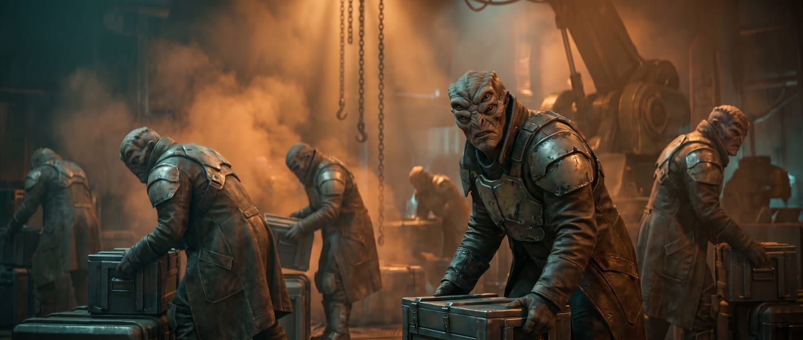
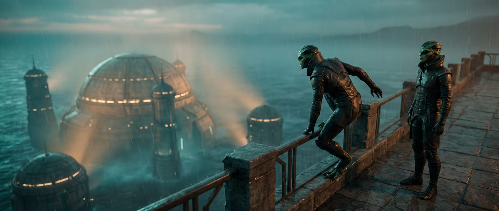
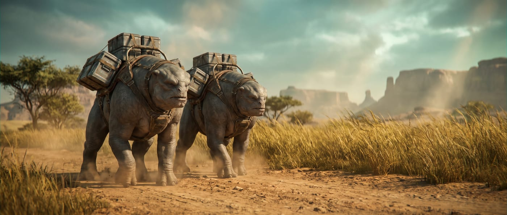
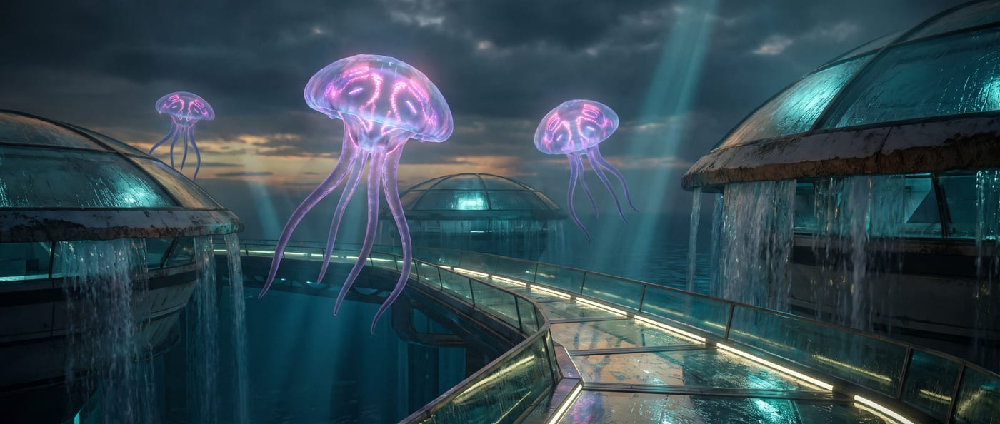
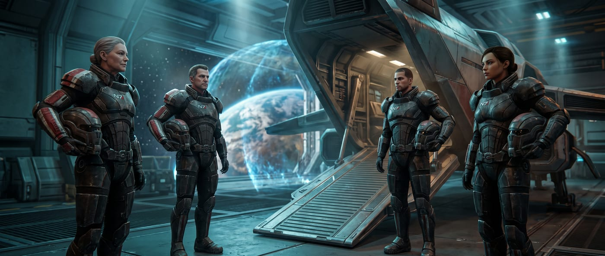
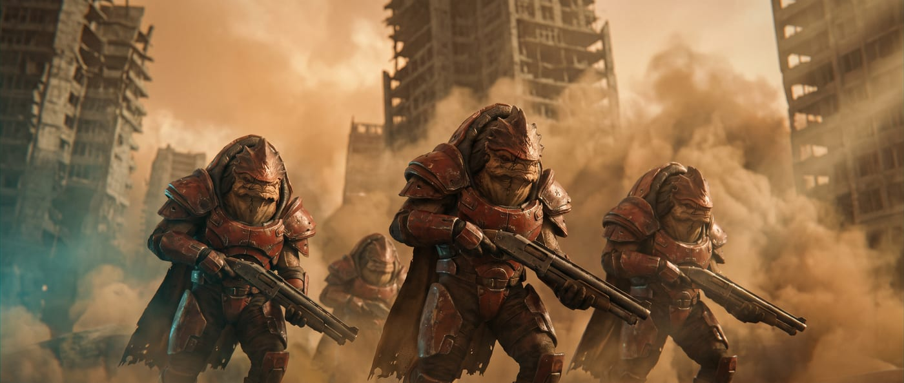
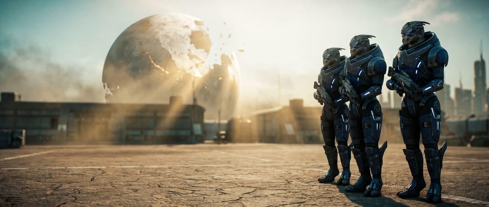
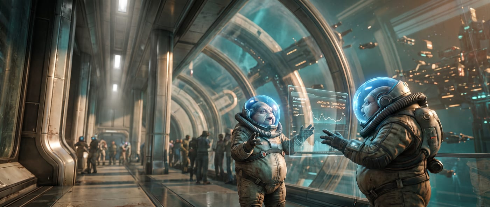
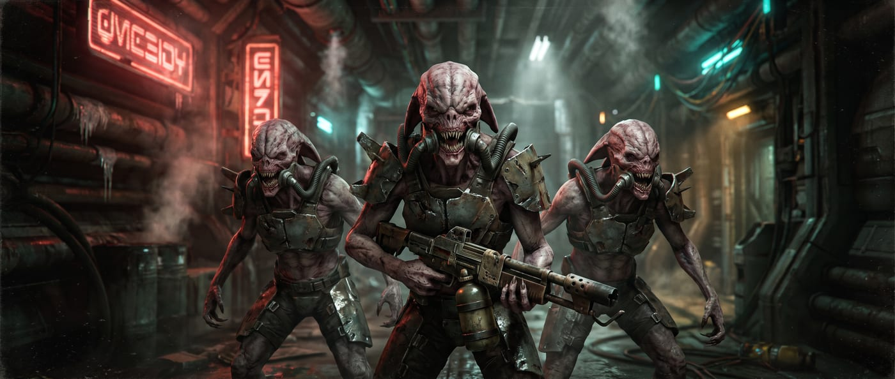

# Mass Effect Starfinder 2e Conversion

*Action costs: ◆ = 1 action · ◆◆ = 2 actions · ◆◆◆ = 3 actions · ↺ = reaction · no symbol = passive*

---

# PART I — CHARACTER OPTIONS

*Everything needed to build a character: ancestries and heritages, the six classes, backgrounds, the full feat catalogue, and equipment.*

---

## ANCESTRIES

*Your ancestry sets your starting Hit Points, size, Speed, attribute boosts and flaw, languages, and any special senses or biology. Choose one heritage at 1st level, then an ancestry feat at 1st level and every even level thereafter. Each species has its own section below, carrying its heritages and its full ancestry feat list.*

| Ancestry | HP | Size | Speed | Boosts | Flaw | Vision | Heritages |
|---|---|---|---|---|---|---|---|
| **Asari** | 8 | Medium | 25 ft | Charisma, Wisdom, Free | Strength | Low-Light | 4 |
| **Batarian** | 10 | Medium | 25 ft | Strength, Wisdom, Free | Charisma | Low-Light | 4 |
| **Drell** | 8 | Medium | 30 ft | Dexterity, Wisdom, Free | Constitution | Normal | 3 |
| **Elcor** | 12 | Large | 20 ft | Strength, Constitution, Free | Dexterity | Low-Light | 3 |
| **Hanar** | 6 | Medium | 20 ft | Intelligence, Charisma, Free | Strength | Normal | 3 |
| **Human** | 8 | Medium | 25 ft | Two Free | — | Normal | 4 |
| **Krogan** | 12 | Medium | 25 ft | Strength, Constitution, Free | Intelligence | Dark | 4 |
| **Quarian** | 6 | Medium | 25 ft | Intelligence, Dexterity, Free | Constitution | Low-Light | 3 |
| **Salarian** | 6 | Medium | 35 ft | Intelligence, Dexterity, Free | Constitution | Normal | 4 |
| **Turian** | 10 | Medium | 25 ft | Strength, Constitution, Free | Charisma | Low-Light | 4 |
| **Volus** | 6 | Small | 20 ft | Intelligence, Constitution, Free | Strength | Normal | 4 |
| **Vorcha** | 10 | Medium | 30 ft | Strength, Constitution, Free | Intelligence | Dark | 4 |

---

### ASARI

*Common · Asari · Humanoid*

> Among the most ancient and influential species in the known galaxy, the asari are a mono-gendered humanoid people from the planet Thessia, renowned for powerful biotic abilities, diplomatic wisdom, and lifespans exceeding a millennium.

Asari are tall, blue- or purple-skinned humanoids distinguished by their head crests-rigid, flexible fronds that replace hair. They pass through three life stages: the wandering Maiden, the settled Matron, and the elder Matriarch, whose centuries of experience command galaxy-wide respect. Their unique ability to neurally meld with any willing partner has made them natural diplomats, scholars, and warriors alike. Asari were instrumental in founding the Citadel Council and remain central to galactic politics.

**You Might…**

- Approach conflict with measured words before resorting to biotics-unless pushed too far.
- Form deep, lasting bonds with companions of any species or biology.
- Find the short lifespans of other species simultaneously tragic and beautiful.

**Others Probably…**

- Assume you possess biotic powers and treat you with appropriate caution.
- Seek your perspective on long-term political or philosophical matters.
- Underestimate how lethal you are when you stop talking.

**Physical Description**

Asari stand 1.7 to 1.9 meters tall with lean, humanoid physiques and vivid skin tones from deep navy to light lavender. Their head crests are bony, flexible structures used for subtle emotional expression. Asari do not age visibly until their final centuries of life.

**Society**

Asari society on Thessia is guided by wisdom rather than strict hierarchy. Communities defer to elder Matriarchs whose centuries of experience carry great weight. Though commandos and justicars are feared across the galaxy, most asari prefer negotiation, commerce, and scholarship. Many spend decades exploring the galaxy before settling.

**Beliefs**

Asari spiritual life centers on the goddess Athame and the Pillars of Strength, emphasizing growth, excellence, and connection between all living things. Most asari are thoughtful and flexible in outlook; extremes of rigid ideology are rare among a people who have centuries to change their minds.

**Sample Names**

Liara, Samara, Aria, Benezia, Tevos, Nassana, Morinth, Aethyta, Shiala, Peregrina

#### Asari Mechanics

**Hit Points** 8  
**Size** Medium  
**Speed** 25 feet  
**Attribute Boosts** Charisma, Wisdom, Free  
**Attribute Flaw** Strength  
**Languages** Common, Thessian. You also gain 1 additional language, plus a number of languages equal to your Intelligence modifier (if positive), chosen from Batarian, Drell, Elcor, Hanar, Krogan, Khelish, Salarian, Turian, Volus, Vorcha.

**Low-Light Vision** You can see in dim light as though it were bright light.

**Biotic Affinity** Asari are born with the potential for biotic ability, arising from the unique interaction between their nervous system and element zero nodules accumulated before birth. Your biotic talent manifests as an innate command of mass effect fields.
You gain a **Telekinetic Projectile** biotic Strike with a range increment of 30 feet (maximum 60 feet) that deals 1d6 force damage. This Strike uses your Charisma modifier for the attack roll and is treated as an occult cantrip for the purpose of biotic power interactions.

**Millennial Lifespan** Asari live for over a thousand years and accumulate a breadth of personal experience that shorter-lived species cannot match. You have personally witnessed historical events that others only read about, and your cultural memory is both a scholarly resource and a survival tool.
You gain a +1 circumstance bonus to Recall Knowledge checks about historical events, prominent figures, and past conflicts that occurred within the last 1,000 years. Additionally, you are immune to the *sickened* condition from natural aging and cannot be magically aged.

#### Asari Heritages

**Ardat-Yakshi Asari** *(rare)* You carry a rare neurological condition called Ardat-Yakshi-a mutation that causes your biotic nervous system to dominate and overwhelm the neural patterns of any partner during neural melding, causing rapid neurological damage and death. This makes you extraordinarily powerful as a biotic warrior; the same mechanism that kills during melding amplifies your mass effect field output to levels other asari cannot reach. Most Ardat-Yakshi are offered a choice by the Asari Republics: voluntary seclusion or service as a sanctioned operative. Some refuse both.
Your biotic attacks and innate biotic spells deal additional damage equal to half your level (minimum 1). However, you cannot safely neural meld with others-any attempt to do so forces the target to attempt a DC 20 Fortitude save or become stunned for 1 round and take 2d6 mental damage; on a critical failure, they become unconscious for 1 minute. This applies whether or not you intended harm.

**Colonist Asari** You grew up not on Thessia but among the diverse populations of colony worlds, stations, or ships-immersed in other cultures from birth. Where Thessia-born asari sometimes view other species through the lens of a well-established civilization, you have always known them as neighbors, coworkers, and sometimes family. This cross-cultural upbringing has given you an ease in mixed-species environments that even other asari don't always possess.
You gain a +1 circumstance bonus to Society checks, and you can speak one additional language of your choice from the languages available to any of the ancestries in this compendium. You also gain the Additional Lore feat for a culture or region you grew up near, chosen at character creation.

**Commando Asari** You were trained from a young age in the Asari Commandos-the elite warrior caste whose members combine biotic power with combat precision into a fighting style other species spend lifetimes failing to replicate. Asari commandos move through battle with a fluid efficiency that makes them among the most feared individual combatants in the galaxy.
You are trained in light and medium armor and gain access to the Quick Draw feat (or become trained in Acrobatics if you already have Quick Draw). Additionally, your biotic abilities (including those from ancestry features and feats) deal an additional 1 damage when used as attacks.

**Matriarch's Lineage Asari** You are descended from one of the great Matriarch lineages-asari who lived long enough and deeply enough to become living repositories of galactic wisdom. The weight of that heritage has shaped how you carry yourself and how others respond to your presence. Even young asari of Matriarch lineage carry a gravity beyond their years.
You gain a +1 circumstance bonus to Diplomacy and Intimidation checks. Additionally, once per day you may use the Aid action as a free action (once per encounter) to assist an ally, representing your instinct for elevating those around you.

#### Asari Feats

*Take one of these at 1st level and every even level thereafter, provided you meet its level requirement.*

##### Millennia of Memory — Level 1

The asari lifespan spans centuries, and even a young asari carries a breadth of accumulated learning that most other species cannot match before middle age. You have been collecting knowledge for longer than some civilizations have existed in their current form, and it shows in the density of what you can pull up on demand.
You gain the Multilingual skill feat as a bonus feat. Additionally, once per day when you fail a Recall Knowledge check in a skill you are at least trained in, you can immediately attempt the same check again and use the better result, as a deeper layer of memory surfaces.

##### Biotic Feedback ↺ — Level 5

**Trigger** A creature hits you with a melee Strike.
Your nervous system responds to physical impact with an involuntary biotic discharge-an uncontrolled surge of mass effect field energy that radiates outward from the point of contact. You didn't choose to do this. It happens faster than conscious thought.
The creature that hit you takes 1d4 force damage (no save). At 9th level this increases to 2d4 force damage. At 17th level this increases to 3d4 force damage.

##### Melded Understanding ◆◆ — Level 9

The asari neural meld is one of the most intimate forms of communication in the galaxy-a temporary merging of nervous systems that allows two beings to share thoughts, memories, and emotional states with a directness that language cannot approach. You have developed the ability to use a controlled, surface-level version of this connection.
You attempt a Diplomacy check against a willing or helpless creature within reach. The DC is 15 for a willing creature or the creature's Will DC for a helpless one.
**Critical Success** You gain a clear, accurate sense of the creature's current emotional state, one significant memory or piece of information from the last 24 hours, and whether it is concealing something. The creature is temporarily immune to Melded Understanding for 24 hours.
**Success** You gain a general sense of the creature's emotional state and one surface-level impression or memory it is currently focused on.
**Failure** You gain no information. If the target was unwilling, you are stupefied 1 for 1 round from the failed connection.

---

### BATARIAN

*Common · Batarian · Humanoid*

> Marked by four eyes and a reputation shaped by their government's brutal history, batarians are a resilient and perceptive humanoid people whose individual worth is rarely reflected in how others see their species.

Batarians are powerfully built humanoids from the planet Khar'shan, immediately recognizable by their four eyes arranged in two pairs-a trait that grants superior visual acuity and peripheral awareness. The Batarian Hegemony's long history of slavery, piracy, and political aggression has poisoned relations with Citadel space, leaving most batarians encountered beyond Hegemony territory to be exiles, escaped slaves, or dissidents who have fled oppression. Individual batarians vary widely in morality and motivation; the cruel reputation of their species' government is not a fair measure of each person.

**You Might…**

- Project confidence and physical intimidation even when uncertain inside.
- Resent being judged by the actions of the Hegemony rather than your own.
- Keep a watchful eye on everyone in the room-old survival habits die hard.

**Others Probably…**

- Assume you are affiliated with slavers, pirates, or the Hegemony until proven otherwise.
- Notice your four eyes and feel unsettled by your unwavering gaze.
- Underestimate the depth of your loyalty to the few people you trust.

**Physical Description**

Batarians stand 1.7 to 1.9 meters tall with broad, muscular builds and tough, brownish skin ranging from tan to dark brown. Their defining feature is their four eyes: the upper pair is larger and more prominent, while the lower pair is smaller but equally sharp. Their facial structure is broad and heavy-browed, and their voice is deep and resonant.

**Society**

Batarian society under the Hegemony is rigidly stratified by caste, with little social mobility and heavy government control. Outside the Hegemony, batarian communities are small and tight-knit, bound together by shared exile and mutual distrust of outsiders. Loyalty within such groups is absolute; betrayal is met with contempt or worse.

**Beliefs**

Batarian religious tradition centers on a polytheistic faith emphasizing strength, cunning, and fate. Many batarians are pragmatic about religion, treating it as cultural identity rather than active devotion. Outlooks range widely: some are honor-bound and protective of the weak they once were; others carry the cruelty their oppressive culture instilled.

**Sample Names**

Balak, Elnora, Solem, Hock, Eramius, Forta, Nassir, Korin, Yuel, Dorak

#### Batarian Mechanics

**Hit Points** 10  
**Size** Medium  
**Speed** 25 feet  
**Attribute Boosts** Strength, Wisdom, Free  
**Attribute Flaw** Charisma  
**Languages** Common, Batarian. You also gain a number of additional languages equal to your Intelligence modifier (if positive), chosen from Thessian, Drell, Krogan, Salarian, Turian, Vorcha.

**Low-Light Vision** You can see in dim light as though it were bright light.

**Four Eyes** Batarians possess two pairs of eyes: a larger upper pair for primary focus and a smaller lower pair providing wide-angle peripheral awareness. This dual-pair arrangement gives batarians exceptional situational vision that is difficult to circumvent through misdirection.
You gain a +1 circumstance bonus to Perception checks that rely on sight. Additionally, you cannot be flanked by a creature attacking from directly behind you alone-flanking still applies when enemies flank from your sides, but a single attacker directly behind you does not cause you to be off-guard.

**Hegemony-Bred** Life under the Batarian Hegemony-whether as enforcer, slave, or dissident-hardens batarians against psychological pressure in ways other species rarely experience. Batarian culture's pervasive authoritarian control, propaganda, and systematic fear conditioning paradoxically builds exceptional mental resistance to external manipulation. You have been conditioned either to apply fear or to endure it, and likely both.
You gain a +1 circumstance bonus to saving throws against fear effects and mental effects (effects with the *fear* or *mental* trait).

#### Batarian Heritages

**Escaped Slave Batarian** You escaped from Hegemony slavery-an act requiring extraordinary courage, cunning, and luck. In doing so, you developed skills for moving unseen, surviving on almost nothing, reading the intentions of people who hold power over you, and making decisions fast when the window is small. You carry the knowledge of what was done to you and the determination that it will never happen again.
You become trained in Stealth and Survival. If you are already trained in both through your class or background, you instead gain a +1 circumstance bonus to Stealth and Survival checks. Additionally, you never become lost when you have seen the surrounding terrain before.

**Hegemony Soldier Batarian** You served in the Batarian Hegemony's military or paramilitary forces, trained in the brutal and systematic combat doctrine that has kept the Hegemony's caste system in place for generations. Hegemony soldiers are not tacticians by default-they are shock troops, enforcers, and heavy-fire specialists who are expected to overwhelm opposition rather than outmaneuver it.
You are trained in medium armor and martial weapons. You gain a +1 circumstance bonus to Athletics checks made to Shove or Grapple.

**Mercenary Batarian** You've built a career selling your skills and your willingness to use them, operating across the grey zones of Terminus space where no one asks too many questions about what you did before you arrived. Batarian mercenaries have a reputation as reliable and brutal, and you've cultivated exactly that reputation to keep the work coming. You know how mercenary contracts work, which employers pay and which don't, and when a job has gone wrong before anyone else in the room catches on.
You become trained in Intimidation and gain the Mercenary Lore skill. You gain a +1 circumstance bonus to Perception checks to Sense Motive when assessing whether an employer or contact is being honest about a job's terms or risks.

**Terminus Pirate Batarian** You grew up raiding and running in Terminus space, part of the shadow economy of piracy and smuggling that the Batarian Hegemony has quietly sponsored for decades as a proxy against Alliance interests. Life on a pirate vessel is harsh and the margin for error is nonexistent-but you have developed an expert's instinct for target selection, quick entry and exit, and dealing with situations where everything has gone wrong at once.
You become trained in Thievery and gain a +1 circumstance bonus to Deception checks to deceive creatures about your intentions, cargo, or destination. You are also trained in one of the following: Piloting Lore, Smuggling Lore, or Underworld Lore.

#### Batarian Feats

*Take one of these at 1st level and every even level thereafter, provided you meet its level requirement.*

##### Four-Eyed Vigilance — Level 1

Four eyes cover a wider arc than two, and the batarian visual system is adapted to process that wider field of view without the attentional bottleneck that limits most binocular species. You are considerably harder to catch off-guard than your opponents generally expect.
You gain a +2 circumstance bonus to Perception checks to avoid being surprised and to detect creatures using Stealth. Creatures do not gain the flanking bonus to attack rolls against you when flanking from your sides-only from directly behind you. Additionally, you can't be flat-footed to creatures you can see.

##### Castes and Leverage — Level 5

Batarian society is organized around a rigid caste system, and navigating that system has given you a finely tuned sense for social hierarchies of any kind-where the power sits, who defers to whom, who is resentful of that deference, and where the leverage points are. You have found that most species organize themselves in hierarchies that are not that different from the Hegemony's, once you strip away the cosmetic differences.
You gain a +1 circumstance bonus to Diplomacy and Intimidation checks against creatures who occupy a defined social or professional role (guards, officials, subordinates, commanders, servants). Once per day you can use Society to Sense Motive in place of Perception-rolling your Society check against the creature's Deception DC-to determine a creature's rank, authority level, or position within their organization.

---

### DRELL

*Common · Drell · Humanoid*

> Agile, sharp-eyed reptilian humanoids with perfect memories and adhesive fingertips, the drell carry both the weight of a dying world and the profound debt of a species saved.

Drell are lithe, reptilian humanoids who evolved in the arid deserts of Rakhana before their world was stripped bare by ecological collapse. Rescued from extinction by the hanar, the drell now live primarily aboard hanar vessels and stations, their small population bound to their saviors through a complex cultural institution called the Compact-an arrangement many drell honor willingly, though it shapes every aspect of their lives. Their most striking biological trait is eidetic memory: drell do not merely remember experiences, they relive them with full sensory detail, sometimes involuntarily. Extended exposure to humidity and the damp environments hanar prefer causes a fatal respiratory disease called Kepral's Syndrome in drell-a constant reminder that they belong to the dry places of the galaxy.

**You Might…**

- Treasure memories as sacred things, treating each experience as something worth preserving perfectly.
- Maintain quiet, intense focus in dangerous situations-panic was a luxury your species could never afford.
- Navigate deep emotional currents beneath a composed exterior that rarely cracks.

**Others Probably…**

- Treat you with deep respect if they know about the Compact and what your people owe the hanar.
- Find your perfect recall either impressive or unsettling depending on what you've witnessed.
- Underestimate your speed and physical capability, expecting fragility from your lean frame.

**Physical Description**

Drell stand 1.6 to 1.8 meters tall with slender, muscular builds and smooth, scale-patterned skin in colors ranging from deep green to brown, grey, and black, often with contrasting lighter patterns. Their eyes are solid-color-gold, amber, or green-with no visible pupil. Their fingertips and palms bear microscopic adhesive fibers that allow them to cling to most surfaces.

**Society**

With fewer than a million drell remaining, their society exists largely within hanar space. Drell communities center on honoring both their cultural traditions and their obligations under the Compact. Family units are small; elders and storytellers hold elevated status. Many drell become hanar servants, priests, or assassins for hire-occupations the Compact provides structure for.

**Beliefs**

Drell worship a pantheon of gods associated with aspects of their desert home: wind, sun, stone, and shadow. Shedding was traditionally a sacred ritual. Philosophically, most drell believe in accepting one's role in the universe's design without complaint-a trait that makes them excellent at difficult duties others would refuse.

**Sample Names**

Thane, Kolyat, Feron, Irikah, Nara, Jellem, Osh, Vela, Drin, Talid

#### Drell Mechanics

**Hit Points** 8  
**Size** Medium  
**Speed** 30 feet  
**Attribute Boosts** Dexterity, Wisdom, Free  
**Attribute Flaw** Constitution  
**Languages** Common, Drell. You also gain a number of additional languages equal to your Intelligence modifier (if positive), chosen from Hanar, Thessian, Batarian, Krogan, Salarian, Turian.

**Eidetic Memory** Drell do not merely remember past experiences-they relive them. A drell's memory is a perfect, multi-sensory recording that can be accessed at will with complete fidelity. This extends to learned information, witnessed events, overheard conversations, and any experience significant enough to register. The gift is not without burden: in times of stress, vivid memory episodes called Harrowing can intrude unbidden.
Once per hour, when you attempt a Recall Knowledge check, you may roll twice and use the better result. Additionally, you automatically succeed at checks to recall information you directly witnessed or experienced within the last year, with a GM-determined DC based on how obscure or significant the detail is to your character.

**Adhesive Skin** Drell evolved in rocky desert terrain and developed microscopic adhesive fibers in their fingertips and palms that allow them to cling to rough surfaces with minimal effort. This adaptation makes drell natural climbers, able to scale walls and ceilings that would defeat most bipedal species without equipment.
You gain a climb Speed of 15 feet. This Speed functions on any surface that is not perfectly smooth (glass, ice, or similar frictionless surfaces may still require an Athletics check at the GM's discretion).

#### Drell Heritages

**Desert Drell** Most drell live in hanar space, adapted to a life of environmental suits and enclosed ships. You came from one of the communities that maintained connections to Rakhana's desert traditions-or were raised in an arid environment that kept those ancient adaptations active. Drell from desert backgrounds are more physically robust, better hydrated by instinct, and significantly more resistant to the Kepral's Syndrome that threatens drell in high-humidity environments.
You gain resistance 5 to fire damage. You reduce the onset time of Kepral's Syndrome (or analogous humidity-related diseases) by half, and gain a +2 circumstance bonus to Fortitude saves against inhaled hazards and disease. Your Adhesive Skin ancestry feature also functions in moderate heat and dry conditions that would slow most creatures.

**Hanar-Raised Drell** You were raised primarily within hanar communities and culture rather than among drell. The hanar reverence for the Enkindlers, their elaborate courtesy protocols, and their bioluminescent communication are as natural to you as breathing-or as natural as it gets for a species that can't breathe Kahje's atmosphere. You navigate hanar society with ease and carry the spiritual weight of Enkindler devotion in your daily outlook.
You learn the Hanar language if you don't already know it. You gain a +1 circumstance bonus to Diplomacy and Religion checks when interacting with hanar or subjects related to Enkindler (Prothean) lore. Additionally, you can produce simple bioluminescent signals using equipment available on most hanar vessels, gaining access to the Bioluminescent Speech ability in limited form even without hanar biology.

**Shadow Drell** The drell's extraordinary physical capabilities-adhesive grip, fast reflexes, perfect memory, and a predator's patience-make them naturally suited for infiltration and assassination work. You were trained in exactly that tradition, likely as part of the Compact's shadow service or as an independent contractor who found the galaxy pays extremely well for someone who can get in, finish the job, and disappear. Your calm is not detachment. It is precision.
You become an expert in Stealth. You gain a +1 circumstance bonus to Athletics checks to Climb and to attack rolls made when you are hidden or undetected. Your Adhesive Skin feature allows you to remain motionless on vertical surfaces indefinitely without a check.

#### Drell Feats

*Take one of these at 1st level and every even level thereafter, provided you meet its level requirement.*

##### Perfect Recall — Level 1

The drell eidetic memory is not a metaphor. You do not remember things the way most species do-as reconstructions assembled from fragments and inferences. You remember them as they were: complete, exact, and available on demand. A conversation from twenty years ago is as accessible as one from this morning. You have never misremembered anything in your life, which is both a gift and, occasionally, a burden you carry alone.
You gain a +2 circumstance bonus to all Recall Knowledge checks. Additionally, you automatically succeed at Recall Knowledge checks to remember events, conversations, or details that you personally witnessed, regardless of how long ago they occurred-your GM may still call for a check if the information has been deliberately obscured or if you were distracted at the time.

##### Toxic Touch — Level 1

Drell skin produces a mild hallucinogenic compound that was originally an environmental adaptation-a chemical signal that could affect the behavior of Rakhana's native predators. In most drell it is present at low concentrations and has no practical effect on most species. In some individuals, however, the compound is potent enough to affect beings that make direct skin contact.
You gain a Venomous Touch unarmed Strike. This attack is in the brawling group and deals 1d4 poison damage. On a hit, the target must succeed at a Fortitude save (DC = 10 + your level + your Constitution modifier) or become sickened 1 (sickened 2 on a critical failure). On a critical hit, the sickened condition applies regardless of the save, and on a critical failure the target is additionally confused for 1 round.

##### Ghost of the Desert — Level 5

Rakhana before the resource collapse was a world of brutal heat, scarce water, and predators adapted to hunt across open ground. The drell who survived there were hunters first and prey second, and that relationship with concealment and stillness is written into the species at a level that training reinforces but doesn't create. You move like something that does not want to be found.
You gain a +2 circumstance bonus to Stealth checks when in arid, rocky, or open terrain. You can attempt to Hide and Sneak even without cover or concealment, though you take a -2 penalty to the check if there is nothing to obscure you. When you are Hiding or Sneaking, you can move at full Speed rather than the usual halved speed.

---

### ELCOR

*Uncommon · Elcor · Humanoid*

> Massive, patient quadrupeds from the high-gravity world of Dekuuna, the elcor communicate volumes through pheromones and subsonic tones that other species can barely detect-and have learned to state their emotional context aloud as a diplomatic accommodation to a galaxy that cannot hear them properly.

Elcor are large, four-limbed beings with wide, squat bodies built for the crushing gravity of their homeworld. They evolved as herd animals in Dekuuna's hostile plains, developing remarkable physical endurance, a strong group-survival instinct, and a complex chemical language of pheromones layered over subsonic vocalizations-a communication system nearly invisible to most other species. In galactic society, elcor have adopted the practice of verbally prefacing their statements with emotional context ("With great solemnity:", "Drily:") so that others understand the weight behind their slow, measured words. Despite their lumbering appearance, elcor are capable of devastating violence when roused; their size and strength should never be mistaken for harmlessness.

**You Might…**

- Speak slowly and with great deliberation, having learned that rushing words in mixed company causes misunderstandings.
- Prefer stable, predictable situations-chaos is uncomfortable for a being whose culture prizes measured consensus.
- Carry yourself with the unhurried dignity of a species that does not fear being underestimated.

**Others Probably…**

- Initially find your verbal emotional cues amusing before realizing how much you are actually communicating.
- Mistake your slow pace for lack of intelligence or urgency, often to their regret.
- Unconsciously give you a wide berth in enclosed spaces-your presence is simply large.

**Physical Description**

Elcor stand roughly 2 meters tall at the shoulder, with four sturdy limbs used for locomotion and a large, rounded body covered in thick, dark grey to brown skin. Their faces are broad and heavy-featured, with large nostrils and small, deep-set eyes. They cannot move quickly but their mass and natural armor make them formidable in a stand. Elcor have 10-foot reach with their forelimbs.

**Society**

Elcor society on Dekuuna is organized around tight-knit family herds led by elder consensus. Decision-making is slow, thorough, and near-unanimous before action is taken-a trait that frustrates faster-moving species but produces remarkably stable governance. Elcor place enormous value on tradition and are deeply uncomfortable with rapid change.

**Beliefs**

Elcor spiritual traditions emphasize patience, communal harmony, and reverence for their homeworld's harsh environment as a teacher. Most elcor tend toward law and good, valuing stability and the protection of the herd above individual ambition. Chaotic or self-centered philosophies are culturally aberrant.

**Sample Names**

Petozi, Calyn, Xeltan, Olorm, Drevyn, Harrot, Lukar, Marab, Sofora, Tandril

#### Elcor Mechanics

**Hit Points** 12  
**Size** Large  
**Speed** 20 feet  
**Attribute Boosts** Strength, Constitution, Free  
**Attribute Flaw** Dexterity  
**Languages** Common, Elcor. You also gain a number of additional languages equal to your Intelligence modifier (if positive), chosen from Batarian, Drell, Hanar, Krogan, Salarian, Turian, Volus.

**Low-Light Vision** You can see in dim light as though it were bright light.

**Quadruped Stability** Elcor evolved on the high-gravity world of Dekuuna walking on four massive limbs, giving them a physical foundation that is extraordinarily difficult to displace. Their wide stance and distributed mass make forced movement and knockdowns far less effective against them than against bipedal species.
You gain a +2 circumstance bonus to your Fortitude DC against Shove and Trip attempts, and to Fortitude saves against effects that would move you against your will or knock you prone. Whenever you would be pushed or pulled, reduce the distance by 5 feet (minimum 0).

**Pheromone Awareness** Elcor evolved with a rich pheromone-based communication system that still functions as a constant environmental sensor. They detect chemical emotional signals from creatures around them even when those creatures are making no sound and showing no visible body language-an awareness that extends to their own emotional regulation.
You gain a +1 circumstance bonus to Will saving throws against emotion and fear effects (those with the *emotion* or *fear* trait). Additionally, you cannot be deceived by effects that fabricate emotional states through pheromones or chemical means, as you can detect the artificiality of manufactured scent.

#### Elcor Heritages

**Diplomat Elcor** Elcor diplomats spend lifetimes learning to bridge the vast communication gap between their pheromone-and-subsonic native language and the sonic speech and body language that other species rely on. The discipline required to translate emotional subtext into explicit verbal context, while simultaneously managing interspecies protocol, produces elcor diplomats of extraordinary patience and social precision.
You become trained in Diplomacy and two additional languages of your choice from among those available to ancestries in this compendium. Your explicit verbal emotional prefacing ("With great sincerity:", "Calmly:") grants you a +1 circumstance bonus to Diplomacy checks to Make an Impression, as your interlocutors always understand exactly what weight you intend behind your words.

**Rugged Elcor** You are from Dekuuna's highlands or one of the herd communities that spent generations in the harshest parts of the planet's high-gravity plains. Your body has adapted to punishment at a level beyond even the elcor baseline-denser plate, thicker hide, a cardiovascular system built for sustained effort under Dekuuna's crushing gravity. Even for an elcor, you are difficult to hurt and harder to stop.
You gain 2 additional Hit Points per level (in addition to your ancestry's base HP). You gain resistance 2 to bludgeoning and piercing damage from your thickened plating.

**Warrior Caste Elcor** Elcor warriors are a sobering reminder that slow does not mean harmless. Warrior caste elcor are trained to carry heavy weapons mounted to their dorsal harness-a rig that turns them into walking artillery platforms-and to use their massive frame as a battering ram when the situation calls for direct contact. You are from that tradition, and you have internalized the fundamental truth that size and patience together are almost always enough.
You gain a natural unarmed attack that deals 1d8 bludgeoning damage and has the Shove trait. You can wield heavy weapons without the normal penalties for being a quadruped, provided the weapon is mounted or braced on your body. You gain a +2 circumstance bonus to Bulk limits.

#### Elcor Feats

*Take one of these at 1st level and every even level thereafter, provided you meet its level requirement.*

##### Crushing Blow — Level 1

An elcor in motion is a significant mass traveling at meaningful velocity. Most elcor are too measured in their movements to use this casually, but you have learned-or perhaps simply remembered from instinct-how to put the full weight of your body into a strike. The results are difficult to argue with.
You gain a Crushing Blow unarmed Strike. This attack is in the brawling group, uses your Strength modifier to hit, and deals 2d6 bludgeoning damage. On a hit, the target must succeed at a Fortitude save (DC = 10 + your level + your Strength modifier) or be pushed 5 feet (10 feet on a critical failure). This attack has the forceful trait.

##### Subvocal Network ◆ — Level 5

Elcor communication runs on two simultaneous channels: the explicit verbal layer that other species hear, and the subvocal emotional layer that conveys the tone, context, and intensity of what is being said. You have developed the ability to use the subvocal channel deliberately-projecting a specific emotional state to allies who know to listen for it, or saturating your immediate environment with emotional signals that are difficult to consciously process but impossible to ignore.
Choose one of the following emotional signals to broadcast until the start of your next turn. This is a mental, auditory effect.
- **Calm:** Allies within 30 feet gain a +1 circumstance bonus to saves against fear effects.
- **Alert:** Allies within 30 feet who can hear you are not flat-footed during their first turn of an encounter if they would otherwise be surprised.
- **Urgent:** One ally within 30 feet can immediately Step or Stand as a free action on their next turn.

---

### HANAR

*Uncommon · Amphibious · Hanar*

> Luminous, multi-tendriled beings of extraordinary politeness and deep spiritual devotion, the hanar are one of the galaxy's most unusual sapient species-communicating in light rather than sound, and revering an extinct civilization as gods.

Hanar are large, jellyfish-like beings from the ocean world of Kahje, the surface of which is covered almost entirely by ocean. Their bodies are composed of a translucent main mass trailing dozens of tendrils used for both locomotion and manipulation. Unable to support their own weight in standard gravity, hanar use mass effect fields to hover and move-a technology they developed early and rely upon absolutely. Their primary communication mode is a complex bioluminescent language of shifting colors and patterns across their bodies, though all hanar capable of interspecies interaction learn to produce sonic speech through a secondary vocal organ. Hanar deeply venerate the Protheans, whom they call the Enkindlers, believing them to be divine beings who gifted sapience to the hanar ancestor species.

**You Might…**

- Express yourself with extreme courtesy-hanar culture considers direct statements rude and considers "this one" a more proper self-reference than "I."
- Hold strong spiritual convictions about the Enkindlers that inform your worldview without becoming domineering.
- Use your bioluminescence for subtle communication others in the room cannot decode.

**Others Probably…**

- Struggle initially to read your emotional state from body language when your expressions are all in color frequencies they can barely see.
- Be charmed by your elaborate courtesy before realizing how firm your positions actually are beneath the politeness.
- Underestimate your physical capacity in combat-a hanar's tendrils are stronger than they appear.

**Physical Description**

Hanar bodies are 1.5 to 2 meters across their main mass, luminous and translucent, with dozens of trailing tendrils ranging in length from short to over a meter. Their coloration shifts continuously between blues, violets, and greens in patterns meaningful to other hanar. They hover 0.5 to 1 meter off the ground via mass effect fields and move with a floating, deliberate grace. In water they are considerably faster and more agile.

**Society**

Hanar society is built around elaborate courtesy, caste traditions, and the veneration of the Enkindlers. Their government is theocratic in structure, with religious figures holding significant authority. The Compact with the drell-a mutual aid arrangement in which drell serve hanar needs in return for being rescued from extinction-is both central to their culture and occasionally a source of external criticism.

**Beliefs**

Hanar are deeply spiritual, worshipping the Enkindlers (Protheans) as divine. Their religion emphasizes service, gratitude, and the sacred nature of connections between species. Most hanar are lawful in temperament, valuing their extensive social protocols. Acts of selfless service are considered among the highest virtues.

**Sample Names**

Hanar rarely share their true names with non-hanar; they use "face names" for outsiders. Face names: Blasto, Mere, Opold, Zymandis, Jahleed, Chorban, Sekat, Inamorda

#### Hanar Mechanics

**Hit Points** 6  
**Size** Medium  
**Speed** 20 feet  
**Attribute Boosts** Intelligence, Charisma, Free  
**Attribute Flaw** Strength  
**Languages** Common, Hanar. You also gain a number of additional languages equal to your Intelligence modifier (if positive), chosen from Drell, Thessian, Batarian, Elcor, Salarian, Turian, Volus.

**Bioluminescent Speech** Hanar communicate their true language through complex bioluminescent patterns that shift across their bodies-a language of color, pattern, and rhythm that carries meaning invisible to most other species without specialized equipment. While hanar also learn to produce sonic speech for interspecies communication, their bioluminescent capacity remains an always-available secondary channel.
You can communicate complex messages to any creature that can see you and understands Hanar, without making any sound. Any creature within 60 feet that can see you and understands Hanar receives your bioluminescent communication perfectly, regardless of ambient noise. Additionally, you can produce simple signals-a rapid flash to indicate danger, a specific color to convey approval or refusal-that any creature within 60 feet can see, though interpreting them without Hanar knowledge requires a DC 15 Society check.

**Multitentacled** Hanar bodies trail dozens of tendrils, of which several are sufficiently strong and dexterous for complex manipulation. Unlike species with only two manipulating limbs, hanar can hold, carry, and use multiple items simultaneously without the constraint that limits most bipedal beings.
You can hold and use up to 4 items simultaneously (rather than the usual 2 for a creature with 2 hands). Switching which items you are actively using is a free action. Additionally, you gain a +1 circumstance bonus to Athletics checks to Grapple due to the difficulty of escaping a creature with dozens of flexible tendrils.

#### Hanar Heritages

**Deep-Sea Hanar** Most hanar encountered in the wider galaxy have adapted to environments designed for other species-controlled atmospheres, space stations, and sealed habitats that simulate comfortable conditions. You came from one of Kahje's deep-ocean communities where hanar live in their element, moving through crushing pressure and complete darkness with the ease of creatures evolved for exactly that environment. In open water, you are something to be feared.
You gain a swim Speed of 40 feet (instead of the base 20). You are immune to pressure-related hazards up to 3 miles of depth. You gain darkvision for underwater environments. Your Multitentacled ancestry feature grants a +2 circumstance bonus to Grapple (rather than +1) when you are in water.

**Emissary Hanar** You were trained as a formal emissary-a hanar chosen to interface with non-hanar species and serve as a bridge between the hanar's deeply protocol-driven society and the chaotic variety of the wider galaxy. Emissaries undergo extensive study of other species' body language, social conventions, and conversational priorities, learning to compress hanar elaborate courtesy into forms that won't exhaust their counterparts in a short meeting.
You become trained in Diplomacy and one additional language of your choice. You gain a +2 circumstance bonus to Diplomacy checks to Make an Impression with non-hanar, as you have perfected the art of making interspecies interactions comfortable and productive.

**Enkindler-Devoted Hanar** Your family belongs to the most devout current of hanar religious practice, and the Enkindlers-the Protheans who the hanar believe gifted them sapience-are not simply history to you. They are sacred. You have spent years studying the Prothean ruins on Kahje, learning everything that can be learned about the beings your people revere, and carrying that knowledge as a practical tool as much as a spiritual one.
You become trained in Religion and Prothean Lore. You can identify Prothean technology and writings with a successful DC 15 Recall Knowledge check (with a +2 circumstance bonus from devoted study). Once per day, you may use a Focus Point (which you gain from this heritage) to enter a state of Enkindler Meditation, gaining a +1 status bonus to all saving throws for 1 minute as your faith steadies you.

#### Hanar Feats

*Take one of these at 1st level and every even level thereafter, provided you meet its level requirement.*

##### Enkindler's Grace ◆ — Level 1

The hanar relationship with the Enkindlers-the Protheans, who uplifted the hanar-carries a weight that most religious traditions cannot match. The Enkindlers were real. Their works are real. The blessings the hanar invoke in their name carry genuine conviction, and that conviction has a way of transmitting itself to those nearby. Whether the grace is divine, psychological, or simply the effect of absolute certainty delivered by something genuinely alien is a question you have stopped asking.
You extend a blessing to one ally within 30 feet who can perceive you. Until the end of your ally's next turn, they gain a +1 circumstance bonus to attack rolls and saving throws. If the ally is at fewer than half their maximum Hit Points, they also gain temporary Hit Points equal to your Charisma modifier (minimum 1). You can use this ability a number of times per day equal to your Charisma modifier (minimum 1).

##### Bioluminescent Display ◆◆ — Level 5

Hanar bioluminescence evolved for communication, but the same chromatic cells that produce conversational flickers can be driven into something else entirely: a full-body strobing cascade of color and light that bypasses conscious processing and hits the visual cortex directly. It is not communication. It is something older than language.
You produce a disorienting bioluminescent display. Each sighted creature in a 20-foot cone must succeed at a Will save (DC = 10 + your level + your Charisma modifier) or become dazzled for 1 minute (stunned 1 on a critical failure, lasting until the end of their next turn). Creatures that critically succeed are immune to Bioluminescent Display for 24 hours. Creatures that cannot see are unaffected. After using this ability, you become concealed until the start of your next turn from the afterimage you leave in observers' vision.

---

### HUMAN

*Common · Human · Humanoid*

> Ambitious, adaptable, and driven by an exceptional hunger to expand and excel, humans rose from a single world to galactic prominence in an eyeblink of cosmic time-and show no signs of slowing down.

Humanity made first contact with the wider galaxy only twenty-six years before the Eden Prime War, yet has already secured a seat on the Citadel Council, founded the Systems Alliance as a unified interstellar government, and spread across dozens of colony worlds. Other species find this pace alarming, admirable, or both. Humans are physically unremarkable compared to many galactic species-no natural biotics, no extraordinary senses, no unusual physiology-but their sheer variety of thought, their willingness to take risks, and their rapid institutional learning have made them a force that no one in the galaxy can afford to ignore. Humans serve as soldiers, diplomats, scientists, merchants, and criminals in roughly equal measure, adapting to whatever role the situation demands.

**You Might…**

- Set ambitious goals that others find impractical-then actually accomplish them through sheer determination.
- Approach problems from unconventional angles that centuries-old species hadn't considered.
- Take personal relationships seriously across species lines, forming bonds that cross cultural divides.

**Others Probably…**

- View you as either a refreshing wildcard or a dangerously unpredictable variable in their plans.
- Underestimate how much you've already learned about their species and culture before this conversation.
- Remain unsure whether humanity's rapid ascent is admirable or threatening-possibly both.

**Physical Description**

Humans are medium-sized bipedal mammals with enormous variety in build, skin tone, hair, and eye color. They live roughly 80-120 years naturally, though advanced medicine has pushed the upper range in the 22nd century. They have no natural weapons, no unusual senses, and no innate biotic ability-only the capabilities they build, earn, or learn.

**Society**

The Systems Alliance serves as humanity's unified political and military voice to the galaxy, though individual human colonies vary enormously in culture, law, and tradition. Human civilization spans a spectrum from gleaming Core Worlds to wild Terminus colonies operating almost entirely outside Alliance law. This variation means that no two humans are likely to represent their species the same way.

**Beliefs**

Humans follow an enormous variety of religious, spiritual, and philosophical traditions reflecting their diverse origin cultures. No single belief system dominates. Individual worldviews run the full ethical spectrum; the only constant is that humans rarely agree on anything for long.

**Sample Names**

Shepard, Anderson, Lizbeth, Ashley, Kaidan, David, Cerberus, Miranda, Jacob, Jack, James, Hannah, Steven, Samantha, Garrus (human name: Garrus Vakarian is turian, but culturally adopted names vary widely)

#### Human Mechanics

**Hit Points** 8  
**Size** Medium  
**Speed** 25 feet  
**Attribute Boosts** Two Free  
**Attribute Flaw** —  
**Languages** Common. You also gain 1 additional language, plus a number of languages equal to your Intelligence modifier (if positive), chosen from .

**Ambitious Striving** Humanity's defining characteristic across galactic history has been an almost unreasonable drive to learn, improve, and exceed expectations-including their own. In the span of a single generation, humans went from their first steps into space to a seat on the Citadel Council. That same drive is present in every human, expressed as an insatiable hunger to be good at something that matters to them.
You become trained in one additional skill of your choice.

**Adaptive Resilience** Humanity's rapid rise across the stars was built as much on the ability to absorb setbacks and adapt as on any special talent. Humans survive disasters that should have ended their ambitions and emerge recalibrating rather than broken. This resilience is both cultural and deeply personal-a stubbornness at the core of the species that refuses to accept permanent defeat.
Once per day, when you would critically fail a saving throw, you can reduce the result to a regular failure instead.

#### Human Heritages

**Alliance Biotic Human** *(uncommon)* You were exposed to element zero in utero and survived the process with functional biotic nodules rather than neurological damage-a rare outcome that the Alliance immediately identified, tracked, and eventually recruited. Human biotics are a relatively new phenomenon and the technology for harnessing them has been rushed, meaning your implants have been upgraded and adjusted multiple times. The process has left you with real power and a complicated relationship with the program that shaped you.
You can cast *telekinetic projectile* as an occult innate cantrip, using Charisma as your spellcasting ability. Additionally, you gain access to the Biotic Adept ancestry feat (see ancestry feats) without meeting its normal prerequisites.

**Colonist Human** You grew up on one of humanity's colony worlds-distant from Earth and the Core, built on grit and determination, often under skies that weren't the right color and gravity that never felt quite right. Colony life teaches adaptability, self-reliance, and a particular hostility toward the idea that anyone from the Core gets to tell you what your life is worth. You know how to live off limited resources, fix what you have, and trust your neighbors when there's nothing else.
You become trained in Survival and Nature. You gain a +1 circumstance bonus to Fortitude saves against environmental hazards and diseases. You are trained in one Lore skill related to your colony world's terrain type (Desert Lore, Arctic Lore, Jungle Lore, etc.), chosen at character creation.

**Systems Alliance Human** You served in or grew up deeply embedded with the Systems Alliance-humanity's unified military and political arm to the galaxy. Alliance culture prizes adaptability, determination, and the ability to do more with less, and those values are bone-deep in you. Whether you were a soldier, engineer, pilot, or civilian contractor, the Alliance shaped you into someone who knows how to function under pressure and how to work with a team that might not like each other but has to perform anyway.
You become trained in Athletics and gain the Systems Alliance Lore skill. You gain proficiency with light armor and simple weapons. Once per day you can Shrug It Off as a free action when you would become frightened 1 or 2, reducing the value by 1.

**Terminus Human** You grew up in Terminus space, outside Alliance jurisdiction and far beyond the reach of anything resembling consistent law. Terminus colonies are places where people go when they want to disappear or start over, and where survival depends on reading people fast, keeping your head down when it needs to be down, and having contingency plans for when plans fail. You've been making do your entire life and you're very good at it.
You become trained in Thievery and Deception. You gain a +1 circumstance bonus to Deception checks to Lie and to Stealth checks to Avoid Notice. You are never caught flat-footed in your first round of combat against creatures you haven't been formally introduced to.

#### Human Feats

*Take one of these at 1st level and every even level thereafter, provided you meet its level requirement.*

##### Adaptive Learner — Level 1

Humans do not have the longest lifespans, the most efficient minds, or the best physical equipment. What they have is an unusual capacity to learn across domains-to pick up skills that evolution never prepared them for and develop competence in areas that the species has only been exposed to for a generation. Where other species often excel within a defined area of specialization, humans accumulate breadth. This is, depending on your perspective, either their greatest strength or evidence that they cannot commit to anything.
You gain one additional skill in which you are trained (your choice). Additionally, when you receive a critical success on a check to learn a new skill or when you attempt a downtime activity to Earn Income using a skill, you gain a +1 circumstance bonus to your next check using that same skill within 24 hours.

##### Tenacious Survivor — Level 1

Humanity's rapid expansion into the galaxy happened faster than most species thought was biologically possible, and the humans who survived the early colonial period were selected hard for a very specific trait: the refusal to stop. This is not mere stubbornness. It is a deep, physiological drive toward continued function even in conditions that would have convinced a more rational organism to quit.
You reduce your dying condition by 1 at the end of each of your turns (in addition to normal recovery), meaning you naturally stabilize faster. You gain a +1 circumstance bonus to recovery checks (the d20 roll to avoid dying when at dying 1+). When you succeed at a recovery check, you can immediately attempt a DC 15 flat check; if you succeed, you lose the unconscious condition and are at 0 Hit Points rather than needing to wait for a heal.

##### Battle-Hardened — Level 5

Human military and colonial history in the three decades since first contact has been dense with the kind of experience that leaves a mark-the Relay 314 Incident, the colonial attacks, the constant pressure of operating in a galaxy full of species that had millennia of head start. Those who survived adapted. You carry that adaptation in the way you handle damage that would stop someone who hadn't learned what you have.
When you would gain persistent damage, you attempt a DC 15 flat check to avoid gaining it; on a success, the persistent damage is negated entirely. You gain a +1 circumstance bonus to the flat check to end persistent damage at the end of your turn. Additionally, you gain a +1 circumstance bonus to Fortitude saves against effects that would cause you to be sickened or drained.

---

### KROGAN

*Common · Humanoid · Krogan*

> Massive, biologically redundant warriors bred by eons of violent evolution on a dying world, the krogan are a species that survived extinction once through sheer biological stubbornness-and are now surviving it again through sheer will.

Krogan evolved on Tuchanka, a world devastated by nuclear warfare before they even reached the stars. Their biology is an answer to that environment: two hearts, a secondary nervous system, a distributed circulatory system, thick-plated hump of blood-stored nutrients, and a cellular regeneration rate that makes killing them a significant project. The Salarian Union uplifted the krogan during the Rachni Wars, using their numbers and aggression to win a war the Council races couldn't survive alone-then, terrified by the resulting population explosion, introduced the genophage: a biological weapon that renders 999 of every 1,000 krogan births non-viable. Krogan society is therefore caught between their evolutionary legacy of violence and aggression, a cultural drive to restore their people, and the simmering fury of a species that knows what was done to them.

**You Might…**

- Approach every challenge expecting the worst-and prepare accordingly.
- Earn loyalty slowly and guard it fiercely; betrayal is not forgiven.
- Find younger species' political maneuvering exhausting when a direct solution is obviously available.

**Others Probably…**

- Give you significant physical space and choose their words carefully.
- Underestimate your strategic intelligence, expecting only aggression.
- Find themselves surprised by the depth of the loyalty you show toward those who've genuinely earned it.

**Physical Description**

Krogan are massive bipeds standing 2.1 to 2.4 meters tall with broad, powerful builds, thick layered plate-like skin, and a large dorsal hump of stored nutrients and blood-processing capacity. Their four eyes provide wide-angle vision. Krogan regenerate from injury rapidly and can survive wounds that would kill most other species outright. They live for centuries if not killed violently-which most are.

**Society**

Krogan society on Tuchanka is organized into clans, each led by a powerful warrior called a Clan Leader or, in the most powerful cases, a Paramount. The genophage has fractured krogan culture, driving some clans toward increasingly desperate violence and others toward the grim pragmatism of survival. Clan Urdnot has emerged as a dominant voice pushing for krogan unity in recent decades.

**Beliefs**

Krogan spirituality is tied to Tuchanka itself-ancestral spirits called the Shaman's Voices, the harsh world they came from, and the belief that a krogan who dies without honor brings shame on their bloodline. Most krogan lean toward pragmatic self-interest and their clan's interests; abstract goodness is respected but rarely a primary motivation. Their cultural alignment has shifted significantly depending on circumstances.

**Sample Names**

Wrex, Grunt, Wreav, Urdnot, Drau, Charr, Gatatog, Maleon, Korlack, Uvenk, Skarr

#### Krogan Mechanics

**Hit Points** 12  
**Size** Medium  
**Speed** 25 feet  
**Attribute Boosts** Strength, Constitution, Free  
**Attribute Flaw** Intelligence  
**Languages** Common, Krogan. You also gain a number of additional languages equal to your Intelligence modifier (if positive), chosen from Batarian, Salarian, Turian, Vorcha.

**Darkvision** You can see in dim light as though it were bright light, and in darkness as though it were dim light (in black and white only).

**Krogan Fortitude** Krogan biology is designed to keep functioning long after other species would be dead. Their distributed circulatory and nervous systems, multi-chambered hearts, and accelerated cellular repair make them extraordinarily difficult to bring down through conventional injury. Wounds that would cripple a human or turian are inconveniences to a krogan with time to breathe.
You gain fast healing 1: at the start of each of your turns, if you are below half your maximum Hit Points, you recover 1 Hit Point. This healing does not function if you are at 0 HP.

**Redundant Biology** Krogan evolved with two hearts, a secondary nervous system, and multiple backup biological systems that can compensate when primary systems fail. A killing blow that should end a krogan may instead find itself absorbed by redundant organ capacity that another species simply does not possess. Krogan have literally walked away from injuries that killed everything around them.
Once per day, when a physical attack would reduce you to 0 Hit Points, you can attempt a DC 15 Fortitude save. On a success, you are instead reduced to 1 Hit Point and are not knocked out or dying from that attack. You can only benefit from this ability while you are not dying.

#### Krogan Heritages

**Exiled Krogan** You have no clan-cast out, disgraced, or simply orphaned by war in a culture that has no space for those without allegiance. Clanless krogan in Tuchanka's society are targets, prey for anyone who wants to prove themselves. But you survived anyway, and that survival has produced something that most krogan with the security of a clan never develop: genuine self-reliance and the ability to read any situation without the lens of clan loyalty coloring your judgment.
You become trained in Survival and Stealth. You gain a +2 circumstance bonus to saving throws against effects that would cause you to be Controlled (the controller trait) or forced to act against your own interests. You do not require clan membership or organizational backing to take leadership roles with strangers-your reputation stands on its own.

**Krogan Shaman** *(uncommon)* Krogan shamans preserve the oral traditions, spiritual practices, and historical memory of their clans at a time when that memory is an endangered resource. They tend to the females who carry the crushing weight of the genophage, maintain connections to Tuchanka's ancestral spirits, and provide a counterweight to the culture of pure aggression that otherwise dominates krogan society. It takes a particular kind of strength to be the one who remembers what everyone else has decided doesn't matter anymore.
You become trained in Religion and Medicine. You can cast *stabilize* and *guidance* as occult innate cantrips, using Wisdom as your spellcasting ability. Once per day you can cast *heal* as a 1st-rank innate occult spell.

**Tank-Bred Krogan** *(uncommon)* You were not born naturally but grown from a carefully curated genetic sequence in a breeding tank-a practice developed specifically to work around the genophage by producing viable krogan through controlled genetic manipulation rather than natural reproduction. Tank-bred krogan are selected for specific traits and raised in accelerated developmental programs, which makes them exceptional physical specimens but sometimes leaves them with a complicated relationship to krogan cultural identity and what it means to be one of your people.
You gain 2 additional maximum Hit Points (above your ancestry HP). Your Redundant Biology ancestry feature's DC is 13 instead of 15. You gain a +1 circumstance bonus to Fortitude saves against the genophage or biologically-targeted effects specifically targeting krogan physiology.

**Urdnot Warrior Krogan** Clan Urdnot has risen to prominence by producing krogan who fight with discipline rather than just rage-the most dangerous kind of krogan there is. Urdnot warriors are trained to use their biology as a weapon system: take the hit, regenerate, hit back harder. You embody that ethos. You don't dodge if you don't have to. You don't retreat if you can take what's coming. You use what you are.
You gain a +1 circumstance bonus to attack rolls while you are below half your maximum Hit Points. This reflects the krogan combat trance that kicks in when things get serious. Additionally, once per encounter when you hit with a melee Strike, you can attempt to Shove the target as a free action.

#### Krogan Feats

*Take one of these at 1st level and every even level thereafter, provided you meet its level requirement.*

##### Headbutt — Level 1

The krogan cranial ridge is a structural feature that serves multiple purposes: it protects the brain from impacts that would kill most species outright, it is a display indicator of age and status, and in a combat situation, it is a weapon. Striking with the crest delivers the force of a full upper body slam concentrated into one of the hardest surfaces on a krogan's body. Most species that have experienced this firsthand describe it as memorable, in the same way that a concussion is memorable.
You gain a Headbutt unarmed Strike. This attack is in the brawling group, uses your Strength modifier, and deals 1d8 bludgeoning damage. A creature hit by your Headbutt must succeed at a Fortitude save (DC = 10 + your level + your Strength modifier) or become stunned 1. On a critical hit, the creature is stunned 1 regardless of the save, and stunned 2 on a critical failure of the save.

##### Blood Rage ◇ — Level 5

**Trigger** You take damage that reduces you to fewer than half your maximum Hit Points.
Krogan adrenaline systems evolved to respond to injury by escalating combat effectiveness-a feedback loop that most medical researchers consider alarming and most krogan consider their best feature. When you are hurt badly enough, your body interprets this as a signal to hit harder, not to retreat.
You gain temporary Hit Points equal to your level + your Constitution modifier (minimum 1). These temporary Hit Points last until the end of the encounter. Additionally, until the end of your next turn, your melee Strikes deal an additional 1d6 damage.

##### Undying Warrior — Level 9

Krogan redundant biology is not a metaphor. Multiple hearts, backup nervous system pathways, secondary organs for critical functions, and a bone structure that treats most projectiles as a delay rather than a conclusion-all of this culminates, in sufficiently seasoned krogan, in a capacity to continue fighting through damage that would have killed the organism twice over by any reasonable biological accounting. You are one of those krogan.
Your dying threshold is increased by 1 (you die at dying 5 rather than dying 4). You gain a +2 circumstance bonus to recovery checks. When you succeed at a recovery check, you also gain a number of temporary Hit Points equal to your Constitution modifier (minimum 1), which last until the start of your next turn. If you have the Fortitude Fortress ancestry feature, you gain an additional +1 to recovery checks (total +3).

---

### QUARIAN

*Common · Humanoid · Quarian*

> Exiled from their homeworld for creating a synthetic race that turned against them, the quarians have spent three centuries as nomads aboard a vast Migrant Fleet, becoming the galaxy's most skilled engineers-and the species most dependent on the technology they understand better than anyone.

Quarians evolved on the lush world of Rannoch and were a prosperous spacefaring civilization before they created the geth-synthetic laborers who achieved consciousness and then, when ordered to submit to decommissioning, fought back. The resulting war drove quarians from their homeworld. Three centuries aboard the Migrant Fleet have fundamentally shaped quarian biology and culture: with no stable planetary ecosystem to maintain immune system diversity, quarians have developed increasingly fragile immune systems that leave them dangerously vulnerable to environmental pathogens. Every quarian lives permanently within an environmental suit. Despite this vulnerability, quarians are arguably the finest engineers and technicians in the galaxy-a skill born of necessity on overcrowded ships where a broken component could mean death.

**You Might…**

- Maintain meticulous care for technology and equipment, understanding better than most what happens when it fails.
- Keep your distance socially in ways that go beyond the suit-three centuries of exile have made trust a resource to spend carefully.
- Carry an unspoken longing for a home you've never seen but have heard about your entire life.

**Others Probably…**

- Initially treat you with curious sympathy or mild condescension about your exile before seeing how capable you actually are.
- Assume you speak for your entire species or the Fleet when you clearly speak only for yourself.
- Be startled when they realize your "frail" appearance conceals one of the sharpest technical minds in the room.

**Physical Description**

Quarians are lean, bipedal humanoids of slight build, with three-fingered hands and large, luminous eyes. They are always seen in their environmental suits-hermetically sealed outfits with filtration systems that protect their compromised immune systems. Without these suits in contaminated environments, a quarian rapidly becomes dangerously ill. Their faces, rarely exposed to outsiders, are angular with fine features.

**Society**

Quarian society is organized around the Migrant Fleet: hundreds of ships in a constantly moving convoy, governed by the Admiralty Board. Every quarian who comes of age must complete the Pilgrimage-a solo journey into the wider galaxy to return with something of value-before being accepted back as a full member of their ship-family. Ship-based clans form the core of social identity.

**Beliefs**

Quarians are pragmatic and communal, valuing contribution to the Fleet above individual glory. Their spiritual traditions include animistic beliefs about ships having personalities and ancestors watching from the void. Most quarians are lawful in sensibility, respecting the Fleet's authority as a survival necessity, though their ethics vary widely between individuals.

**Sample Names**

Tali'Zorah, Kal'Reegar, Shala'Raan, Veetor'Nara, Yeoman, Prazza, Chora, Vela, Kori, Lari, Kor'Thal

#### Quarian Mechanics

**Hit Points** 6  
**Size** Medium  
**Speed** 25 feet  
**Attribute Boosts** Intelligence, Dexterity, Free  
**Attribute Flaw** Constitution  
**Languages** Common, Khelish. You also gain a number of additional languages equal to your Intelligence modifier (if positive), chosen from Batarian, Drell, Elcor, Hanar, Krogan, Salarian, Turian, Volus.

**Low-Light Vision** You can see in dim light as though it were bright light.

**Environmental Suit** Every quarian wears a hermetically sealed environmental suit at all times, a necessity born from their compromised immune systems-exposure to ambient pathogens without suit protection can be rapidly fatal. Three centuries of Flotilla engineering have made these suits remarkably sophisticated: they filter air, regulate temperature, administer medication, and provide minor protection against physical harm. The suit is not a burden to most quarians; it is simply a part of who they are.
Your environmental suit provides a +1 item bonus to AC. You are immune to airborne diseases and inhaled poisons. You can breathe safely in mildly toxic or low-oxygen atmospheres (though not in vacuum or extreme hazard without additional support).
**Suit Breach:** If your suit is significantly damaged (GM discretion, typically 25+ piercing or slashing damage from a single hit), you become *sickened 1* until you spend 10 minutes repairing it with a successful DC 15 Crafting check. Healing potions and similar consumables must be administered via injector port to function (takes an additional action).

**Tech Expertise** Three centuries of surviving aboard overcrowded ships where broken technology means death has produced quarian engineers capable of working miracles with improvised tools and salvaged parts. Every quarian is raised from childhood with a fundamental understanding of how machines work, how to repair them under pressure, and how to make them do things their designers never intended. It is less a skill than it is a survival instinct.
You become trained in Crafting. If you would already be trained in Crafting through your class or background, you instead become trained in a Lore skill related to technology or engineering (such as Engineering Lore or Starship Lore). Additionally, the time required for you to Repair an item is reduced by half.

#### Quarian Heritages

**Migrant Fleet Quarian** You grew up on one of the Flotilla's ships, part of the intricate social ecology of a vessel where everyone's role is essential and every cubic meter of living space is precious. Flotilla-raised quarians develop an intimate familiarity with the ship systems that keep them alive, a sensitivity to when something is wrong long before the diagnostics say so, and an orientation toward community cooperation that is simply assumed rather than taught.
You become an expert in Crafting. The time required to Repair an item is reduced to one-quarter normal (rather than half). Once per day when you critically fail a Crafting check to Repair, you can reduce the result to a regular failure instead.

**Pilgrim Quarian** Every quarian who comes of age undertakes the Pilgrimage: a solo journey into the wider galaxy to return with something of value that proves they can survive and contribute beyond the safety of the Flotilla. Your Pilgrimage is complete-and whatever you found out there changed you. You've seen the galaxy at ground level, made contacts in unexpected places, and developed the particular competence of someone who spent years figuring out difficult situations alone.
You gain a +1 circumstance bonus to Diplomacy checks with non-quarian species from your Pilgrimage experience with them. You begin play with one Contact-a named individual from another species who owes you a favor or has reason to assist you (work with your GM to establish this contact and their capacity to help).

**Rannoch Settler Quarian** *(uncommon)* You are among the quarians who returned to Rannoch after it was reclaimed-part of the generation attempting to rebuild a civilization on a planet none of them had ever seen, from stories and generations-old records. Settlement on Rannoch means learning to survive on solid ground after a lifetime aboard ships: exposure to open sky, planetary weather, and a natural ecosystem that your immune system was never prepared for. Those who succeed are genuinely remarkable.
Your environmental suit has been adapted for extended planetary use, reducing maintenance requirements. You gain a +1 circumstance bonus to Survival checks and become trained in Nature. Your suit's immune filters have been upgraded for outdoor environments, granting you resistance to natural poisons (those without the magical trait) equal to half your level.

#### Quarian Feats

*Take one of these at 1st level and every even level thereafter, provided you meet its level requirement.*

##### Omni-Tool Mastery — Level 1

Quarians grow up interfacing with technology through an omni-tool as a matter of basic survival-the suit's environmental systems, the Fleet's communication networks, the ship's engineering substrates. By the time a quarian is old enough for their Pilgrimage, the omni-tool is not a device they use. It is an extension of how they process the world. You have the kind of hardware fluency that comes from necessity, and it shows in the speed and ease with which you work.
You gain a +1 circumstance bonus to Crafting and Society checks involving technology, electronics, or networked systems. When you use Crafting to Repair a technological device, you reduce the time required by half. When you critically succeed on a Crafting check to identify or interact with technology, you also learn one additional property or function of the device beyond what the check normally reveals.

##### Suit Integrity — Level 1

Every quarian who leaves the Migrant Fleet understands that their environmental suit is the primary barrier between them and an immune system that has never had to defend itself against a normal pathogen load. You have spent enough time maintaining, repairing, and improvising repairs on that suit that you know its failure modes as well as you know your own heartbeat-and you know how to keep it functional under conditions that would compromise a less experienced operator's equipment.
You gain a +2 circumstance bonus to Fortitude saves against disease and poison. When your suit is breached (such as by a critical hit from a piercing or slashing weapon), you can attempt a DC 15 Crafting or Survival check as a free action to improvise a temporary seal; on a success, you negate the breach effect for 10 minutes. You are automatically trained in Crafting if you would not otherwise be.

##### Emergency Evacuation Protocol ↺ — Level 5

**Trigger** You are reduced to fewer than one-quarter your maximum Hit Points.
Centuries of living aboard ships where an emergency can mean a hull breach, an engine failure, or enemy boarders in three corridors simultaneously has produced a quarian cultural reflex: when the situation becomes genuinely critical, you get out. Not in panic-in protocol. You know where the exits are because you always know where the exits are, and when the trigger fires, your body moves before your conscious mind has finished processing the situation.
You immediately Stride up to your full Speed. This movement does not provoke reactions. If you end this movement in cover or out of line of sight of all creatures that could be threatening you, you can attempt to Hide as a free action.

---

### SALARIAN

*Common · Humanoid · Salarian*

> Sharp-minded, fast-talking, and hyper-analytical, salarians process the universe at a pace that other species find exhausting to keep up with-and live a lifespan so short that every decade feels like borrowed time.

Salarians are amphibious bipeds from Sur'Kesh, and their hyperactive metabolism shapes everything about them. They sleep for only an hour each day, move quickly, talk faster, and process information at remarkable speed. The cost of this metabolic intensity is a natural lifespan of only 40 years-and a body that burns itself out rapidly. Salarians are responsible for uplifting both the krogan (during the Rachni Wars) and humanity (accelerating human technological development after first contact), and they have a complicated relationship with the consequences of both decisions. Their intelligence apparatus, the Special Tasks Group (STG), is considered one of the most capable espionage organizations in the galaxy. Salarians communicate in rapid, precise sentences that drop pronouns and get to the point immediately.

**You Might…**

- Speak quickly and efficiently, dropping words that seem obvious to include-to you, context fills in the gaps.
- Approach problems analytically before emotionally, preferring information to intuition when both are available.
- Keep one eye on long-term consequences others haven't considered yet, having seen how interventions compound.

**Others Probably…**

- Ask you to slow down or repeat yourself-not because you're unclear, but because you assume they're processing as fast as you are.
- Trust your analysis while slightly distrusting your motives, suspecting that you always know more than you're sharing.
- Forget how old you seem relative to how little time you actually have, and feel oddly guilty about it.

**Physical Description**

Salarians are tall, thin bipeds with long necks, large eyes on either side of their head, and smooth, hairless skin that ranges from grey to green to brown. Their most distinctive features are the horns growing from their skulls-typically small, curved, and positioned above the forehead. They move with quick, precise energy and rarely appear physically relaxed.

**Society**

Salarian government is a loose confederacy of clans ruled by family matriarchs called Dalatrasses, who engage in elaborate political maneuvering through arranged pairings and long-running negotiations. Males are the minority in salarian society. The STG operates as an almost autonomous intelligence service that occasionally surprises even its own government with the scope of its operations.

**Beliefs**

Salarians tend toward lawful pragmatism-they respect structures that produce reliable outcomes and distrust chaos. Their spiritual traditions are minimal; salarians are generally secular, though clan honor and intellectual tradition function as quasi-religious anchors. Ethical considerations for long-term consequences are taken seriously.

**Sample Names**

Mordin, Kirrahe, Padok, Jondum, Niftu, Chorban, Jahleed, Rana, Dara, Sola, Velnaran, Sekat

#### Salarian Mechanics

**Hit Points** 6  
**Size** Medium  
**Speed** 35 feet  
**Attribute Boosts** Intelligence, Dexterity, Free  
**Attribute Flaw** Constitution  
**Languages** Common, Salarian. You also gain 1 additional language, plus a number of languages equal to your Intelligence modifier (if positive), chosen from Thessian, Batarian, Drell, Elcor, Hanar, Krogan, Khelish, Turian, Volus, Vorcha.

**Hypermetabolism** Salarian metabolic processes operate at several times the rate of most other species. Their hearts beat faster, their reflexes engage more quickly, and their minds process sensory information in bursts that would be overwhelming to a slower brain. This comes with real costs-salarians need to eat and drink more frequently and burn through their 40-year lifespan at a pace that leaves them looking middle-aged before they are 30-but the tactical advantages in reaction speed and mental throughput are undeniable.
You require only 1 hour of sleep per day (rather than 8) and are immune to the *sleep* condition. You gain a +2 circumstance bonus to initiative rolls.

**Analytical Mind** Salarian cognition operates in parallel analytical streams that other species lack the neurological architecture to sustain. Where a human recognizes a situation, a salarian simultaneously categorizes it, cross-references it against accumulated experience, runs probability assessments, and produces a recommended action-all before their counterpart has finished blinking. This makes them exceptional researchers, strategists, and investigators, and deeply annoying to work with in social situations where others expect to contribute thoughts.
Once per hour when you attempt a Recall Knowledge check, you roll twice and use the better result. This is a fortune effect.

#### Salarian Heritages

**Dalatrass Lineage Salarian** *(uncommon)* You come from the matriarchal political families that govern salarian society-the Dalatrasses. Salarian politics are a web of long-term pairings, negotiated alliances, and calculated obligations that make most other species' governments look straightforwardly simple by comparison. Growing up in a Dalatrass family means learning that information is leverage, that every relationship has a value, and that what someone doesn't say is usually more important than what they do.
You become trained in Diplomacy and Society and gain the Salarian Political Lore skill. Once per day you can use the Lie (Deception) action as a free action to create a single false impression that you then immediately address with something technically true-the technical-truth defense being a cornerstone of Dalatrass political culture.

**STG Operative Salarian** *(uncommon)* The Salarian Special Tasks Group operates in the space between what governments admit to and what they actually do. STG operatives are trained for intelligence gathering, sabotage, and covert insertion in environments where conventional military force would cause diplomatic incidents. The STG gets results, rarely leaves evidence, and is not technically supposed to exist in most of the places it operates. You are one of those operatives, or former ones-either is complicated.
You become an expert in Stealth and trained in Deception. You gain the Lie to Me feat. Additionally, you can maintain cover identities with remarkable depth; when you spend at least 1 week building a false identity, creatures attempting to investigate that identity take a -2 circumstance penalty to their checks.

**Sur'Kesh Scholar Salarian** The Salarian Union's academic institutions on Sur'Kesh are among the most productive in the galaxy-turning out researchers at a pace that reflects both the salarian work ethic and their compressed lifespan, in which a career that would take a human 40 years must be completed in 15. You studied there, or somewhere equivalent, and emerged with the kind of dense, cross-disciplinary knowledge base that makes you genuinely dangerous to talk to about almost any subject.
You become trained in your choice of Arcana, Occultism, or Nature, and gain two additional Lore skills of your choice. Your Analytical Mind ancestry feature applies to skill checks to Recall Knowledge in addition to saving throws. Once per day when you fail a Recall Knowledge check, you can reroll it and use the better result.

**Uplift Scientist Salarian** *(uncommon)* The salarian science establishment has a long and complicated history of accelerating the technological development of other species for strategic purposes-the krogan uplift, the acceleration of human technology after first contact, various covert programs with less publicly acknowledged outcomes. You are a product of that tradition: a scientist trained specifically in cross-species biological, technological, and social development. The ethical dimensions of this work are something you think about more than your predecessors did.
You become trained in Medicine and two additional Lore skills related to biology, genetics, or a specific species (e.g., Krogan Lore, Xenobiology Lore). You gain the Assurance feat for Medicine. Once per day when you Treat Wounds, you can attempt to treat an additional creature simultaneously without a penalty to either check.

#### Salarian Feats

*Take one of these at 1st level and every even level thereafter, provided you meet its level requirement.*

##### Accelerated Mind — Level 1

Salarian neural processing runs at a clock speed that most species would consider medically inadvisable. The metabolic cost is significant-it is part of why salarians live shorter lives than most Council species-but the cognitive throughput is extraordinary. You process situational information faster than your opponents expect, which translates, in practical terms, to arriving first.
You gain a +2 circumstance bonus to initiative rolls. When you roll initiative using Perception, you can also attempt to identify one creature you can see as a free action; the result is as if you had used Recall Knowledge, and you do not need to spend an additional action for it. When you roll initiative using a skill other than Perception, you can choose to use Perception instead without any penalty.

##### Chemical Analysis ◆ — Level 1

Salarian olfactory and dermal sensor systems can perform crude chemical analysis on substances in contact with or near their skin. You can identify poisons, pharmaceuticals, chemical accelerants, contaminated water, atmospheric composition anomalies, and a range of other substances by exposure. This is not as precise as a laboratory analysis, but it is immediate, free, and available at all times.
You can attempt a Medicine or Nature check (your choice) to identify a poison, drug, or unknown chemical substance by smell and dermal contact, without requiring any tools. The DC is the same as normal identification, but you gain a +2 circumstance bonus to the check. Additionally, you automatically detect whether a substance you consume or touch is a poison before its effects trigger, giving you a chance to spit it out or drop it before taking damage (a DC 15 Fortitude save to avoid the initial effects if you act immediately).

##### STG Methods — Level 5

The Special Tasks Group is the Salarian Union's intelligence and covert operations arm-small-team operators who specialize in getting in, doing the thing no one is supposed to know happened, and getting out before anyone has assembled a coherent account of what occurred. You have trained in or been exposed to STG methods, and they have left a distinctive mark on how you approach problems that other people call obstacles.
You gain a +1 circumstance bonus to Stealth and Deception checks. When you attempt to Gather Information using Diplomacy, Society, or Deception, you can choose not to reveal your true identity or affiliation; success on this check also means you leave no verifiable trace that you were asking. Once per day, when you fail a Stealth check to Hide or Sneak, you can choose to have the check result treated as a success instead-this represents a prepared contingency, not luck.

---

### TURIAN

*Common · Humanoid · Turian*

> Disciplined, duty-driven warriors from the militarized world of Palaven, turians form the backbone of the Citadel's Spectres and the largest military force among the Council races-a people for whom service is not merely a value but an identity.

Turians are bipedal humanoids with a natural exoskeleton of hard plates, sweeping facial structures that include rigid mandibles, and metallic-sheen skin caused by reflective cellular structures that provide minor radiation resistance-a necessity on the high-radiation world of Palaven. Turian society is fundamentally military in structure: every turian serves in the military between the ages of 15 and 30, and military hierarchies form the model for nearly all other social institutions. Turians joined the Citadel Council after the Krogan Rebellions and have served as the primary military enforcer of galactic order ever since. Despite their stern reputation, individual turians are not inherently aggressive-they are simply people who believe deeply that commitments must be honored and obligations must be met, and who find the failure to do so genuinely offensive.

**You Might…**

- Hold yourself to a strict personal code and extend the same expectation to others without apology.
- Express approval through precision and reliability rather than warmth-but feel the warmth nonetheless.
- Find chaotic or unprincipled behavior genuinely baffling, even when it's not directed at you.

**Others Probably…**

- Initially read your directness as coldness before realizing that a turian who says something means it exactly.
- Trust your reliability even when they're not sure they like you personally.
- Feel a reflexive deference to your confidence and bearing, even if they try to resist it.

**Physical Description**

Turians stand 1.8 to 2.1 meters tall with lean, plated builds and distinctive facial carapace structures-swept-back plates and mandibles that frame the lower jaw. Their skin has a metallic sheen from the dextro-amino biology adapted to Palaven's environment. Their eyes are vivid in color, typically blue, green, or yellow. Turian facial markings (clan markings applied in patterns unique to each lineage) cover the face and neck.

**Society**

Turian society is stratified by military rank and a deep sense of civic obligation. The Hierarchy governs all turian space through a ranked chain of command that values experience and demonstrated competence over birthright. Turian families are stable and close-knit; children are raised with a clear understanding that their duty to society outweighs their individual preferences.

**Beliefs**

Turian spiritual life centers on the Spirits-ancestral forces that evaluate whether the living are living up to their commitments. Most turians are lawful by deep cultural conditioning; they respect authority that has earned authority and have genuine contempt for those who abandon their posts or betray their word. Individual ethics within that framework vary.

**Sample Names**

Garrus, Saren, Nihlus, Chellick, Vakarian, Nyreen, Corinthus, Adrien, Tarquin, Vetra, Macen, Oraka

#### Turian Mechanics

**Hit Points** 10  
**Size** Medium  
**Speed** 25 feet  
**Attribute Boosts** Strength, Constitution, Free  
**Attribute Flaw** Charisma  
**Languages** Common, Turian. You also gain a number of additional languages equal to your Intelligence modifier (if positive), chosen from Batarian, Drell, Elcor, Krogan, Salarian, Volus.

**Low-Light Vision** You can see in dim light as though it were bright light.

**Carapace** Turian bodies are encased in a natural exoskeleton of hard, overlapping plates that protect their vital organs and absorb glancing strikes that would cut or bruise softer species. This carapace is not rigid armor in the traditional sense-it flexes with movement and does not restrict agility-but it provides constant passive protection that turian warriors learn to rely on as a baseline before they strap on actual kit.
While you are unarmored or wearing light armor, your carapace provides a +1 circumstance bonus to AC.

**Military Discipline** Every turian who reaches adulthood has served in the military. This is not mere cultural tradition-it is the core institution through which turian society transmits its values, builds its identity, and produces the competence it expects from all citizens. Fifteen years of mandatory military service instills combat training, unit cohesion, and an unfailing confidence in one's physical capabilities that most other species simply cannot replicate through any other means.
You gain the Assurance feat for your choice of Athletics or Acrobatics. Additionally, choose one martial weapon group; you become trained in all weapons of that group.

#### Turian Heritages

**Colony Turian** You grew up on one of the turian colonial worlds rather than Palaven itself-worlds that sit at varying distances from the Hierarchy's institutional center, where the mandatory military service still applies but the rigid cultural uniformity of the homeworld is softer at the edges. Colony turians often develop a more adaptive relationship with non-turian species than their Palaven-raised counterparts, and a broader view of what the Hierarchy is actually for.
You become trained in Diplomacy and gain one additional language of your choice from among those spoken by species common in your colonial region. You gain a +1 circumstance bonus to Diplomacy checks when interacting with non-turian species who might view standard turian demeanor as intimidating, as you have learned to modulate this effectively. You are also trained in Survival.

**Palaven Soldier Turian** You trained through the full Turian Hierarchy military program on or near Palaven, the turian homeworld, and graduated into frontline service with the fleet or ground forces. Palaven produces soldiers of a quality that other species generally acknowledge, even grudgingly. The training is long, demanding, and designed to produce warriors who function as a unit first and as individuals second.
You become an expert in Athletics. When you Aid an ally in combat, your Aid bonus is increased by 1 (from +1 to +2, or from +2 to +3 on a critical success). Your Military Discipline ancestry feature applies to two martial weapon groups instead of one.

**Spectre-Trained Turian** *(rare)* You underwent the covert operations training that the Hierarchy uses to prepare candidates for Spectre consideration-or you are a Spectre, or a former one. Hierarchy intelligence operations require a specific kind of turian: someone who can operate without the institutional support of their unit, make autonomous decisions in ambiguous situations, and return results without requiring their superiors to know exactly how. This training leaves distinctive marks on a person.
You become trained in Deception and Stealth. You gain a +1 circumstance bonus to Perception checks to Sense Motive. When you are gathering information using Diplomacy, Society, or Deception, you can choose to be remembered as a different species (with a successful DC 15 Deception check) due to specialized camouflage training.

**Turian Mercenary** Not all turians serve the Hierarchy their entire lives. Some complete their mandatory service and seek work elsewhere-operating in the mercenary market where their military training is worth exactly what it cost to produce them, plus whatever premium the client is willing to pay for reliability. Turian mercenaries bring discipline and tactical competence to operations that would otherwise rely on considerably less organized personnel.
You become trained in Intimidation and gain the Mercenary Lore skill. You gain access to a wider range of weapons than standard class proficiency: you are trained with all martial weapons (regardless of class). You gain a +1 circumstance bonus to Deception checks to negotiate contract terms when the other party knows or suspects your military background.

#### Turian Feats

*Take one of these at 1st level and every even level thereafter, provided you meet its level requirement.*

##### Formation Fighter — Level 1

Turian military doctrine is built around unit cohesion-the idea that a soldier's effectiveness is a function of where they are relative to their unit, not just their individual capability. You internalized this during your service, and it shows in how you position yourself in combat. You don't just fight. You fight in relation to the people fighting next to you, and that relationship multiplies what both of you can do.
When you are adjacent to at least one ally, you gain a +1 circumstance bonus to attack rolls and a +1 circumstance bonus to AC. When you and an ally are flanking a creature, your flanking bonus to attack rolls increases to +3 (rather than the standard +2). You can use the Aid reaction even if you do not have the Aid skill feat, though you must still meet the check requirements normally.

##### Hierarchy Command ◆ — Level 5

Turian command presence is not about volume or threat. It is about absolute clarity of expectation delivered at exactly the right moment-a tone and manner that cuts through confusion and fear and tells the people around you what to do next with enough authority that they do it without stopping to debate. You have this. It is not something you put on. It is something you are.
Choose up to two allies within 30 feet who can hear you. Each chosen ally gains a +1 circumstance bonus to their next attack roll or skill check made before the end of their next turn. Additionally, if any chosen ally is currently frightened, they reduce their frightened condition by 1. You can use this ability a number of times per day equal to your Charisma modifier (minimum 1).

##### Carapace Resilience — Level 9

The turian exoskeleton is not decorative. It is a structural feature that distributes impact loads across a rigid lattice integrated into the musculature, and in individuals whose biology has been pushed through sustained military conditioning, that lattice thickens and hardens beyond the species baseline. Veteran turian soldiers take hits that would permanently injure younger members of their species, and they know it-not with arrogance, but with the calm of something that has been tested repeatedly and not found wanting.
Your natural armor improves. You gain a +1 status bonus to AC when you are unarmored. Additionally, you gain resistance to bludgeoning and slashing damage equal to half your level (minimum 1). When you critically fail a Fortitude save against a physical effect (such as being knocked prone, moved, or stunned by a physical blow), you treat the result as a regular failure instead.

---

### VOLUS

*Common · Humanoid · Volus*

> Short, pressure-suited ammonia-breathers from the high-gravity world of Irune, volus have built one of the galaxy's most powerful economic empires while being personally dependent on environmental suits that other species could remove with a screwdriver-a vulnerability that has made them very good at arranging for protection.

Volus evolved in the thick, ammonia-rich atmosphere of Irune and cannot survive in standard oxygen environments without their suits-which filter the air and regulate atmospheric pressure around their bodies. This permanent dependency on technology has shaped their worldview: volus understand better than almost anyone that survival requires systems you can trust, and they have built those systems in the form of banks, trade networks, and the Elkoss Combine mercantile empire. The Vol Protectorate formally allies with the Turian Hierarchy in exchange for military protection, a rational arrangement that turians honor and volus consider their greatest diplomatic achievement. Despite this dependency and their small stature, volus should not be underestimated: their economic influence shapes galactic markets, and a volus with a grudge and resources is a formidable long-term problem.

**You Might…**

- Evaluate every situation for its cost-benefit ratio before committing-action has consequences, and resources are finite.
- Maintain carefully cultivated relationships with beings who can provide what you cannot do alone.
- Find the willingness of other species to give away things of value deeply confusing-and slightly suspicious.

**Others Probably…**

- Initially dismiss you as a nonthreat, which you find useful and have stopped trying to correct.
- Respect your knowledge of trade, contracts, and economics even when they find you personally grating.
- Feel vaguely guilty when your breathing apparatus makes a noise and they've forgotten it's there.

**Physical Description**

Volus stand approximately 1.2 meters tall with round, squat bodies adapted for high-gravity and high-pressure environments. Their faces are broad with wide, flat nostrils and small mouths, and their skin is dark and rubbery. They are always seen in their environmental suits-typically bulky, sealed garments with rounded helmets and breathing apparatus. Their short arms and three-fingered hands are surprisingly dexterous.

**Society**

Volus society under the Vol Protectorate is organized around commerce, clan allegiance, and the careful management of status through economic achievement. Their caste system is loosely meritocratic-achievement in trade elevates one's standing. Volus cities on Irune are densely packed and highly organized by necessity; their homeworld's high gravity and atmospheric composition demand efficient infrastructure.

**Beliefs**

Volus are practical and contract-minded; they respect agreements as sacred as any spiritual law and treat breaking a deal as a serious moral failure. Their spiritual traditions tie closely to Irune's natural cycles and the concept of balance in exchange. Most volus are lawful and self-interested, but their word, once given formally, is considered completely reliable.

**Sample Names**

Din Korlack, Barla Von, Expat, Niftu Cal, Jahleed, Blasto (hanar name sometimes used by volus), Vel Nol, Kor Tun, Shal Vin

#### Volus Mechanics

**Hit Points** 6  
**Size** Small  
**Speed** 20 feet  
**Attribute Boosts** Intelligence, Constitution, Free  
**Attribute Flaw** Strength  
**Languages** Common, Volus. You also gain a number of additional languages equal to your Intelligence modifier (if positive), chosen from Batarian, Elcor, Hanar, Krogan, Salarian, Turian.

**Pressure Suit** Volus evolved in the thick, high-pressure ammonia atmosphere of Irune and cannot survive in standard oxygen environments without their pressure suits, which regulate atmospheric pressure and filter their breathing mix. These suits are remarkably engineered for their compactness, providing both life support and a modest degree of physical protection. A volus without their suit in a standard atmosphere begins experiencing pressure differential distress immediately.
Your pressure suit provides a +1 item bonus to AC. You are immune to ammonia-atmosphere hazards and can breathe safely in high-pressure environments that would be lethal to most species. You are immune to inhaled poisons.
**Suit Dependency:** If your pressure suit is breached or removed in a standard oxygen atmosphere, you become *sickened 1* and this condition does not improve until the suit is repaired or replaced (DC 15 Crafting, 10 minutes). If exposed for more than 10 minutes, you become *sickened 2*, increasing by 1 each additional 10 minutes.

**Economic Acumen** The Elkoss Combine and the Vol Protectorate's banking networks have made volus the galactic economy's most important invisible hand. Volus instinctively think in terms of value, exchange, leverage, and long-term obligation-not because they are taught to, but because their culture treats economic understanding the way other cultures treat literacy: as a basic competency every adult should possess.
You become trained in Society. If you would already be trained in Society through your class or background, you instead become trained in Mercantile Lore or another trade-related Lore of your choice. You gain a +1 circumstance bonus to Diplomacy checks made in the context of negotiating contracts, brokering deals, or setting prices.

#### Volus Heritages

**Engineer Volus** Not every volus works in finance. The species that invented the credit economy also had to build the infrastructure to run it-the stations, the ships, the communication relays, the environmental systems that keep ammonia-breathing aliens alive in an oxygen-nitrogen galaxy. You are one of those volus who went into the technical trades, and you have found that mechanical competence is its own kind of currency: universally valued, immediately transferable, and considerably harder to devalue than credits.
You become trained in Crafting and gain the Engineering Lore and Starship Systems Lore skills. When you Repair an item or vehicle, you reduce the repair time by half. You gain a +1 circumstance bonus to Crafting checks to identify the function and value of technological devices and equipment.

**Protectorate Diplomat Volus** The Volus Protectorate's relationship with the Turian Hierarchy is one of the more interesting arrangements in Citadel space-a species that traded military sovereignty for commercial security, and has been quietly profiting from that trade ever since. As a Protectorate diplomat, you operate in the institutional space between the volus merchant interests and the political structure of the Hierarchy and Council, navigating a world where every conversation is a negotiation and every negotiation has financial implications that extend three relationships deep.
You become trained in Diplomacy and Society and gain the Politics Lore skill. You gain a +1 circumstance bonus to Diplomacy and Deception checks when interacting with officials, bureaucrats, or government representatives. You can use Society in place of Intimidation to Demoralize targets who are susceptible to social censure (such as political or civic officials).

**Trade Baron Volus** *(uncommon)* The volus trade barons are the commercial apex of a species that has spent millennia perfecting the art of making money. You come from one of the great merchant houses or have built your own commercial empire through a combination of financial acuity, aggressive negotiation, and a tolerance for risk that other species might interpret as recklessness. You understand that the economy is the most powerful force in the galaxy-more reliable than weapons, more durable than governments, and considerably more profitable than either.
You become an expert in Society and gain the Mercantile Lore and Guild Lore skills. You gain a +2 circumstance bonus to checks to Earn Income or to Diplomacy checks made to negotiate financial agreements. When you critically succeed on an Earn Income check, you gain an additional 25% of the base income.

**Void Trader Volus** The edges of mapped space are where regulations are suggestions, tariffs are negotiable, and the margin on a cargo that everyone else considers too risky to move can be extraordinary. You have spent your career-or most of it-operating in those spaces: running routes between systems that don't appear on standard charts, trading in goods that occupy a complicated legal status, and developing relationships with the kind of clients who pay in advance and ask no questions. You are very good at your work. The authorities have varying opinions about this.
You become trained in Stealth and Thievery and gain the Underworld Lore skill. You gain a +1 circumstance bonus to Deception checks to conceal the nature or value of cargo or goods. When you attempt to Subsist in a settlement or urban environment, you can use Thievery in place of Society.

#### Volus Feats

*Take one of these at 1st level and every even level thereafter, provided you meet its level requirement.*

##### Market Instinct — Level 1

The volus did not invent currency, but they refined it, standardized it, and turned it into the infrastructure of Citadel civilization. A species that has spent millennia thinking about value-real value, not the number on a tag-develops an instinct for it that operates below the conscious level. You know what things are worth. You can usually tell when someone is lying about what things are worth. And you have a distinctive read on the moment when a negotiation is about to break down versus the moment when the other party is about to agree to something they will later regret.
You can always determine the approximate market value of any item you examine (within 10%). You gain a +2 circumstance bonus to Deception checks to misrepresent the value of goods and to Perception checks (Sense Motive) to detect when someone is misrepresenting value to you. When you critically succeed on a check to Earn Income, you earn an additional 50% of the base income.

##### Ammonia Reserve — Level 5

Volus suits maintain a pressurized ammonia-nitrogen atmosphere, but the biological systems underneath are adapted to manage ammonia concentrations that would be lethal to most species-and to do so under variable conditions. When your suit is compromised or you are exposed to unusual atmospheric conditions, your body has reserves and tolerances that give you more time than biology alone would suggest.
You gain resistance 5 to poison damage. You can hold your breath or function in a compromised atmosphere for twice as long as normal before suffering negative effects. When you are exposed to an inhaled poison or hazardous atmosphere, you gain a +2 circumstance bonus to the initial Fortitude save. Additionally, if your environmental suit is breached, you do not immediately take penalties from the hostile environment-instead you have a number of rounds equal to your Constitution modifier (minimum 1) before environmental effects begin.

---

### VORCHA

*Common · Humanoid · Vorcha*

> Ferocious, short-lived, and biologically remarkable, vorcha are the galaxy's most overlooked species-cannon fodder by reputation, survivors by biology, and occasionally something much more dangerous when given the chance to adapt.

Vorcha evolved on Heshtok, a brutal world of constant environmental hazards, and their biology is a direct answer to it: vorcha possess clusters of undifferentiated cells that rapidly respond to physical trauma or environmental stress by adapting the body for greater resistance. Wounds trigger accelerated healing; heat exposure triggers heat resistance; atmospheric poisons trigger respiratory adaptation. This makes vorcha terrifyingly resilient in combat-not because they cannot be hurt, but because they become harder to hurt the more they take. Their natural lifespan is 20 years, but in that time a vorcha can develop capabilities that would take other species decades of specialized training. Most vorcha in the wider galaxy serve as low-ranking Blood Pack mercenaries or are found in slums, considered expendable by those who hire them-a self-fulfilling prophecy that some exceptional vorcha are determined to disprove.

**You Might…**

- Trust instinct over deliberation-where others plan, you react, and your reactions tend to work out.
- Take damage in stride with a vicious pragmatism: it hurts now, and you'll be harder to hurt next time.
- Surpass every expectation others set for your species, which is simultaneously gratifying and exhausting.

**Others Probably…**

- Underestimate your intelligence consistently-a mistake they usually get to make only once.
- Feel deeply unsettled watching you recover from an injury they expected to be much more serious.
- Treat you as a weapon rather than a person, which you've learned to use against them.

**Physical Description**

Vorcha are lean, wiry bipeds standing 1.6 to 1.8 meters tall with mottled, reddish-brown skin that shifts slightly in texture based on current environmental adaptations. Their faces are elongated with distinctive forehead spines and wide, amber-colored eyes. They move with quick, aggressive energy and a constant physical tension. Their healing is visually obvious-wounds close rapidly and color shifts in the skin mark recent adaptation sites.

**Society**

Vorcha society on Heshtok is organized around violent pack hierarchies: the strongest leads until someone stronger takes over, and social bonds are maintained through demonstrated usefulness and shared aggression. Outside Heshtok, vorcha form tight-knit clans within the Blood Pack mercenary company or in slum communities of other species' cities where they tend to cluster. Elder vorcha-those who survive past 15 years-command absolute respect.

**Beliefs**

Vorcha spiritual traditions are oral and centered on survival and the concept of worthy death: a vorcha who dies in honorable combat is considered to have lived fully. Most vorcha are pragmatic and immediate in their ethical thinking, but those who have experienced the wider galaxy sometimes develop more complex moral frameworks built on the bedrock of that survival drive.

**Sample Names**

Garm, Jok, Kureck, Nakmor (often a krogan clan name adopted), Rata, Torr, Vesk, Krul, Yetch, Harsk

#### Vorcha Mechanics

**Hit Points** 10  
**Size** Medium  
**Speed** 30 feet  
**Attribute Boosts** Strength, Constitution, Free  
**Attribute Flaw** Intelligence  
**Languages** Common, Vorcha. You also gain a number of additional languages equal to your Intelligence modifier (if positive), chosen from Batarian, Krogan, Turian, Salarian.

**Darkvision** You can see in dim light as though it were bright light, and in darkness as though it were dim light (in black and white only).

**Rapid Cell Regeneration** Vorcha biology is built around clusters of undifferentiated somatic cells that respond to injury by rapidly regenerating damaged tissue-a mechanism driven by evolutionary pressure on a world where constant harm was the norm. The speed of this healing is visible and, to many other species, deeply unsettling to watch: wounds close over minutes, and vorcha who survive encounters with fire, acid, or toxins often emerge with greater resistance to those hazards than they had going in.
You gain fast healing 2: at the start of each of your turns, if you are below half your maximum Hit Points, you recover 2 Hit Points. Additionally, you gain a +1 circumstance bonus to saving throws against poison and disease effects.

**Adaptive Physiology** The same undifferentiated cell clusters that drive vorcha rapid healing also respond to sustained environmental stress by adapting the body for future exposure. A vorcha who survives a fire emerges with greater heat resistance. One who endures repeated acid burns becomes harder to damage with corrosives. This adaptation is not instantaneous-it requires sustained exposure over hours and will not save a vorcha from a killing blow-but over time, it makes vorcha increasingly difficult to kill with the same method twice.
After spending at least 24 hours exposed to a specific type of energy damage (fire, cold, acid, electricity, or sonic), you gain resistance 5 to that damage type. This resistance changes when you gain a new adaptation-you cannot maintain multiple resistances simultaneously. The adaptation fades if you go more than a week without relevant exposure.

#### Vorcha Heritages

**Blood Pack Vorcha** The Blood Pack is the mercenary organization that vorcha are most commonly associated with-a krogan-led outfit that correctly identified that vorcha make excellent shock troops if you give them weapons, point them at something, and get out of the way. You have served with the Blood Pack, are currently serving, or were trained in the operational culture they developed for vorcha combatants: aggressive, expendable, and significantly more dangerous than most people expect when they see you coming.
You become trained in Intimidation and Athletics and gain the Mercenary Lore skill. When you successfully Demoralize a creature, the frightened condition you impose lasts 1 additional round. You gain a +1 circumstance bonus to Athletics checks to Grapple or Shove.

**Evolved Vorcha** *(rare)* The vorcha adaptive biology that makes the species so resilient has, in rare individuals, produced something beyond the standard template. Your cellular adaptation ran further, faster, or in a more directed fashion than typical-the result of genetic variation, unusual environmental pressures during developmental periods, or simple biological fortune. You heal faster than most vorcha, your adaptations are more pronounced, and you have developed capabilities that mark you as something different from the baseline. Other vorcha notice. Most other species don't know what they're looking at, which is an advantage you have learned to use.
Your Rapid Cell Regeneration ancestry feature's fast healing value increases by 1 (to fast healing 3 when below half HP). You gain a +1 circumstance bonus to Fortitude saves against disease and poison. Once per day when you fail a Fortitude save, you can reroll it and use the better result.

**Scavenger Vorcha** Most vorcha who end up in civilized space do so as scavengers-finding the gaps between organized society where survival is possible without the institutional backing that other species take for granted. You have learned to make use of what others discard, to find shelter in spaces others consider uninhabitable, and to identify value in things that more comfortable species overlook. It is not a glamorous existence, but it has made you extraordinarily resourceful and considerably harder to kill than the average person in your income bracket.
You become trained in Survival and Thievery and gain the Underworld Lore skill. You can use Survival in place of Society to Subsist in any environment, including urban settings. When you Craft improvised items or weapons, you treat your Crafting rank as one higher (maximum expert) for determining what you can produce.

**Void Vorcha** *(uncommon)* Some vorcha end up in space-on stations, ships, or drifting habitats at the margins of mapped systems-and adapt to it in the way that vorcha adapt to everything: by changing. The low-gravity environments, recycled atmospheres, and vacuum-adjacent conditions of deep space living have shaped your biology in subtle but meaningful ways. You move differently in microgravity. You have an intuitive read on pressurized environments that vorcha who grew up planetside simply don't develop. The void is not comfortable, but it is yours.
You become trained in Acrobatics and gain the Starship Systems Lore and Vacuum Environments Lore skills. You ignore the first 2 points of penalty from low-gravity or zero-gravity environments on Athletics and Acrobatics checks. You gain a +1 circumstance bonus to Perception checks to detect atmospheric anomalies, pressure changes, or hull integrity issues.

#### Vorcha Feats

*Take one of these at 1st level and every even level thereafter, provided you meet its level requirement.*

##### Feral Bite — Level 1

Vorcha dentition is adapted for an omnivorous diet in competitive scarcity conditions-which is to say, it is designed to bite through things that do not want to be bitten through. The jaw structure is reinforced beyond what most species would consider necessary, and the bite reflex is connected to a threat-response system that activates faster than conscious decision-making. In close quarters, this is relevant.
You gain a Feral Bite unarmed Strike. This attack is in the brawling group, has the agile and finesse traits, and deals 1d6 piercing damage. On a critical hit, the target takes 1d4 persistent bleed damage in addition to the Strike's normal effects. If you have a grabbed or restrained target, your Feral Bite deals an additional 1d6 damage.

##### Adaptive Immunity — Level 5

Vorcha adaptive biology works faster than most species' immune systems can even register a threat. Where a human might spend a week fighting off an infection, you spend hours. Where a disease might permanently compromise another species' physiology, yours adapts to it, incorporates the relevant information, and continues operating. This extends beyond pathogens: toxins, chemical agents, and physiological stressors that accumulate in most bodies are processed out by yours in a fraction of the expected time.
At the end of each of your turns, you can attempt a DC 15 flat check to reduce the value of one of the following conditions by 1: clumsy, drained, enfeebled, sickened, or stupefied. Additionally, you gain a +2 circumstance bonus to Fortitude saves against disease, poison, and effects that would cause the drained or sickened conditions. The first time each day you would gain the sickened condition, you can attempt a DC 15 Fortitude save; on a success, you do not gain the condition.

---

## CLASSES

*The six Mass Effect classes. Each entry covers its class feature, advancement and mastery chain, plus an index of its feats — the feats themselves are catalogued under Feats.*

---

### SOLDIER

Masters of combat in every environment, Soldiers rely on weapon proficiency, tactical awareness, and a suite of ammo powers to dominate the battlefield. They eschew biotic and tech powers in favor of being the best shot in any engagement.

**Key Attribute:** Constitution or Strength

**Hit Points:** 10 plus your Constitution modifier per level

**Signature Abilities:** Adrenaline Rush, Concussive Shot, Fortification

**Power Access:** All ammo powers (*ME Ammo Powers* compendium). Soldiers do not natively access biotic or tech power feats.

**Weapons:** Proficient with all weapon groups - assault rifles, shotguns, sniper rifles, pistols, submachine guns, heavy weapons.

**Armor:** Heavy, medium, and light armor. Heavy armor preferred.

**Playstyle:** Front-line combatant. Soldiers are the most resilient class and the most weapon-versatile. Their ammo powers let them adapt to any enemy type without investing in biotic or tech abilities. In a squad, the Soldier is the one who goes through the front door.

#### Initial Proficiencies

- **Perception:** Trained in Perception
- **Saving Throws:** Expert in Fortitude; Expert in Reflex; Trained in Will
- **Skills:** Trained in Athletics; Trained in a number of additional skills equal to 3 plus your Intelligence modifier
- **Attacks:** Trained in simple and martial weapons; Trained in unarmed attacks
- **Defenses:** Trained in light armor, medium armor, heavy armor, and unarmored defense
- **Class DC:** Trained in Soldier class DC

#### Advancement

| Level | Class Features |
|---|---|
| 1 | Soldier Durability, Soldier Mastery, Class Feat, Initial Proficiencies, Ancestry Feat |
| 2 | Class Feat, Skill Feat |
| 3 | Will Expertise, General Feat, Skill Increase |
| 4 | Class Feat, Skill Feat |
| 5 | Perception Expertise, Soldier Weapon Expertise, Ancestry Feat, Skill Increase, Attribute Boosts |
| 6 | Class Feat, Skill Feat |
| 7 | Fortitude Mastery, Improved Soldier Mastery, Weapon Specialization, General Feat, Skill Increase |
| 8 | Class Feat, Skill Feat |
| 9 | Soldier Expertise, Ancestry Feat, Skill Increase |
| 10 | Class Feat, Skill Feat, Attribute Boosts |
| 11 | Armor Expertise, General Feat, Skill Increase |
| 12 | Class Feat, Skill Feat |
| 13 | Soldier Weapon Mastery, Superior Soldier Mastery, Ancestry Feat, Skill Increase |
| 14 | Class Feat, Skill Feat |
| 15 | Greater Weapon Specialization, Reflex Mastery, General Feat, Skill Increase, Attribute Boosts |
| 16 | Class Feat, Skill Feat |
| 17 | Armor Mastery, Ancestry Feat, Skill Increase |
| 18 | Class Feat, Skill Feat |
| 19 | Master Soldier, General Feat, Skill Increase |
| 20 | Class Feat, Skill Feat, Attribute Boosts |

#### Soldier Durability — Level 1

+4 HP from combat conditioning.

---

#### Class Mastery

*These features are automatically granted at the indicated levels.*

#### Soldier Mastery — Level 1

Intensive combat training sharpens your instincts and weapon handling. Your weapon Strikes deal **+2 damage**. You gain a **+1 bonus** to attack rolls against enemies who are Flat-Footed.
*Classes: Soldier.*

---
*Automation: Strike damage and the +1 to attack rolls against off-guard targets are applied automatically.*

---

#### Improved Soldier Mastery — Level 7
*Prerequisite: Soldier Mastery*

Years of combat experience make you a force multiplier on the battlefield. Your weapon Strikes deal **+2 additional damage** (total +4 with Soldier Mastery) and you retain the **+1 bonus** to attack rolls against Flat-Footed enemies. Once per round when you use Adrenaline Rush, you may immediately make a Strike as a **free action**.
*Prerequisite: Soldier Mastery.*

---
*Automation: The extra Strike damage is applied automatically. The free Strike after Adrenaline Rush is yours to take.*

---

#### Superior Soldier Mastery — Level 13
*Prerequisite: Improved Soldier Mastery*

You are a living weapon, honed to perfection through countless battles. Your weapon Strikes deal **+2 additional damage** (total +6 with all mastery tiers) and you retain all prior mastery bonuses. Once per turn when you critically hit with a weapon attack, the target is **Stunned 1**.
*Prerequisite: Improved Soldier Mastery.*

---
*Automation: The extra Strike damage is applied automatically, and a critical hit posts a Stunned 1 reminder.*

---

#### Class Feats

*SOLDIER feats are listed in full under **Feats -> Class Feats -> SOLDIER**. Class feats are available at levels 1, 2, 4, 6, 8, 10, 12, 14, 16, 18 and 20.*

| Level | Feats |
|---|---|
| 1 | Concussive Shot, Cryo Rounds, Disruptor Rounds, Frag Grenade, Incendiary Rounds |
| 2 | Adrenaline Rush, Tactical Reload |
| 4 | Heavy Weapon Training, Improved Concussive Shot |
| 6 | Ammo Master, Concussive Volley, Improved Adrenaline Rush |
| 8 | Master Concussive Shot, Suppressing Fire |
| 10 | Master Adrenaline Rush |
| 14 | Battlefield Commander, Devastating Rounds |
| 18 | Legendary Combat |
| 20 | War Machine |

---

### ENGINEER

Specialists in technical warfare, Engineers control the battlefield through drone deployment, electronic warfare, and the ability to strip enemy shields and set enemies on fire. They are the definitive tech class, capable of solving almost any tactical problem with the right tool.

**Key Attribute:** Intelligence

**Hit Points:** 8 plus your Constitution modifier per level

**Signature Abilities:** Combat Drone, Sentry Turret, Incinerate, Overload, AI Hacking, Cryo Blast

**Power Access:** All tech powers (*ME Tech Powers* compendium). Engineers do not natively access biotic power feats.

**Weapons:** Pistols, submachine guns. Light weapons preferred; heavy weapons and sniper rifles are not standard.

**Armor:** Light and medium armor only. Combat Drone provides area denial that compensates for lighter armor.

**Playstyle:** Force multiplier and control specialist. Engineers rarely trade shots directly - they strip defenses, deploy drones and turrets, and create conditions that the rest of the squad exploits. Best when given time to set up.

#### Initial Proficiencies

- **Perception:** Trained in Perception
- **Saving Throws:** Trained in Fortitude; Expert in Reflex; Expert in Will
- **Skills:** Trained in Crafting; Trained in a number of additional skills equal to 4 plus your Intelligence modifier
- **Attacks:** Trained in simple weapons; Trained in martial pistols and submachine guns; Trained in unarmed attacks
- **Defenses:** Trained in light armor, medium armor, and unarmored defense
- **Class DC:** Trained in Engineer class DC

#### Advancement

| Level | Class Features |
|---|---|
| 1 | Engineer Mastery, Engineer Systems Knowledge, Class Feat, Initial Proficiencies, Ancestry Feat |
| 2 | Class Feat, Skill Feat |
| 3 | Fortitude Expertise, General Feat, Skill Increase |
| 4 | Class Feat, Skill Feat |
| 5 | Ancestry Feat, Skill Increase, Attribute Boosts |
| 6 | Class Feat, Skill Feat |
| 7 | Engineer Expertise, Improved Engineer Mastery, General Feat, Skill Increase |
| 8 | Class Feat, Skill Feat |
| 9 | Will Mastery, Ancestry Feat, Skill Increase |
| 10 | Class Feat, Skill Feat, Attribute Boosts |
| 11 | Medium Armor Expertise, Perception Expertise, Weapon Expertise, General Feat, Skill Increase |
| 12 | Class Feat, Skill Feat |
| 13 | Superior Engineer Mastery, Weapon Specialization, Ancestry Feat, Skill Increase |
| 14 | Class Feat, Skill Feat |
| 15 | Master Engineer, General Feat, Skill Increase, Attribute Boosts |
| 16 | Class Feat, Skill Feat |
| 17 | Reflex Mastery, Ancestry Feat, Skill Increase |
| 18 | Class Feat, Skill Feat |
| 19 | Legendary Engineer, General Feat, Skill Increase |
| 20 | Class Feat, Skill Feat, Attribute Boosts |

#### Engineer Systems Knowledge — Level 1

+2 circumstance bonus to Will saves (trained mind, resistant to hacking and mental subversion).

---

#### Class Mastery

*These features are automatically granted at the indicated levels.*

#### Engineer Mastery — Level 1

Optimized omni-tool firmware and systematic power deployment reduces the overhead of all tech abilities. All tech powers have their action cost **reduced by 1** (minimum 1 action) and their save DCs gain **+1**.
*Classes: Engineer.*

---
*Automation: Tech powers show their reduced action cost, and the +1 is added to your class DC, which your powers use. The action cost reduction from each mastery tier is the same reduction; they don't stack.*

---

#### Improved Engineer Mastery — Level 7
*Prerequisite: Engineer Mastery*

Your system-level tech optimization reaches an advanced state. All tech powers have their action cost **reduced by 1** (minimum 1 action) and their DCs keep the **+1**. Once per round when a tech power you used deals damage, you may reduce one active power cooldown by **1 round**. Your Combat Drone gains **+2 HP per your level**.
*Prerequisite: Engineer Mastery.*

---
*Automation: Cooldown reduction and the Combat Drone's extra HP are tracked by hand.*

---

#### Superior Engineer Mastery — Level 13
*Prerequisite: Improved Engineer Mastery*

Your mastery of omni-tool systems reaches the pinnacle of technical achievement. All tech powers have their action cost **reduced by 1** (minimum 1 action), their DCs gain **+2** (total), and you may reduce a cooldown once per round when dealing damage. Tech powers used against **Flat-Footed** targets deal **+1d6 bonus damage**. Your Combat Drone gains **+2 HP per your level**.
*Prerequisite: Improved Engineer Mastery.*

---
*Automation: Your class DC bonus rises to +2 total. The +1d6 against off-guard targets and the drone HP are tracked by hand.*

---

#### Class Feats

*ENGINEER feats are listed in full under **Feats -> Class Feats -> ENGINEER**. Class feats are available at levels 1, 2, 4, 6, 8, 10, 12, 14, 16, 18 and 20.*

| Level | Feats |
|---|---|
| 1 | Combat Drone, Cryo Blast, Incinerate, Overload, Sabotage, Sentry Turret |
| 8 | Incinerate Upgrade, Overload Upgrade |
| 10 | Combat Drone Upgrade |
| 12 | System Override, Tech Field |
| 14 | Drone Commander, Overload Network |
| 16 | Omni-Grenade |
| 18 | Network Shutdown |
| 20 | Apex Engineer |

---

### ADEPT

The most powerful biotic class in the galaxy, Adepts use mass effect fields to dominate, suspend, and destroy enemies with devastating efficiency. Their biotic combos - particularly the Biotic Explosion chain - are the most powerful burst damage in the game.

**Key Attribute:** Charisma

**Hit Points:** 6 plus your Constitution modifier per level

**Signature Abilities:** Singularity, Warp, Throw, Stasis, Pull, Dark Channel, Dominate

**Power Access:** All biotic powers (*ME Biotic Powers* compendium). Adepts do not natively access tech power feats.

**Weapons:** Pistols and submachine guns only. Adepts depend on powers, not guns.

**Armor:** Light armor only. Biotic Barrier compensates for the lack of physical protection.

**Playstyle:** Crowd control and combo detonation. An Adept's power is in setup - priming multiple enemies simultaneously with Singularity, then detonating with Throw or Warp for cascading Biotic Explosions. Fragile without their barrier up; devastating when they control positioning.

#### Initial Proficiencies

- **Perception:** Trained in Perception
- **Saving Throws:** Trained in Fortitude; Expert in Reflex; Expert in Will
- **Skills:** Trained in Occultism; Trained in a number of additional skills equal to 3 plus your Intelligence modifier
- **Attacks:** Trained in simple weapons; Trained in martial pistols and submachine guns; Trained in unarmed attacks
- **Defenses:** Trained in light armor and unarmored defense
- **Class DC:** Trained in Adept class DC

#### Advancement

| Level | Class Features |
|---|---|
| 1 | Adept Mastery, Biotic Conditioning, Class Feat, Initial Proficiencies, Ancestry Feat |
| 2 | Class Feat, Skill Feat |
| 3 | Fortitude Expertise, General Feat, Skill Increase |
| 4 | Class Feat, Skill Feat |
| 5 | Ancestry Feat, Skill Increase, Attribute Boosts |
| 6 | Class Feat, Skill Feat |
| 7 | Adept Expertise, Improved Adept Mastery, General Feat, Skill Increase |
| 8 | Class Feat, Skill Feat |
| 9 | Will Mastery, Ancestry Feat, Skill Increase |
| 10 | Class Feat, Skill Feat, Attribute Boosts |
| 11 | Light Armor Expertise, Perception Expertise, Weapon Expertise, General Feat, Skill Increase |
| 12 | Class Feat, Skill Feat |
| 13 | Superior Adept Mastery, Weapon Specialization, Ancestry Feat, Skill Increase |
| 14 | Class Feat, Skill Feat |
| 15 | Master Adept, General Feat, Skill Increase, Attribute Boosts |
| 16 | Class Feat, Skill Feat |
| 17 | Reflex Mastery, Ancestry Feat, Skill Increase |
| 18 | Class Feat, Skill Feat |
| 19 | Legendary Adept, General Feat, Skill Increase |
| 20 | Class Feat, Skill Feat, Attribute Boosts |

#### Biotic Conditioning — Level 1

+2 circumstance bonus to Fortitude saves (years of biotic conditioning hardens the body against physical trauma).

---

#### Class Mastery

*These features are automatically granted at the indicated levels.*

#### Adept Mastery — Level 1

Refined biotic focus reduces the effort required to shape mass effect fields. All biotic powers you use have their action cost **reduced by 1** (minimum 1 action). Your biotic power save DCs increase by **+1**.
*Classes: Adept.*

---
*Automation: Biotic powers show their reduced action cost, and the +1 is added to your class DC, which your powers use. The action cost reduction from each mastery tier is the same reduction; they don't stack.*

---

#### Improved Adept Mastery — Level 7
*Prerequisite: Adept Mastery*

Your biotic efficiency reaches exceptional levels. All biotic powers have their action cost **reduced by 1** (minimum 1 action) and your biotic power DCs keep the **+1**. Once per round, after triggering a Biotic Explosion, you may use a biotic power as a **free action**.
*Prerequisite: Adept Mastery.*

---
*Automation: The free biotic power after a Biotic Explosion is yours to take.*

---

#### Superior Adept Mastery — Level 13
*Prerequisite: Improved Adept Mastery*

You have mastered the art of mass effect manipulation. All biotic powers have their action cost **reduced by 1** (minimum 1 action), gain **+2 to their save DCs** (total), and you may use one as a free action after triggering a Biotic Explosion once per round. Your constant biotic field adds **+2 damage** to all Strikes and grants you resistance 5 to void damage.
*Prerequisite: Improved Adept Mastery.*

---
*Automation: Your class DC bonus rises to +2 total; the Strike damage and void resistance are applied automatically.*

---

#### Class Feats

*ADEPT feats are listed in full under **Feats -> Class Feats -> ADEPT**. Class feats are available at levels 1, 2, 4, 6, 8, 10, 12, 14, 16, 18 and 20.*

| Level | Feats |
|---|---|
| 1 | Cluster Grenade, Pull, Shockwave, Singularity, Throw, Warp |
| 8 | Singularity Upgrade |
| 10 | Biotic Resonance, Warp Upgrade |
| 12 | Warp Field |
| 14 | Gravity Well |
| 16 | Biotic Cascade |
| 18 | Dark Matter |
| 20 | Ascendant Form |

---

### VANGUARD

The most aggressive class in the galaxy, Vanguards combine biotic power with close-range weapon mastery. Their signature abilities - Charge and Nova - define a high-risk, high-reward playstyle built around closing distance, overwhelming enemies, and recharging defenses through momentum.

**Key Attribute:** Charisma

**Hit Points:** 10 plus your Constitution modifier per level

**Signature Abilities:** Charge, Nova, Biotic Barrier, Reave, Pull, Shockwave

**Power Access:** Charge, Nova, Biotic Barrier, and the close-range biotic suite from the *ME Biotic Powers* compendium. Vanguards have limited access to long-range biotic control powers (no Singularity, limited Warp). No native tech power access.

**Weapons:** Shotguns (primary), pistols (secondary). Vanguards close the distance with Charge and finish with a shotgun burst.

**Armor:** Heavy armor preferred. Vanguards tank through aggression - Charge restores shield HP, Nova is a last resort. They need the HP to survive the approach.

**Playstyle:** Aggressive melee-range biotic fighter. Charge into a group, Nova for point-blank devastation, shotgun any survivors, and rely on Charge's shield recharge to stay alive. Extremely effective in close quarters; exposed at range.

#### Initial Proficiencies

- **Perception:** Trained in Perception
- **Saving Throws:** Expert in Fortitude; Trained in Reflex; Expert in Will
- **Skills:** Trained in Athletics; Trained in a number of additional skills equal to 3 plus your Intelligence modifier
- **Attacks:** Trained in simple weapons; Trained in martial shotguns and pistols; Trained in unarmed attacks
- **Defenses:** Trained in light armor, medium armor, heavy armor, and unarmored defense
- **Class DC:** Trained in Vanguard class DC

#### Advancement

| Level | Class Features |
|---|---|
| 1 | Vanguard Mastery, Vanguard Momentum, Class Feat, Initial Proficiencies, Ancestry Feat |
| 2 | Class Feat, Skill Feat |
| 3 | Reflex Expertise, General Feat, Skill Increase |
| 4 | Class Feat, Skill Feat |
| 5 | Weapon Expertise, Ancestry Feat, Skill Increase, Attribute Boosts |
| 6 | Class Feat, Skill Feat |
| 7 | Improved Vanguard Mastery, Vanguard Expertise, Weapon Specialization, General Feat, Skill Increase |
| 8 | Class Feat, Skill Feat |
| 9 | Fortitude Mastery, Ancestry Feat, Skill Increase |
| 10 | Class Feat, Skill Feat, Attribute Boosts |
| 11 | Armor Expertise, Perception Expertise, General Feat, Skill Increase |
| 12 | Class Feat, Skill Feat |
| 13 | Superior Vanguard Mastery, Weapon Mastery, Ancestry Feat, Skill Increase |
| 14 | Class Feat, Skill Feat |
| 15 | Greater Weapon Specialization, Master Vanguard, General Feat, Skill Increase, Attribute Boosts |
| 16 | Class Feat, Skill Feat |
| 17 | Will Mastery, Ancestry Feat, Skill Increase |
| 18 | Class Feat, Skill Feat |
| 19 | Legendary Vanguard, General Feat, Skill Increase |
| 20 | Class Feat, Skill Feat, Attribute Boosts |

#### Vanguard Momentum — Level 1

+2 circumstance bonus to Reflex saves (constant movement and biotic enhancement make Vanguards extremely hard to pin down).

---

#### Class Mastery

*These features are automatically granted at the indicated levels.*

#### Vanguard Mastery — Level 1

Combat biotic training sharpens your body and barrier into a unified weapon. All biotic powers you use have their action cost **reduced by 1** (minimum 1 action). After using Biotic Charge, your Biotic Barrier regains **5 HP**.
*Classes: Vanguard.*

---
*Automation: Biotic powers show their reduced action cost. Using Charge refills 5 HP of your Biotic Barrier. The action cost reduction from each mastery tier is the same reduction; they don't stack.*

---

#### Improved Vanguard Mastery — Level 7
*Prerequisite: Vanguard Mastery*

Your combat biotic synergy reaches its peak efficiency. All biotic powers have their action cost **reduced by 1** (minimum 1 action) and Biotic Charge restores **5 HP** to your Biotic Barrier. After using Biotic Charge or Nova, your next Strike this turn deals **+1d6 void** damage.
*Prerequisite: Vanguard Mastery.*

---
*Automation: Using Charge or Nova gives you a Vanguard Momentum effect until the end of your turn; your Strikes deal the extra 1d6 void while it lasts. Remove it after the Strike.*

---

#### Superior Vanguard Mastery — Level 13
*Prerequisite: Improved Vanguard Mastery*

Your barrier and body move as one unstoppable force. All biotic powers have their action cost **reduced by 1** (minimum 1 action), Biotic Charge restores **5 HP** to your Biotic Barrier, and after using Biotic Charge or Nova your next Strike deals **+1d6 void** damage. While your Biotic Barrier is at full HP, you gain a **+1 status bonus** to attack rolls and damage.
*Prerequisite: Improved Vanguard Mastery.*

---
*Automation: The +1 to attack and damage switches on by itself whenever your Biotic Barrier is at full HP.*

---

#### Class Feats

*VANGUARD feats are listed in full under **Feats -> Class Feats -> VANGUARD**. Class feats are available at levels 1, 2, 4, 6, 8, 10, 12, 14, 16, 18 and 20.*

| Level | Feats |
|---|---|
| 1 | Biotic Charge, Biotic Warrior, Cryo Rounds, Incendiary Rounds, Nova, Pull, Shockwave |
| 4 | Vanguard Rush |
| 8 | Charge Upgrade, Nova Upgrade |
| 10 | Death's Embrace |
| 12 | Unstoppable Charge |
| 14 | Vanguard Strike |
| 16 | Rampage |
| 20 | Apex Vanguard |

---

### INFILTRATOR

Elite marksmen who combine precision weapon skills with just enough tech to gain and exploit an edge. Infiltrators rely on Tactical Cloak to set up devastating precision strikes, then use tech powers to strip defenses and neutralize specific threats.

**Key Attribute:** Intelligence

**Hit Points:** 8 plus your Constitution modifier per level

**Signature Abilities:** Tactical Cloak, Incinerate, AI Hacking (or Sabotage), Energy Drain

**Power Access:** Tactical Cloak (core, always available), plus a limited selection of tech powers from the *ME Tech Powers* compendium - typically one offensive power (Incinerate or Cryo Blast) and one utility/crowd control power (AI Hacking, Sabotage, or Energy Drain). No biotic power access.

**Weapons:** Sniper rifles (primary), pistols and submachine guns (secondary). The Tactical Cloak precision bonus is designed for sniper follow-through.

**Armor:** Light and medium armor. Infiltrators rely on positioning and cloak rather than taking hits.

**Playstyle:** Precision control from range. Cloak to reposition, uncloak for a precision sniper shot (+2d6 from Tactical Cloak), strip one enemy's defenses with Incinerate or Energy Drain, and use AI Hacking to remove a synthetic threat from the fight entirely. High single-target damage; low survivability in open combat.

#### Initial Proficiencies

- **Perception:** Expert in Perception
- **Saving Throws:** Trained in Fortitude; Expert in Reflex; Expert in Will
- **Skills:** Trained in Stealth; Trained in a number of additional skills equal to 4 plus your Intelligence modifier
- **Attacks:** Trained in simple weapons; Trained in martial sniper rifles, pistols, and submachine guns; Trained in unarmed attacks
- **Defenses:** Trained in light armor, medium armor, and unarmored defense
- **Class DC:** Trained in Infiltrator class DC

#### Advancement

| Level | Class Features |
|---|---|
| 1 | Infiltrator Mastery, Infiltrator Training, Class Feat, Initial Proficiencies, Ancestry Feat |
| 2 | Class Feat, Skill Feat |
| 3 | Fortitude Expertise, General Feat, Skill Increase |
| 4 | Class Feat, Skill Feat |
| 5 | Weapon Expertise, Ancestry Feat, Skill Increase, Attribute Boosts |
| 6 | Class Feat, Skill Feat |
| 7 | Improved Infiltrator Mastery, Infiltrator Expertise, Perception Mastery, Weapon Specialization, General Feat, Skill Increase |
| 8 | Class Feat, Skill Feat |
| 9 | Reflex Mastery, Ancestry Feat, Skill Increase |
| 10 | Class Feat, Skill Feat, Attribute Boosts |
| 11 | Medium Armor Expertise, General Feat, Skill Increase |
| 12 | Class Feat, Skill Feat |
| 13 | Superior Infiltrator Mastery, Weapon Mastery, Ancestry Feat, Skill Increase |
| 14 | Class Feat, Skill Feat |
| 15 | Greater Weapon Specialization, Master Infiltrator, General Feat, Skill Increase, Attribute Boosts |
| 16 | Class Feat, Skill Feat |
| 17 | Will Mastery, Ancestry Feat, Skill Increase |
| 18 | Class Feat, Skill Feat |
| 19 | Legendary Infiltrator, General Feat, Skill Increase |
| 20 | Class Feat, Skill Feat, Attribute Boosts |

#### Infiltrator Training — Level 1

+2 circumstance bonus to Stealth checks (trained in concealment and operational silence).

---

#### Class Mastery

*These features are automatically granted at the indicated levels.*

#### Infiltrator Mastery — Level 1

Tactical training integrates tech powers seamlessly into your combat routine. All tech powers have their action cost **reduced by 1** (minimum 1 action). While Tactical Cloak is active, you gain a **+2 bonus** to Stealth checks.
*Classes: Infiltrator.*

---
*Automation: Tech powers show their reduced action cost; the Stealth bonus applies while the Tactical Cloak effect is on you. The action cost reduction from each mastery tier is the same reduction; they don't stack.*

---

#### Improved Infiltrator Mastery — Level 7
*Prerequisite: Infiltrator Mastery*

Your tactical precision reaches a lethal edge. All tech powers have their action cost **reduced by 1** (minimum 1 action) and you retain the **+2 bonus** to Stealth while Tactical Cloak is active. Your first attack after emerging from Tactical Cloak deals **+2d6 precision** damage.
*Prerequisite: Infiltrator Mastery.*

---
*Automation: The extra 2d6 precision is added to Strikes while the Tactical Cloak effect is on you, on top of the cloak's own 2d6.*

---

#### Superior Infiltrator Mastery — Level 13
*Prerequisite: Improved Infiltrator Mastery*

You are the perfect predator — invisible, precise, and lethal. All tech powers have their action cost **reduced by 1** (minimum 1 action) and you retain all prior mastery bonuses. While Tactical Cloak is active, you gain **Resistance 5** to all damage. Tech powers used against **Flat-Footed** targets have their DC increased by **2**.
*Prerequisite: Improved Infiltrator Mastery.*

---
*Automation: Resistance 5 to all damage applies while the Tactical Cloak effect is on you. The +2 DC against off-guard targets is tracked by hand.*

---

#### Class Feats

*INFILTRATOR feats are listed in full under **Feats -> Class Feats -> INFILTRATOR**. Class feats are available at levels 1, 2, 4, 6, 8, 10, 12, 14, 16, 18 and 20.*

| Level | Feats |
|---|---|
| 1 | Cryo Rounds, Disruptor Rounds, Incinerate, Sabotage, Sticky Grenade, Tactical Cloak |
| 2 | Hunter's Mark |
| 8 | Incinerate Upgrade, Tactical Cloak Upgrade |
| 10 | Ghost Protocol |
| 12 | Assassination Protocol |
| 16 | Phantom Protocol |
| 18 | Death From Above |
| 20 | Apex Infiltrator |

---

### SENTINEL

The most defensively robust class in the game, Sentinels combine Tech Armor with a selection of both tech and biotic powers. They sacrifice the peak offensive output of pure specialists in exchange for unmatched survivability and tactical versatility.

**Key Attribute:** Charisma or Intelligence

**Hit Points:** 10 plus your Constitution modifier per level

**Signature Abilities:** Tech Armor, Throw, Warp, Overload, Cryo Blast

**Power Access:** A hybrid selection from both *ME Biotic Powers* and *ME Tech Powers* compendiums. Sentinels can take biotic powers from the control/debuff suite (Throw, Warp, Stasis) and defensive/utility tech powers (Tech Armor, Overload, Cryo Blast). They do not access the highest-tier powers of either type.

**Weapons:** Assault rifles and shotguns. More weapon-versatile than pure biotic/tech classes.

**Armor:** Medium and heavy armor, supplemented by Tech Armor. The combination makes Sentinels the hardest class to kill outright.

**Playstyle:** Durable generalist. Sentinels don't dominate any single tactical dimension but handle every situation adequately. Tech Armor provides a damage-buffer layer on top of regular armor. Throw and Warp enable biotic combos at lower power level, while Overload and Cryo Blast handle shields and crowd control. Best for players who want to be the team's anchor rather than its specialist.

#### Initial Proficiencies

- **Perception:** Trained in Perception
- **Saving Throws:** Expert in Fortitude; Trained in Reflex; Expert in Will
- **Skills:** Trained in Occultism and Crafting; Trained in a number of additional skills equal to 3 plus your Intelligence modifier
- **Attacks:** Trained in simple weapons; Trained in martial assault rifles and shotguns; Trained in unarmed attacks
- **Defenses:** Trained in light armor, medium armor, heavy armor, and unarmored defense
- **Class DC:** Trained in Sentinel class DC

#### Advancement

| Level | Class Features |
|---|---|
| 1 | Sentinel Conditioning, Sentinel Mastery, Class Feat, Initial Proficiencies, Ancestry Feat |
| 2 | Class Feat, Skill Feat |
| 3 | Reflex Expertise, General Feat, Skill Increase |
| 4 | Class Feat, Skill Feat |
| 5 | Weapon Expertise, Ancestry Feat, Skill Increase, Attribute Boosts |
| 6 | Class Feat, Skill Feat |
| 7 | Improved Sentinel Mastery, Sentinel Expertise, Weapon Specialization, General Feat, Skill Increase |
| 8 | Class Feat, Skill Feat |
| 9 | Will Mastery, Ancestry Feat, Skill Increase |
| 10 | Class Feat, Skill Feat, Attribute Boosts |
| 11 | Armor Expertise, Perception Expertise, General Feat, Skill Increase |
| 12 | Class Feat, Skill Feat |
| 13 | Superior Sentinel Mastery, Weapon Mastery, Ancestry Feat, Skill Increase |
| 14 | Class Feat, Skill Feat |
| 15 | Greater Weapon Specialization, Master Sentinel, General Feat, Skill Increase, Attribute Boosts |
| 16 | Class Feat, Skill Feat |
| 17 | Fortitude Mastery, Ancestry Feat, Skill Increase |
| 18 | Class Feat, Skill Feat |
| 19 | Armor Mastery, Legendary Sentinel, General Feat, Skill Increase |
| 20 | Class Feat, Skill Feat, Attribute Boosts |

#### Sentinel Conditioning — Level 1

+1 circumstance bonus to all saving throws (combined biotic/tech training creates comprehensive defensive conditioning).

---

#### Class Mastery

*These features are automatically granted at the indicated levels.*

#### Sentinel Mastery — Level 1

Dual biotic and tech training allows you to deploy both disciplines with exceptional efficiency. Biotic and tech powers you use each have their action cost **reduced by 1** (minimum 1 action).
*Classes: Sentinel.*

---
*Automation: Biotic and tech powers show their reduced action cost. The action cost reduction from each mastery tier is the same reduction; they don't stack.*

---

#### Improved Sentinel Mastery — Level 7
*Prerequisite: Sentinel Mastery*

You have refined your dual-discipline approach into a seamless defense. Biotic and tech powers each have their action cost **reduced by 1** (minimum 1 action). Once per round, when you use both a biotic power and a tech power in the same turn, you gain a **+2 circumstance bonus to AC** until the start of your next turn.
*Prerequisite: Sentinel Mastery.*

---
*Automation: Turn on the toggle on your sheet after using both kinds of power in one turn, and off again at the start of your next turn. Like Tech Armor, this is a circumstance bonus, so the two don't stack.*

---

#### Superior Sentinel Mastery — Level 13
*Prerequisite: Improved Sentinel Mastery*

Your hybrid discipline reaches its apex, blending biotic and tech into a seamless defensive and offensive system. Biotic and tech powers each have their action cost **reduced by 1** (minimum 1 action) and you retain the AC bonus from using both in the same turn. Tech Armor's damage reduction increases by **2**. Your biotic and tech powers deal **+1d4 bonus damage**.
*Prerequisite: Improved Sentinel Mastery.*

---
*Automation: Tech Armor's damage reduction and the +1d4 power damage are tracked by hand.*

---

#### Class Feats

*SENTINEL feats are listed in full under **Feats -> Class Feats -> SENTINEL**. Class feats are available at levels 1, 2, 4, 6, 8, 10, 12, 14, 16, 18 and 20.*

| Level | Feats |
|---|---|
| 1 | Cryo Blast, Lift Grenade, Overload, Tech Armor, Throw, Warp |
| 8 | Overload Upgrade |
| 10 | Warp Upgrade |
| 12 | Adaptive Defense, Hybrid Core |
| 14 | Interference Field |
| 16 | Battle Hardened |
| 18 | Sentinel's Resolve |
| 20 | Apex Sentinel |

---

### CLASS PROFICIENCY FEATURES

*Shared by the classes that list them in their Advancement table. Each class's own DC features (such as Adept Expertise, Master Adept and Legendary Adept) raise that class DC to expert, master and legendary; every power uses your class DC.*

**Armor Expertise** Your proficiency ranks for light, medium, and heavy armor and for unarmored defense increase to expert.

**Armor Mastery** Your proficiency ranks for light, medium, and heavy armor and for unarmored defense increase to master.

**Fortitude Expertise** Your proficiency rank for Fortitude saves increases to expert.

**Fortitude Mastery** Your proficiency rank for Fortitude saves increases to master. When you roll a success on a Fortitude save, you get a critical success instead.

**Greater Weapon Specialization** Your damage from Weapon Specialization increases to 4 with weapons and unarmed attacks in which you are an expert, 6 if you are a master, and 8 if you are legendary.

**Light Armor Expertise** Your proficiency ranks for light armor and unarmored defense increase to expert.

**Medium Armor Expertise** Your proficiency ranks for light armor, medium armor, and unarmored defense increase to expert.

**Perception Expertise** Your proficiency rank for Perception increases to expert.

**Perception Mastery** Your proficiency rank for Perception increases to master.

**Reflex Expertise** Your proficiency rank for Reflex saves increases to expert.

**Reflex Mastery** Your proficiency rank for Reflex saves increases to master. When you roll a success on a Reflex save, you get a critical success instead.

**Soldier Weapon Expertise** Your proficiency ranks for unarmed attacks, simple weapons, and martial weapons increase to expert.

**Soldier Weapon Mastery** Your proficiency ranks for unarmed attacks, simple weapons, and martial weapons increase to master.

**Weapon Expertise** Your proficiency ranks for unarmed attacks, simple weapons, and the weapons your class trains you in increase to expert.

**Weapon Mastery** Your proficiency ranks for unarmed attacks, simple weapons, and the weapons your class trains you in increase to master.

**Weapon Specialization** You deal 2 additional damage with weapons and unarmed attacks in which you are an expert. This damage increases to 3 if you are a master, and to 4 if you are legendary.

**Will Expertise** Your proficiency rank for Will saves increases to expert.

**Will Mastery** Your proficiency rank for Will saves increases to master. When you roll a success on a Will save, you get a critical success instead.

---

## BACKGROUNDS

*Choose one background during character creation. Backgrounds grant two ability boosts, skill training, a Lore skill, and a 1st-level skill feat.*

| Background | Ability Boosts | Skill | Lore | Skill Feat | Description |
|---|---|---|---|---|---|
| Alliance Soldier | Con or Str, Cha or Con or Dex or Int or Str or Wis | Athletics | Systems Alliance Lore | Quick Jump | You served in the Systems Alliance military, humanity's primary defense force and its voice in galactic politics. Years of training, deployment, and combat experience hardened your body and sharpened your instincts. Whether you survived the Skyllian Blitz, patrolled the Terminus border, or served aboard an Alliance frigate, military service left an indelible mark on how you move, think, and solve problems. |
| Biotic Prodigy | Con or Cha, Cha or Con or Dex or Int or Str or Wis | Occultism | Element Zero Lore | Oddity Identification | Element zero exposure before birth - or a rare, unexplained neurological event - gifted you with exceptional biotic potential. You were identified early and sent for training at a biotic academy, where instructors noted your unusual raw ability even among students with similar exposure. Most biotics develop adequate field application. You developed something else entirely. |
| Cerberus Agent | Int or Str, Cha or Con or Dex or Int or Str or Wis | Intimidation | Cerberus Lore | Quick Coercion | You believed - or needed to believe - in humanity's manifest destiny among the stars. Cerberus recruited you, trained you, and deployed you against threats the Alliance refused to acknowledge. The organization gave you resources, a mission, and the uncomfortable knowledge of what humanity's enemies are actually capable of. Whatever doubts you carry now, the skills remain. |
| Citadel Bureaucrat | Int or Cha, Cha or Con or Dex or Int or Str or Wis | Society | Citadel Council Lore | Experienced Professional | The Citadel's administrative machinery is vast enough that millions of careers disappear into it without trace. Yours didn't. You navigated the Presidium's endless layered jurisdictions, learned which regulations were enforced and which were merely words, and developed an instinct for institutional power that most people never acquire. The Council doesn't govern the galaxy so much as it ratifies what the bureaucracy has already decided. |
| Citadel Wards | Cha or Wis, Cha or Con or Dex or Int or Str or Wis | Society | Citadel Lore | Streetwise | The Presidium gleams for visiting dignitaries. The Wards are where everyone else lives. Millions of beings from dozens of species crowd into residential towers, commercial districts, and service corridors that most Presidium residents never see. Growing up in the Wards means learning the rhythms of a genuinely multicultural society - who trusts whom, which districts belong to which communities, and what the actual power structures are beneath the ones on the organization chart. |
| Colonist | Con or Wis, Cha or Con or Dex or Int or Str or Wis | Survival | Frontier Lore | Forager | You grew up somewhere humanity wasn't supposed to be able to survive - a colony world at the edge of explored space, an outpost that measured its isolation in months of travel time, a settlement that built everything it needed from whatever the planet provided. That experience gave you a pragmatic relationship with hardship that people raised in the inner systems simply don't have. |
| Corporate Operative | Int or Cha, Cha or Con or Dex or Int or Str or Wis | Diplomacy | Corporate Lore | Bargain Hunter | The major corporations operating in galactic space - Eldfell-Ashland, Binary Helix, Synthetic Insights - answer to no government and employ their own security, intelligence, and negotiation assets. You were one of those assets. Your work required knowing when to talk, when to listen, and when to let the contract speak for itself. |
| Earth Native | Cha or Wis, Cha or Con or Dex or Int or Str or Wis | Performance | Earth Lore | Impressive Performance | Humanity's homeworld carries the weight of the species' entire history - every war, every art form, every scientific breakthrough, every catastrophic failure. Earth is the cultural core of the Systems Alliance and the reference point against which humanity measures everything it has become in the galaxy. Growing up here means you were shaped by that history: the music, the politics, the literature, the sports, and the contradictions of a species that nearly destroyed its own planet and then decided to expand into someone else's galaxy. |
| Illium | Int or Cha, Cha or Con or Dex or Int or Str or Wis | Deception | Illium Lore | Charming Liar | Technically, Illium is a lawfully governed asari world. Practically, it operates as a free market with diplomatic immunity - a planet where anything can be bought, sold, or contracted if the paperwork is correct. You navigated that system, which means you know how to read a contract, understand which regulations are enforced, and recognize when someone is using legality as a tool rather than a constraint. The smile and the clause are both part of the negotiation. |
| Infiltrator | Dex or Int, Cha or Con or Dex or Int or Str or Wis | Deception | Infiltrator Lore | Lie to Me | You gathered information that wasn't meant to be gathered. Whether you worked for Alliance Intelligence, a private security firm, or a client you never met in person, your value was your ability to be somewhere you weren't supposed to be and leave without anyone knowing you'd been there. The work changed how you process every room you enter. |
| Mercenary | Str or Con, Cha or Con or Dex or Int or Str or Wis | Athletics | Mercenary Lore | Titan Wrestler | The Blue Suns, Eclipse, Blood Pack, and dozens of smaller outfits provide the galaxy with armed professionals willing to do what standing militaries won't or can't. You were one of them. The work was rarely clean, always dangerous, and paid well enough that you kept taking contracts. You've learned to evaluate threats fast, because in your line of work you don't get a second chance to reassess. |
| Noble | Cha or Int, Cha or Con or Dex or Int or Str or Wis | Diplomacy | Politics Lore | Hobnobber | Wealth and influence are not the same thing, but you have both. Your family - or the institution you were born into - provided access to education, connections, and resources that most people spend careers trying to acquire. You've been in rooms where galaxy-shaping decisions were made, watched them be made badly, and understood that the real power usually belongs to whoever controls what gets said next. |
| Omega | Dex or Cha, Cha or Con or Dex or Int or Str or Wis | Stealth | Omega Lore | Experienced Smuggler | There is nowhere else in the galaxy quite like Omega. The Terminus's largest station has no government, no law, and no shortage of people willing to fill those vacancies violently. You grew up here, which means you learned early that visibility is a liability, that everyone wants something, and that the station's endless crowds are simultaneously your greatest danger and your best cover. Aria T'Loak keeps Omega from destroying itself. Everything else is negotiable. |
| Omni-Tool Engineer | Int or Dex, Cha or Con or Dex or Int or Str or Wis | Crafting | Omni-Tool Lore | Quick Repair | You didn't just learn to use an omni-tool. You learned to understand it - the hardware layer, the firmware, the edge cases the manufacturer never anticipated, and the modifications that turn consumer hardware into something else entirely. That knowledge made you valuable to anyone who needed tech that worked in conditions where it wasn't supposed to. |
| Palaven | Dex or Wis, Cha or Con or Dex or Int or Str or Wis | Acrobatics | Palaven Lore | Cat Fall | Every turian serves. This is not metaphor or tradition - it is the organizing principle of an entire civilization. Palaven's mandatory military service structures society around collective duty, hierarchy, and the understanding that the individual exists in service of something larger. Your fifteen years of service gave you military training, a place in the hierarchy, and a set of physical instincts that civilian life cannot replicate. You learned to move through danger efficiently, because fear doesn't excuse failure. |
| Quarian Pilgrim | Wis or Dex, Cha or Con or Dex or Int or Str or Wis | Crafting | Migrant Fleet Lore | Specialty Crafting | Your Pilgrimage took you away from the Flotilla and into a galaxy that had no reason to trust you. Quarians are tolerated at best, viewed with suspicion at worst. The year or more you spent away from the Fleet - finding something to bring back, finding yourself in the process - changed you in ways that even the Fleet elders couldn't have predicted. You brought back more than a gift. |
| Scientist | Int or Wis, Cha or Con or Dex or Int or Str or Wis | Arcana | Academia Lore | Quick Identification | The fundamental questions - of life, mass effect fields, dark energy, the Protheans, what lies beyond the relay network - pulled you into a life of research. You've worked in corporate labs, university positions, or independent settings where funding was uncertain and curiosity was the only constant. Science is the only methodology you trust completely, which makes you both valuable and occasionally difficult to work with. |
| Smuggler | Dex or Cha, Cha or Con or Dex or Int or Str or Wis | Thievery | Smuggling Lore | Subtle Theft | The galaxy runs on legal commerce and officially sanctioned contracts. The parts that matter, though, frequently don't. You've moved cargo that couldn't be declared, navigated inspection protocols designed to fail against creative interpretation, and developed a working relationship with people who exist in the spaces between law and its enforcement. You know what things are actually worth and who actually wants them. |
| Spectre Candidate | Str or Dex, Cha or Con or Dex or Int or Str or Wis | Stealth | Spectre Lore | Terrain Stalker | The Council's Special Tactics and Reconnaissance operatives answer to no one but the Council itself, receive no public acknowledgment, and operate by a mandate that begins and ends with results. You were identified as a potential candidate - screened, evaluated, and subjected to a preparation process that most people never know exists. Whether you've been formally inducted yet or not, you were changed by the process. |
| Sur'Kesh | Int or Dex, Cha or Con or Dex or Int or Str or Wis | Nature | Sur'Kesh Lore | Dubious Knowledge | The salarian homeworld is a humid jungle world of extraordinary biological complexity - ecosystems dense enough that new species are still being catalogued, and a culture sophisticated enough to be cataloguing them. Sur'Kesh produced the Special Tasks Group, the galaxy's most effective intelligence service, and the scientific methodologies that underpin much of modern research. Growing up here means an instinctive relationship with living systems - their structures, their vulnerabilities, and their potential applications. |
| Terminus Survivor | Wis or Con, Cha or Con or Dex or Int or Str or Wis | Medicine | Terminus Systems Lore | Battle Medicine | The Terminus Systems exist outside Council space and outside Council law. You grew up in a region where medical care was whatever you could provide yourself, law enforcement was whoever had the bigger weapon, and trust was the most dangerous luxury available. That environment taught you to assess injuries fast and treat them faster - survival in the Terminus often depends on being able to get back up before your enemies notice you went down. |
| Thessia | Int or Wis, Cha or Con or Dex or Int or Str or Wis | Occultism | Thessia Lore | Schooled in Secrets | The asari homeworld is everything the species has spent three thousand years becoming - prosperous, cultured, suffused with biotic tradition and diplomatic sophistication. Thessia's schools are among the galaxy's finest. Its biotic academies are the oldest. Growing up here means you absorbed a civilization's worth of accumulated knowledge - including the biotic theory that underlies everything from L2 amplifiers to singularity fields. The galaxy looks different when you can read its physics. |
| Tuchanka | Str or Con, Cha or Con or Dex or Int or Str or Wis | Intimidation | Tuchanka Lore | Intimidating Glare | Before the Genophage, Tuchanka was a krogan world of warring clans and fierce territorial contests. After it, the planet became something else - a blasted, radiation-scarred demonstration of what happens when a species is biologically broken by design. Growing up here demanded physical toughness and the ability to project power, because the alternative was to become prey. Tuchanka does not produce diplomats. It produces survivors who understand exactly what they survived. |

---

## FEATS

*Class feats, racial (ancestry) feats, and general/skill feats.*

---

### Class Feats

#### SOLDIER

#### Concussive Shot ◆◆ — Level 1

You fire a concentrated kinetic burst that hammers your target to the ground.
Make a Strike with a ranged weapon. This Strike deals **1d8** additional bludgeoning damage. On a **hit**, the target is knocked **Prone**. On a **critical hit**, the target is also pushed back **10 feet**.
**Cooldown:** 7 - your Strength modifier rounds (minimum 1).
*Classes: Soldier.*

---

#### Cryo Rounds ◆◆ — Level 1

You have been trained in the use of cryo rounds. Using two actions, you can modify your ammunition to gain the following features:
Cryogenically-charged rounds that flash-freeze on impact. Your weapon attacks deal an additional **1d4 cold damage**.
When Cryo Rounds deal direct HP damage, the target becomes **Chilled** (off-guard until the end of their next turn).
Remove this effect to return to standard ammunition.

---

#### Disruptor Rounds ◆◆ — Level 1

You have been trained in the use of disruptor rounds. Using two actions, you can modify your ammunition to gain the following features:
Rounds that generate a disruptive electrical pulse on impact. Your weapon attacks deal **electricity damage** instead of their normal damage type.
Disruptor rounds deal double damage to kinetic shields: all electricity damage against shielded targets is automatically doubled.
Remove this effect to return to standard ammunition.

---

#### Frag Grenade ◆◆ — Level 1

You hurl a standard-issue fragmentation grenade that detonates on impact, shredding targets with lethal shrapnel.
Choose a point within **60 feet**. All creatures in a 10-foot burst centered on that point must attempt a Reflex save against your class DC.
**Critical Success** Unaffected.
**Success** The target takes **2d6 piercing** damage.
**Failure** The target takes **4d6 piercing** damage and its Speed is reduced by **10 feet** until the end of your next turn.
**Critical Failure** The target takes **6d6 piercing** damage, its Speed is reduced by 10 feet until the end of your next turn, and it is knocked **prone**.
**Cooldown:** 3 rounds.

---
*When a creature rolls the save above, the damage and conditions for its result are applied automatically (see the Auto-Apply Power Effects setting). Damage is rolled once and shared by every creature in the area.*

---

#### Incendiary Rounds ◆◆ — Level 1

You have been trained in the use of incendiary rounds. Using two actions, you can modify your ammunition to gain the following features:
Thermite-tipped rounds that ignite on impact. Your weapon attacks deal **fire damage** instead of their normal damage type.
Incendiary rounds burn through armor faster: each point of incoming damage depletes 1.5× points of armor.
On a **critical hit**, the target ignites and suffers **persistent fire damage** (DC 15 flat check to extinguish).
Remove this effect to return to standard ammunition.

---

#### Adrenaline Rush ◆ — Level 2

You spike your body's combat stimulant response, accelerating your reaction speed for a burst of action. Until the end of your turn, you are **Quickened 1** and gain **+15 feet of Speed**.
**Cooldown:** 7 - your Constitution modifier rounds (minimum 1).
*Classes: Soldier.*

---

#### Tactical Reload — Level 2
*Prerequisite: Improved Combat Training*

Combat reflexes honed through thousands of engagements let you reload without breaking your rhythm.
Once per round, you may **reload a weapon as a free action**. This can be used to reload during a multi-attack sequence.
*Prerequisite: Improved Combat Training. Classes: Soldier.*

---

#### Heavy Weapon Training — Level 4
*Prerequisite: Weapon Mastery (Assault Rifles), Weapon Mastery (Shotguns)*

You've mastered the art of carrying and operating the heaviest weapons in the Alliance's arsenal.
You gain proficiency with **heavy weapons** (bomb group). You deal **+2 damage** with heavy weapon attacks. Heavy weapons consume Power Cells (tracked as a separate consumable).
*Prerequisite: Weapon Mastery (Assault Rifles) or Weapon Mastery (Shotguns). Classes: Soldier.*

---

#### Improved Concussive Shot ◆◆ — Level 4
*Prerequisite: Concussive Shot*

Your concussive fire has grown powerful enough to send enemies sprawling with every hit.
Make a Strike with a ranged weapon. This Strike deals **2d8** additional bludgeoning damage. On a **hit**, the target is knocked **Prone**. On a **critical hit**, the target is also pushed back **10 feet**.
**Cooldown:** 7 - your Strength modifier rounds (minimum 1).
*Prerequisite: Concussive Shot.*

---

#### Ammo Master — Level 6
*Prerequisite: Incendiary Rounds, Disruptor Rounds*

Years of field experience with specialized ammunition have sharpened your instinct for ammo efficiency. Each ammo power you have active deals **+1 additional damage die** of its type.
*Prerequisite: Any two ammo powers. Classes: Soldier.*

---

#### Concussive Volley — Level 6
*Prerequisite: Concussive Shot*

Your concussive burst fans wide enough to catch two targets at once.
When you use **Concussive Shot**, you may target two creatures that are within **10 feet** of each other. Make a separate attack roll against each target, applying all of Concussive Shot's effects to each.
*Prerequisite: Concussive Shot. Classes: Soldier.*

---

#### Improved Adrenaline Rush ↺ — Level 6
*Prerequisite: Adrenaline Rush*

**Trigger:** You take damage from a Strike while not Flat-Footed.
Your body automatically triggers an adrenaline response when threatened. Until the end of your turn, you are **Quickened 1**, gain **+20 feet of Speed**, and gain **+1 to attack rolls**.
**Cooldown:** After using this reaction, you can't use it again for 7 - your Constitution modifier rounds (minimum 1).
*Prerequisite: Adrenaline Rush.*

---

#### Master Concussive Shot ◆◆ — Level 8
*Prerequisite: Improved Concussive Shot*

Your concussive rounds deliver punishing force that ragdolls even armored targets.
Make a Strike with a ranged weapon. This Strike deals **3d8** additional bludgeoning damage. On a **hit**, the target is knocked **Prone**. On a **critical hit**, the target is also pushed back **10 feet**.
**Cooldown:** 7 - your Strength modifier rounds (minimum 1).
*Prerequisite: Improved Concussive Shot.*

---

#### Suppressing Fire — Level 8
*Prerequisite: Master Combat Training*

A sustained barrage of fire forces enemies to keep their heads down even when you miss.
Whenever you make **3 or more Strikes** in a single turn, all enemies you missed with any of those Strikes are **Flat-Footed** until the start of your next turn.
*Prerequisite: Master Combat Training. Classes: Soldier.*

---

#### Master Adrenaline Rush ↺ — Level 10
*Prerequisite: Improved Adrenaline Rush*

**Trigger:** You take damage from any source while not Flat-Footed.
Your augmented combat systems trigger a full adrenaline surge at the slightest provocation. Until the end of your turn, you are **Quickened 2**, gain **+30 feet of Speed**, and gain **+2 to attack rolls**.
**Cooldown:** After using this reaction, you can't use it again for 7 - your Constitution modifier rounds (minimum 1).
*Prerequisite: Improved Adrenaline Rush.*

---

#### Battlefield Commander ◆◆ — Level 14
*Prerequisite: Master Combat Training*

Your experience reading combat situations lets you coordinate allies with a few shouted commands and hand signals.
All allies within **30 feet** who can hear or see you gain a **+1 status bonus to their next attack roll** made before the start of your next turn.
*Prerequisite: Master Combat Training. Classes: Soldier.*

---

#### Devastating Rounds — Level 14
*Prerequisite: Ammo Master*

Your deep familiarity with ammo types lets you push each round to its absolute limits.
Each ammo power you have active deals **+1 additional damage die** of its type (stacks with Ammo Master's bonus, for +2 total additional dice).
*Prerequisite: Ammo Master. Classes: Soldier.*

---

#### Legendary Combat — Level 18
*Prerequisite: Master Combat Training*

You have reached the pinnacle of personal combat effectiveness. You deal an additional **+2 damage** on all Strikes (stacks with the Combat Training chain) and gain a **+2 circumstance bonus to attack rolls**. Critical hits you score ignore **5 points** of the target's damage resistance.
*Prerequisite: Master Combat Training. Classes: Soldier.*

---

#### War Machine — Level 20
*Prerequisite: Devastating Rounds*

You are a one-person army. Your weapons, your ammo, and your will are all operating at maximum capacity.
Your active ammo powers each deal **+2 additional damage dice** (replaces Devastating Rounds' +2 total). You can maintain **two different ammo powers simultaneously** - both effects apply to every Strike.
*Prerequisite: Devastating Rounds. Classes: Soldier.*

---

#### ENGINEER

#### Combat Drone ◆◆◆ — Level 1

You deploy a hovering AI combat drone that harasses enemies and draws their fire away from your allies.
You deploy a Combat Drone at a point within **30 feet**. The drone occupies a 5-foot space, has **20 HP**, AC 15, and cannot be healed. It acts on your initiative and persists for up to **1 minute** or until destroyed.
On each of your turns, you can direct the drone as a free action. The drone's presence applies **Off-Guard** to one adjacent enemy of your choice (your choice, once per your turn). As an action, you can order it to make a ranged Strike (+4 attack, 1d6 electricity, 20-foot range) against a target within 30 feet.
If the drone is destroyed, it explodes in a 5-foot burst dealing 1d6 electricity damage (basic Reflex save against your class DC).
**Cooldown:** 7 − your Intelligence modifier rounds (minimum 1).

---
*When a creature rolls the save above, the result for its degree of success is applied automatically (see the Auto-Apply Power Effects setting). Damage is rolled once and shared by every creature in the area.*

---

#### Cryo Blast ◆◆ — Level 1

You fire a cryogenic burst from your omni-tool that flash-freezes targets in a wide area, slowing their movements.
All creatures in a 10-foot radius burst within **30 feet** must attempt a Fortitude save against your class DC.
**Critical Success** Unaffected.
**Success** The target takes **1d6 cold** damage.
**Failure** The target takes **2d6 cold** damage and is **Slowed 1** until the end of its next turn.
**Critical Failure** The target takes **4d6 cold** damage and is **Immobilized** until the end of its next turn. If the target is already Slowed, it is Immobilized instead.
**Cooldown:** 7 − your Intelligence modifier rounds (minimum 1).

---
*When a creature rolls the save above, the result for its degree of success is applied automatically (see the Auto-Apply Power Effects setting). Damage is rolled once and shared by every creature in the area.*

---

#### Incinerate ◆◆ — Level 1

You launch a superheated plasma projectile from your omni-tool that burns through armor and sets targets ablaze.
Choose a creature within **30 feet**. It must attempt a Reflex save. Incinerate ignores up to 5 points of fire resistance.
**Critical Success** Unaffected.
**Success** The target takes **1d6 fire** damage.
**Failure** The target takes **2d6 fire** damage and **1d4 persistent fire** damage. The target cannot regain HP until the start of your next turn. Armor Frames hit by Incinerate take 1.5× damage.
**Critical Failure** As failure, but **4d6 fire** damage and **2d4 persistent fire**.
**Cooldown:** 7 - your Intelligence modifier rounds (minimum 1).

---
*When the target rolls the save above, this power's damage and persistent fire are applied automatically (see the Auto-Apply Power Effects setting).*

---

#### Overload ◆◆ — Level 1

You fire a concentrated electromagnetic pulse that shreds kinetic shields and fries synthetic circuitry.
Choose a creature within **30 feet**. The target must attempt a Reflex save against your class DC. Electricity damage dealt to kinetic shields is doubled by the shield system.
**Critical Success** Unaffected.
**Success** The target takes **1d8 electricity** damage.
**Failure** The target takes **2d8 electricity** damage. Synthetic or mech creatures take an additional **1d8 electricity** damage.
**Critical Failure** As failure, but **4d8 electricity** damage (plus the synthetic bonus). The target is also **Stunned 1**.
**Cooldown:** 7 − your Intelligence modifier rounds (minimum 1).

---
*When a creature rolls the save above, the result for its degree of success is applied automatically (see the Auto-Apply Power Effects setting).*

---

#### Sabotage ◆◆ — Level 1

You hack a synthetic enemy's combat VI, turning it against its own allies and causing it to attack everything in sight.
**Requirements** The target must be a synthetic, mech, or drone-type creature.
Choose a qualifying target within **30 feet**. The target must attempt a Will save against your class DC.
**Critical Success** Unaffected.
**Success** The target is **Confused** until the end of your next turn.
**Failure** The target treats all creatures as enemies and attacks the nearest target each round for 1 round. At the end of each of its turns, it can attempt a new Will save to end the effect.
**Critical Failure** As failure, but the effect lasts for 1 minute. The target also attacks with its maximum damage each round.
**Cooldown:** 7 − your Intelligence modifier rounds (minimum 1).

---
*When a creature rolls the save above, the result for its degree of success is applied automatically (see the Auto-Apply Power Effects setting).*

---

#### Sentry Turret ◆◆◆ — Level 1

You fabricate and deploy a stationary automated turret from your omni-tool that provides sustained suppressive fire.
You deploy a Sentry Turret at a point within **30 feet**. The turret occupies a 5-foot space, has **30 HP**, AC 14, and cannot move or be healed. It acts on your initiative and persists for up to **1 minute** or until destroyed.
On each of your turns, the turret automatically fires at the nearest enemy within 60 feet as a free action: ranged Strike (**+6 attack**, **1d8+2 piercing**, 60-foot range). You can direct it to target a specific creature as a free action on your turn.
If a creature ends its turn within 10 feet of the turret, the turret fires a bonus opportunistic shot (same stats, does not count against its action economy).
**Cooldown:** 7 − your Intelligence modifier rounds (minimum 1).

---

#### Incinerate Upgrade — Level 8
*Prerequisite: Incinerate*

You recalibrate your plasma projector for wide-pattern dispersion, turning Incinerate into an area attack.
Incinerate now targets a **10-foot burst** within 30 feet instead of a single creature. All creatures in the burst make the saving throw. Persistent fire damage applies only to those who critically fail.
*Prerequisite: Incinerate. Classes: Engineer, Infiltrator.*

---

#### Overload Upgrade — Level 8
*Prerequisite: Overload*

Your mastery of electromagnetic pulse technology allows Overload to cascade across nearby shielded systems.
When Overload destroys a kinetic shield, it automatically chains to **one additional shielded target within 15 feet**, dealing half the original damage (no save).
*Prerequisite: Overload. Classes: Engineer, Sentinel.*

---

#### Combat Drone Upgrade — Level 10
*Prerequisite: Combat Drone*

You push your drone's processing routines to the limit, dramatically increasing its combat efficiency.
Your Combat Drone gains **one additional attack per round** (total two attacks on its turn) and its maximum HP increases by **your level**.
*Prerequisite: Combat Drone. Classes: Engineer.*

---

#### System Override ◆◆◆ — Level 12
*Prerequisite: AI Hacking*

You hack deeper into an enemy's nervous system or control chip than standard AI Hacking allows, affecting even organic targets.
Choose a creature within **30 feet**. It must attempt a Will save against your class DC.
**Critical Success:** Unaffected.
**Success:** The target is **Stunned 1**.
**Failure:** The target is **Stunned 2** and takes **3d6 electricity** damage.
**Critical Failure:** The target is **Stunned 3**, takes 6d6 electricity damage, and acts as if affected by AI Hacking for 1 round.
Works on organic and synthetic creatures alike.

---
*When a creature rolls the save above, the result for its degree of success is applied automatically (see the Auto-Apply Power Effects setting).*
*Prerequisite: AI Hacking. Classes: Engineer.*

---

#### Tech Field ◆◆ — Level 12
*Prerequisite: Improved Engineer Mastery*

You deploy a stationary electromagnetic disruption field that continuously drains kinetic shields in the area.
Deploy a **15-foot burst** field at a point within 30 feet. The field persists for **1 minute** or until destroyed (AC 14, HP equal to twice your level). Each round at the start of your turn, all shielded creatures in the field lose **5 shield HP** (no save). Unshielded creatures take 1d4 electricity damage per round.
*Prerequisite: Improved Engineer Mastery. Classes: Engineer.*

---

#### Drone Commander — Level 14
*Prerequisite: Combat Drone Upgrade*

Your command protocols can run two drone instances simultaneously without interference.
You may have **two Combat Drones active at the same time**. Deploying a second drone doesn't end the first. Each drone acts independently on your turn.
*Prerequisite: Combat Drone Upgrade. Classes: Engineer.*

---

#### Overload Network — Level 14
*Prerequisite: Overload Upgrade*

Your overload signal broadcasts across all EM-vulnerable systems simultaneously.
When Overload destroys a kinetic shield, it chains to **all shielded targets within 15 feet** (not just one), dealing half damage to each. Each additional target must also save or be Stunned 1.
*Prerequisite: Overload Upgrade. Classes: Engineer.*

---

#### Omni-Grenade ◆◆ — Level 16
*Prerequisite: Superior Engineer Mastery*

You synthesize a custom explosive payload on the fly, combining incendiary and electromagnetic charges in a single devastating burst.
Target a point within **30 feet**. All creatures in a 15-foot burst must attempt a basic Reflex save against your class DC.
**Critical Success:** Unaffected.
**Success:** Half damage.
**Failure:** **4d6 fire + 4d6 electricity** damage. Electricity damage is doubled against shields.
**Critical Failure:** **8d6 fire + 8d6 electricity** damage; Stunned 1.

---
*When a creature rolls the save above, the damage and conditions for its result are applied automatically (see the Auto-Apply Power Effects setting). Damage is rolled once and shared by every creature in the area.*
*Prerequisite: Superior Engineer Mastery. Classes: Engineer.*

---

#### Network Shutdown ◆◆◆ — Level 18
*Prerequisite: System Override*

You broadcast a catastrophic shutdown signal across all synthetic systems in the area, freezing them mid-operation.
All **synthetic** enemies within a 30-foot emanation must attempt a Will save against your class DC.
**Success:** Stunned 1.
**Failure:** Stunned 2 and take 4d6 electricity damage.
**Critical Failure:** Stunned 3 and take 8d6 electricity damage; can't use tech abilities for 1 round.

---
*When a creature rolls the save above, the result for its degree of success is applied automatically (see the Auto-Apply Power Effects setting). Damage is rolled once and shared by every creature in the area.*
*Prerequisite: System Override. Classes: Engineer.*

---

#### Apex Engineer — Level 20
*Prerequisite: Superior Engineer Mastery*

Your mastery of omni-tool tech is without parallel. Every system you touch becomes a weapon.
All tech powers you use deal **+1d6 electricity damage** in addition to their normal effects. Once per round, the first tech power you use costs **0 actions** (free action). You also deal **+2 damage** with all weapon Strikes (passive omni-field amplification).
*Prerequisite: Superior Engineer Mastery. Classes: Engineer.*

---

#### ADEPT

#### Cluster Grenade ◆◆ — Level 1

You scatter a cluster of mass-effect kinetic charges across a wide area, creating a rapid chain of biotic detonations on impact.
Choose a point within **60 feet**. All creatures in a 10-foot burst centered on that point must attempt a Reflex save against your class DC.
**Critical Success** Unaffected.
**Success** The target takes **1d6 force** damage.
**Failure** The target takes **2d6 force** damage and is pushed **5 feet** outward from the burst center.
**Critical Failure** The target takes **4d6 force** damage, is pushed **10 feet** outward from the burst center, and is knocked **prone**.
**Cooldown:** 7 - your Charisma modifier rounds (minimum 1).

---
*When a creature rolls the save above, the damage and conditions for its result are applied automatically (see the Auto-Apply Power Effects setting). Damage is rolled once and shared by every creature in the area.*

---

#### Pull ◆ — Level 1

You project a focused mass effect field that seizes a single target and yanks them toward you.
Choose a creature within **30 feet**. The target must attempt a Reflex save against your class DC.
**Critical Success** Unaffected.
**Success** The creature is pulled 10 feet toward you.
**Failure** The creature is pulled up to 20 feet toward you and becomes **Grabbed** until the start of your next turn. The creature is Off-Guard while grabbed this way.
**Critical Failure** As failure, but the creature is pulled 30 feet. If pulled adjacent to you, it is also **Knocked Prone**.
**Cooldown:** 7 − your Charisma modifier rounds (minimum 1).

---
*When a creature rolls the save above, the result for its degree of success is applied automatically (see the Auto-Apply Power Effects setting).*

---

#### Shockwave ◆◆ — Level 1

You slam biotic energy into the ground, sending a rolling kinetic shockwave along the surface that topples everything in its path.
All creatures in a 60-foot line must attempt a Reflex save against your class DC.
**Critical Success** Unaffected.
**Success** The creature takes **1d6 bludgeoning** damage.
**Failure** The creature takes **2d6 bludgeoning** damage and is pushed 10 feet away from you.
**Critical Failure** As failure, but **4d6 bludgeoning** and also **Knocked Prone**.
**Cooldown:** 7 − your Charisma modifier rounds (minimum 1).

---
*When a creature rolls the save above, the result for its degree of success is applied automatically (see the Auto-Apply Power Effects setting). Damage is rolled once and shared by every creature in the area.*

---

#### Singularity ◆◆◆ — Level 1

You create a localized mass effect gravity well that pulls nearby enemies in and suspends them helplessly.
You create a Singularity at a point within **60 feet**. All creatures within a 20-foot radius burst centered on that point must attempt a Reflex save against your class DC.
**Critical Success** Unaffected.
**Success** The creature is pulled 10 feet toward the singularity's center.
**Failure** The creature is pulled to the singularity's center and becomes **Restrained** (Escape DC equals your class DC). The singularity persists until the start of your next turn; you may Sustain it as a free action each round for up to 1 minute.
**Critical Failure** As failure. Additionally, the creature takes **2d6 bludgeoning** damage at the start of each of its turns while restrained.
**Cooldown:** 7 − your Charisma modifier rounds (minimum 1).

---
*When a creature rolls the save above, the result for its degree of success is applied automatically (see the Auto-Apply Power Effects setting). Damage is rolled once and shared by every creature in the area.*

---

#### Throw ◆◆ — Level 1

You project a mass effect field that hurls a creature or object with violent force.
Choose a creature or unattended object within **60 feet**. The target must attempt a Fortitude save against your class DC.
**Critical Success** Unaffected.
**Success** The target is pushed 5 feet away from you.
**Failure** The target takes **2d8 bludgeoning** damage and is pushed 10 feet away from you. If pushed into a solid object, the target takes an additional 1d6 bludgeoning damage and is knocked prone.
**Critical Failure** As failure, but 4d8 bludgeoning damage and pushed 20 feet. If pushed into an obstacle, additional 2d6 bludgeoning and knocked prone.
**Cooldown:** 7 − your Charisma modifier rounds (minimum 1).

---
*When a creature rolls the save above, the result for its degree of success is applied automatically (see the Auto-Apply Power Effects setting).*

---

#### Warp ◆◆ — Level 1

You suffuse a creature with destabilizing dark energy that tears apart molecular bonds and prevents regeneration.
Choose a creature within **60 feet**. The target must attempt a Fortitude save against your class DC.
**Critical Success** Unaffected.
**Success** The target takes **1d6 void** damage.
**Failure** The target takes **2d6 void** damage and **1d4 persistent void** damage. The target cannot regain HP until the start of your next turn. Warp damage also deals 1.5× damage to Biotic Barriers.
**Critical Failure** As failure, but **4d6 void** damage. If the target has an active Biotic Barrier, it detonates in a dark energy explosion (2d6 void in a 10-foot burst).
**Cooldown:** 7 - your Charisma modifier rounds (minimum 1).

---
*When a creature rolls the save above, the result for its degree of success is applied automatically (see the Auto-Apply Power Effects setting).*

---

#### Singularity Upgrade — Level 8
*Prerequisite: Singularity*

You have learned to sustain the singularity field far beyond its normal duration, and expanded its gravitational reach.
Singularity's radius increases to **25 feet** (up from 20 feet). The singularity persists for **2 rounds** instead of 1, affecting creatures at the start of each round. Creatures remain Grabbed until they succeed on an Escape check against your class DC.
*Prerequisite: Singularity. Classes: Adept.*

---

#### Biotic Resonance — Level 10
*Prerequisite: Improved Adept Mastery*

Your constant biotic activity creates a persistent resonance field that amplifies the damage output of your powers.
All biotic powers you use that deal damage deal an additional **+1d6 void damage**.
*Prerequisite: Improved Adept Mastery. Classes: Adept.*

---

#### Warp Upgrade — Level 10
*Prerequisite: Warp*

You push your dark energy manipulation past its standard parameters, adding a disorienting fear component to the singularity field.
On a **failure**, the target also becomes **Frightened 1** in addition to normal effects. The persistent void damage increases to **2d4 per round** (up from 1d4).
*Prerequisite: Warp. Classes: Adept, Sentinel.*

---

#### Warp Field ◆◆ — Level 12
*Prerequisite: Warp Upgrade*

You generate a sustained dark energy aura that continuously destabilizes everything around you.
You project a 15-foot warp aura for **1 minute**. At the start of each of your turns, all enemies within the aura take **1d4 void damage** and must succeed on a Fortitude save against your class DC or become Off-Guard until the start of your next turn. Dismiss as a free action.

---
*When a creature rolls the save above, the result for its degree of success is applied automatically (see the Auto-Apply Power Effects setting). Damage is rolled once and shared by every creature in the area.*
*Prerequisite: Warp Upgrade. Classes: Adept.*

---

#### Gravity Well — Level 14
*Prerequisite: Singularity Upgrade*

The singularity fields you generate have grown powerful enough to distort space itself on a larger scale.
Singularity's radius increases to **30 feet** (up from 25 feet with Singularity Upgrade). Any creature entering the field for the first time must succeed on a Reflex save against your class DC or be **Grabbed** immediately. Creatures already inside the field are **Slowed 1** for as long as they remain within it.

---
*When a creature rolls the save above, the result for its degree of success is applied automatically (see the Auto-Apply Power Effects setting).*
*Prerequisite: Singularity Upgrade. Classes: Adept.*

---

#### Biotic Cascade — Level 16
*Prerequisite: Biotic Resonance*

When you detonate a Biotic Explosion, the shockwave propagates to nearby enemies, punishing tight formations.
Whenever you trigger a Biotic Explosion, **one adjacent enemy within 10 feet** of the original target also takes the **full explosion damage** (no save). The adjacent enemy must be a different creature than the primary target.
*Prerequisite: Biotic Resonance. Classes: Adept.*

---

#### Dark Matter — Level 18
*Prerequisite: Superior Adept Mastery*

You have unlocked a deeper understanding of dark energy manipulation, pushing your biotic abilities beyond any recorded limit.
All biotic power save DCs you use increase by **2**. Your biotic damage ignores up to **5 points** of void damage resistance. Enemies that critically fail saves against your biotic powers become **Frightened 2** in addition to normal effects.

---
*Automation: the +2 is added to your class DC, which your powers use, and creatures that critically fail a save against your biotic powers become Frightened 2. Void resistance is not bypassed automatically.*
*Prerequisite: Superior Adept Mastery. Classes: Adept.*

---

#### Ascendant Form ◆ — Level 20
*Prerequisite: Dark Matter*

**Frequency:** Once per day.
You shed the limitations of normal biotic operation and enter a state of pure mass-effect resonance for **1 minute**.
While in Ascendant Form: all biotic powers you use are **free actions**; all biotic powers deal **+1 damage die**; you float 5 feet off the ground (ignore ground-based difficult terrain); you are immune to the Grabbed, Prone, and Immobilized conditions. Dismiss as a free action.
*Prerequisite: Dark Matter. Classes: Adept.*

---

#### VANGUARD

#### Biotic Charge ◆◆ — Level 1

You surround yourself with a biotic field and launch forward in a devastating dash, crashing into enemies with tremendous impact force. You move up to **60 feet** in a straight line towards an enemy you can see, so long as that enemy does not have total cover, phasing through any obstacles in your path. That target must attempt a Reflex save against your class DC.
**Critical Success** Unaffected.
**Success** The target takes **1d6 bludgeoning** damage.
**Failure** The target takes **3d6 bludgeoning** damage and is knocked **prone**. Your Biotic Barrier recharges half of its maximum barrier HP.
**Critical Failure** As failure, but **6d6 bludgeoning** and pushed **5 feet** away from you. Your Biotic Barrier recharges to full.
**Cooldown:** 7 - your Charisma modifier rounds (minimum 1).

---
*When a creature rolls the save above, the result for its degree of success is applied automatically (see the Auto-Apply Power Effects setting).*

---

#### Biotic Warrior — Level 1
*Prerequisite: Biotic Charge*

You have learned to channel your biotic field directly through your fists, making you deadly even when unarmed.
Your unarmed Strikes deal **1d8 bludgeoning + 1d6 void** damage and gain the *agile* and *finesse* traits. On a critical hit with an unarmed Strike, the target is pushed 5 feet and knocked Prone.
*Prerequisite: Biotic Charge. Classes: Vanguard.*

---

#### Cryo Rounds ◆◆ — Level 1

You have been trained in the use of cryo rounds. Using two actions, you can modify your ammunition to gain the following features:
Cryogenically-charged rounds that flash-freeze on impact. Your weapon attacks deal an additional **1d4 cold damage**.
When Cryo Rounds deal direct HP damage, the target becomes **Chilled** (off-guard until the end of their next turn).
Remove this effect to return to standard ammunition.

---

#### Incendiary Rounds ◆◆ — Level 1

You have been trained in the use of incendiary rounds. Using two actions, you can modify your ammunition to gain the following features:
Thermite-tipped rounds that ignite on impact. Your weapon attacks deal **fire damage** instead of their normal damage type.
Incendiary rounds burn through armor faster: each point of incoming damage depletes 1.5× points of armor.
On a **critical hit**, the target ignites and suffers **persistent fire damage** (DC 15 flat check to extinguish).
Remove this effect to return to standard ammunition.

---

#### Nova ◆ — Level 1

You discharge all of your biotic barrier energy in a devastating point-blank explosion, obliterating everything around you at the cost of your defenses.
**Requirements** You have an active Biotic Barrier with at least 1 HP remaining.
You expend your entire Biotic Barrier in a 10-foot emanation. The damage equals the barrier's current HP at the time of detonation. All creatures in the area must attempt a basic Fortitude save against your class DC.
**Critical Success** Unaffected.
**Success** Half damage.
**Failure** Full damage and pushed **5 feet** away from you.
**Critical Failure** Double damage, pushed **10 feet** away, and knocked **prone**.
Your Biotic Barrier is immediately depleted after using this power. Using Nova records the barrier's HP as this detonation's **force** damage and empties the barrier.
**Cooldown:** 7 - your Charisma modifier rounds (minimum 1).

---
*When a creature rolls the save above, the result for its degree of success is applied automatically (see the Auto-Apply Power Effects setting). Damage is rolled once and shared by every creature in the area.*

---

#### Pull ◆ — Level 1

You project a focused mass effect field that seizes a single target and yanks them toward you.
Choose a creature within **30 feet**. The target must attempt a Reflex save against your class DC.
**Critical Success** Unaffected.
**Success** The creature is pulled 10 feet toward you.
**Failure** The creature is pulled up to 20 feet toward you and becomes **Grabbed** until the start of your next turn. The creature is Off-Guard while grabbed this way.
**Critical Failure** As failure, but the creature is pulled 30 feet. If pulled adjacent to you, it is also **Knocked Prone**.
**Cooldown:** 7 − your Charisma modifier rounds (minimum 1).

---
*When a creature rolls the save above, the result for its degree of success is applied automatically (see the Auto-Apply Power Effects setting).*

---

#### Shockwave ◆◆ — Level 1

You slam biotic energy into the ground, sending a rolling kinetic shockwave along the surface that topples everything in its path.
All creatures in a 60-foot line must attempt a Reflex save against your class DC.
**Critical Success** Unaffected.
**Success** The creature takes **1d6 bludgeoning** damage.
**Failure** The creature takes **2d6 bludgeoning** damage and is pushed 10 feet away from you.
**Critical Failure** As failure, but **4d6 bludgeoning** and also **Knocked Prone**.
**Cooldown:** 7 − your Charisma modifier rounds (minimum 1).

---
*When a creature rolls the save above, the result for its degree of success is applied automatically (see the Auto-Apply Power Effects setting). Damage is rolled once and shared by every creature in the area.*

---

#### Vanguard Rush ◆◆ — Level 4
*Prerequisite: Biotic Charge, Nova*

You combine your Biotic Charge and Nova into a single explosive sequence, crashing into your target and immediately detonating your barrier energy on impact.
**Requirements** You have an active Biotic Barrier with at least 1 HP remaining.
Use **Biotic Charge**. If the target fails their save (Failure or Critical Failure result), immediately use **Nova** as a free action upon landing. The Nova uses your Biotic Barrier's current HP at the moment of detonation, including any HP recharged by the Biotic Charge. If the target critically succeeds on their save against Biotic Charge, Nova is not triggered.
Using Vanguard Rush places both Biotic Charge and Nova on their individual cooldowns.
**Cooldown:** 7 - your Charisma modifier rounds (minimum 1).

---

#### Charge Upgrade — Level 8
*Prerequisite: Biotic Charge*

Your biotic charge technique has evolved. You may choose one of the following options to improve your Biotic Charge ability:
- Your Biotic Charge distance increases by **30 feet**, and its damage increases by **2d6**.
- Your Biotic Charge distance and damage remain the same, but your Biotic Barrier always recharges to **full**, regardless of whether your target succeeds their Reflex save against your Biotic Charge.
*Prerequisite: Biotic Charge. Classes: Vanguard.*

---

#### Nova Upgrade — Level 8
*Prerequisite: Nova*

You channel every ounce of your biotic reserves into a catastrophic release of mass effect energy.
Nova's burst radius increases to **20 feet** (up from 10 feet). The damage increases to **twice the barrier's current HP** at the moment of detonation (up from the barrier's current HP). On a **Failure**, targets are also **Stunned 1**. On a **Critical Failure**, targets are **Stunned 3** instead.
*Prerequisite: Nova. Classes: Vanguard.*

---

#### Death's Embrace ↺ — Level 10
*Prerequisite: Charge Upgrade*

**Trigger:** You would be reduced to 0 HP.
You refuse to fall. Instead of going down, you immediately Charge the nearest enemy within 60 feet as a reaction. You arrive at the target's location with **1 HP** and your Biotic Barrier restored to **full**. If no valid target exists within 60 feet, this ability does not trigger.
*Prerequisite: Charge Upgrade. Classes: Vanguard.*

---

#### Unstoppable Charge — Level 12
*Prerequisite: Charge Upgrade*

Your Biotic Charge has become an unstoppable force of nature. Nothing stands between you and your target.
When you use Biotic Charge, you may now move through **total cover** as though it were open terrain - walls, barriers, and obstacles are no obstacle to your biotic field. In addition, regardless of the save result, Biotic Charge always restores **25% of your maximum Biotic Barrier HP**.
On a Critical Failure, the target is not merely knocked prone - they are **thrown half the distance** of your Biotic Charge, landing prone and taking falling damage as normal for the distance thrown.
*Prerequisite: Charge Upgrade. Classes: Vanguard.*

---

#### Vanguard Strike ◆◆ — Level 14
*Prerequisite: Vanguard Rush, Nova Upgrade*

You have mastered the art of the biotic blitz. Biotic Charge and Nova fuse into a single overwhelming sequence that devastates everything caught in your path.
**Requirements** None - your Biotic Barrier automatically recharges to full before the sequence begins.
Use **Biotic Charge**. Immediately upon landing, use **Nova** as a free action. Nova fires regardless of whether the Biotic Charge target succeeded their save - even a Critical Success does not prevent the detonation. Nova uses the upgraded statistics from **Nova Upgrade** (20-foot emanation, damage equal to **2× the Biotic Barrier HP** at detonation, Stunned 1 on Failure, Stunned 3 on Critical Failure). Because the barrier was just recharged to full, Nova's damage equals **2× your maximum Biotic Barrier HP**.
Vanguard Strike places Biotic Charge, Nova, and Vanguard Rush on their individual cooldowns simultaneously.
**Cooldown:** 7 - your Charisma modifier rounds (minimum 1), shared across Biotic Charge, Nova, and Vanguard Rush.
*Prerequisites: Vanguard Rush, Nova Upgrade. Classes: Vanguard.*

---

#### Rampage — Level 16
*Prerequisite: Unstoppable Charge*

Your Charge carries such momentum that you naturally transition into a devastating follow-up strike.
Immediately after a successful Charge, you may make **one free shotgun Strike** against the same target as a free action. This Strike doesn't count toward your multiple attack penalty for the round.
*Prerequisite: Unstoppable Charge. Classes: Vanguard.*

---

#### Apex Vanguard — Level 20
*Prerequisite: Death's Embrace*

You are a living weapon, an unstoppable force of biotic aggression at the absolute peak of Vanguard capability.
Charge always restores your **Biotic Barrier to full**, regardless of the save result (up from 25% with Unstoppable Charge). Nova can be used **twice per turn**; the second use deals damage equal to your **maximum Biotic Barrier HP** even if the barrier is currently empty, and does not deplete it. When you use Rampage while adjacent to your target, your Strike deals an additional **1d6 void** damage.
*Prerequisite: Death's Embrace. Classes: Vanguard.*

---

#### INFILTRATOR

#### Cryo Rounds ◆◆ — Level 1

You have been trained in the use of cryo rounds. Using two actions, you can modify your ammunition to gain the following features:
Cryogenically-charged rounds that flash-freeze on impact. Your weapon attacks deal an additional **1d4 cold damage**.
When Cryo Rounds deal direct HP damage, the target becomes **Chilled** (off-guard until the end of their next turn).
Remove this effect to return to standard ammunition.

---

#### Disruptor Rounds ◆◆ — Level 1

You have been trained in the use of disruptor rounds. Using two actions, you can modify your ammunition to gain the following features:
Rounds that generate a disruptive electrical pulse on impact. Your weapon attacks deal **electricity damage** instead of their normal damage type.
Disruptor rounds deal double damage to kinetic shields: all electricity damage against shielded targets is automatically doubled.
Remove this effect to return to standard ammunition.

---

#### Incinerate ◆◆ — Level 1

You launch a superheated plasma projectile from your omni-tool that burns through armor and sets targets ablaze.
Choose a creature within **30 feet**. It must attempt a Reflex save. Incinerate ignores up to 5 points of fire resistance.
**Critical Success** Unaffected.
**Success** The target takes **1d6 fire** damage.
**Failure** The target takes **2d6 fire** damage and **1d4 persistent fire** damage. The target cannot regain HP until the start of your next turn. Armor Frames hit by Incinerate take 1.5× damage.
**Critical Failure** As failure, but **4d6 fire** damage and **2d4 persistent fire**.
**Cooldown:** 7 - your Intelligence modifier rounds (minimum 1).

---
*When the target rolls the save above, this power's damage and persistent fire are applied automatically (see the Auto-Apply Power Effects setting).*

---

#### Sabotage ◆◆ — Level 1

You hack a synthetic enemy's combat VI, turning it against its own allies and causing it to attack everything in sight.
**Requirements** The target must be a synthetic, mech, or drone-type creature.
Choose a qualifying target within **30 feet**. The target must attempt a Will save against your class DC.
**Critical Success** Unaffected.
**Success** The target is **Confused** until the end of your next turn.
**Failure** The target treats all creatures as enemies and attacks the nearest target each round for 1 round. At the end of each of its turns, it can attempt a new Will save to end the effect.
**Critical Failure** As failure, but the effect lasts for 1 minute. The target also attacks with its maximum damage each round.
**Cooldown:** 7 − your Intelligence modifier rounds (minimum 1).

---
*When a creature rolls the save above, the result for its degree of success is applied automatically (see the Auto-Apply Power Effects setting).*

---

#### Sticky Grenade ◆◆ — Level 1

You deploy a high-adhesive incendiary charge that clings to the first surface it contacts and burns steadily, denying the area.
Choose a point within **30 feet**. All creatures in a 5-foot burst centered on that point must attempt a Reflex save against your class DC.
**Critical Success** Unaffected.
**Success** The target takes **2d6 fire** damage.
**Failure** The target takes **4d6 fire** damage and gains **Persistent 1d6 fire** damage (DC 12 flat check to end).
**Critical Failure** The target takes **6d6 fire** damage and gains **Persistent 2d6 fire** damage (DC 15 flat check to end).
**Cooldown:** 3 rounds.

---
*When a creature rolls the save above, the damage and conditions for its result are applied automatically (see the Auto-Apply Power Effects setting). Damage is rolled once and shared by every creature in the area.*

---

#### Tactical Cloak ◆◆ — Level 1

You activate a personal light-bending cloaking device, becoming completely invisible to enemies while setting up a devastating ambush strike.
You become **Undetected** by all creatures until the start of your next turn or until you make a Strike, whichever comes first. You gain the Tactical Cloak effect, which adds **+2d6 precision damage** to your first Strike made while Undetected. Remove the effect after making that Strike.
**Cooldown:** 7 − your Intelligence modifier rounds (minimum 1).

---

#### Hunter's Mark ◆ — Level 2
*Prerequisite: Master Weapon Mastery (Sniper Rifles)*

You mark a target through your scope, feeding real-time biometric data to your weapon's targeting system.
Designate one creature you can see within 120 feet as your **Marked target**. You deal **+2 damage** against the Marked target with all weapon Strikes, and you always know the Marked target's exact location (even if Concealed). The Mark persists until the target is incapacitated or you Mark a new target.
*Prerequisite: Master Weapon Mastery (Sniper Rifles). Classes: Infiltrator.*

---

#### Incinerate Upgrade — Level 8
*Prerequisite: Incinerate*

You recalibrate your plasma projector for wide-pattern dispersion, turning Incinerate into an area attack.
Incinerate now targets a **10-foot burst** within 30 feet instead of a single creature. All creatures in the burst make the saving throw. Persistent fire damage applies only to those who critically fail.
*Prerequisite: Incinerate. Classes: Engineer, Infiltrator.*

---

#### Tactical Cloak Upgrade — Level 8
*Prerequisite: Tactical Cloak*

Advanced cloaking algorithms keep the field stable even through the shock of a weapon discharge.
Tactical Cloak **does not end when you make your first Strike**. The cloak ends after your **second Strike** while cloaked, or at the start of your next turn, whichever comes first. Both Strikes made while cloaked gain the precision damage bonus.
*Prerequisite: Tactical Cloak. Classes: Infiltrator.*

---

#### Ghost Protocol — Level 10
*Prerequisite: Tactical Cloak Upgrade*

Advanced field harmonics keep your cloaking device stable through multiple weapon discharges.
Tactical Cloak does not end when you Strike. The cloak remains active until you make your **second Strike** or the start of your next turn (whichever comes first). You may Strike twice from concealment, both attacks gaining the precision damage bonus. The cloak ends automatically after the second Strike.
*Prerequisite: Tactical Cloak Upgrade. Classes: Infiltrator.*

---

#### Assassination Protocol — Level 12
*Prerequisite: Ghost Protocol*

You have optimized your ambush technique to the point of lethal perfection.
The precision damage bonus from Tactical Cloak increases to **+3d6** per Strike made while cloaked (replaces the base +2d6). Additionally, if your cloaked Strike reduces a target to 0 HP, your Tactical Cloak immediately reactivates at no action cost (once per minute).
*Prerequisite: Ghost Protocol. Classes: Infiltrator.*

---

#### Phantom Protocol — Level 16
*Prerequisite: Ghost Protocol*

Your cloaking device can reinitiate automatically when a kill provides the brief opening needed to recalibrate.
Once per encounter, when you reduce an enemy to 0 HP, **Tactical Cloak automatically reactivates** as a free action. This can occur even if Tactical Cloak is currently on cooldown.
*Prerequisite: Ghost Protocol. Classes: Infiltrator.*

---

#### Death From Above — Level 18
*Prerequisite: Assassination Protocol*

A critical strike made from the shadows carries terrifying force multipliers that push damage beyond the edge of comprehension.
When you score a **critical hit** with a Strike made while Tactical Cloak is active, you deal an additional **2d6 precision damage** (stacks with Assassination Protocol's +3d6 for a total of +5d6 on a crit). Enemies that witness this must succeed on a Will save against your class DC or become **Frightened 2**.

---
*When a creature rolls the save above, the result for its degree of success is applied automatically (see the Auto-Apply Power Effects setting).*
*Prerequisite: Assassination Protocol. Classes: Infiltrator.*

---

#### Apex Infiltrator — Level 20
*Prerequisite: Death From Above*

You have become something beyond human - a ghost, a myth, a phantom that enemies never see coming twice.
The **first Strike you make each turn** while Tactical Cloak is active is treated as a **critical hit** regardless of the attack roll result (if it would hit). Your Hunter's Mark bonus increases to **+4 damage**. Phantom Protocol now triggers on any kill, not just once per encounter.
*Prerequisite: Death From Above. Classes: Infiltrator.*

---

#### SENTINEL

#### Cryo Blast ◆◆ — Level 1

You fire a cryogenic burst from your omni-tool that flash-freezes targets in a wide area, slowing their movements.
All creatures in a 10-foot radius burst within **30 feet** must attempt a Fortitude save against your class DC.
**Critical Success** Unaffected.
**Success** The target takes **1d6 cold** damage.
**Failure** The target takes **2d6 cold** damage and is **Slowed 1** until the end of its next turn.
**Critical Failure** The target takes **4d6 cold** damage and is **Immobilized** until the end of its next turn. If the target is already Slowed, it is Immobilized instead.
**Cooldown:** 7 − your Intelligence modifier rounds (minimum 1).

---
*When a creature rolls the save above, the result for its degree of success is applied automatically (see the Auto-Apply Power Effects setting). Damage is rolled once and shared by every creature in the area.*

---

#### Lift Grenade ◆◆ — Level 1

You throw a hybrid tech-biotic device that projects a localized mass-effect lift field on detonation, suspending targets in the air.
Choose a point within **60 feet**. All creatures in a 15-foot burst centered on that point must attempt a Reflex save against your class DC.
**Critical Success** Unaffected.
**Success** The target is lifted **5 feet** off the ground and becomes **Off-Guard** until the end of your next turn.
**Failure** The target is lifted **10 feet** and becomes **Grabbed** (suspended by the biotic field). The Grabbed condition ends at the start of your next turn or when the target Escapes (DC equals your class DC).
**Critical Failure** As failure, and the target takes **2d6 void** damage and is **Stunned 1**.
**Cooldown:** 3 rounds.

---
*When a creature rolls the save above, the damage and conditions for its result are applied automatically (see the Auto-Apply Power Effects setting). Damage is rolled once and shared by every creature in the area.*

---

#### Overload ◆◆ — Level 1

You fire a concentrated electromagnetic pulse that shreds kinetic shields and fries synthetic circuitry.
Choose a creature within **30 feet**. The target must attempt a Reflex save against your class DC. Electricity damage dealt to kinetic shields is doubled by the shield system.
**Critical Success** Unaffected.
**Success** The target takes **1d8 electricity** damage.
**Failure** The target takes **2d8 electricity** damage. Synthetic or mech creatures take an additional **1d8 electricity** damage.
**Critical Failure** As failure, but **4d8 electricity** damage (plus the synthetic bonus). The target is also **Stunned 1**.
**Cooldown:** 7 − your Intelligence modifier rounds (minimum 1).

---
*When a creature rolls the save above, the result for its degree of success is applied automatically (see the Auto-Apply Power Effects setting).*

---

#### Tech Armor ◆◆ — Level 1

You activate a hardlight exoskeleton projected from your omni-tool, reinforcing your body with a crackling energy shell that detonates if overwhelmed.
You gain the Tech Armor effect: **+2 circumstance bonus to AC**. If you take 20 or more damage from a single hit while this effect is active, it detonates — all creatures in a 10-foot emanation take **2d6 electricity** damage (basic Reflex save against your class DC) and the effect ends. You may also voluntarily detonate it as a free action on your turn.
**Cooldown:** 7 − your Intelligence modifier rounds (minimum 1).

---
*When a creature rolls the save above, the result for its degree of success is applied automatically (see the Auto-Apply Power Effects setting). Damage is rolled once and shared by every creature in the area.*

---

#### Throw ◆◆ — Level 1

You project a mass effect field that hurls a creature or object with violent force.
Choose a creature or unattended object within **60 feet**. The target must attempt a Fortitude save against your class DC.
**Critical Success** Unaffected.
**Success** The target is pushed 5 feet away from you.
**Failure** The target takes **2d8 bludgeoning** damage and is pushed 10 feet away from you. If pushed into a solid object, the target takes an additional 1d6 bludgeoning damage and is knocked prone.
**Critical Failure** As failure, but 4d8 bludgeoning damage and pushed 20 feet. If pushed into an obstacle, additional 2d6 bludgeoning and knocked prone.
**Cooldown:** 7 − your Charisma modifier rounds (minimum 1).

---
*When a creature rolls the save above, the result for its degree of success is applied automatically (see the Auto-Apply Power Effects setting).*

---

#### Warp ◆◆ — Level 1

You suffuse a creature with destabilizing dark energy that tears apart molecular bonds and prevents regeneration.
Choose a creature within **60 feet**. The target must attempt a Fortitude save against your class DC.
**Critical Success** Unaffected.
**Success** The target takes **1d6 void** damage.
**Failure** The target takes **2d6 void** damage and **1d4 persistent void** damage. The target cannot regain HP until the start of your next turn. Warp damage also deals 1.5× damage to Biotic Barriers.
**Critical Failure** As failure, but **4d6 void** damage. If the target has an active Biotic Barrier, it detonates in a dark energy explosion (2d6 void in a 10-foot burst).
**Cooldown:** 7 - your Charisma modifier rounds (minimum 1).

---
*When a creature rolls the save above, the result for its degree of success is applied automatically (see the Auto-Apply Power Effects setting).*

---

#### Overload Upgrade — Level 8
*Prerequisite: Overload*

Your mastery of electromagnetic pulse technology allows Overload to cascade across nearby shielded systems.
When Overload destroys a kinetic shield, it automatically chains to **one additional shielded target within 15 feet**, dealing half the original damage (no save).
*Prerequisite: Overload. Classes: Engineer, Sentinel.*

---

#### Warp Upgrade — Level 10
*Prerequisite: Warp*

You push your dark energy manipulation past its standard parameters, adding a disorienting fear component to the singularity field.
On a **failure**, the target also becomes **Frightened 1** in addition to normal effects. The persistent void damage increases to **2d4 per round** (up from 1d4).
*Prerequisite: Warp. Classes: Adept, Sentinel.*

---

#### Adaptive Defense — Level 12
*Prerequisite: Tech Armor, Fortification*

Your hybrid conditioning allows your tech and biotic defenses to coexist without interfering with each other.
Tech Armor and Fortification can both be **active simultaneously**. The combined defensive bonuses apply: Resistance from Fortification reduces damage before Tech Armor's AC bonus applies. You may activate and dismiss each independently.
*Prerequisite: Tech Armor, Fortification. Classes: Sentinel.*

---

#### Hybrid Core — Level 12
*Prerequisite: Sentinel Mastery*

Your dual biotic-tech training has fused at a deep level, letting your powers amplify each other when used in sequence.
When you use a biotic power and then a tech power (or vice versa) within the same turn, your second power deals **+1d6 void damage** in addition to its normal effects. This bonus applies once per turn.
*Prerequisite: Sentinel Mastery. Classes: Sentinel.*

---

#### Interference Field ◆◆ — Level 14
*Prerequisite: Superior Sentinel Mastery*

You broadcast a broad-spectrum jamming field that disrupts incoming tech-based attacks against your allies.
You project a **20-foot interference aura** for **1 minute**. The first time each round that any tech power would affect a friendly creature within the aura, it automatically **fails** (the attacker's action is wasted). Non-tech attacks and biotic powers are unaffected. Dismiss as a free action.
*Prerequisite: Superior Sentinel Mastery. Classes: Sentinel.*

---

#### Battle Hardened — Level 16
*Prerequisite: Adaptive Defense*

Decades of surviving the worst the galaxy has to offer have made you immune to conditions that would break lesser warriors.
You are **immune to the Stunned, Dazed, and Confused conditions**. You gain a **+2 bonus to all saving throws** (untyped, stacks with other bonuses).
*Prerequisite: Adaptive Defense. Classes: Sentinel.*

---

#### Sentinel's Resolve ◆◆ — Level 18
*Prerequisite: Battle Hardened*

**Frequency:** Once per day.
You activate every defensive system simultaneously, entering a near-invulnerable combat state.
For **1 minute**: Resistance to all damage **20**; **+4 circumstance to AC**; all biotic and tech power costs reduced by 1 (minimum 1). Dismiss as a free action.
*Prerequisite: Battle Hardened. Classes: Sentinel.*

---

#### Apex Sentinel — Level 20
*Prerequisite: Sentinel's Resolve*

You are the ultimate expression of the hybrid warrior - a near-perfect fusion of biotic and tech capability wrapped in impenetrable armor.
Adrenaline Rush and Fortification can both be activated **simultaneously as free actions** (once per round each). The action cost reductions from Sentinel Mastery apply to every power. Sentinel's Resolve can be used **twice per day**.
*Prerequisite: Sentinel's Resolve. Classes: Sentinel.*

---

### Racial Feats

*Ancestry feats print in full in each species' own section under Ancestries, alongside the heritages and special abilities they interact with. This index lists them all by ancestry and level.*

| Ancestry | Feats (level) |
|---|---|
| **Asari** | Millennia of Memory (1), Biotic Feedback (5), Melded Understanding (9) |
| **Batarian** | Four-Eyed Vigilance (1), Castes and Leverage (5) |
| **Drell** | Perfect Recall (1), Toxic Touch (1), Ghost of the Desert (5) |
| **Elcor** | Crushing Blow (1), Subvocal Network (5) |
| **Hanar** | Enkindler's Grace (1), Bioluminescent Display (5) |
| **Human** | Adaptive Learner (1), Tenacious Survivor (1), Battle-Hardened (5) |
| **Krogan** | Headbutt (1), Blood Rage (5), Undying Warrior (9) |
| **Quarian** | Omni-Tool Mastery (1), Suit Integrity (1), Emergency Evacuation Protocol (5) |
| **Salarian** | Accelerated Mind (1), Chemical Analysis (1), STG Methods (5) |
| **Turian** | Formation Fighter (1), Hierarchy Command (5), Carapace Resilience (9) |
| **Volus** | Market Instinct (1), Ammonia Reserve (5) |
| **Vorcha** | Feral Bite (1), Adaptive Immunity (5) |

---

### General & Skill Feats

*Powers and feats that appear on two or more class lists, or are open to any character meeting the prerequisites.*

#### AI Hacking ◆◆◆ — Level 1

You perform a deep hack of a synthetic enemy's core AI, fully subverting its combat programming and converting it to fight for your side.
**Requirements** The target must be a synthetic or mech-type creature that is not immune to mental effects.
Choose a qualifying target within **30 feet**. The target must attempt a Will save against your class DC.
**Critical Success** Unaffected.
**Success** The target is **Stunned 1**.
**Failure** The target becomes your ally for up to **1 minute**, fighting as directed. This effect ends immediately if the target takes damage from one of your allies exceeding 10 HP in a single hit. At the end of each minute, it can attempt a new Will save to end the effect.
**Critical Failure** As failure, but the target also has a +2 circumstance bonus to attack rolls and saving throws while under your control (its combat programming has been maximized).
**Cooldown:** 7 − your Intelligence modifier rounds (minimum 1).

---
*When a creature rolls the save above, the result for its degree of success is applied automatically (see the Auto-Apply Power Effects setting).*

---

#### Armor-Piercing Rounds ◆◆ — Level 1

You have been trained in the use of armor-piercing rounds. Using two actions, you can modify your ammunition to gain the following features:
Hard alloy sabot rounds designed to penetrate ablative armor plating. These rounds add no bonus damage type.
When striking a target with an active Combat Armor Frame, 50% of the incoming HP damage bypasses the armor entirely and is dealt directly to shields and HP.
Remove this effect to return to standard ammunition.

---

#### Damping ◆◆ — Level 1

You deploy a proximity mine that emits a dampening pulse, scrambling the neural implants and omni-tool interfaces of all nearby enemies.
You place a Damping Mine at a point within **30 feet**. All creatures in a 10-foot radius burst must attempt a Will save against your class DC.
**Critical Success** Unaffected.
**Success** The creature is **Stupefied 1** until the start of your next turn (it can use Tech and Biotic powers, but at a –1 penalty to DCs and attack rolls with them).
**Failure** The creature cannot use Tech or Biotic powers until the start of your next turn and is **Stupefied 2**.
**Critical Failure** As failure, but the effect lasts until the end of the affected creature's next turn.
**Cooldown:** 7 − your Intelligence modifier rounds (minimum 1).

---
*When a creature rolls the save above, the result for its degree of success is applied automatically (see the Auto-Apply Power Effects setting). Damage is rolled once and shared by every creature in the area.*

---

#### Dark Channel ◆◆ — Level 1

You mark a target with a persistent dark energy curse that eats away at them from within — and leaps to a new host when they fall.
Choose a creature within **30 feet**. The target must attempt a Fortitude save against your class DC.
**Critical Success** Unaffected.
**Success** The target takes **1d6 void** damage.
**Failure** The target takes **1d6 void** damage and gains **1d6 persistent void** damage (DC 15 flat check to end). When a creature affected by Dark Channel is reduced to 0 HP, the persistent void damage automatically transfers to the nearest enemy within **30 feet**.
**Critical Failure** As failure, but **2d6 persistent void** damage (DC 18 flat check to end).
**Cooldown:** 7 − your Charisma modifier rounds (minimum 1).

---
*When a creature rolls the save above, the result for its degree of success is applied automatically (see the Auto-Apply Power Effects setting).*

---

#### Decoy ◆◆ — Level 1

You project a photorealistic holographic duplicate of yourself that draws enemy fire and attention away from your actual position.
You create a holographic Decoy at a point within **30 feet**. The Decoy mimics your appearance and makes minor movements to appear alive. It has **1 HP** and is destroyed by any damage.
When an enemy targets you while the Decoy is active, it must succeed on a **DC 17 Perception** check (Seek action) to distinguish you from the Decoy; on a failure it must target the Decoy instead. Enemies that critically succeed become immune to your Decoy for 24 hours.
The Decoy lasts for **1 minute**, until destroyed, or until you use Decoy again (only one Decoy can be active at a time).
**Cooldown:** 7 − your Intelligence modifier rounds (minimum 1).

---

#### Defense Drone ◆◆◆ — Level 1

You deploy a hovering electrocution drone that follows you and automatically zaps any enemy that ventures too close.
You deploy a Defense Drone that orbits you. The drone has **10 HP**, is immune to electricity, and cannot move independently (it follows you). It persists for up to **1 minute** or until destroyed.
At the start of each of your turns, the drone automatically zaps all enemies within **10 feet** of you: each must attempt a basic Reflex save against your class DC or take **1d6 electricity** damage (half on a success).
Additionally, any enemy that hits you with a melee attack while the drone is active takes **1d4 electricity** damage (no save) as the drone retaliates.
**Cooldown:** 7 − your Intelligence modifier rounds (minimum 1).

---
*When a creature rolls the save above, the result for its degree of success is applied automatically (see the Auto-Apply Power Effects setting). Damage is rolled once and shared by every creature in the area.*

---

#### Defense Matrix ◆◆ — Level 1

You activate a sophisticated energy matrix from your omni-tool that absorbs incoming damage and can be purged to restore your kinetic shields.
You gain the Defense Matrix effect: **resistance 3 to all damage**. You can Purge Defense Matrix as a **free action** on your turn to end the effect and immediately restore **15 HP** to your kinetic shields.
**Cooldown:** 7 − your Intelligence modifier rounds (minimum 1).

---

#### Dominate ◆◆◆ — Level 1

You reach into an organic creature's nervous system with a mass effect field and seize direct control of their actions, turning them against their own allies.
**Requirements** The target must be an organic creature.
Choose a creature within **30 feet**. The target must attempt a Will save against your class DC.
**Critical Success** Unaffected.
**Success** The creature is **Confused** until the end of its next turn.
**Failure** The creature is under your control for 1 round, treating you and your allies as friends and enemies as foes. It uses its actions as you direct. At the end of each of its turns, it can attempt a new Will save to end the effect.
**Critical Failure** As failure, but the effect lasts for 1 minute. The creature is also **Stupefied 2** for the duration.
**Cooldown:** 7 − your Charisma modifier rounds (minimum 1).

---
*When a creature rolls the save above, the result for its degree of success is applied automatically (see the Auto-Apply Power Effects setting).*

---

#### Energy Drain ◆◆ — Level 1

You fire an omni-tool beam that siphons kinetic barrier energy directly from a target and transfers it to your own shields.
Choose a creature within **30 feet**. The target must attempt a Fortitude save against your class DC.
**Critical Success** Unaffected.
**Success** The target takes **1d8 electricity** damage, or loses 10 shield HP if it has an active kinetic shield.
**Failure** Against a shielded target: drain up to **20 HP of shields**; you gain that amount as temp HP (stacking with existing shields, up to your maximum). Against an unshielded target: **2d8 electricity** damage and you regain 10 temp HP.
**Critical Failure** As failure, but drain **40 shield HP** (or 4d8 electricity) and you gain 20 temp HP from the drain.
**Cooldown:** 7 − your Intelligence modifier rounds (minimum 1).

---
*When a creature rolls the save above, the result for its degree of success is applied automatically (see the Auto-Apply Power Effects setting).*

---

#### Flare ◆◆◆ — Level 1

You gather and compress an enormous sphere of biotic dark energy and hurl it forward in a slow-moving but catastrophically destructive projectile.
You launch a Flare projectile at a point within **60 feet**. On impact, it detonates in a 15-foot radius burst. All creatures in the area must attempt a Reflex save against your class DC.
**Critical Success** Half damage.
**Success** Full damage.
**Failure** **6d6 void** damage. Any Biotic Barriers in the area are immediately depleted.
**Critical Failure** **12d6 void** damage, all Biotic Barriers depleted, and targets are knocked prone.
**Cooldown:** 7 − your Charisma modifier rounds (minimum 1).

---
*When a creature rolls the save above, the result for its degree of success is applied automatically (see the Auto-Apply Power Effects setting). Damage is rolled once and shared by every creature in the area.*

---

#### Geth Shield Boost ◆ — Level 1

You activate a geth-derived shield optimization algorithm from your omni-tool, temporarily supercharging your kinetic barrier.
Your kinetic shield maximum is doubled until the start of your next turn. Immediately set your current temp HP to the doubled maximum. Remove the Geth Shield Boost effect at the start of your next turn and reset temp HP to your normal shield maximum.
**Cooldown:** 7 − your Intelligence modifier rounds (minimum 1).

---

#### Lash ◆◆ — Level 1

You extend a whip-like biotic tendril that snares an enemy and violently yanks them toward you, dealing damage on impact.
Choose a creature within **30 feet**. The target must attempt a Reflex save against your class DC.
**Critical Success** Unaffected.
**Success** The target takes **1d6 bludgeoning** damage.
**Failure** The target is pulled up to **30 feet** toward you and takes **2d6 bludgeoning** damage. If pulled adjacent to you, it is Off-Guard until the start of your next turn.
**Critical Failure** As failure, but **4d6 bludgeoning** and the target is also **Grabbed** until the start of your next turn.
**Cooldown:** 7 − your Charisma modifier rounds (minimum 1).

---
*When a creature rolls the save above, the result for its degree of success is applied automatically (see the Auto-Apply Power Effects setting).*

---

#### Lift ◆◆ — Level 1

You unleash an anti-gravity sphere that violently hurls nearby creatures into the air, leaving them floating helplessly.
All creatures in a 10-foot radius burst within **30 feet** must attempt a Reflex save against your class DC.
**Critical Success** Unaffected.
**Success** The creature is lifted 5 feet off the ground and becomes **Off-Guard** until the start of your next turn.
**Failure** The creature is lifted 10 feet into the air and becomes **Grabbed** and **Off-Guard** until the start of your next turn. When the effect ends, the creature falls and takes appropriate fall damage.
**Critical Failure** As failure, but the creature is lifted 20 feet and remains suspended until the end of your next turn.
**Cooldown:** 7 − your Charisma modifier rounds (minimum 1).

---
*When a creature rolls the save above, the result for its degree of success is applied automatically (see the Auto-Apply Power Effects setting). Damage is rolled once and shared by every creature in the area.*

---

#### Neural Shock ◆◆ — Level 1

You fire a targeted bio-electric pulse through a specialized omni-tool attachment that overloads an organic creature's nervous system.
**Requirements** The target must be an organic creature.
Choose a qualifying creature within **30 feet**. The target must attempt a Fortitude save against your class DC.
**Critical Success** Unaffected.
**Success** The target takes **1d6 electricity** damage.
**Failure** The target takes **2d6 electricity** damage and is **Stunned 1**.
**Critical Failure** The target takes **4d6 electricity** damage and is **Stunned 3**. Additionally, the target is **Off-Guard** until the end of its next turn even after the Stunned condition expires.
**Cooldown:** 7 − your Intelligence modifier rounds (minimum 1).

---
*When a creature rolls the save above, the result for its degree of success is applied automatically (see the Auto-Apply Power Effects setting).*

---

#### Phasic Rounds ◆◆ — Level 1

You have been trained in the use of phasic rounds. Using two actions, you can modify your ammunition to gain the following features:
Rounds coated in a mass effect field that phases through all defensive layers. Phasic rounds bypass kinetic shields, biotic barriers, and Combat Armor Frames entirely — damage is dealt directly to HP. However, the phasing effect reduces total damage dealt to **40%**.
Remove this effect to return to standard ammunition.

---

#### Reave ◆◆ — Level 1

You drain the vital energy from a foe, siphoning their life force and preventing them from recovering while bolstering your own resilience.
Choose a creature within **30 feet**. The target must attempt a Fortitude save against your class DC.
**Critical Success** Unaffected.
**Success** The target takes **1d8 void** damage and cannot regain HP until the start of your next turn.
**Failure** The target takes **2d8 void** damage, cannot regain HP for 1 round, and you regain **1d8 HP**.
**Critical Failure** As failure, but **4d8 void** damage, you regain **2d8 HP**, and the target cannot regain HP for 1 minute (or until the end of combat).
**Cooldown:** 7 − your Charisma modifier rounds (minimum 1).

---
*When a creature rolls the save above, the result for its degree of success is applied automatically (see the Auto-Apply Power Effects setting).*

---

#### Shredder Rounds ◆◆ — Level 1

You have been trained in the use of shredder rounds. Using two actions, you can modify your ammunition to gain the following features:
Serrated flechette rounds designed to shred unprotected tissue. Your weapon attacks deal an additional **1d6 slashing damage**.
Most effective against targets with no active shields, barriers, or armor.
Remove this effect to return to standard ammunition.

---

#### Slam ◆◆ — Level 1

You seize a target with a biotic field, lift them helplessly into the air, then slam them into the ground with crushing force.
Choose a creature within **30 feet**. The target must attempt a Fortitude save against your class DC.
**Critical Success** Unaffected.
**Success** The target takes **1d6 bludgeoning** damage and is moved 5 feet in any direction.
**Failure** The target is lifted 10 feet into the air and then slammed down, taking **3d6 bludgeoning** damage and becoming **Stunned 1** and **Prone**.
**Critical Failure** As failure, but **6d6 bludgeoning**, **Stunned 2**, and the target's movement speed is halved until the end of its next turn.
**Cooldown:** 7 − your Charisma modifier rounds (minimum 1).

---
*When a creature rolls the save above, the result for its degree of success is applied automatically (see the Auto-Apply Power Effects setting).*

---

#### Stasis ◆◆ — Level 1

You encase a single target in an impenetrable mass effect stasis field, freezing them completely in place.
Choose a creature within **30 feet**. The target must attempt a Will save against your class DC.
**Critical Success** Unaffected.
**Success** The creature is **Immobilized** until the start of your next turn.
**Failure** The creature is **Paralyzed** until the start of your next turn. At the end of each of its turns, it can attempt a new Will save to end the effect early.
**Critical Failure** The creature is **Paralyzed** for 1 minute. At the end of each of its turns, it can attempt a new Will save (same DC) to end the effect early.
**Cooldown:** 7 − your Charisma modifier rounds (minimum 1).

---
*When a creature rolls the save above, the result for its degree of success is applied automatically (see the Auto-Apply Power Effects setting).*

---

#### Warp Rounds ◆◆ — Level 1

You have been trained in the use of warp rounds. Using two actions, you can modify your ammunition to gain the following features:
Rounds infused with destabilizing dark energy. Your weapon attacks deal an additional **1d4 void damage**.
Warp rounds are devastating against biotic barriers: damage to a Biotic Barrier is multiplied by 1.5×. Depleting a barrier with Warp rounds triggers a dark energy detonation.
Remove this effect to return to standard ammunition.

---

#### Fortification ◆◆ — Level 2

You run a hardening current through your armor plating, distributing kinetic energy across the suit's surface to reduce incoming damage.
Until the start of your next turn, you gain **Resistance 5** to all damage.
**Cooldown:** 7 - your Constitution modifier rounds (minimum 1).
*Classes: Soldier, Sentinel.*

---

#### Improved Fortification ◆◆ — Level 6
*Prerequisite: Fortification*

Enhanced armor hardening channels additional energy into your plating.
Until the start of your next turn, you gain **Resistance 8** to all damage and a **+1 circumstance bonus to AC**.
**Cooldown:** 7 - your Constitution modifier rounds (minimum 1).
*Prerequisite: Fortification.*

---

#### Master Fortification ◆◆ — Level 10
*Prerequisite: Improved Fortification*

Your fortification system creates a near-impenetrable combat shell.
Until the start of your next turn, you gain **Resistance 12** to all damage, a **+2 circumstance bonus to AC**, and a **+2 circumstance bonus to saving throws**.
**Cooldown:** 7 - your Constitution modifier rounds (minimum 1).
*Prerequisite: Improved Fortification.*

---

## EQUIPMENT

### Weapons

*All Mass Effect weapons carry the **tech** trait. Action cost to Strike is ◆ unless noted. Damage type: P = piercing, B = bludgeoning, S = slashing, E = electricity.*

**Trait Key**
- **automatic** — Can fire a burst; all targets in a 10-ft cone make Reflex saves instead of individual attack rolls.
- **burst-fire** — Makes 3 attacks as a 2-action activity; all share the same roll, each deals half damage.
- **fatal-dX** — On a critical hit, the damage die increases to dX and you roll one additional die.
- **kickback** — −2 to attack rolls unless you have both hands on the weapon or brace against a surface.
- **scatter-X** — All creatures within X feet of the primary target also take splash damage equal to the damage dice result.
- **unwieldy** — Cannot be used for more than one Strike per turn.
- **volley-X** — −2 to attack rolls against targets within X feet of you.

#### Pistols & SMGs

| Name | Level | Bulk | Credits | Damage | Type | Range | Traits |
|---|---|---|---|---|---|---|---|
| M-3 Predator | 1 | 1 | 200 cr | 1d6 | P | 40 ft | — |
| M-4 Shuriken | 1 | 1 | 200 cr | 3d4 | P | 20 ft | automatic |
| M-25 Hornet | 3 | 1 | 1,000 cr | 3d4 | P | 25 ft | automatic |
| M-9 Tempest | 3 | 1 | 1,000 cr | 3d4 | P | 25 ft | automatic, agile |
| Arc Pistol | 5 | 1 | 2,500 cr | 2d6 | E | 45 ft | — |
| Blood Pack Punisher | 5 | 1 | 2,500 cr | 4d4 | P | 25 ft | automatic |
| M-11 Suppressor | 5 | 1 | 2,500 cr | 2d6 | P | 50 ft | — |
| M-12 Locust | 5 | 1 | 2,500 cr | 3d6 | P | 30 ft | automatic |
| M-358 Talon | 5 | 1 | 2,500 cr | 3d6 | P | 15 ft | scatter-5 |
| M-5 Phalanx | 5 | 1 | 2,500 cr | 2d6 | P | 50 ft | — |
| M-6 Carnifex | 7 | 1 | 7,000 cr | 3d6 | P | 45 ft | kickback |
| Scorpion | 7 | 1 | 7,000 cr | 2d6 | B | 25 ft | scatter-5 |
| M-77 Paladin | 9 | 1 | 20,000 cr | 3d8 | P | 55 ft | kickback |
| N7 Hurricane | 9 | 2 | 20,000 cr | 4d4 | P | 30 ft | automatic |
| N7 Eagle | 11 | 1 | 50,000 cr | 3d8 | P | 40 ft | automatic |

#### Assault Rifles

| Name | Level | Bulk | Credits | Damage | Type | Range | Traits |
|---|---|---|---|---|---|---|---|
| M-8 Avenger | 1 | 2 | 300 cr | 1d8 | P | 60 ft | automatic |
| M-15 Vindicator | 3 | 2 | 1,000 cr | 2d8 | P | 70 ft | burst-fire |
| Phaeston | 3 | 2 | 1,000 cr | 1d8 | P | 65 ft | automatic |
| Geth Pulse Rifle | 5 | 2 | 3,000 cr | 2d8 | E | 75 ft | automatic |
| M-55 Argus | 5 | 2 | 2,500 cr | 2d6 | P | 70 ft | burst-fire |
| M-96 Mattock | 5 | 2 | 2,500 cr | 2d10 | P | 80 ft | kickback |
| Collector Assault Rifle | 7 | 2 | 10,000 cr | 3d8 | P | 70 ft | automatic |
| M-7 Lancer | 7 | 2 | 7,000 cr | 2d8 | E | 70 ft | automatic |
| M-76 Revenant | 7 | 3 | 7,000 cr | 3d6 | P | 60 ft | automatic, unwieldy |
| Geth Spitfire | 9 | 3 | 20,000 cr | 3d8 | P | 70 ft | automatic, unwieldy |
| M-99 Saber | 9 | 2 | 20,000 cr | 3d10 | P | 80 ft | — |
| N7 Typhoon | 11 | 3 | 50,000 cr | 8d4 | P | 120 ft | automatic, unwieldy |

#### Shotguns

| Name | Level | Bulk | Credits | Damage | Type | Range | Traits |
|---|---|---|---|---|---|---|---|
| M-27 Scimitar | 1 | 2 | 300 cr | 3d6 | P | 15 ft | scatter-5 |
| AT-12 Raider | 3 | 2 | 1,000 cr | 3d6 | P | 15 ft | scatter-5 |
| Disciple | 3 | 1 | 1,000 cr | 3d6 | P | 15 ft | scatter-5 |
| M-23 Eviscerator | 3 | 2 | 1,000 cr | 3d8 | P | 15 ft | scatter-5 |
| Geth Plasma Shotgun | 5 | 2 | 3,000 cr | 3d6 | Fire | 40 ft | scatter-5 |
| M-11 Wraith | 5 | 2 | 2,500 cr | 3d8 | P | 15 ft | scatter-5, fatal-d10, kickback |
| Venom Shotgun | 7 | 2 | 7,000 cr | 4d6 | B | 20 ft | scatter-5 |
| M-300 Claymore | 9 | 3 | 20,000 cr | 5d8 | P | 10 ft | scatter-5, fatal-d12, kickback |
| N7 Crusader | 9 | 2 | 20,000 cr | 4d8 | P | 25 ft | fatal-d12, kickback |

#### Sniper Rifles

| Name | Level | Bulk | Credits | Damage | Type | Range | Traits |
|---|---|---|---|---|---|---|---|
| M-92 Mantis | 1 | 2 | 300 cr | 2d8 | P | 120 ft | fatal-d10, kickback, volley-30 |
| M-97 Viper | 3 | 2 | 1,000 cr | 2d8 | P | 120 ft | volley-30 |
| M-90 Indra | 5 | 2 | 2,500 cr | 2d6 | P | 120 ft | automatic, volley-30 |
| Collector Sniper Rifle | 7 | 2 | 10,000 cr | 3d8 | Fire | 150 ft | volley-30 |
| Kishock Harpoon Gun | 7 | 2 | 7,000 cr | 3d10 | P | 150 ft | fatal-d12, volley-30 |
| M-29 Incisor | 7 | 2 | 7,000 cr | 3d6 | P | 150 ft | burst-fire, volley-30 |
| Javelin | 9 | 2 | 20,000 cr | 3d10 | E | 200 ft | fatal-d12, volley-30 |
| M-98 Widow | 9 | 3 | 20,000 cr | 5d12 | P | 200 ft | fatal-d12, kickback, unwieldy, volley-30 |
| N7 Valiant | 9 | 2 | 20,000 cr | 3d10 | P | 180 ft | volley-30 |
| Black Widow | 11 | 3 | 50,000 cr | 4d12 | P | 200 ft | fatal-d12, kickback, volley-30 |

#### Heavy Weapons

| Name | Level | Bulk | Credits | Damage | Type | Range | Traits |
|---|---|---|---|---|---|---|---|
| M-100 Grenade Launcher | 5 | 3 | 2,500 cr | 3d8 | B | 40 ft | scatter-5 |
| M-451 Firestorm | 5 | 3 | 2,500 cr | 3d8 | Fire | 20 ft | — |
| Arc Projector | 7 | 3 | 7,000 cr | 3d8 | E | 30 ft | — |
| M-622 Avalanche | 7 | 3 | 7,000 cr | 3d8 | Cold | 30 ft | — |
| Collector Particle Beam | 9 | 3 | 30,000 cr | 4d8 | Fire | 80 ft | — |
| M-490 Blackstorm | 9 | 3 | 25,000 cr | 4d8 | Force | 20 ft | unwieldy |
| M-920 Cain | 11 | 3 | 50,000 cr | 8d8 | Fire | 50 ft | kickback, unwieldy |

### Armor

*All armors carry the **tech** trait. Heavy armors also carry **bulwark**. Str = Strength score required to avoid the Speed penalty.*

#### Light Armor

| Name | Level | Bulk | Credits | AC | Dex Cap | Check | Speed | Str |
|---|---|---|---|---|---|---|---|---|
| Assassin Armor (L) | 0 | 1 | 300 cr | +2 | 4 | 0 | 0 | 1 |
| Duelist Armor (L) | 0 | 1 | 250 cr | +2 | 4 | -1 | 0 | 1 |
| Explorer Armor (L) | 0 | 1 | 200 cr | +2 | 3 | -1 | 0 | 1 |
| Gladiator Armor (L) | 0 | 1 | 150 cr | +2 | 2 | -1 | 0 | 1 |
| Guardian Armor (L) | 0 | 1 | 250 cr | +2 | 3 | 0 | 0 | 1 |
| Hydra Armor (L) | 0 | 1 | 250 cr | +2 | 3 | 0 | 0 | 1 |
| Liberator Armor (L) | 0 | 1 | 250 cr | +2 | 4 | -1 | 0 | 1 |
| Mantis Armor (L) | 0 | 1 | 300 cr | +2 | 4 | 0 | 0 | 1 |
| Mercenary Armor (L) | 0 | 1 | 200 cr | +2 | 3 | -1 | 0 | 1 |
| Onyx Armor (L) | 0 | 1 | 150 cr | +2 | 2 | -2 | 0 | 1 |
| Phoenix Armor (L) | 0 | 1 | 200 cr | +2 | 3 | -1 | 0 | 1 |
| Predator Armor (L) | 0 | 1 | 1,400 cr | +2 | 4 | -1 | 0 | 1 |
| Scorpion Armor (L) | 0 | 1 | 250 cr | +2 | 4 | -1 | 0 | 1 |
| Survivor Armor (L) | 0 | 1 | 200 cr | +2 | 3 | -1 | 0 | 1 |
| Titan Armor (L) | 0 | 1 | 150 cr | +2 | 2 | -2 | 0 | 1 |
| Ursa Armor (L) | 0 | 1 | 200 cr | +2 | 3 | -1 | 0 | 1 |
| Colossus Armor (L) | 2 | 1 | 1,200 cr | +4 | 3 | -1 | 0 | 1 |
| Predator L Armor | 2 | 1 | 1,400 cr | +4 | 4 | -1 | 0 | 1 |

#### Medium Armor

| Name | Level | Bulk | Credits | AC | Dex Cap | Check | Speed | Str |
|---|---|---|---|---|---|---|---|---|
| Assassin Armor (M) | 0 | 2 | 650 cr | +3 | 3 | -2 | -5 | 2 |
| Duelist Armor (M) | 0 | 2 | 500 cr | +3 | 2 | -2 | -5 | 2 |
| Explorer Armor (M) | 0 | 2 | 600 cr | +3 | 2 | -1 | -5 | 2 |
| Gladiator Armor (M) | 0 | 2 | 500 cr | +3 | 2 | -2 | -5 | 2 |
| Guardian Armor (M) | 0 | 2 | 600 cr | +3 | 2 | -2 | 0 | 2 |
| Hydra Armor (M) | 0 | 2 | 650 cr | +3 | 3 | -2 | -5 | 2 |
| Liberator Armor (M) | 0 | 2 | 600 cr | +3 | 2 | -1 | -5 | 2 |
| Mantis Armor (M) | 0 | 2 | 650 cr | +3 | 3 | -2 | -5 | 2 |
| Onyx Armor (M) | 0 | 2 | 400 cr | +3 | 1 | -2 | -5 | 2 |
| Phoenix Armor (M) | 0 | 2 | 500 cr | +3 | 2 | -2 | -5 | 2 |
| Predator Armor (M) | 0 | 2 | 2,800 cr | +3 | 3 | -2 | -5 | 2 |
| Scorpion Armor (M) | 0 | 2 | 650 cr | +3 | 3 | -2 | -5 | 2 |
| Survivor Armor (M) | 0 | 2 | 700 cr | +3 | 2 | -1 | 0 | 2 |
| Titan Armor (M) | 0 | 2 | 400 cr | +3 | 1 | -3 | -5 | 2 |
| Ursa Armor (M) | 0 | 2 | 500 cr | +3 | 2 | -2 | -5 | 2 |
| Mercenary Armor (M) | 2 | 2 | 1,200 cr | +5 | 2 | -2 | -5 | 2 |
| Colossus Armor (M) | 3 | 2 | 2,500 cr | +6 | 2 | -2 | -5 | 3 |
| Predator M Armor | 3 | 2 | 2,800 cr | +6 | 3 | -2 | -5 | 3 |

#### Heavy Armor

| Name | Level | Bulk | Credits | AC | Dex Cap | Check | Speed | Str |
|---|---|---|---|---|---|---|---|---|
| Assassin Armor (H) | 0 | 2 | 500 cr | +3 | 2 | -3 | -10 | 3 |
| Duelist Armor (H) | 0 | 2 | 400 cr | +3 | 1 | -3 | -10 | 3 |
| Explorer Armor (H) | 0 | 2 | 480 cr | +3 | 1 | -2 | -10 | 3 |
| Gladiator Armor (H) | 0 | 2 | 400 cr | +3 | 1 | -3 | -10 | 3 |
| Guardian Armor (H) | 0 | 2 | 480 cr | +3 | 1 | -3 | -5 | 3 |
| Hydra Armor (H) | 0 | 2 | 400 cr | +3 | 1 | -3 | -10 | 3 |
| Liberator Armor (H) | 0 | 2 | 500 cr | +3 | 2 | -3 | -10 | 3 |
| Onyx Armor (H) | 0 | 2 | 320 cr | +3 | 0 | -3 | -10 | 3 |
| Phoenix Armor (H) | 0 | 2 | 400 cr | +3 | 1 | -3 | -10 | 3 |
| Survivor Armor (H) | 0 | 2 | 320 cr | +3 | 1 | -4 | -10 | 3 |
| Mantis Armor (H) | 2 | 2 | 1,500 cr | +5 | 1 | -3 | -10 | 3 |
| Predator Armor (H) | 2 | 2 | 6,500 cr | +5 | 2 | -2 | -5 | 3 |
| Scorpion Armor (H) | 2 | 2 | 1,650 cr | +5 | 2 | -3 | -10 | 3 |
| Titan Armor (H) | 2 | 2 | 1,350 cr | +5 | 1 | -4 | -10 | 3 |
| Ursa Armor (H) | 2 | 2 | 1,650 cr | +5 | 1 | -2 | -10 | 3 |
| Kestrel Armor | 3 | 3 | 3,250 cr | +6 | 2 | -3 | -10 | 4 |
| Mercenary Armor (H) | 3 | 3 | 3,250 cr | +6 | 1 | -2 | -10 | 4 |
| Colossus Armor (H) | 5 | 3 | 6,000 cr | +6 | 1 | -2 | -5 | 4 |
| Predator H Armor | 5 | 3 | 6,500 cr | +6 | 2 | -2 | -5 | 4 |

### Kinetic Shields & Combat Frames

Kinetic shields are worn equipment that provide Shield HP — temporary protection that regenerates at the start of each turn. Combat frames absorb damage after shields, before actual HP.

| Item | Level | Credits | Effect |
|---|---|---|---|
| Kinetic Shield | 1 | 150 cr | 30 Shield HP; recharges 10 HP/turn |
| Shield HP Mod — Tier 1 | 3 | 600 cr | +10 max Shield HP (30 → 40) |
| Shield Regen Mod — Tier 1 | 3 | 600 cr | Recharge rate 10 → 15 HP/turn |
| Shield HP Mod — Tier 2 | 6 | 2,500 cr | +20 max Shield HP (30 → 50) |
| Shield Regen Mod — Tier 2 | 6 | 2,500 cr | Recharge rate 10 → 20 HP/turn |
| Shield HP Mod — Tier 3 | 9 | 7,000 cr | +40 max Shield HP (30 → 70) |
| Shield Regen Mod — Tier 3 | 9 | 7,000 cr | Recharge rate 10 → 25 HP/turn |
| Shield HP Mod — Tier 4 | 12 | 16,000 cr | +70 max Shield HP (30 → 100) |
| Shield Regen Mod — Tier 4 | 12 | 16,000 cr | Recharge rate 10 → 30 HP/turn |

*Only one HP Mod and one Regen Mod can be installed at a time.*

#### Combat Frames

| Frame | Armor Points |
|---|---|
| Heavy Combat Frame | 100 |
| Light Combat Frame | 20 |
| Standard Combat Frame | 50 |
| Titan Combat Frame | 200 |

#### Biotic Barrier

Biotics can activate a personal mass effect barrier. **HP = 5 × ⌊level ÷ 2⌋**, calculated at activation. Absorbs damage before shields and HP. Does not recharge passively — must be reactivated.

### Weapon Modifications

Weapon mods install into a single weapon and provide passive or triggered bonuses. Most weapons accept one mod.

| Mod | Level | Credits | Effect |
|---|---|---|---|
| Extended Barrel I | 3 | 1,000 cr | A longer barrel with an extended kinetic acceleration chamber that increases the muzzle velocity of… |
| High-Velocity Barrel I | 3 | 1,000 cr | A specially rifled barrel with hardened interior lining that increases round velocity to levels suff… |
| Magazine Upgrade I | 3 | 1,000 cr | An extended heat sink and thermal clip assembly that increases the number of rounds a weapon can fir… |
| Melee Stunner I | 3 | 1,000 cr | A compact electroshock emitter fitted to the weapon's frame near the barrel that discharges on conta… |
| Power Magnifier I | 3 | 1,000 cr | A focusing-resonance amplifier wired into the weapon's omni-tool interface. It sharpens the user's o… |
| Scope I | 3 | 1,000 cr | A low-magnification targeting scope with an integrated rangefinder and windage compensation system.… |
| Shredder Mod I | 3 | 1,000 cr | A modified shot dispersal pattern that introduces irregular, tumbling pellets into the spread. The i… |
| Smart Choke I | 3 | 1,000 cr | An adjustable choke collar that narrows the shot spread at the muzzle, tightening pellet groupings a… |
| Stability Damper I | 3 | 1,000 cr | A recoil-absorbing stock and foregrip assembly that counteracts the muzzle climb and barrel drift ca… |
| Ultralight Materials I | 3 | 1,000 cr | A partial frame replacement using carbon-ceramic composite materials that retain the weapon's struct… |
| Omni-Blade | 5 | 2,500 cr | A micro-fabricated crystalline blade generated from the weapon's omni-tool interface and bonded to t… |
| Thermal Scope I | 5 | 2,500 cr | A thermal imaging scope that overlays heat signatures onto the targeting display, allowing the snipe… |
| Ultralight Materials II | 5 | 2,500 cr | A full-frame reconstruction in featherlight alloys so responsive the weapon barely registers in the… |
| Cranial Trauma System | 7 | 7,000 cr | A targeting VI and barrel assembly optimized for precision shots against the head and upper cervical… |
| Extended Barrel II | 7 | 7,000 cr | A military-specification extended barrel with a reinforced acceleration chamber and precision-tuned… |
| High-Velocity Barrel II | 7 | 7,000 cr | An advanced high-velocity barrel with a tungsten-lined bore and enhanced mass effect coil configurat… |
| Magazine Upgrade II | 7 | 7,000 cr | A double-capacity heat sink assembly using high-density composite thermal materials that absorb near… |
| Melee Stunner II | 7 | 7,000 cr | A high-voltage frame-mounted stun emitter that delivers a full nervous system override on contact, b… |
| Power Magnifier II | 7 | 7,000 cr | A military-grade resonance amplifier with a dedicated power-conditioning circuit feeding cleaner ene… |
| Scope II | 7 | 7,000 cr | A high-magnification combat scope with an advanced rangefinder VI, atmospheric correction algorithms… |
| Shredder Mod II | 7 | 7,000 cr | An advanced shredder configuration using serrated flechette sub-projectiles that deploy on impact an… |
| Smart Choke II | 7 | 7,000 cr | A precision variable-choke system controlled by a targeting VI that dynamically adjusts spread angle… |
| Stability Damper II | 7 | 7,000 cr | An advanced gyroscopic stabilization system integrated into the weapon's frame that actively counter… |
| Thermal Scope II | 9 | 20,000 cr | An advanced multi-spectrum thermal scope combining infrared imaging with a predictive targeting VI t… |

### Armor Modifications

Armor mods install into a single suit of armor. Most armors accept one mod.

| Mod | Level | Credits | Effect |
|---|---|---|---|
| Ablative Coating I | 1 | 200 cr | A layer of impact-absorbing nanocomposite material bonded to the inner surface of the armor chassis.… |
| Arc Resistance Grid I | 3 | 1,000 cr | A Faraday mesh woven into the suit's outer shell that diverts electrical charge around the wearer ra… |
| Cryo Resistance Lining I | 3 | 1,000 cr | An internal suit lining using phase-change thermal regulation materials that resist extreme cold by… |
| Damage Amplifier I | 3 | 1,000 cr | A targeting VI module integrated into the helmet's HUD system, providing continuous ballistic calcul… |
| Fire Resistance Layer I | 3 | 1,000 cr | A ceramic-composite thermal insulation layer bonded between the outer shell and the suit's inner pad… |
| Kinetic Dampeners | 3 | 1,000 cr | A micro-suspension system installed in the joints and weight-bearing structures of the armor that ab… |
| Melee Actuators I | 3 | 1,000 cr | Motorized exoskeletal actuators in the arm and shoulder sections of the suit that engage automatical… |
| Power Amplifier I | 3 | 1,000 cr | A neural interface booster and omni-tool amplification module that increases the output power of bot… |
| Recharge Accelerator I | 3 | 1,000 cr | An auxiliary power-routing module that primes the kinetic barrier emitters the instant fire slackens… |
| Servo Actuators I | 3 | 1,000 cr | Leg and hip servo motors that actively assist the wearer's walking and running gait, effectively car… |
| Shield Capacitor I | 3 | 1,000 cr | An supplementary kinetic barrier emitter cell that augments the output of the armor's existing barri… |
| Trauma Module I | 3 | 1,000 cr | A medi-gel dispenser and automated triage system integrated into the armor's inner layer. Pressure s… |
| Ablative Coating II | 5 | 2,500 cr | An advanced multi-layer ablative coating using graded-density alloy composites that progressively ab… |
| Precision Targeting | 5 | 2,500 cr | A biometric targeting overlay system that combines thermal imaging, structural weak-point mapping, a… |
| Recharge Module I | 5 | 2,500 cr | A power cycling optimization module that streamlines the energy routing between the suit's main reac… |
| Arc Resistance Grid II | 7 | 7,000 cr | A high-conductance superconducting mesh integrated throughout the suit structure, capable of safely… |
| Biotic Feedback Generator | 7 | 7,000 cr | A dark energy resonance amplifier tuned specifically to biotic L5 implant frequencies. The device cr… |
| Cryo Resistance Lining II | 7 | 7,000 cr | A full-suit cryogenic insulation system incorporating active thermal countermeasures - small resista… |
| Damage Amplifier II | 7 | 7,000 cr | An advanced ballistic VI suite integrating real-time target modeling, predictive movement algorithms… |
| Fire Resistance Layer II | 7 | 7,000 cr | A reinforced thermal protection system using active heat-sink channels that continuously wick therma… |
| Melee Actuators II | 7 | 7,000 cr | Heavy-duty combat actuators that replace the standard elbow and shoulder servo assemblies with hydra… |
| Power Amplifier II | 7 | 7,000 cr | A high-performance multicore amplifier system that significantly increases the destructive output of… |
| Recharge Accelerator II | 7 | 7,000 cr | A redundant field generator that holds a reserve charge dedicated to emergency barrier restoration,… |
| Servo Actuators II | 7 | 7,000 cr | High-output military-grade leg actuators with full-body kinetic assist, including hip, knee, and ank… |
| Shield Capacitor II | 7 | 7,000 cr | A high-density barrier capacitor array using superconducting loop technology to sustain a substantia… |
| Tech Integrator | 7 | 7,000 cr | A custom heuristics module that integrates directly with the wearer's omni-tool, replacing the stand… |
| Trauma Module II | 7 | 7,000 cr | An advanced battlefield triage system combining medi-gel infusion, nanoscale wound sealants, and a m… |
| Ablative Coating III | 9 | 20,000 cr | Military-grade lattice shunting technology derived from dreadnought hull plating adapted for infantr… |
| Recharge Module II | 9 | 20,000 cr | A high-capacity power cell and smart routing module that dramatically accelerates the cooldown cycle… |

### Grenades

Grenades are consumable items sold in packs of 3. All grenades require ◆◆ to use unless noted.

---

#### Proximity Mine ◆◆ — Level 1 · L Bulk · 800 cr

A pressure-triggered explosive mine that detonates when a creature moves within range. Deploy it defensively or place it in a chokepoint.
**Place (2 actions):** Place the mine at a point within **15 feet**. The mine arms at the start of your next turn. It remains active for 1 hour or until triggered.
**Trigger:** Any creature (enemy or ally) that moves into or through the mine's **5-foot space** triggers it. All creatures in a 10-foot burst must attempt a DC 16 basic Reflex save.
**Critical Success** Unaffected.
**Success** Half damage.
**Failure** **3d6 bludgeoning** damage and **Knocked Prone**.
**Critical Failure** **6d6 bludgeoning** damage, Knocked Prone, and **Stunned 1**.

---
*When a creature rolls the save above, the damage and conditions for its result are applied automatically (see the Auto-Apply Power Effects setting). Damage is rolled once and shared by every creature in the area.*

---

#### Arc Grenade ◆◆ — Level 2 · L Bulk · 1,200 cr

A grenade packed with an electromagnetic charge that releases a burst of electricity on detonation. Particularly effective against kinetic shields.
**Throw (2 actions):** Throw at a point within **30 feet**. All creatures in a 10-foot burst must attempt a DC 17 basic Reflex save.
**Critical Success** Unaffected.
**Success** Half damage.
**Failure** **2d8 electricity** damage.
**Critical Failure** **4d8 electricity** damage and the creature is **Stunned 1**.
Electricity damage from Arc Grenades is doubled against kinetic shields (handled automatically by the shield system).

---
*When a creature rolls the save above, the damage and conditions for its result are applied automatically (see the Auto-Apply Power Effects setting). Damage is rolled once and shared by every creature in the area.*

---

#### Cryo Grenade ◆◆ — Level 2 · L Bulk · 1,000 cr

A grenade that releases a cloud of cryogenic gas on detonation, flash-freezing everything in the blast radius.
**Throw (2 actions):** Throw at a point within **30 feet**. All creatures in a 10-foot burst must attempt a DC 17 Fortitude save.
**Critical Success** Unaffected.
**Success** **1d6 cold** damage.
**Failure** **2d6 cold** damage and the creature is **Slowed 1** until the end of its next turn.
**Critical Failure** **4d6 cold** damage and the creature is **Immobilized** until the end of its next turn.

---
*When a creature rolls the save above, the damage and conditions for its result are applied automatically (see the Auto-Apply Power Effects setting). Damage is rolled once and shared by every creature in the area.*

---

#### Incendiary Grenade ◆◆ — Level 2 · L Bulk · 1,000 cr

A thermite-packed grenade that detonates in a spray of burning gel on impact.
**Throw (2 actions):** Throw at a point within **30 feet**. All creatures in a 10-foot burst must attempt a DC 17 Reflex save.
**Critical Success** Unaffected.
**Success** Half damage.
**Failure** **2d6 fire** damage and **1d4 persistent fire** damage.
**Critical Failure** **4d6 fire** damage and **2d4 persistent fire** damage.
Incendiary Grenades apply 1.5× damage to Combat Armor Frames (same as Incendiary Rounds).

---
*When a creature rolls the save above, the damage and conditions for its result are applied automatically (see the Auto-Apply Power Effects setting). Damage is rolled once and shared by every creature in the area.*

---

#### Cluster Grenade ◆◆ — Level 3 · L Bulk · 1,500 cr

A grenade that splits into multiple submunitions mid-air, saturating a wide area with overlapping explosions.
**Throw (2 actions):** Throw at a point within **30 feet**. The grenade splits into 3 submunitions that land in a 20-foot burst, each covering a 5-foot burst. Each creature in the overall area must attempt a DC 18 Reflex save for each submunition that lands in their space.
**Critical Success** Unaffected (per submunition).
**Success** Half damage (per submunition).
**Failure** **1d6 bludgeoning** damage per submunition (max 3d6).
**Critical Failure** **2d6 bludgeoning** per submunition and Knocked Prone.
A creature can be hit by at most 3 submunitions.

---
*When a creature rolls the save above, the damage and conditions for its result are applied automatically (see the Auto-Apply Power Effects setting). Damage is rolled once and shared by every creature in the area.*

---

#### Lift Grenade ◆◆ — Level 4 · L Bulk · 2,000 cr

A grenade packed with a mass effect field generator that triggers a localized anti-gravity burst on detonation, suspending enemies in the air.
**Throw (2 actions):** Throw at a point within **30 feet**. All creatures in a 10-foot burst must attempt a DC 19 Reflex save.
**Critical Success** Unaffected.
**Success** The creature is lifted 5 feet off the ground and is **Off-Guard** until the start of your next turn.
**Failure** The creature is lifted 10 feet into the air and becomes **Grabbed** (by the field) and **Off-Guard** until the end of your next turn. When the effect ends, the creature falls and takes fall damage.
**Critical Failure** As failure, but the creature is lifted 20 feet and suspended until the end of your next turn. This sets up a *Biotic Explosion* combo (Lifted condition acts as a biotic primer).

---
*When a creature rolls the save above, the damage and conditions for its result are applied automatically (see the Auto-Apply Power Effects setting). Damage is rolled once and shared by every creature in the area.*

---

# PART II — BESTIARY

*175 ready-to-run adversaries and allies: faction NPCs, hostile creatures and synthetics, and crewed vehicles and ships.*

---

## NPCS

*Grouped by faction, matching the **ME NPCs** compendium. Shield values are kinetic barriers that absorb damage before Hit Points and recharge at the start of each turn.*

### SYSTEMS ALLIANCE

##### Alliance Combat Engineer — Creature 3

*Medium · Human · Humanoid*

Alliance tech specialist and drone operator.

**Perception** +11; **Skills** Computers +12, Crafting +11, Thievery +10
**Abilities** Str +1, Dex +3, Con +2, Int +4, Wis +2, Cha +1
**Items** Kinetic Shield, M-9 Tempest, Onyx Armor (L)
**AC** 19; **Fort** +8, **Ref** +10, **Will** +9
**HP** 40; **Shields** 30 (recharge 10/turn)
**Speed** 25 feet
**Ranged** ◆ Sidearm +10 (range increment 40 ft), **Damage** 2d8+4 piercing
**Overload** ◆◆ **Range** 60 feet, one creature. Deals 2d6 electricity damage (basic Reflex save, DC 19); kinetic barriers and synthetics take double.
**Deploy Combat Drone** ◆◆ Deploys a combat drone (AC 17, HP 15, fly 30) that makes a ranged zap Strike (+9, 1d6 electricity) on the engineer's turn. One drone at a time.

---

##### Alliance Medic — Creature 3

*Medium · Human · Humanoid*

Alliance field medic with medi-gel.

**Perception** +12; **Skills** Athletics +8, Medicine +13, Society +9
**Abilities** Str +1, Dex +3, Con +2, Int +3, Wis +4, Cha +2
**Items** Kinetic Shield, M-9 Tempest, Onyx Armor (L)
**AC** 19; **Fort** +9, **Ref** +9, **Will** +11
**HP** 45; **Shields** 30 (recharge 10/turn)
**Speed** 25 feet
**Ranged** ◆ Sidearm +10 (range increment 40 ft), **Damage** 2d8+4 piercing
**Apply Medi-Gel** ◆◆ **Range** touch (or thrown 30 feet as a dispenser). The medic restores 2d8+3 Hit Points to a living creature and removes the persistent bleed condition.

---

##### Alliance Officer — Creature 4

*Medium · Human · Humanoid*

Systems Alliance commissioned officer.

**Perception** +12; **Skills** Athletics +10, Diplomacy +12, Intimidation +11, Warfare +12
**Abilities** Str +2, Dex +3, Con +2, Int +3, Wis +3, Cha +4
**Items** Kinetic Shield, Phaeston, Onyx Armor (M)
**AC** 20; **Fort** +10, **Ref** +11, **Will** +12
**HP** 55; **Shields** 35 (recharge 10/turn)
**Speed** 25 feet
**Ranged** ◆ M-8 Avenger +12 (range increment 60 ft, automatic), **Damage** 2d8+6 piercing
**Ranged** ◆ Sidearm +12 (range increment 40 ft), **Damage** 2d8+6 piercing
**Issue Orders** ◆ One allied soldier within 30 feet who can hear the officer can immediately Stride or Strike as a reaction.

---

##### Alliance N7 Operative — Creature 6

*Uncommon · Medium · Human · Humanoid*

Elite N7 special-forces operator.

**Perception** +15; **Skills** Acrobatics +14, Athletics +14, Intimidation +14, Stealth +15, Warfare +14
**Abilities** Str +3, Dex +5, Con +3, Int +3, Wis +3, Cha +3
**Items** Kinetic Shield, M-96 Mattock, Onyx Armor (L)
**AC** 24; **Fort** +13, **Ref** +15, **Will** +13
**HP** 95; **Shields** 50 (recharge 15/turn)
**Speed** 25 feet
**Ranged** ◆ M-8 Avenger +16 (range increment 70 ft, automatic), **Damage** 3d6+10 piercing
**Melee** ◆ Omni-Blade +15 (agile, finesse), **Damage** 2d8+8 slashing plus 1d6 fire
**Tactical Cloak** ◆ The operative becomes hidden until the end of its next turn or until it attacks. Its next Strike while cloaked deals an extra 2d6 precision damage.
**Adrenaline Rush** ◆ The operative gains a third action this turn, usable only to Strike, Stride, or Take Cover.

---

##### Alliance Marine — Creature 7

*Medium · Human · Humanoid*

Systems Alliance professional combat marine

**Perception** +14; **Skills** Athletics +15, Medicine +13, Stealth +13, Survival +13
**Abilities** Str +4, Dex +3, Con +3, Int +2, Wis +3, Cha +2
**Items** Kinetic Shield, M-8 Avenger, Predator H Armor
**AC** 25; **Fort** +16, **Ref** +14, **Will** +14
**HP** 120
**Speed** 25 feet
**Melee** ◆ Combat Knife +16 (agile, finesse), **Damage** 3d6+7 slashing
**Melee** ◆ M-8 Avenger +15 (analog, reload-2), **Damage** 4d6+9 piercing
**Suppressing Fire** ◆◆ The marine saturates a 10-foot square within 60 feet with fire. Until the start of the marine's next turn, each creature that enters or begins its turn in the square must succeed at a DC 23 Reflex save or take 2d6+4 piercing damage and become flat-footed until the end of their next turn.

---

##### Captain Anderson — Creature 10

*Unique · Medium · Human · Humanoid · Unique*

Decorated Alliance N7 veteran and mentor to Shepard; inspiring battlefield leader.

**Perception** +22; **Skills** Athletics +22, Diplomacy +18, Intimidation +20, Piloting +18
**Abilities** Str +4, Dex +4, Con +4, Int +3, Wis +4, Cha +3
**Items** Kinetic Shield, Shield HP Mod - Tier 1, M-99 Saber, Onyx Armor (M)
**AC** 28; **Fort** +20, **Ref** +20, **Will** +22
**HP** 180; **Shields** 30 (recharge 10/turn)
**Speed** 30 feet
**Ranged** ◆ M-8 Avenger +22 (range increment 60 ft), **Damage** 5d6+12 piercing
**Melee** ◆ Combat Knife +23 (agile, finesse), **Damage** 4d6+11 piercing
**Inspiring Presence** Alliance allies within 30 feet gain a **+1 morale bonus** to attack rolls and saving throws.

---

##### Admiral Hackett — Creature 12

*Unique · Medium · Human · Humanoid · Unique*

Commander of the Alliance Fifth Fleet; strategic genius whose presence strengthens all Alliance forces.

**Perception** +27; **Skills** Diplomacy +30, Intimidation +28, Piloting +22, Tactics +28
**Abilities** Str +2, Dex +3, Con +3, Int +5, Wis +7, Cha +6
**Items** Kinetic Shield
**AC** 31; **Fort** +23, **Ref** +23, **Will** +27
**HP** 195; **Shields** 30 (recharge 10/turn)
**Speed** 30 feet
**Ranged** ◆ M-3 Predator +23 (range increment 30 ft, agile), **Damage** 1d6+5 piercing
**Fleet Command** Alliance allies within 60 feet gain a **+2 morale bonus** to saving throws.
**Strategic Directive** ◆◆ Up to three allies within 60 feet may each immediately Stride or Strike as a free action. 1/encounter.

---

### CITADEL & COUNCIL

##### Councilor Sparatus — Creature 4

*Uncommon · Medium · Turian · Humanoid*

Turian representative on the Citadel Council.

**Perception** +13; **Skills** Diplomacy +12, Intimidation +13, Society +13, Warfare +12
**Abilities** Str +2, Dex +2, Con +2, Int +3, Wis +3, Cha +4
**Items** Kinetic Shield
**AC** 20; **Fort** +12, **Ref** +10, **Will** +12
**HP** 60; **Shields** 30 (recharge 10/turn)
**Speed** 25 feet
**Ranged** ◆ Sidearm +12 (range increment 40 ft), **Damage** 1d8+2 piercing
**Skeptical Rebuttal** ↺ **Trigger** A creature attempts to Coerce, Lie to, or Make an Impression on Sparatus.

---
Sparatus's hardened political instincts grant him a +2 circumstance bonus to his Will save or Deception DC against the triggering attempt.

---

##### Councilor Tevos — Creature 4

*Uncommon · Medium · Asari · Humanoid*

Asari representative on the Citadel Council.

**Perception** +11; **Skills** Deception +12, Diplomacy +16, Occultism +11, Society +14
**Abilities** Str +0, Dex +2, Con +1, Int +4, Wis +3, Cha +6
**Items** Kinetic Shield
**AC** 20; **Fort** +9, **Ref** +11, **Will** +14
**HP** 55; **Shields** 30 (recharge 10/turn)
**Speed** 30 feet
**Melee** ◆ Biotic Push +11 (agile, finesse, force, unarmed), **Damage** 1d6 bludgeoning plus 1d4 force
**Compelling Argument** ◆ Tevos makes a Diplomacy check to Request or shift attitudes. Against a single creature that can hear and understand her, she gains a +2 circumstance bonus to the check for the remainder of the encounter.

---

##### Councilor Valern — Creature 4

*Uncommon · Medium · Salarian · Humanoid*

Salarian representative on the Citadel Council.

**Perception** +14; **Skills** Computers Lore +14, Deception +12, Diplomacy +11, Medicine +13, Society +14
**Abilities** Str +0, Dex +3, Con +1, Int +5, Wis +3, Cha +3
**Items** Kinetic Shield
**AC** 20; **Fort** +9, **Ref** +12, **Will** +12
**HP** 50; **Shields** 30 (recharge 10/turn)
**Speed** 30 feet
**Ranged** ◆ Sidearm +12 (range increment 40 ft), **Damage** 1d8+1 piercing
**Rapid Assessment** ◆ Valern Recalls Knowledge with a +2 circumstance bonus. On a success he also identifies the single most tactically relevant fact about a target creature or situation.

---

##### Ambassador Udina — Creature 5

*Unique · Medium · Human · Humanoid · Unique*

Human Ambassador and later Councilor; political operative who advances humanity's interests through leverage.

**Perception** +12; **Skills** Deception +18, Diplomacy +18, Intimidation +16, Society +16
**Abilities** Str +0, Dex +1, Con +1, Int +4, Wis +2, Cha +5
**Items** Kinetic Shield
**AC** 19; **Fort** +10, **Ref** +10, **Will** +16
**HP** 55; **Shields** 30 (recharge 10/turn)
**Speed** 30 feet
**Ranged** ◆ Light Pistol +10 (range increment 30 ft, agile, concealable), **Damage** 1d4+1 piercing
**Political Leverage** ◆ Udina imposes a **–2 circumstance penalty** to one creature's saves against Deception and Diplomacy effects for the rest of the encounter. 1/encounter.

---

##### Commander Bailey — Creature 6

*Unique · Medium · Human · Humanoid · Unique*

Head of C-Sec on the Citadel wards; pragmatic lawman who deals straight and fights dirty.

**Perception** +16; **Skills** Athletics +13, Diplomacy +14, Intimidation +17, Society +14
**Abilities** Str +2, Dex +3, Con +2, Int +3, Wis +3, Cha +3
**Items** Kinetic Shield, Shield HP Mod - Tier 1, Predator Armor (M)
**AC** 23; **Fort** +14, **Ref** +14, **Will** +16
**HP** 95; **Shields** 30 (recharge 10/turn)
**Speed** 30 feet
**Ranged** ◆ M-3 Predator +16 (range increment 30 ft, agile), **Damage** 3d6+7 piercing
**Melee** ◆ Combat Baton +17 (agile), **Damage** 3d6+10 bludgeoning

---

### SPECTRES

##### Jondum Bau — Creature 7

*Rare · Medium · Salarian · Humanoid*

Salarian Spectre and counter-intelligence specialist.

**Perception** +17; **Skills** Acrobatics +15, Computers +16, Deception +15, Society +15, Stealth +17
**Abilities** Str +2, Dex +5, Con +3, Int +5, Wis +4, Cha +3
**Items** Kinetic Shield, Scorpion, Colossus Armor (L)
**AC** 25; **Fort** +13, **Ref** +16, **Will** +16
**HP** 100; **Shields** 50 (recharge 15/turn)
**Speed** 30 feet
**Ranged** ◆ Scorpion Pistol +17 (range increment 50 ft), **Damage** 3d8+6 piercing plus 1d6 fire
**Melee** ◆ Omni-Blade +16 (agile, finesse), **Damage** 3d8+5 slashing plus 1d4 fire
**Neural Shock** ◆◆ **Range** 30 feet, one creature. The target must succeed at a Fortitude save (DC 25) or be stunned 1 (stunned 2 on a critical failure) as its nervous system is overloaded.
**Tactical Cloak** ◆ Bau vanishes behind a light-bending field, becoming hidden until the end of his next turn or until he makes an attack. His next Strike while cloaked deals an extra 2d6 precision damage.

---

##### Nihlus Kryik — Creature 7

*Rare · Medium · Turian · Humanoid*

Veteran turian Spectre and mentor.

**Perception** +17; **Skills** Acrobatics +15, Athletics +14, Intimidation +15, Stealth +16, Warfare +15
**Abilities** Str +3, Dex +5, Con +3, Int +3, Wis +4, Cha +3
**Items** Kinetic Shield, M-76 Revenant, Colossus Armor (L)
**AC** 25; **Fort** +14, **Ref** +16, **Will** +15
**HP** 105; **Shields** 55 (recharge 15/turn)
**Speed** 25 feet
**Ranged** ◆ Phaeston Assault Rifle +17 (range increment 70 ft, automatic), **Damage** 4d6+9 piercing
**Ranged** ◆ Heavy Pistol +17 (range increment 50 ft), **Damage** 2d8+9 piercing
**Melee** ◆ Omni-Blade +16 (agile, finesse), **Damage** 3d8+6 slashing plus 1d6 fire
**Marksman's Focus** ◆ Nihlus steadies his aim. His next ranged Strike this turn ignores the target's cover and gains a +2 circumstance bonus to the attack roll.
**Combat Roll** ◆ Nihlus rolls up to 15 feet. This movement doesn't trigger reactions, and until the start of his next turn he gains a +1 circumstance bonus to AC against ranged attacks.

---

##### Tela Vasir — Creature 8

*Rare · Medium · Asari · Humanoid*

Ruthless asari Spectre and biotic powerhouse.

**Perception** +18; **Skills** Acrobatics +18, Athletics +15, Deception +16, Intimidation +17, Stealth +17
**Abilities** Str +3, Dex +5, Con +4, Int +4, Wis +4, Cha +4
**Items** Kinetic Shield, Scorpion, Colossus Armor (L)
**AC** 27; **Fort** +16, **Ref** +18, **Will** +17
**HP** 140; **Shields** 60 (recharge 20/turn)
**Speed** 30 feet
**Ranged** ◆ Heavy Pistol +18 (range increment 50 ft), **Damage** 3d8+12 piercing
**Melee** ◆ Biotic Slam +18 (agile, finesse, force, unarmed), **Damage** 2d10+10 bludgeoning plus 1d6 force
**Biotic Charge** ◆◆ Vasir streaks up to 50 feet in a straight line to a creature she can see and makes a melee Strike dealing an extra 2d6 force damage. On a hit, her barrier restores 15 Shield HP.
**Biotic Nova** ◆◆ **Area** 15-foot emanation. Vasir detonates her barrier in a shockwave, dealing 4d6 force damage (basic Reflex save, DC 27) to all other creatures in the area. Her barrier is reduced to 0 Shield HP afterward.

---

##### Turian Spectre — Creature 8

*Rare · Medium · Turian · Humanoid*

Elite Council Spectre - autonomous operative, extreme threat

**Perception** +18; **Skills** Acrobatics +17, Athletics +17, Deception +17, Intimidation +18, Society +16, Stealth +17, Survival +16
**Abilities** Str +4, Dex +4, Con +3, Int +3, Wis +4, Cha +3
**Items** Kinetic Shield, M-76 Revenant, Predator H Armor
**AC** 27; **Fort** +18, **Ref** +17, **Will** +17
**HP** 140
**Speed** 30 feet
**Melee** ◆ Combat Knife +19 (agile, finesse), **Damage** 3d6+7 piercing
**Melee** ◆ Spectre-Issue Assault Rifle +19 (analog, reload-2), **Damage** 3d8+12 piercing

---

### CERBERUS

##### Cerberus Medic — Creature 2

*Medium · Humanoid*

Cerberus field medic who heals and stabilizes allies during combat.

**Perception** +9; **Skills** Medicine +12
**Abilities** Str +0, Dex +1, Con +2, Int +2, Wis +3, Cha +1
**Items** Kinetic Shield, M-4 Shuriken, Phoenix Armor (L)
**AC** 16; **Fort** +9, **Ref** +7, **Will** +9
**HP** 28; **Shields** 30 (recharge 10/turn)
**Speed** 25 feet
**Ranged** ◆ Light Pistol +8 (range increment 30 ft), **Damage** 2d4+5 piercing
**Field Triage** ◆◆ The Medic applies emergency treatment to an adjacent ally (or themselves). That creature regains 2d6+4 HP.
**Medi-Gel Injection** ◆ The Medic administers medi-gel to an adjacent dying ally, removing the Dying condition and stabilizing them at 1 HP. 1/encounter.

---

##### Cerberus Trooper — Creature 2

*Medium · Humanoid*

Standard Cerberus paramilitary soldier equipped with an assault rifle and kinetic barrier.

**Perception** +9; **Skills** Athletics +7
**Abilities** Str +2, Dex +2, Con +1, Int +0, Wis +0, Cha -1
**Items** Kinetic Shield, M-8 Avenger, Phoenix Armor (M)
**AC** 17; **Fort** +9, **Ref** +9, **Will** +6
**HP** 30; **Shields** 30 (recharge 10/turn)
**Speed** 25 feet
**Ranged** ◆ Assault Rifle +9 (range increment 60 ft), **Damage** 2d6+3 piercing

---

##### Cerberus Commando — Creature 3

*Medium · Humanoid*

Veteran Cerberus shock trooper specializing in close-quarters combat with shotgun and combat knife.

**Perception** +10; **Skills** Athletics +12, Intimidation +9
**Abilities** Str +3, Dex +2, Con +2, Int +0, Wis +1, Cha +0
**Items** Kinetic Shield, Shield HP Mod - Tier 1, M-23 Eviscerator, Phoenix Armor (M)
**AC** 20; **Fort** +12, **Ref** +10, **Will** +8
**HP** 48; **Shields** 30 (recharge 10/turn)
**Speed** 30 feet
**Ranged** ◆ Shotgun +12 (range increment 30 ft, scatter-5), **Damage** 2d6+4 piercing
**Melee** ◆ Combat Knife +13 (agile, finesse), **Damage** 1d6+5 slashing

---

##### Cerberus Riot Trooper — Creature 3

*Medium · Humanoid*

Cerberus shock trooper with a riot shield and stun baton.

**Perception** +10; **Skills** Athletics +11, Intimidation +9
**Abilities** Str +4, Dex +2, Con +3, Int +0, Wis +1, Cha +0
**Items** Kinetic Shield, M-9 Tempest, Phoenix Armor (H)
**AC** 19; **Fort** +11, **Ref** +8, **Will** +8
**HP** 45; **Shields** 30 (recharge 10/turn)
**Speed** 25 feet
**Melee** ◆ Stun Baton +11, **Damage** 1d8+4 bludgeoning plus 1d6 electricity
**Ranged** ◆ Sidearm +9 (range increment 40 ft), **Damage** 1d8+2 piercing
**Shield Bash** ◆ The trooper slams forward with its riot shield, making an Athletics check to Shove a creature within reach with a +1 circumstance bonus. On a success it may Step into the vacated space.

---

##### Cerberus Technician — Creature 3

*Medium · Humanoid*

Cerberus maintenance technician who repairs mechs and interfaces with security systems.

**Perception** +9; **Skills** Computers +13, Crafting +13
**Abilities** Str +0, Dex +2, Con +1, Int +4, Wis +1, Cha +0
**Items** Kinetic Shield
**AC** 17; **Fort** +9, **Ref** +9, **Will** +10
**HP** 38; **Shields** 30 (recharge 10/turn)
**Speed** 25 feet
**Ranged** ◆ Light Pistol +8 (range increment 30 ft), **Damage** 1d4+1 piercing

---

##### Mystaria — Stage I — Creature 3

*Unique · Medium · Evil · Human · Humanoid*

Cerberus operative at the start of her augmentation program; agile infiltrator with prototype phase cloak.

**Perception** +10; **Skills** Acrobatics +10, Athletics +6, Intimidation +6, Piloting +8, Stealth +12
**Abilities** Str +1, Dex +4, Con +1, Int +2, Wis +1, Cha +0
**Items** Kinetic Shield, M-9 Tempest, Phoenix Armor (M)
**AC** 19; **Fort** +8, **Ref** +11, **Will** +7
**HP** 45; **Shields** 30 (recharge 10/turn)
**Speed** 30 feet
**Melee** ◆ Plasma Sword +10 (critical-plasma, powered, tech), **Damage** 2d8+4 fire
**Ranged** ◆ Light Pistol +10 (range increment 30 ft, agile, concealable), **Damage** 2d4+3 piercing
**Phantom Cloak** ◆ Mystaria activates her prototype phase cloak, becoming Invisible until the end of her next turn or until she makes a Strike. The prototype unit requires full recharge between encounters. 1/encounter.
**Sneak Attack** Mystaria deals an extra **1d6** precision damage to Off-Guard creatures.

---

##### Cerberus Centurion — Creature 4

*Medium · Humanoid*

Cerberus squad leader armed with a Mattock rifle and smoke grenades, directing allied units in battle.

**Perception** +13; **Skills** Athletics +11, Tactics +13
**Abilities** Str +2, Dex +3, Con +2, Int +2, Wis +2, Cha +1
**Items** Kinetic Shield, Shield HP Mod - Tier 1, Phaeston, Phoenix Armor (M)
**AC** 21; **Fort** +13, **Ref** +12, **Will** +11
**HP** 62; **Shields** 30 (recharge 10/turn)
**Speed** 25 feet
**Ranged** ◆ M-96 Mattock +14 (range increment 80 ft, fatal-d10), **Damage** 2d8+4 piercing
**Deploy Smoke Grenade** ◆ The Centurion fires a smoke grenade (range 60 ft) that creates a 10-foot-radius cloud of smoke. Creatures within the cloud are Concealed. The cloud lasts until the start of the Centurion's next turn. Recharge 1d4 rounds.

---

##### Cerberus Combat Engineer — Creature 4

*Medium · Humanoid*

Cerberus field technician who deploys combat turrets and provides technical support to allied forces.

**Perception** +12; **Skills** Computers +12, Crafting +14
**Abilities** Str +1, Dex +2, Con +2, Int +4, Wis +2, Cha +0
**Items** Kinetic Shield, Shield HP Mod - Tier 1, M-9 Tempest, Phoenix Armor (L)
**AC** 21; **Fort** +13, **Ref** +11, **Will** +13
**HP** 60; **Shields** 30 (recharge 10/turn)
**Speed** 25 feet
**Ranged** ◆ Submachine Gun +11 (range increment 50 ft), **Damage** 3d6+4 piercing
**Deploy Turret** ◆◆ The Engineer deploys a combat turret in an adjacent square. The turret has AC 17, HP 30, and on each of the Engineer's turns makes one ranged attack (+11 to hit, 1d6+3 piercing, 60 ft range). The turret is destroyed if reduced to 0 HP. Only one turret can be active at a time.

---

##### Cerberus Research Scientist — Creature 4

*Medium · Humanoid*

Cerberus research staff conducting experiments in genetics, cybernetics, and alien technology.

**Perception** +11; **Skills** Computers +14, Medicine +14, Science +16
**Abilities** Str -1, Dex +1, Con +1, Int +6, Wis +2, Cha +2
**Items** Kinetic Shield
**AC** 18; **Fort** +10, **Ref** +9, **Will** +12
**HP** 48; **Shields** 30 (recharge 10/turn)
**Speed** 25 feet
**Ranged** ◆ Light Pistol +8 (range increment 30 ft), **Damage** 1d4+1 piercing

---

##### Cerberus Field Operative — Creature 5

*Uncommon · Medium · Humanoid*

Cerberus intelligence agent operating under civilian cover, skilled in espionage and extraction.

**Perception** +14; **Skills** Deception +17, Society +14, Stealth +15
**Abilities** Str +1, Dex +4, Con +2, Int +3, Wis +3, Cha +4
**Items** Kinetic Shield, Shield HP Mod - Tier 1, M-5 Phalanx, Phoenix Armor (M)
**AC** 22; **Fort** +11, **Ref** +14, **Will** +14
**HP** 65; **Shields** 30 (recharge 10/turn)
**Speed** 30 feet
**Ranged** ◆ Holdout Pistol +14 (range increment 30 ft, agile, concealable), **Damage** 3d6+8 piercing

---

##### Cerberus Guardian — Creature 5

*Uncommon · Medium · Humanoid*

Heavily armored Cerberus trooper with a tower ballistic shield, nearly impervious to frontal attacks.

**Perception** +13; **Skills** Athletics +15, Intimidation +12
**Abilities** Str +4, Dex +1, Con +3, Int +0, Wis +2, Cha +0
**Items** M-5 Phalanx, Phoenix Armor (H)
**AC** 24; **Fort** +15, **Ref** +10, **Will** +12
**HP** 80
**Speed** 20 feet
**Ranged** ◆ Pistol +12 (range increment 40 ft), **Damage** 2d6+6 piercing
**Melee** ◆ Shield Bash +15 (push), **Damage** 4d4+8 bludgeoning

---

##### Cerberus Nemesis — Creature 5

*Uncommon · Medium · Humanoid*

Lightly armored Cerberus sniper who eliminates targets at extreme range with deadly precision.

**Perception** +16; **Skills** Perception +16, Stealth +15
**Abilities** Str +1, Dex +5, Con +1, Int +2, Wis +3, Cha +1
**Items** M-90 Indra, Phoenix Armor (L)
**AC** 21; **Fort** +10, **Ref** +15, **Will** +13
**HP** 62
**Speed** 30 feet
**Ranged** ◆ Sniper Rifle +16 (range increment 200 ft, fatal-d12, volley-50), **Damage** 3d8+6 piercing

---

##### Kelly Chambers — Creature 5

*Unique · Medium · Humanoid · Unique*

Cerberus yeoman and psychological operative; warm exterior conceals intelligence role.

**Perception** +16; **Skills** Deception +18, Diplomacy +20, Medicine +15, Society +14
**Abilities** Str +0, Dex +2, Con +1, Int +3, Wis +5, Cha +6
**Items** Kinetic Shield
**AC** 20; **Fort** +10, **Ref** +11, **Will** +16
**HP** 55; **Shields** 30 (recharge 10/turn)
**Speed** 25 feet
**Ranged** ◆ Light Pistol +11 (range increment 30 ft), **Damage** 1d4+2 piercing

---

##### Mystaria — Stage II — Creature 5

*Unique · Medium · Evil · Human · Humanoid*

Mid-grade Cerberus augmented operative; M-13 Raptor sniper rifle, M-25 Hornet SMG, and rechargeable phase cloak.

**Perception** +12; **Skills** Acrobatics +12, Athletics +7, Intimidation +8, Piloting +10, Stealth +15
**Abilities** Str +2, Dex +5, Con +2, Int +2, Wis +1, Cha +0
**Items** Kinetic Shield, Phoenix Armor (L)
**AC** 22; **Fort** +11, **Ref** +14, **Will** +10
**HP** 90; **Shields** 30 (recharge 10/turn)
**Speed** 30 feet
**Melee** ◆ Plasma Sword +14 (critical-plasma, powered, tech), **Damage** 1d8+5 fire
**Ranged** ◆ M-25 Hornet +12 (range increment 30 ft, agile, burst-fire), **Damage** 1d6+4 piercing
**Ranged** ◆ M-13 Raptor +13 (range increment 150 ft, fatal-d12, volley-30), **Damage** 2d8+5 piercing
**Phantom Cloak** ◆ Mystaria activates her phase cloak, becoming Invisible until the end of her next turn or until she makes a Strike. The second-generation cloak recharges — she may use it again after 1d4+1 rounds.
**Sneak Attack** Mystaria deals an extra **1d6** precision damage to Off-Guard creatures.

---

##### Cerberus Dragoon — Creature 6

*Uncommon · Medium · Humanoid*

Biotic-augmented Cerberus soldier who uses a mass-effect lash to pull enemies out of cover.

**Perception** +15; **Skills** Athletics +16, Intimidation +15
**Abilities** Str +3, Dex +3, Con +3, Int +2, Wis +2, Cha +3
**Items** Kinetic Shield, Shield HP Mod - Tier 2, M-96 Mattock, Phoenix Armor (M)
**AC** 23; **Fort** +16, **Ref** +15, **Will** +15
**HP** 100; **Shields** 30 (recharge 10/turn)
**Speed** 30 feet
**Melee** ◆ Biotic Lash +17 (reach-20, disarm), **Damage** 3d8+6 bludgeoning
**Ranged** ◆ Assault Rifle +15 (range increment 60 ft), **Damage** 3d6+6 piercing
**Biotic Lash (Area)** ◆◆ The Dragoon sends a lash of dark energy in a 20-foot line. Each creature in the line must succeed on a DC 23 Reflex save or take 3d8 bludgeoning damage and be Grabbed (pulled adjacent to the Dragoon). On a success: half damage, not Grabbed. On a critical failure: also Stunned 1. Recharge 1d3 rounds.

---

##### Cerberus Operations Commander — Creature 6

*Uncommon · Medium · Humanoid*

Senior Cerberus officer overseeing complex operations, granting bonuses to nearby allies.

**Perception** +16; **Skills** Diplomacy +17, Intimidation +17, Tactics +16
**Abilities** Str +2, Dex +3, Con +2, Int +4, Wis +3, Cha +4
**Items** Kinetic Shield, Shield HP Mod - Tier 2, M-96 Mattock, Phoenix Armor (M)
**AC** 24; **Fort** +14, **Ref** +15, **Will** +17
**HP** 95; **Shields** 30 (recharge 10/turn)
**Speed** 25 feet
**Ranged** ◆ Assault Rifle +16 (range increment 60 ft), **Damage** 3d6+10 piercing

---

##### Cerberus Phantom — Creature 8

*Rare · Medium · Humanoid*

Elite Cerberus assassin with phase cloaking, monomolecular blade, and heavy cybernetic augmentation.

**Perception** +20; **Skills** Acrobatics +21, Athletics +17, Stealth +22
**Abilities** Str +3, Dex +5, Con +3, Int +2, Wis +2, Cha +1
**Items** Kinetic Shield, Shield HP Mod - Tier 3, Shield Regen Mod - Tier 3, Scorpion, Phoenix Armor (L)
**AC** 27; **Fort** +17, **Ref** +21, **Will** +18
**HP** 140; **Shields** 30 (recharge 10/turn)
**Speed** 35 feet
**Melee** ◆ Monomolecular Blade +21 (agile, finesse, deadly-d10), **Damage** 3d8+12 slashing
**Ranged** ◆ Submachine Gun +20 (range increment 50 ft, agile), **Damage** 4d6+6 piercing
**Phase Cloak** ◆ The Phantom activates her phase cloaking system, becoming Invisible until the end of her next turn or until she makes a Strike (whichever comes first). While cloaked she gains a +2 circumstance bonus to AC. This ability can be used once per round.

---

##### Mystaria — Stage III — Creature 8

*Unique · Medium · Evil · Human · Humanoid*

Phantom Aspirant with implanted monofilament blade; neural-integrated cloak provides both stealth and defense.

**Perception** +17; **Skills** Acrobatics +18, Athletics +10, Intimidation +11, Piloting +13, Stealth +21
**Abilities** Str +2, Dex +6, Con +3, Int +3, Wis +2, Cha +0
**Items** Kinetic Shield, Shield HP Mod - Tier 2, Shield Regen Mod - Tier 1, Phoenix Armor (L)
**AC** 26; **Fort** +15, **Ref** +19, **Will** +14
**HP** 140; **Shields** 30 (recharge 10/turn)
**Speed** 30 feet
**Melee** ◆ Monofilament Blade +19 (agile, finesse, deadly-d10, tech), **Damage** 3d8+12 slashing
**Ranged** ◆ M-25 Hornet +18 (range increment 50 ft, agile, burst-fire), **Damage** 3d6+10 piercing
**Phantom Cloak** ◆ Mystaria activates her neural-integrated phase cloak, becoming Invisible and gaining a +1 circumstance bonus to AC until the end of her next turn or until she makes a Strike. 1/encounter.
**Sneak Attack** Mystaria deals an extra **2d6** precision damage to Off-Guard creatures.
**Neural Interface** Mystaria's implanted combat-data neural interface grants her a **+2 circumstance bonus to initiative** rolls.

---

##### Miranda Lawson — Creature 10

*Unique · Medium · Humanoid · Unique*

Genetically perfected Cerberus operative and powerful biotic. Liaison for the Lazarus Project.

**Perception** +22; **Skills** Athletics +18, Deception +26, Diplomacy +26, Stealth +21
**Abilities** Str +2, Dex +5, Con +3, Int +5, Wis +4, Cha +6
**Items** Kinetic Shield, Shield HP Mod - Tier 3, Shield Regen Mod - Tier 3, N7 Hurricane, Phoenix Armor (L)
**AC** 29; **Fort** +19, **Ref** +21, **Will** +23
**HP** 165; **Shields** 30 (recharge 10/turn)
**Speed** 30 feet
**Ranged** ◆ Submachine Gun +22 (range increment 50 ft, agile), **Damage** 5d6+12 piercing
**Warp** ◆◆ Miranda targets a creature within 60 feet. The target takes 3d10+6 force damage (DC 28 Will for half). On a critical failure, the target is also Weakened 2 until the end of its next turn.
**Throw** ◆◆ Miranda launches a biotic throw at a target within 60 feet. The target must succeed on a DC 28 Reflex save or be flung 20 feet in a direction Miranda chooses and take 2d10 bludgeoning damage. On a success: half damage, not flung. On a critical success: no effect.

---

##### Kai Leng — Creature 12

*Unique · Medium · Humanoid · Unique*

Cerberus assassin and cybernetically enhanced former N7; deadly with omni-blade and sniper rifle.

**Perception** +24; **Skills** Acrobatics +27, Athletics +25, Stealth +27
**Abilities** Str +5, Dex +7, Con +4, Int +3, Wis +4, Cha +2
**Items** Kinetic Shield, Shield HP Mod - Tier 3, Shield Regen Mod - Tier 3, Black Widow, Phoenix Armor (L)
**AC** 33; **Fort** +22, **Ref** +27, **Will** +22
**HP** 200; **Shields** 30 (recharge 10/turn)
**Speed** 40 feet
**Melee** ◆ Omni-Katana +27 (agile, finesse, deadly-d12, tech), **Damage** 4d8+14 slashing
**Ranged** ◆ Sniper Rifle +25 (range increment 200 ft, fatal-d12, volley-50), **Damage** 4d10+13 piercing
**Phase Cloak** ◆ Kai Leng activates his phase cloak, becoming Invisible until the end of his next turn or until he makes a Strike. While invisible he gains a +2 circumstance bonus to AC. 1/encounter.

---

##### Mystaria — Stage IV — Creature 12

*Unique · Medium · Evil · Human · Humanoid*

Proto-Phantom at the threshold of full conversion; Phantom-grade monofilament blade, phase cloak, and cybernetic threading.

**Perception** +23; **Skills** Acrobatics +24, Athletics +18, Intimidation +17, Piloting +18, Stealth +27
**Abilities** Str +3, Dex +7, Con +4, Int +4, Wis +3, Cha +0
**Items** Kinetic Shield, Shield HP Mod - Tier 3, Shield Regen Mod - Tier 3, Phoenix Armor (L)
**AC** 31; **Fort** +21, **Ref** +25, **Will** +20
**HP** 200; **Shields** 30 (recharge 10/turn)
**Speed** 35 feet
**Melee** ◆ Monofilament Blade +25 (agile, finesse, deadly-d12, tech), **Damage** 5d8+12 slashing
**Ranged** ◆ M-25 Hornet +23 (range increment 50 ft, agile, burst-fire), **Damage** 5d6+12 piercing
**Phase Cloak** ◆ Mystaria activates her Phantom-grade phase cloak, becoming Invisible and gaining a +2 circumstance bonus to AC until the end of her next turn or until she makes a Strike. 1/encounter.
**Sneak Attack** Mystaria deals an extra **3d6** precision damage to Off-Guard creatures.
**Cybernetic Threading** Synthetic fiber threading throughout Mystaria's musculature grants her a **+5-foot speed bonus** and a **+2 circumstance bonus to initiative** rolls.

---

##### The Illusive Man — Creature 14

*Unique · Medium · Humanoid · Unique*

Founder and leader of Cerberus; brilliant strategist partially indoctrinated by Reaper technology.

**Perception** +28; **Skills** Deception +34, Diplomacy +32, Intimidation +32, Politics +30
**Abilities** Str +3, Dex +4, Con +4, Int +8, Wis +6, Cha +8
**Items** Kinetic Shield, Shield HP Mod - Tier 3, Shield Regen Mod - Tier 3, Phoenix Armor (M)
**AC** 35; **Fort** +25, **Ref** +24, **Will** +29
**HP** 240; **Shields** 30 (recharge 10/turn)
**Speed** 30 feet
**Melee** ◆ Fist +23 (agile, finesse, nonlethal, unarmed), **Damage** 7d6+16 bludgeoning
**Reaper Touch** ◆◆ The Illusive Man channels Reaper-enhanced biotic energy at one target within 60 feet. The target takes 5d10+10 force damage (DC 32 Will for half) and must succeed on a DC 32 Fortitude save or be Stunned 2.

---

### BLUE SUNS

##### Blue Suns Trooper — Creature 2

*Medium · Humanoid*

Rank-and-file mercenary of the Blue Suns.

**Perception** +8; **Skills** Athletics +7, Intimidation +6
**Abilities** Str +2, Dex +3, Con +2, Int +0, Wis +1, Cha +0
**Items** Kinetic Shield, M-8 Avenger, Mercenary Armor (M)
**AC** 18; **Fort** +8, **Ref** +9, **Will** +5
**HP** 30; **Shields** 25 (recharge 10/turn)
**Speed** 25 feet
**Ranged** ◆ Assault Rifle +9 (range increment 60 ft, automatic), **Damage** 2d6+3 piercing
**Melee** ◆ Combat Knife +9 (agile, finesse), **Damage** 2d6+3 slashing

---

##### Blue Suns Legionnaire — Creature 3

*Medium · Humanoid*

Veteran heavy trooper of the Blue Suns.

**Perception** +10; **Skills** Athletics +10, Intimidation +8
**Abilities** Str +3, Dex +3, Con +3, Int +0, Wis +1, Cha +0
**Items** Kinetic Shield, Phaeston, Mercenary Armor (M)
**AC** 19; **Fort** +11, **Ref** +9, **Will** +7
**HP** 50; **Shields** 40 (recharge 10/turn)
**Speed** 25 feet
**Ranged** ◆ Heavy Assault Rifle +11 (range increment 60 ft, automatic), **Damage** 2d8+4 piercing
**Melee** ◆ Combat Knife +11 (agile, finesse), **Damage** 2d6+4 slashing

---

##### Blue Suns Centurion — Creature 4

*Uncommon · Medium · Humanoid*

Blue Suns squad leader and tactician.

**Perception** +12; **Skills** Athletics +11, Intimidation +12, Warfare +11
**Abilities** Str +3, Dex +4, Con +3, Int +2, Wis +2, Cha +2
**Items** Kinetic Shield, M-9 Tempest, Mercenary Armor (M)
**AC** 21; **Fort** +11, **Ref** +12, **Will** +10
**HP** 60; **Shields** 40 (recharge 10/turn)
**Speed** 25 feet
**Ranged** ◆ Submachine Gun +13 (range increment 40 ft, automatic), **Damage** 3d6+4 piercing
**Melee** ◆ Combat Knife +13 (agile, finesse), **Damage** 3d6+4 slashing
**Tactical Order** ◆ The Centurion barks a command. One allied Blue Suns mercenary within 30 feet who can hear them can immediately Step or Stride up to half its Speed as a reaction.
**Concussive Grenade** ◆◆ **Range** thrown 30 feet; **Area** 10-foot burst.
Each creature in the area takes 2d6 bludgeoning damage (basic Reflex save, DC 21). On a failure, the target is also knocked back 5 feet.

---

##### Blue Suns Heavy — Creature 4

*Uncommon · Medium · Humanoid*

Blue Suns rocket-launcher specialist.

**Perception** +10; **Skills** Athletics +12, Intimidation +9
**Abilities** Str +4, Dex +2, Con +4, Int +0, Wis +1, Cha +0
**Items** Kinetic Shield, M-100 Grenade Launcher, Mercenary Armor (H)
**AC** 19; **Fort** +13, **Ref** +9, **Will** +9
**HP** 70; **Shields** 30 (recharge 10/turn)
**Speed** 20 feet
**Ranged** ◆ Rocket Launcher +11 (range increment 80 ft), **Damage** 2d8+4 fire
**Ranged** ◆ Sidearm +9 (range increment 40 ft), **Damage** 1d8+2 piercing
**Missile Barrage** ◆◆ **Range** 80 feet; **Area** 15-foot burst.
The Heavy fires an explosive rocket. Each creature in the area takes 2d8+4 fire damage plus 1d6 bludgeoning (basic Reflex save, DC 21). The Heavy cannot fire again until the start of its next turn.

---

##### Vido Santiago — Creature 5

*Rare · Medium · Human · Humanoid*

Founder and financier of the Blue Suns.

**Perception** +14; **Skills** Deception +14, Diplomacy +13, Intimidation +14, Society +13, Warfare +14
**Abilities** Str +2, Dex +4, Con +3, Int +4, Wis +3, Cha +4
**Items** Kinetic Shield, M-5 Phalanx, Mercenary Armor (M)
**AC** 22; **Fort** +12, **Ref** +14, **Will** +13
**HP** 85; **Shields** 45 (recharge 15/turn)
**Speed** 25 feet
**Ranged** ◆ Custom Pistol +14 (range increment 50 ft), **Damage** 2d8+9 piercing
**Coordinate Mercenaries** ◆ Vido directs his forces with cold precision. Up to two allied Blue Suns mercenaries within 60 feet that can hear him each gain a +1 status bonus to attack rolls until the start of Vido's next turn.
**Expendable Assets** ↺ **Trigger** Vido is targeted by a Strike and an allied Blue Suns mercenary is within 10 feet.

---
Vido shoves an underling into the line of fire. The triggering attack is redirected to the ally instead, who becomes the new target of the Strike.

---

##### Tarak — Creature 6

*Rare · Medium · Batarian · Humanoid*

Batarian leader of the Blue Suns on Omega.

**Perception** +15; **Skills** Athletics +14, Intimidation +16, Piloting +13, Warfare +14
**Abilities** Str +4, Dex +4, Con +4, Int +2, Wis +3, Cha +3
**Items** Kinetic Shield, M-96 Mattock, Mercenary Armor (M)
**AC** 24; **Fort** +15, **Ref** +14, **Will** +13
**HP** 105; **Shields** 50 (recharge 15/turn)
**Speed** 25 feet
**Ranged** ◆ Custom Assault Rifle +16 (range increment 60 ft, automatic), **Damage** 3d6+8 piercing
**Melee** ◆ Vibro-Blade +16 (agile, finesse), **Damage** 2d8+8 slashing plus 1d6 electricity
**Gunship Strafe** ◆◆ **Area** 60-foot line, 5 feet wide.
Tarak calls in a strafing run from his gunship (or lays down a withering hail of fire). Each creature in the line takes 4d6 piercing damage (basic Reflex save, DC 23).
**Slaver's Cruelty** ↺ **Trigger** Tarak reduces a creature to 0 HP.

---
Each enemy within 30 feet that witnesses the kill must succeed at a Will save (DC 23) or become frightened 1 (frightened 2 on a critical failure).

---

### ECLIPSE

##### Eclipse Trooper — Creature 2

*Medium · Humanoid*

Hired gun of the Eclipse mercenary company.

**Perception** +8; **Skills** Acrobatics +8, Stealth +8
**Abilities** Str +1, Dex +3, Con +2, Int +1, Wis +1, Cha +1
**Items** Kinetic Shield, M-4 Shuriken, Duelist Armor (M)
**AC** 18; **Fort** +7, **Ref** +10, **Will** +6
**HP** 30; **Shields** 25 (recharge 10/turn)
**Speed** 25 feet
**Ranged** ◆ Submachine Gun +9 (range increment 40 ft, automatic), **Damage** 2d6+3 piercing
**Melee** ◆ Combat Knife +9 (agile, finesse), **Damage** 2d6+1 slashing

---

##### Eclipse Engineer — Creature 3

*Uncommon · Medium · Salarian · Humanoid*

Eclipse tech specialist and drone operator.

**Perception** +11; **Skills** Computers Lore +12, Crafting +11, Thievery +10
**Abilities** Str +0, Dex +3, Con +2, Int +4, Wis +2, Cha +1
**Items** Kinetic Shield, M-9 Tempest, Duelist Armor (L)
**AC** 19; **Fort** +8, **Ref** +10, **Will** +9
**HP** 40; **Shields** 30 (recharge 10/turn)
**Speed** 30 feet
**Ranged** ◆ Sidearm +10 (range increment 40 ft), **Damage** 2d8+4 piercing
**Overload** ◆◆ **Range** 60 feet, one creature.
The engineer sends an overcharge pulse. The target takes 2d6 electricity damage (basic Reflex save, DC 19). Kinetic barriers take double this damage before it carries to Hit Points.
**Deploy Combat Drone** ◆◆ The engineer launches a hovering combat drone into an adjacent space (AC 17, HP 15, Speed fly 30). On the engineer's turn it can direct the drone to make a ranged zap Strike (+9, 1d6 electricity). The engineer can have only one drone active at a time.

---

##### Eclipse Heavy — Creature 4

*Uncommon · Medium · Humanoid*

Eclipse missile and heavy-weapons specialist.

**Perception** +10; **Skills** Athletics +12, Intimidation +10
**Abilities** Str +4, Dex +2, Con +4, Int +1, Wis +1, Cha +1
**Items** Kinetic Shield, M-100 Grenade Launcher, Duelist Armor (H)
**AC** 19; **Fort** +13, **Ref** +9, **Will** +9
**HP** 70; **Shields** 30 (recharge 10/turn)
**Speed** 20 feet
**Ranged** ◆ Missile Launcher +11 (range increment 80 ft), **Damage** 2d8+4 fire
**Ranged** ◆ Sidearm +9 (range increment 40 ft), **Damage** 1d8+2 piercing
**Missile Barrage** ◆◆ **Range** 80 feet; **Area** 15-foot burst.
Each creature in the area takes 2d8+4 fire plus 1d6 bludgeoning damage (basic Reflex save, DC 21). The Heavy cannot fire again until the start of its next turn.

---

##### Eclipse Vanguard — Creature 4

*Uncommon · Medium · Asari · Humanoid*

Biotic shock trooper of Eclipse.

**Perception** +11; **Skills** Acrobatics +12, Athletics +10, Intimidation +11
**Abilities** Str +2, Dex +4, Con +3, Int +2, Wis +2, Cha +3
**Items** Kinetic Shield, M-23 Eviscerator, Duelist Armor (M)
**AC** 20; **Fort** +10, **Ref** +13, **Will** +11
**HP** 55; **Shields** 40 (recharge 10/turn)
**Speed** 30 feet
**Ranged** ◆ Shotgun +13 (range increment 20 ft), **Damage** 3d6+4 piercing
**Melee** ◆ Biotic Strike +13 (agile, finesse, force, unarmed), **Damage** 2d6+4 bludgeoning plus 1d4 force
**Biotic Charge** ◆◆ The Vanguard hurls itself in a biotic slipstream up to 40 feet in a straight line to an enemy it can see, ignoring difficult terrain. It then makes a melee Strike that deals an extra 1d6 force damage. On a hit, the Vanguard's barrier immediately restores 10 Shield HP.

---

##### Eclipse Enforcer — Creature 5

*Uncommon · Medium · Humanoid*

Heavily armored Eclipse enforcer with a flamethrower.

**Perception** +12; **Skills** Athletics +14, Intimidation +12
**Abilities** Str +5, Dex +2, Con +4, Int +1, Wis +2, Cha +1
**Items** Kinetic Shield, M-451 Firestorm, Duelist Armor (H)
**AC** 22; **Fort** +14, **Ref** +11, **Will** +11
**HP** 90; **Shields** 50 (recharge 15/turn)
**Speed** 20 feet
**Ranged** ◆ Incendiary Thrower +14 (range increment 15 ft), **Damage** 3d6+7 fire
**Melee** ◆ Armored Fist +14, **Damage** 2d10+7 bludgeoning
**Immolate** ◆◆ **Area** 15-foot cone.
The Enforcer sprays burning fuel. Each creature in the cone takes 2d6+3 fire damage (basic Reflex save, DC 22) and 1d6 persistent fire damage on a failure.

---

##### Jaroth — Creature 5

*Rare · Medium · Salarian · Humanoid*

Salarian leader of Eclipse on Omega.

**Perception** +14; **Skills** Computers Lore +15, Crafting +14, Deception +13, Stealth +13
**Abilities** Str +1, Dex +4, Con +3, Int +5, Wis +3, Cha +3
**Items** Kinetic Shield, M-5 Phalanx, Duelist Armor (M)
**AC** 22; **Fort** +11, **Ref** +14, **Will** +13
**HP** 75; **Shields** 45 (recharge 15/turn)
**Speed** 30 feet
**Ranged** ◆ Custom Pistol +14 (range increment 50 ft), **Damage** 2d8+9 piercing
**Overload Burst** ◆◆ **Range** 60 feet; **Area** 10-foot burst.
Each creature in the area takes 3d6 electricity damage (basic Reflex save, DC 22); kinetic barriers take double before it carries to HP.
**Deploy Security Mech** ◆◆ Jaroth activates a LOKI mech from a nearby cache (use the LOKI Mech statblock). He can have up to two active at once and directs one to act on his initiative.

---

##### Wasea — Creature 5

*Rare · Medium · Asari · Humanoid*

Asari Eclipse lieutenant, strung out on red sand.

**Perception** +13; **Skills** Acrobatics +13, Athletics +12, Intimidation +14
**Abilities** Str +2, Dex +4, Con +3, Int +2, Wis +2, Cha +4
**Items** Kinetic Shield, M-5 Phalanx, Duelist Armor (M)
**AC** 22; **Fort** +12, **Ref** +14, **Will** +12
**HP** 80; **Shields** 45 (recharge 15/turn)
**Speed** 30 feet
**Ranged** ◆ Machine Pistol +14 (range increment 40 ft, automatic), **Damage** 3d6+6 piercing
**Melee** ◆ Amplified Biotic Strike +14 (agile, finesse, force, unarmed), **Damage** 2d8+6 bludgeoning plus 1d6 force
**Biotic Throw** ◆◆ **Range** 30 feet, one creature.
Wasea hurls a target that fails a Fortitude save (DC 22) up to 15 feet and knocks it prone, dealing 2d6 bludgeoning on a critical failure.

---

##### Jona Sederis — Creature 6

*Rare · Medium · Asari · Humanoid*

Unhinged asari founder and leader of Eclipse.

**Perception** +14; **Skills** Acrobatics +14, Athletics +13, Deception +15, Intimidation +17
**Abilities** Str +2, Dex +4, Con +4, Int +3, Wis +2, Cha +5
**Items** Kinetic Shield, M-5 Phalanx, Duelist Armor (M)
**AC** 24; **Fort** +13, **Ref** +15, **Will** +14
**HP** 105; **Shields** 50 (recharge 15/turn)
**Speed** 30 feet
**Ranged** ◆ Prototype SMG +16 (range increment 40 ft, automatic), **Damage** 3d6+8 piercing
**Melee** ◆ Biotic Lash +16 (agile, finesse, force, unarmed), **Damage** 2d8+8 bludgeoning plus 1d6 force
**Biotic Detonation** ◆◆ **Range** 30 feet; **Area** 15-foot burst.
Jona collapses a mass effect field into a violent implosion. Each creature in the area takes 4d6 force damage (basic Fortitude save, DC 24) and is knocked prone on a failure.
**Execute** ◆ Jona shoots one of her own faltering mercenaries within reach or line of sight. That ally is reduced to 0 HP, and each enemy within 30 feet that witnesses it must succeed at a Will save (DC 24) or be frightened 2.

---

### BLOOD PACK

##### Blood Pack Trooper — Creature 2

*Medium · Vorcha · Humanoid*

Vorcha grunt of the Blood Pack.

**Perception** +8; **Skills** Athletics +9, Intimidation +7, Survival +6
**Abilities** Str +3, Dex +3, Con +3, Int -1, Wis +1, Cha +0
**Items** M-27 Scimitar, Gladiator Armor (M)
**AC** 18; **Fort** +9, **Ref** +8, **Will** +5
**HP** 40
**Speed** 30 feet
**Ranged** ◆ Shotgun +9 (range increment 20 ft), **Damage** 2d6+3 piercing
**Melee** ◆ Claws +9 (agile, unarmed), **Damage** 1d8+3 slashing
**Vorcha Regeneration** At the start of each of its turns, the vorcha regains 10 Hit Points and adapts to recent harm. The first time each round it would be reduced to 0 HP by a damage type it has already taken this encounter, it instead remains at 1 HP. This ability is deactivated for 1 round if the vorcha takes fire or acid damage.

---

##### Blood Pack Pyro — Creature 3

*Medium · Vorcha · Humanoid*

Vorcha flamethrower fanatic of the Blood Pack.

**Perception** +9; **Skills** Athletics +10, Intimidation +8
**Abilities** Str +3, Dex +2, Con +4, Int -1, Wis +1, Cha +0
**Items** M-451 Firestorm, Gladiator Armor (M)
**AC** 18; **Fort** +11, **Ref** +8, **Will** +6
**HP** 55
**Speed** 25 feet
**Ranged** ◆ Flamethrower +10 (range increment 15 ft), **Damage** 2d6+3 fire
**Melee** ◆ Claws +10 (agile, unarmed), **Damage** 1d8+3 slashing
**Immolate** ◆◆ **Area** 15-foot cone.
Each creature in the cone takes 2d6+3 fire damage (basic Reflex save, DC 19) plus 1d6 persistent fire damage on a failure.
**Vorcha Regeneration** At the start of each of its turns, the vorcha regains 10 Hit Points and adapts to recent harm. The first time each round it would be reduced to 0 HP by a damage type it has already taken this encounter, it instead remains at 1 HP. This ability is deactivated for 1 round if the vorcha takes fire or acid damage.

---

##### Blood Pack Warrior — Creature 4

*Uncommon · Medium · Krogan · Humanoid*

Krogan heavy of the Blood Pack.

**Perception** +11; **Skills** Athletics +14, Intimidation +12, Survival +10
**Abilities** Str +5, Dex +2, Con +5, Int +0, Wis +2, Cha +1
**Items** M-23 Eviscerator, Gladiator Armor (H)
**AC** 20; **Fort** +15, **Ref** +9, **Will** +10
**HP** 70
**Speed** 25 feet
**Ranged** ◆ Combat Shotgun +13 (range increment 20 ft), **Damage** 2d8+5 piercing
**Melee** ◆ Krogan Headbutt +14 (unarmed), **Damage** 1d10+5 bludgeoning
**Krogan Charge** ◆◆ The warrior Strides up to double its Speed in a straight line and makes a melee Strike. If it moved at least 15 feet, the Strike deals an extra 2d6 bludgeoning damage and the target must succeed at a Fortitude save (DC 21) or be knocked prone.
**Redundant Physiology** The krogan's duplicated organs make it brutally hard to kill. It is not knocked out at 0 HP unless the damage is a critical hit or from fire; otherwise it acts on 1 HP until reduced a second time. It also gains a +2 circumstance bonus to saves against being sickened, poisoned, or made to bleed.
**Blood Rage** ◇ **Trigger** The krogan is reduced to half its Hit Points or fewer.

---
The krogan enters a battle fury, gaining a +2 status bonus to melee damage and fast healing 5 until the end of the encounter. While enraged it takes a –1 penalty to AC.

---

##### Ganar Wrang — Creature 5

*Rare · Medium · Krogan · Humanoid*

Krogan Blood Pack lieutenant.

**Perception** +12; **Skills** Athletics +16, Intimidation +14, Survival +11
**Abilities** Str +6, Dex +2, Con +5, Int +1, Wis +2, Cha +2
**Items** M-11 Wraith, Gladiator Armor (H)
**AC** 22; **Fort** +16, **Ref** +10, **Will** +11
**HP** 84
**Speed** 25 feet
**Ranged** ◆ Heavy Shotgun +15 (range increment 20 ft), **Damage** 2d8+6 piercing
**Melee** ◆ Krogan Headbutt +16 (unarmed), **Damage** 1d12+6 bludgeoning
**Krogan Charge** ◆◆ Wrang Strides up to double his Speed in a straight line and makes a melee Strike. If he moved at least 15 feet, the Strike deals an extra 2d6 bludgeoning damage and the target must succeed at a Fortitude save (DC 23) or be knocked prone.
**Redundant Physiology** The krogan's duplicated organs make it brutally hard to kill. It is not knocked out at 0 HP unless the damage is a critical hit or from fire; otherwise it acts on 1 HP until reduced a second time. It also gains a +2 circumstance bonus to saves against being sickened, poisoned, or made to bleed.
**Blood Rage** ◇ **Trigger** The krogan is reduced to half its Hit Points or fewer.

---
The krogan enters a battle fury, gaining a +2 status bonus to melee damage and fast healing 5 until the end of the encounter. While enraged it takes a –1 penalty to AC.

---

##### Garm — Creature 6

*Rare · Medium · Krogan · Humanoid*

Krogan warlord and leader of the Blood Pack on Omega.

**Perception** +15; **Skills** Athletics +18, Intimidation +16, Survival +13
**Abilities** Str +6, Dex +3, Con +6, Int +1, Wis +3, Cha +3
**Items** Kinetic Shield, M-11 Wraith, Gladiator Armor (H)
**AC** 24; **Fort** +18, **Ref** +12, **Will** +13
**HP** 98; **Shields** 40 (recharge 15/turn)
**Speed** 30 feet
**Ranged** ◆ Claymore Shotgun +17 (range increment 20 ft), **Damage** 3d8+6 piercing
**Melee** ◆ Krogan Headbutt +18 (unarmed), **Damage** 2d10+6 bludgeoning
**Berserker Charge** ◆◆ Garm Strides up to triple his Speed in a straight line, trampling through creatures' spaces, and makes a melee Strike with a +2 circumstance bonus to damage. Each creature whose space he moved through takes 2d8 bludgeoning damage (basic Reflex save, DC 24).
**Regenerative Fury** Garm has fast healing 15 while above 0 HP. If reduced to 0 HP, he does not fall unless the triggering damage was a critical hit or fire damage; otherwise he remains at 1 HP with his fast healing suppressed for 1 round.
**Redundant Physiology** The krogan's duplicated organs make it brutally hard to kill. It is not knocked out at 0 HP unless the damage is a critical hit or from fire; otherwise it acts on 1 HP until reduced a second time. It also gains a +2 circumstance bonus to saves against being sickened, poisoned, or made to bleed.

---

### QUARIAN FLOTILLA

##### Quarian Mechanic — Creature 3

*Medium · Quarian · Humanoid*

Quarian technical specialist and battlefield engineer

**Perception** +8; **Skills** Crafting +12, Engineering Lore +12, Society +10, Stealth +9
**Abilities** Str +1, Dex +3, Con +1, Int +4, Wis +2, Cha +1
**Items** Kinetic Shield, M-27 Scimitar, Explorer Armor (L)
**AC** 18; **Fort** +9, **Ref** +10, **Will** +9
**HP** 35
**Speed** 25 feet
**Melee** ◆ Omni-Blade +9 (agile, finesse, tech), **Damage** 2d6+4 slashing plus 1d4 fire
**Melee** ◆ Pistol +9 (analog), **Damage** 2d6+3 piercing
**Omni-Tool Overload** ◆◆ **Range** 30 feet. One creature with a kinetic barrier or electronic device.
The mechanic sends a targeted electromagnetic disruption through the target's systems. The target must succeed at a Reflex save (DC 18) or have their kinetic barrier disrupted, losing 2d6 Shield HP (or the effect determined by the GM for other electronics). On a critical failure, the barrier is also briefly offline and does not recharge until the start of the target's next turn.

---

##### Admiral Shala'Raan vas Tonbay — Creature 4

*Rare · Medium · Quarian · Humanoid*

Level-headed admiral and family friend of the Zorahs.

**Perception** +13; **Skills** Computers +11, Diplomacy +14, Piloting +11, Society +13
**Abilities** Str +1, Dex +3, Con +2, Int +3, Wis +4, Cha +4
**Items** Kinetic Shield
**AC** 20; **Fort** +10, **Ref** +11, **Will** +13
**HP** 55; **Shields** 35 (recharge 10/turn)
**Speed** 25 feet
**Ranged** ◆ Sidearm +11 (range increment 40 ft), **Damage** 1d8+2 piercing
**Mediate** ◆ Shala'Raan attempts to calm a tense situation, gaining a +2 circumstance bonus to a Diplomacy check to Request or to shift a creature's attitude one step toward indifferent.

---

##### Admiral Zaal'Koris vas Qwib-Qwib — Creature 4

*Rare · Medium · Quarian · Humanoid*

Idealist admiral who argues against war with the geth.

**Perception** +12; **Skills** Computers +12, Diplomacy +14, Medicine +11, Society +13
**Abilities** Str +1, Dex +2, Con +2, Int +4, Wis +4, Cha +4
**Items** Kinetic Shield
**AC** 20; **Fort** +9, **Ref** +10, **Will** +13
**HP** 55; **Shields** 35 (recharge 10/turn)
**Speed** 25 feet
**Ranged** ◆ Sidearm +11 (range increment 40 ft), **Damage** 1d8+1 piercing
**Voice of Reason** ◆ Zaal'Koris attempts a Diplomacy check to make a heartfelt appeal, gaining a +2 circumstance bonus to de-escalate hostilities or talk down a single creature able to understand him.

---

##### Quarian Marine — Creature 4

*Medium · Quarian · Humanoid*

Quarian Migrant Fleet combat marine

**Perception** +10; **Skills** Acrobatics +10, Athletics +9, Crafting +10, Stealth +10
**Abilities** Str +2, Dex +3, Con +2, Int +3, Wis +2, Cha +1
**Items** Kinetic Shield, M-8 Avenger, Liberator Armor (M)
**AC** 21; **Fort** +11, **Ref** +11, **Will** +9
**HP** 52
**Speed** 25 feet
**Melee** ◆ Omni-Blade +11 (finesse, tech), **Damage** 2d8+4 slashing plus 1d4 fire
**Melee** ◆ Assault Rifle +11 (analog, reload-2), **Damage** 2d8+4 piercing

---

##### Admiral Daro'Xen vas Moreh — Creature 5

*Rare · Medium · Quarian · Humanoid*

Brilliant, amoral quarian scientist-admiral.

**Perception** +14; **Skills** Computers +15, Crafting +15, Science +15, Thievery +12
**Abilities** Str +0, Dex +3, Con +2, Int +6, Wis +3, Cha +2
**Items** Kinetic Shield
**AC** 21; **Fort** +10, **Ref** +12, **Will** +13
**HP** 60; **Shields** 40 (recharge 10/turn)
**Speed** 25 feet
**Ranged** ◆ Sidearm +12 (range increment 40 ft), **Damage** 1d8+2 piercing
**Deploy Reprogrammed Drone** ◆◆ Daro'Xen activates a captured combat drone (AC 18, HP 18, fly 30). It makes a ranged zap Strike (+11, 1d6+2 electricity) on her turn. She can have one active at a time.
**Overload** ◆◆ **Range** 60 feet, one creature. The target takes 2d6 electricity damage (basic Reflex save, DC 22); kinetic barriers and synthetic creatures take double.

---

##### Admiral Han'Gerrel vas Neema — Creature 5

*Rare · Medium · Quarian · Humanoid*

Hawkish admiral of the Migrant Fleet's military.

**Perception** +13; **Skills** Athletics +12, Intimidation +13, Piloting +12, Warfare +14
**Abilities** Str +3, Dex +3, Con +3, Int +3, Wis +2, Cha +3
**Items** Kinetic Shield, M-11 Wraith, Explorer Armor (M)
**AC** 22; **Fort** +13, **Ref** +12, **Will** +11
**HP** 80; **Shields** 45 (recharge 15/turn)
**Speed** 25 feet
**Ranged** ◆ Combat Shotgun +14 (range increment 20 ft), **Damage** 2d8+9 piercing
**Melee** ◆ Omni-Blade +13 (agile, finesse), **Damage** 1d8+7 slashing plus 1d4 fire
**Rally the Fleet** ◆ Han'Gerrel exhorts nearby quarian marines. Each ally within 30 feet who can hear him gains a +1 status bonus to attack rolls and saves against fear until the start of his next turn.

---

##### Admiral Rael'Zorah vas Rayya — Creature 5

*Rare · Medium · Quarian · Humanoid*

Tali's father; driven engineer-admiral obsessed with the homeworld.

**Perception** +13; **Skills** Computers +15, Crafting +14, Science +14, Warfare +12
**Abilities** Str +2, Dex +3, Con +2, Int +5, Wis +3, Cha +2
**Items** Kinetic Shield, M-5 Phalanx, Explorer Armor (M)
**AC** 21; **Fort** +11, **Ref** +12, **Will** +12
**HP** 65; **Shields** 40 (recharge 10/turn)
**Speed** 25 feet
**Ranged** ◆ Sidearm +12 (range increment 40 ft), **Damage** 2d8+4 piercing
**Melee** ◆ Omni-Blade +12 (agile, finesse), **Damage** 2d8+6 slashing plus 1d4 fire
**Sabotage** ◆◆ **Range** 60 feet. Rael'Zorah hacks a target's tech. A synthetic creature or a target's kinetic barrier takes 2d6 electricity damage; a creature wielding a tech weapon must succeed at a Reflex save (DC 20) or have it misfire, becoming unusable for 1 round.

---

##### Tali'Zorah vas Normandy — Creature 10

*Unique · Medium · Humanoid · Quarian · Unique*

Quarian engineer and hacker; peerless with technology and synthetic systems, deadly with a shotgun.

**Perception** +21; **Skills** Computers +26, Engineering +24, Piloting +20, Stealth +19
**Abilities** Str +1, Dex +5, Con +2, Int +6, Wis +4, Cha +3
**Items** Kinetic Shield, Shield HP Mod - Tier 2, Shield Regen Mod - Tier 1, Explorer Armor (L)
**AC** 27; **Fort** +17, **Ref** +21, **Will** +22
**HP** 155; **Shields** 30 (recharge 10/turn)
**Speed** 30 feet
**Ranged** ◆ M-23 Katana +19 (range increment 20 ft, scatter-5), **Damage** 4d8+12 piercing
**Combat Drone** ◆◆ Tali deploys an IED combat drone (AC 16, 25 HP) adjacent to one enemy within 60 feet. While the drone is active, that enemy takes a –2 circumstance penalty to attack rolls. The drone can be targeted and destroyed.
**AI Hacking** ◆◆◆ One synthetic creature within 60 feet must succeed on a DC 28 Will save or become Confused for 1 round. 1/encounter.

---

### COMPANIONS

##### James Vega — Creature 7

*Unique · Medium · Human · Humanoid · Unique*

Alliance marine aboard the Normandy; exceptional physical specimen and close-quarters specialist.

**Perception** +14; **Skills** Athletics +22, Intimidation +16
**Abilities** Str +7, Dex +3, Con +5, Int +1, Wis +2, Cha +2
**Items** Kinetic Shield, Shield HP Mod - Tier 1, M-76 Revenant, Predator Armor (M)
**AC** 24; **Fort** +20, **Ref** +15, **Will** +14
**HP** 130; **Shields** 30 (recharge 10/turn)
**Speed** 30 feet
**Ranged** ◆ M-96 Mattock +20 (range increment 80 ft, fatal-d10), **Damage** 2d8+9 piercing
**Melee** ◆ Combat Knife +20 (agile, finesse), **Damage** 1d6+10 piercing
**Soldier's Endurance** 1/encounter, when Vega would take a critical hit, he may treat it as a normal hit instead.

---

##### Mordin Solus — Creature 7

*Unique · Medium · Humanoid · Salarian · Unique*

Salarian scientist and former STG operative; the galaxy's foremost geneticist and a surprisingly dangerous combatant.

**Perception** +18; **Skills** Computers +22, Medicine +22, Science +24, Survival +18
**Abilities** Str +1, Dex +4, Con +2, Int +8, Wis +4, Cha +2
**Items** Kinetic Shield, Scorpion, Predator Armor (M)
**AC** 22; **Fort** +12, **Ref** +16, **Will** +16
**HP** 110; **Shields** 30 (recharge 10/turn)
**Speed** 35 feet
**Ranged** ◆ M-9 Tempest +17 (range increment 50 ft, agile, burst-fire), **Damage** 4d6+9 piercing
**Incinerate** ◆◆ One target within 60 feet takes 3d8+8 fire damage and is Clumsy 1 until the end of its next turn (DC 25 Reflex for half, no Clumsy on success).
**Neural Shock** ◆◆ One target within 30 feet must succeed on a DC 25 Fortitude save or be Stunned 1 (Stunned 2 on a critical failure). 1/encounter.
**Salarian Metabolism** Mordin gains a +2 circumstance bonus to initiative rolls and is never caught flat-footed during a surprise round.

---

##### Grunt — Creature 9

*Unique · Medium · Humanoid · Krogan · Unique*

Tank-bred krogan warrior; perfected for combat from birth, carrying the genetic memories of a thousand battles.

**Perception** +20; **Skills** Athletics +24, Intimidation +18, Survival +18
**Abilities** Str +7, Dex +2, Con +7, Int +1, Wis +2, Cha +1
**Items** Kinetic Shield, Shield HP Mod - Tier 2, N7 Crusader, Predator Armor (H)
**AC** 28; **Fort** +23, **Ref** +18, **Will** +18
**HP** 140; **Shields** 30 (recharge 10/turn)
**Speed** 30 feet
**Ranged** ◆ M-300 Claymore +23 (range increment 20 ft, scatter-5), **Damage** 4d6+9 piercing
**Melee** ◆ Headbutt +23 (shove), **Damage** 2d8+11 bludgeoning
**Krogan Regeneration** Grunt recovers **15 HP** at the start of each of his turns.
**Berserker Charge** ◆◆ Grunt charges up to 40 feet in a straight line and makes a melee Strike (+26, 2d8+11 bludgeoning) at the end. On a hit the target is knocked Prone and pushed 10 feet. 1/encounter.

---

##### Jack — Creature 9

*Unique · Medium · Human · Humanoid · Unique*

Subject Zero; the most powerful human biotic alive, built from Cerberus cruelty and holding herself together through sheer fury.

**Perception** +19; **Skills** Acrobatics +20, Athletics +20, Intimidation +18
**Abilities** Str +3, Dex +5, Con +4, Int +2, Wis +2, Cha +2
**Items** Kinetic Shield, Shield HP Mod - Tier 1, N7 Crusader, Predator Armor (L)
**AC** 26; **Fort** +19, **Ref** +20, **Will** +18
**HP** 165; **Shields** 30 (recharge 10/turn)
**Speed** 30 feet
**Ranged** ◆ M-22 Eviscerator +20 (range increment 20 ft, scatter-5), **Damage** 3d10+12 piercing
**Biotic Superiority** Jack adds **1d6 force damage** to any melee Strike she makes against a target within her reach.
**Pull** ◆◆ One target within 60 feet must succeed on a DC 27 Fortitude save or be pulled up to 30 feet toward Jack and become Grabbed until the end of its next turn.
**Shockwave** ◆◆ A 30-foot line of biotic force. All creatures in the area take 3d8+8 force damage (DC 27 Reflex for half) and are pushed 10 feet away from Jack on a failure.
**Biotic Explosion** ◆◆◆ A 20-foot burst within 60 feet. All creatures in the area take 5d8+10 force damage (DC 27 Reflex for half). On a critical failure, they are also knocked Prone and Stunned 1. 1/encounter.

---

##### Legion — Creature 9

*Unique · Medium · Construct · Geth · Unique*

A unique geth platform of 1,183 programs; hunter-killer turned philosopher, patched with Shepard's armor.

**Perception** +22; **Skills** Athletics +20, Computers +24, Engineering +22, Stealth +22
**Abilities** Str +4, Dex +5, Con +3, Int +6, Wis +4, Cha +0
**Items** Kinetic Shield, Shield HP Mod - Tier 2, N7 Valiant, Predator Armor (L)
**AC** 29; **Fort** +20, **Ref** +22, **Will** +20
**HP** 175; **Shields** 30 (recharge 10/turn)
**Speed** 30 feet
**Ranged** ◆ M-98 Widow +22 (range increment 200 ft, fatal-d12, volley-50), **Damage** 3d10+8 piercing
**Ranged** ◆ Geth Pulse Rifle +20 (range increment 60 ft, burst-fire), **Damage** 2d8+6 electricity
**Geth Network** Legion cannot be Flanked. It is immune to fear effects and the Confused condition.
**AI Hacking** ◆◆◆ One synthetic creature within 60 feet must succeed on a DC 28 Will save or become Confused for 1 round (2 rounds on a critical failure). 1/encounter.
**Self-Repair** Legion recovers **10 HP** at the start of each of its turns.

---

##### Garrus Vakarian — Creature 10

*Unique · Medium · Humanoid · Turian · Unique*

Former C-Sec officer and master sniper; Shepard's most dependable companion. Always calibrating.

**Perception** +22; **Skills** Athletics +19, Intimidation +18, Piloting +20, Stealth +22
**Abilities** Str +3, Dex +6, Con +3, Int +4, Wis +4, Cha +2
**Items** Kinetic Shield, Shield HP Mod - Tier 2, Shield Regen Mod - Tier 1, N7 Valiant, Predator Armor (L)
**AC** 28; **Fort** +19, **Ref** +22, **Will** +20
**HP** 170; **Shields** 30 (recharge 10/turn)
**Speed** 30 feet
**Ranged** ◆ Black Widow Sniper Rifle +24 (range increment 200 ft, fatal-d12, volley-50), **Damage** 3d10+9 piercing
**Ranged** ◆ M-6 Carnifex +22 (range increment 40 ft, fatal-d10), **Damage** 2d6+7 piercing
**Calibrations** 1/encounter, before making an attack roll, Garrus may reroll it and keep the better result.

---

##### Liara T'Soni — Creature 10

*Unique · Medium · Humanoid · Asari · Unique*

Asari archaeologist, biotic powerhouse, and galaxy-spanning information broker (Shadow Broker).

**Perception** +22; **Skills** Arcana +26, Computers +22, Diplomacy +22, Medicine +20
**Abilities** Str +1, Dex +4, Con +3, Int +6, Wis +5, Cha +6
**Items** Kinetic Shield, Shield HP Mod - Tier 2, Shield Regen Mod - Tier 1, N7 Hurricane, Predator Armor (M)
**AC** 27; **Fort** +18, **Ref** +19, **Will** +24
**HP** 160; **Shields** 30 (recharge 10/turn)
**Speed** 30 feet
**Ranged** ◆ M-5 Phalanx +20 (range increment 40 ft, fatal-d10), **Damage** 5d6+12 piercing
**Warp** ◆◆ One target within 60 feet takes 3d10+6 force damage (DC 28 Will for half). On a critical failure the target is Weakened 2 until the end of its next turn.
**Singularity** ◆◆◆ A 15-foot burst within 60 feet. Creatures in the area must succeed on a DC 28 Reflex save or be pulled to the center and Restrained for 1 round. On a success they are pulled but not Restrained. 1/encounter.
**Stasis** ◆◆ One target within 60 feet must succeed on a DC 28 Will save or be Stunned 2. 1/encounter.

---

##### Samara — Creature 10

*Unique · Medium · Humanoid · Asari · Unique*

Asari justicar of 400 years; absolute biotic power bound by a code that cannot be broken.

**Perception** +22; **Skills** Athletics +20, Intimidation +22, Religion +24, Society +18
**Abilities** Str +2, Dex +5, Con +3, Int +3, Wis +6, Cha +5
**Items** Kinetic Shield, Shield HP Mod - Tier 3, Shield Regen Mod - Tier 2, N7 Hurricane, Predator Armor (L)
**AC** 28; **Fort** +19, **Ref** +21, **Will** +24
**HP** 165; **Shields** 30 (recharge 10/turn)
**Speed** 30 feet
**Ranged** ◆ M-9 Tempest +20 (range increment 50 ft, agile, burst-fire), **Damage** 5d6+12 piercing
**Reave** ◆◆ One target within 60 feet takes 3d10+8 negative damage (DC 28 Fortitude for half). On a failure, the target is also Enfeebled 1 until the end of its next turn.
**Biotic Throw** ◆◆ One target within 60 feet must succeed on a DC 28 Fortitude save or be flung 20 feet in a direction of Samara's choice and knocked Prone (taking 2d6 bludgeoning fall damage).
**Justicar's Resolve** Samara is immune to fear effects and cannot be Demoralized by any means.
**Biotic Deflection** ↺ **Trigger** Samara would be struck by a ranged attack. She imposes a –2 penalty to that attack roll.

---

##### Thane Krios — Creature 10

*Unique · Medium · Humanoid · Drell · Unique*

Drell assassin without equal; a terminal illness and a spiritual reckoning don't slow his aim.

**Perception** +24; **Skills** Acrobatics +24, Deception +20, Religion +20, Stealth +26
**Abilities** Str +2, Dex +7, Con +2, Int +3, Wis +6, Cha +3
**Items** N7 Hurricane, Predator Armor (L)
**AC** 28; **Fort** +16, **Ref** +24, **Will** +22
**HP** 155
**Speed** 30 feet
**Ranged** ◆ M-92 Mantis +24 (range increment 150 ft, fatal-d12, volley-30), **Damage** 4d8+12 piercing
**Ranged** ◆ M-4 Shuriken +22 (range increment 30 ft, agile, burst-fire), **Damage** 3d6+8 piercing
**Drell Precision** Thane deals an additional **2d6 precision damage** when striking a flat-footed target.
**Perfect Aim** Thane ignores the volley penalty on his sniper rifle.
**Biotic Throw** ◆◆ One target within 60 feet must succeed on a DC 28 Fortitude save or be flung 20 feet in a direction of Thane's choice and knocked Prone (taking 2d6 bludgeoning fall damage on a failure, double on a critical failure).
**Serene Focus** ◇ Thane enters a meditative state. He gains a +2 circumstance bonus to his next attack roll this turn and ignores concealment for that attack. 1/encounter.

---

##### Urdnot Wrex — Creature 12

*Unique · Medium · Humanoid · Krogan · Unique*

Ancient krogan battlemaster and clan chief; centuries of war made flesh, with biotic power to match.

**Perception** +22; **Skills** Athletics +28, Intimidation +22, Survival +20
**Abilities** Str +8, Dex +2, Con +8, Int +2, Wis +3, Cha +3
**Items** Kinetic Shield, Shield HP Mod - Tier 3, Shield Regen Mod - Tier 2, N7 Crusader, Predator Armor (H)
**AC** 30; **Fort** +27, **Ref** +20, **Will** +24
**HP** 182; **Shields** 30 (recharge 10/turn)
**Speed** 30 feet
**Ranged** ◆ M-300 Claymore +28 (range increment 20 ft, scatter-5), **Damage** 6d6+14 piercing
**Melee** ◆ Headbutt +28 (shove), **Damage** 4d8+13 bludgeoning
**Krogan Regeneration** Wrex recovers **20 HP** at the start of each of his turns. This regeneration continues even while downed, and only stops when Wrex is dead.
**Biotic Charge** ◆◆ Wrex charges up to 60 feet in a straight line, moving through occupied spaces. He makes one melee Strike (+28, 3d8+14 bludgeoning) against a target at the end of the charge. On a hit the target is knocked Prone. 1/encounter.

---

### NOTABLE FIGURES

##### Conrad Verner — Creature 1

*Unique · Medium · Human · Humanoid*

Overzealous civilian who idolizes Commander Shepard.

**Perception** +4; **Skills** Diplomacy +5, Shepard Lore +9, Society +6
**Abilities** Str +1, Dex +1, Con +1, Int +2, Wis -1, Cha +2
**Items** Kinetic Shield
**AC** 15; **Fort** +5, **Ref** +5, **Will** +3
**HP** 18; **Shields** 15 (recharge 5/turn)
**Speed** 25 feet
**Ranged** ◆ Borrowed Pistol +5 (range increment 40 ft), **Damage** 1d8 piercing
**Misguided Heroics** ◆ Conrad makes an impassioned, poorly-judged speech invoking Commander Shepard. He attempts a Diplomacy check to Make an Impression; on a success the target is too bewildered or charmed to attack him until the end of its next turn unless he acts hostile first.

---

##### Sha'ira, the Consort — Creature 5

*Unique · Medium · Asari · Humanoid*

Renowned asari Consort of the Citadel.

**Perception** +13; **Skills** Deception +14, Diplomacy +16, Occultism +12, Performance +15, Society +14
**Abilities** Str +0, Dex +2, Con +1, Int +4, Wis +4, Cha +6
**Items** Kinetic Shield
**AC** 20; **Fort** +9, **Ref** +11, **Will** +14
**HP** 60; **Shields** 30 (recharge 10/turn)
**Speed** 30 feet
**Melee** ◆ Biotic Push +11 (agile, finesse, force, unarmed), **Damage** 1d6 bludgeoning plus 1d4 force
**Words of Insight** ◆ Sha'ira reads a creature with uncanny perception, gaining a +2 circumstance bonus to a Diplomacy or Deception check against it. On a success she also learns one thing the target most desires or fears.

---

##### Captain Kirrahe — Creature 6

*Unique · Medium · Humanoid · Salarian · Unique*

Salarian STG captain; tactician and leader who holds the line when everyone else would retreat.

**Perception** +18; **Skills** Intimidation +16, Stealth +16, Survival +16, Tactics +18
**Abilities** Str +1, Dex +4, Con +2, Int +5, Wis +4, Cha +4
**Items** Kinetic Shield, M-5 Phalanx, Predator Armor (M)
**AC** 22; **Fort** +13, **Ref** +15, **Will** +16
**HP** 85; **Shields** 30 (recharge 10/turn)
**Speed** 35 feet
**Ranged** ◆ M-9 Tempest +16 (range increment 50 ft, agile, burst-fire), **Damage** 3d6+10 piercing
**STG Training** Kirrahe gains a +2 circumstance bonus to initiative rolls and is never caught flat-footed during a surprise round.
**Hold the Line** ◆ All allied creatures within 60 feet who can hear Kirrahe gain a **+2 morale bonus** to saves until the start of his next turn. 1/encounter.

---

##### Matriarch Aethyta — Creature 6

*Unique · Medium · Asari · Humanoid*

Blunt asari matriarch; Liara's father, working a bar on Illium.

**Perception** +15; **Skills** Athletics +13, Diplomacy +14, Intimidation +15, Society +14, Warfare +13
**Abilities** Str +3, Dex +3, Con +4, Int +3, Wis +4, Cha +4
**Items** Kinetic Shield, M-5 Phalanx, Predator Armor (M)
**AC** 23; **Fort** +14, **Ref** +13, **Will** +15
**HP** 100; **Shields** 45 (recharge 15/turn)
**Speed** 30 feet
**Melee** ◆ Biotic Warhammer +15 (force, unarmed), **Damage** 2d8+5 bludgeoning plus 1d6 force
**Ranged** ◆ Heavy Pistol +14 (range increment 50 ft), **Damage** 1d8+4 piercing
**Matriarch's Throw** ◆◆ **Range** 40 feet, one creature. The target must succeed at a Fortitude save (DC 23) or be hurled up to 20 feet and knocked prone, taking 2d6 bludgeoning plus 1d6 force damage (half on a success).

---

##### Saren Arterius — Creature 9

*Unique · Medium · Turian · Humanoid*

Rogue turian Spectre, indoctrinated herald of Sovereign.

**Perception** +19; **Skills** Acrobatics +17, Athletics +17, Computers +17, Intimidation +20, Warfare +18
**Abilities** Str +4, Dex +5, Con +5, Int +4, Wis +3, Cha +4
**Items** Kinetic Shield, M-99 Saber, Predator Armor (L)
**AC** 28; **Fort** +18, **Ref** +18, **Will** +16
**HP** 170; **Shields** 70 (recharge 20/turn)
**Speed** 30 feet
**Ranged** ◆ Custom Assault Rifle +20 (range increment 70 ft, automatic), **Damage** 3d8+13 piercing
**Melee** ◆ Biotic Slam +20 (agile, finesse, force, unarmed), **Damage** 2d12+12 bludgeoning plus 1d6 force
**Biotic Overload** ◆◆ **Area** 20-foot burst within 60 feet. Each creature takes 5d6 force damage (basic Reflex save, DC 28) and is knocked prone on a failure.
**Indoctrinated Zeal** ↺ **Trigger** Saren is critically hit, or an ally within 30 feet is reduced to 0 HP.

---
Saren's unnatural resolve flares. He gains 20 temporary Hit Points and a +2 status bonus to attack rolls until the start of his next turn.

---

##### Commander Shepard — Creature 10

*Unique · Medium · Human · Humanoid*

Humanity's first Spectre and the galaxy's best hope.

**Perception** +20; **Skills** Athletics +19, Diplomacy +20, Intimidation +20, Society +17, Warfare +19
**Abilities** Str +4, Dex +5, Con +4, Int +3, Wis +3, Cha +5
**Items** Kinetic Shield, M-99 Saber, Predator Armor (L)
**AC** 30; **Fort** +19, **Ref** +19, **Will** +18
**HP** 185; **Shields** 75 (recharge 20/turn)
**Speed** 25 feet
**Ranged** ◆ M-8 Avenger +22 (range increment 70 ft, automatic), **Damage** 4d8+12 piercing
**Ranged** ◆ M-3 Predator +22 (range increment 50 ft), **Damage** 3d8+8 piercing
**Melee** ◆ Omni-Blade +21 (agile, finesse), **Damage** 3d8+9 slashing plus 1d6 fire
**Adrenaline Rush** ◆ Time seems to slow. Shepard gains a third action this turn, which can only be used to Strike, Stride, or Take Cover.
**Concussive Shot** ◆◆ **Range** 60 feet, one creature. Shepard fires a kinetic slug dealing 2d10+7 bludgeoning damage (basic Fortitude save, DC 30); on a failure the target is also pushed 10 feet and knocked prone.
**Squad Command** ◆ Each ally within 60 feet who can hear Shepard gains a +2 status bonus to their next attack roll or save and can immediately Step as a free action.

---

##### Aria T'Loak — Creature 11

*Unique · Medium · Humanoid · Asari · Unique*

Absolute ruler of Omega; centuries-old asari crime lord who enforces her will through raw biotic power.

**Perception** +24; **Skills** Deception +24, Intimidation +28, Society +22, Stealth +20
**Abilities** Str +2, Dex +5, Con +4, Int +5, Wis +5, Cha +7
**Items** Kinetic Shield, Shield HP Mod - Tier 3, Shield Regen Mod - Tier 2, N7 Eagle, Predator Armor (L)
**AC** 30; **Fort** +21, **Ref** +22, **Will** +26
**HP** 190; **Shields** 30 (recharge 10/turn)
**Speed** 30 feet
**Ranged** ◆ M-5 Phalanx +22 (range increment 40 ft, fatal-d10), **Damage** 5d6+14 piercing
**I Am Omega** All enemies within 30 feet of Aria take a –1 circumstance penalty to saves against her abilities. Additionally, enemies who fail a save against one of her abilities are Frightened 1.
**Biotic Shockwave** ◆◆ A 30-foot line of biotic force erupts from Aria. All creatures in the area take 4d8+10 force damage (DC 30 Reflex for half).
**Biotic Pull** ◆◆ Up to three targets within 60 feet must succeed on a DC 30 Fortitude save or be pulled 20 feet toward Aria and become Grabbed until the end of their next turn.
**Omega's Resolve** ↺ **Trigger** Aria would be reduced to 0 HP. She is instead reduced to 1 HP and all enemies within 30 feet take 2d10 force damage (no save). 1/encounter.

---

### GENERIC TROOPS & SPECIES

##### Human Civilian — Creature 0

*Medium · Human*

Ordinary human bystander or colonist

**Perception** +3; **Skills** Crafting +4, Society +4
**Abilities** Str +0, Dex +1, Con +0, Int +1, Wis +1, Cha +0
**AC** 13; **Fort** +4, **Ref** +4, **Will** +4
**HP** 10
**Speed** 25 feet
**Melee** ◆ Fist +3 (agile, nonlethal, unarmed), **Damage** 1d4 bludgeoning

---

##### Vorcha Scrounger — Creature 0

*Medium · Vorcha*

Solitary vorcha living by wits and scavenging

**Perception** +4; **Skills** Stealth +6, Survival +4, Thievery +5
**Abilities** Str +0, Dex +3, Con +3, Int -1, Wis +0, Cha -1
**Items** Predator Armor (M)
**AC** 13; **Fort** +6, **Ref** +6, **Will** +2
**HP** 12
**Speed** 30 feet
**Melee** ◆ Bite +5 (finesse, unarmed), **Damage** 1d4+2 piercing

---

##### Asari Consort — Creature 1

*Medium · Asari*

Asari diplomat and socialite

**Perception** +6; **Skills** Deception +7, Diplomacy +9, Performance +7, Society +6
**Abilities** Str -1, Dex +2, Con +0, Int +2, Wis +3, Cha +4
**AC** 14; **Fort** +4, **Ref** +6, **Will** +9
**HP** 16
**Speed** 25 feet
**Melee** ◆ Biotic Shove +6 (reach-30), **Damage** 1d4+4 force

---

##### Asari Raider — Creature 1

*Medium · Asari · Humanoid*

Asari mercenary combatant

**Perception** +5; **Skills** Acrobatics +7, Intimidation +6
**Abilities** Str +2, Dex +2, Con +1, Int +1, Wis +1, Cha +3
**Items** Kinetic Shield, M-3 Predator, Mantis Armor (L)
**AC** 15; **Fort** +8, **Ref** +7, **Will** +7
**HP** 20
**Speed** 25 feet
**Melee** ◆ Combat Strike +6 (agile, finesse), **Damage** 2d4+3 bludgeoning
**Melee** ◆ Autotarget Rifle +6 (analog, automatic, reload-2), **Damage** 1d6+4 piercing
**Activate Biotic Barrier (NPC)** ◆◆ **Activate Biotic Barrier** 

---
The creature projects a protective mass effect field, gaining a biotic barrier with 5 HP. The barrier absorbs damage before shields and actual HP. Reactivating replaces any remaining barrier HP.

---

##### Batarian Trader — Creature 1

*Medium · Batarian*

Batarian fence and black-market merchant

**Perception** +6; **Skills** Deception +8, Intimidation +6, Society +6, Stealth +5
**Abilities** Str +1, Dex +2, Con +1, Int +2, Wis +1, Cha +3
**AC** 14; **Fort** +5, **Ref** +6, **Will** +6
**HP** 16
**Speed** 25 feet
**Melee** ◆ Fist +6 (agile, finesse, nonlethal, unarmed), **Damage** 1d4+1 bludgeoning

---

##### Drell Archivist — Creature 1

*Medium · Drell*

Drell scholar with eidetic memory

**Perception** +7; **Skills** Arcana +8, Nature +6, Occultism +7, Religion +7, Society +8
**Abilities** Str -1, Dex +2, Con +0, Int +4, Wis +3, Cha +1
**AC** 14; **Fort** +4, **Ref** +6, **Will** +8
**HP** 14
**Speed** 25 feet
**Melee** ◆ Fist +4 (agile, finesse, nonlethal, unarmed), **Damage** 1d4-1 bludgeoning

---

##### Hanar Keeper — Creature 1

*Medium · Amphibious · Hanar*

Hanar religious attendant and support caster

**Perception** +6; **Skills** Diplomacy +8, Medicine +5, Religion +7
**Abilities** Str +0, Dex +2, Con +0, Int +2, Wis +2, Cha +4
**Items** Kinetic Shield
**AC** 14; **Fort** +5, **Ref** +7, **Will** +9
**HP** 16
**Speed** 20 feet
**Melee** ◆ Tentacle Lash +5 (agile, finesse, reach-5, unarmed), **Damage** 1d4+0 bludgeoning
**Bioluminescent Display** ◆◆ The hanar produces a disorienting strobing display. Each sighted creature in a 20-foot cone must succeed at a Will save (DC 15) or become dazzled for 1 minute (stunned 1 on a critical failure). Creatures that critically succeed are immune for 24 hours. The hanar becomes concealed until the start of its next turn.

---

##### Militia Recruit — Creature 1

*Medium · Human · Humanoid*

Barely-trained conscript with a pistol.

**Perception** +6; **Skills** Athletics +6, Intimidation +4
**Abilities** Str +2, Dex +2, Con +2, Int +0, Wis +1, Cha +0
**Items** Kinetic Shield
**AC** 16; **Fort** +7, **Ref** +6, **Will** +4
**HP** 20; **Shields** 15 (recharge 5/turn)
**Speed** 25 feet
**Ranged** ◆ Pistol +7 (range increment 40 ft), **Damage** 1d8+1 piercing
**Melee** ◆ Fist +6 (agile, finesse, nonlethal, unarmed), **Damage** 1d4+2 bludgeoning

---

##### Turian Magistrate — Creature 1

*Medium · Turian*

Turian government administrator and arbiter

**Perception** +6; **Skills** Diplomacy +6, Intimidation +7, Legal +8, Society +8
**Abilities** Str +1, Dex +1, Con +1, Int +3, Wis +2, Cha +2
**AC** 15; **Fort** +6, **Ref** +6, **Will** +7
**HP** 16
**Speed** 25 feet
**Melee** ◆ Fist +6 (agile, finesse, nonlethal, unarmed), **Damage** 1d4+1 bludgeoning

---

##### Vorcha Raider — Creature 1

*Medium · Vorcha · Humanoid*

Aggressive vorcha melee combatant

**Perception** +4; **Skills** Athletics +7, Intimidation +4
**Abilities** Str +3, Dex +2, Con +3, Int -1, Wis +0, Cha -1
**Items** Kinetic Shield, AT-12 Raider, Gladiator Armor (L)
**AC** 14; **Fort** +9, **Ref** +7, **Will** +4
**HP** 22
**Speed** 30 feet
**Melee** ◆ Feral Bite +7 (agile, finesse, unarmed), **Damage** 1d6+3 piercing
**Melee** ◆ Claw +7 (agile, unarmed), **Damage** 1d4+3 slashing
**Melee** ◆ Scattergun +5 (reload-1, scatter-5), **Damage** 1d8+2 piercing

---

##### Batarian Soldier — Creature 2

*Medium · Batarian · Humanoid*

Batarian Hegemony combat infantry

**Perception** +8; **Skills** Athletics +7, Intimidation +6, Stealth +6
**Abilities** Str +3, Dex +2, Con +2, Int +1, Wis +2, Cha +0
**Items** Kinetic Shield, M-8 Avenger, Mantis Armor (M)
**AC** 16; **Fort** +9, **Ref** +8, **Will** +7
**HP** 30
**Speed** 25 feet
**Melee** ◆ Combat Strike +8, **Damage** 2d6+3 bludgeoning
**Melee** ◆ Assault Rifle +8 (analog, reload-2), **Damage** 1d8+6 piercing

---

##### Elcor Diplomat — Creature 2

*Large · Elcor*

Elcor ambassador and inter-species negotiator

**Perception** +6; **Skills** Diplomacy +9, Intimidation +7, Legal +7, Society +8
**Abilities** Str +4, Dex -2, Con +3, Int +3, Wis +2, Cha +3
**AC** 17; **Fort** +9, **Ref** +4, **Will** +9
**HP** 30
**Speed** 20 feet
**Melee** ◆ Trample +8 (reach-10), **Damage** 1d8+4 bludgeoning

---

##### Human Mercenary — Creature 2

*Medium · Human · Humanoid*

Contracted human combatant

**Perception** +6; **Skills** Acrobatics +7, Athletics +6, Stealth +7
**Abilities** Str +2, Dex +3, Con +1, Int +1, Wis +1, Cha +1
**Items** Kinetic Shield, M-8 Avenger, Gladiator Armor (L)
**AC** 16; **Fort** +8, **Ref** +9, **Will** +6
**HP** 30
**Speed** 25 feet
**Melee** ◆ Pistol Whip +8 (agile), **Damage** 2d4+3 bludgeoning
**Melee** ◆ Autotarget Rifle +9 (analog, automatic, reload-2), **Damage** 2d6+3 piercing

---

##### Volus Merchant — Creature 2

*Small · Volus · Humanoid*

Volus trade operative, non-combat encounter or hostile negotiator

**Perception** +7; **Skills** Deception +10, Diplomacy +10, Intimidation +8, Society +10
**Abilities** Str +0, Dex +1, Con +0, Int +4, Wis +3, Cha +4
**Items** Kinetic Shield, M-3 Predator, Onyx Armor (L)
**AC** 15; **Fort** +6, **Ref** +7, **Will** +9
**HP** 24
**Speed** 20 feet
**Melee** ◆ Holdout Pistol +6 (analog, concealable), **Damage** 1d4+1 piercing

---

##### Combat Medic — Creature 3

*Medium · Humanoid*

Field medic supporting a squad with medi-gel.

**Perception** +12; **Skills** Athletics +8, Medicine +13
**Abilities** Str +1, Dex +3, Con +2, Int +3, Wis +4, Cha +2
**Items** Kinetic Shield, M-9 Tempest, Predator Armor (L)
**AC** 19; **Fort** +9, **Ref** +9, **Will** +11
**HP** 45; **Shields** 30 (recharge 10/turn)
**Speed** 25 feet
**Ranged** ◆ Sidearm +10 (range increment 40 ft), **Damage** 2d8+4 piercing
**Apply Medi-Gel** ◆◆ **Range** touch (or thrown 30 feet). Restores 2d8+3 Hit Points to a living creature and removes persistent bleed.

---

##### Drell Mercenary — Creature 3

*Medium · Drell · Humanoid*

Contracted drell combat specialist

**Perception** +9; **Skills** Acrobatics +11, Athletics +8, Stealth +11, Thievery +9
**Abilities** Str +2, Dex +4, Con +1, Int +2, Wis +2, Cha +1
**Items** Kinetic Shield, M-5 Phalanx, Survivor Armor (L)
**AC** 20; **Fort** +9, **Ref** +11, **Will** +9
**HP** 40
**Speed** 30 feet
**Melee** ◆ Combat Blade +11 (agile, finesse), **Damage** 2d6+4 slashing
**Melee** ◆ Pistol +11 (analog), **Damage** 2d6+6 piercing

---

##### Field Engineer — Creature 3

*Medium · Humanoid*

Tech specialist with drones and disruptor attacks.

**Perception** +11; **Skills** Computers +12, Crafting +12, Thievery +10
**Abilities** Str +1, Dex +3, Con +2, Int +4, Wis +2, Cha +1
**Items** Kinetic Shield, M-9 Tempest, Predator Armor (L)
**AC** 19; **Fort** +8, **Ref** +10, **Will** +9
**HP** 40; **Shields** 30 (recharge 10/turn)
**Speed** 25 feet
**Ranged** ◆ Sidearm +10 (range increment 40 ft), **Damage** 2d8+4 piercing
**Overload** ◆◆ **Range** 60 feet, one creature. Deals 2d6 electricity damage (basic Reflex save, DC 19); kinetic barriers and synthetics take double.
**Deploy Combat Drone** ◆◆ Deploys a combat drone (AC 17, HP 15, fly 30) that makes a ranged zap Strike (+9, 1d6 electricity) on the engineer's turn. One drone at a time.

---

##### Hanar Cultist — Creature 3

*Medium · Amphibious · Hanar*

Fanatical hanar Enkindler devotee

**Perception** +9; **Skills** Diplomacy +11, Intimidation +10, Religion +10
**Abilities** Str +0, Dex +3, Con +1, Int +2, Wis +3, Cha +5
**Items** Kinetic Shield, M-6 Carnifex, Predator Armor (M)
**AC** 18; **Fort** +8, **Ref** +10, **Will** +12
**HP** 38
**Speed** 20 feet
**Melee** ◆ Tentacle Lash +9 (agile, finesse, reach-5, unarmed), **Damage** 2d6+1 bludgeoning
**Melee** ◆ Pistol +9 (analog), **Damage** 2d6+6 piercing
**Bioluminescent Display** ◆◆ 20-foot cone. Each sighted creature must succeed at a Will save (DC 18) or become dazzled for 1 minute (stunned 1 on a critical failure). The hanar becomes concealed until the start of its next turn.

---

##### Human Soldier — Creature 3

*Medium · Human · Humanoid*

Trained professional soldier with an assault rifle.

**Perception** +10; **Skills** Athletics +10, Intimidation +8
**Abilities** Str +3, Dex +3, Con +3, Int +1, Wis +2, Cha +1
**Items** Kinetic Shield, Phaeston, Predator Armor (M)
**AC** 19; **Fort** +11, **Ref** +9, **Will** +8
**HP** 45; **Shields** 30 (recharge 10/turn)
**Speed** 25 feet
**Ranged** ◆ Assault Rifle +11 (range increment 60 ft, automatic), **Damage** 2d8+4 piercing
**Melee** ◆ Combat Knife +11 (agile, finesse), **Damage** 2d6+4 slashing

---

##### Krogan Elder — Creature 3

*Medium · Krogan*

Ancient krogan veteran and clan counselor

**Perception** +8; **Skills** Athletics +9, Intimidation +9, Society +6, Survival +8
**Abilities** Str +4, Dex +0, Con +4, Int +2, Wis +3, Cha +2
**AC** 19; **Fort** +11, **Ref** +7, **Will** +10
**HP** 45
**Speed** 25 feet
**Melee** ◆ Headbutt +11 (brutal, unarmed), **Damage** 1d8+6 bludgeoning

---

##### Salarian Scientist — Creature 3

*Medium · Salarian · Humanoid*

Salarian research operative with field-deployed chemical arsenal

**Perception** +10; **Skills** Arcana +12, Crafting +12, Medicine +11, Nature +12, Society +12
**Abilities** Str +0, Dex +2, Con +1, Int +5, Wis +3, Cha +2
**Items** Kinetic Shield, M-9 Tempest, Phoenix Armor (L)
**AC** 17; **Fort** +8, **Ref** +9, **Will** +10
**HP** 32
**Speed** 35 feet
**Melee** ◆ Omni-Blade +7 (agile, finesse, tech), **Damage** 1d4+0 slashing
**Melee** ◆ Chemical Dispenser +9 (poison, splash-5), **Damage** 1d8 poison

---

##### Shock Trooper — Creature 3

*Medium · Humanoid*

Aggressive close-assault trooper with a shotgun.

**Perception** +9; **Skills** Athletics +11, Intimidation +8
**Abilities** Str +4, Dex +3, Con +3, Int +0, Wis +1, Cha +1
**Items** Kinetic Shield, M-23 Eviscerator, Predator Armor (M)
**AC** 19; **Fort** +11, **Ref** +9, **Will** +7
**HP** 50; **Shields** 30 (recharge 10/turn)
**Speed** 25 feet
**Ranged** ◆ Shotgun +11 (range increment 20 ft), **Damage** 2d6+4 piercing
**Melee** ◆ Combat Knife +11 (agile, finesse), **Damage** 1d6+4 slashing
**Breaching Charge** ◆◆ The trooper Strides up to its Speed and makes a Shotgun Strike. If it moved at least 10 feet toward the target, the Strike deals an extra 1d6 piercing damage.

---

##### Turian Soldier — Creature 3

*Medium · Turian · Humanoid*

Turian Hierarchy line infantry

**Perception** +8; **Skills** Athletics +8, Intimidation +7, Survival +7
**Abilities** Str +3, Dex +2, Con +2, Int +1, Wis +2, Cha +1
**Items** Kinetic Shield, M-15 Vindicator, Mercenary Armor (H)
**AC** 19; **Fort** +11, **Ref** +9, **Will** +8
**HP** 40
**Speed** 25 feet
**Melee** ◆ Combat Knife +10 (agile, finesse), **Damage** 2d6+4 piercing
**Melee** ◆ Assault Rifle +10 (analog, reload-2), **Damage** 2d8+4 piercing

---

##### Drell Assassin — Creature 4

*Uncommon · Medium · Drell · Humanoid*

Contracted drell elimination specialist

**Perception** +11; **Skills** Acrobatics +12, Athletics +9, Deception +10, Stealth +13, Thievery +11
**Abilities** Str +2, Dex +5, Con +1, Int +2, Wis +3, Cha +2
**Items** Kinetic Shield, M-92 Mantis, Assassin Armor (L)
**AC** 21; **Fort** +10, **Ref** +13, **Will** +11
**HP** 55
**Speed** 30 feet
**Melee** ◆ Venomous Touch +12 (agile, finesse, poison), **Damage** 1d8+5 piercing plus 1d4 poison
**Melee** ◆ Sniper Rifle +12 (reload-1, aimed), **Damage** 2d8+5 piercing
**Vanish** ◆ The drell assassin uses their training and desert-stalker instincts to immediately Hide, even without cover or concealment, taking a -2 penalty to the check if nothing obscures them.

---

##### Drell Sharpshooter — Creature 4

*Uncommon · Medium · Drell · Humanoid*

Agile drell marksman with perfect recall.

**Perception** +14; **Skills** Acrobatics +14, Athletics +11, Stealth +13
**Abilities** Str +2, Dex +5, Con +2, Int +2, Wis +3, Cha +2
**Items** Kinetic Shield, M-97 Viper, Predator Armor (L)
**AC** 21; **Fort** +9, **Ref** +14, **Will** +11
**HP** 50; **Shields** 30 (recharge 10/turn)
**Speed** 30 feet
**Ranged** ◆ Viper Sniper Rifle +14 (range increment 100 ft), **Damage** 2d8+4 piercing
**Ranged** ◆ Heavy Pistol +14 (range increment 50 ft), **Damage** 1d8+4 piercing
**Marksman's Focus** ◆ The sharpshooter's next ranged Strike this turn ignores cover and gains a +2 circumstance bonus; against a flat-footed target it deals an extra 2d6 precision damage.

---

##### Heavy Gunner — Creature 4

*Medium · Humanoid*

Soldier laying down suppressing fire with a machine gun.

**Perception** +10; **Skills** Athletics +12, Intimidation +9
**Abilities** Str +4, Dex +2, Con +4, Int +0, Wis +1, Cha +0
**Items** Kinetic Shield, M-9 Tempest, Predator Armor (H)
**AC** 19; **Fort** +13, **Ref** +9, **Will** +8
**HP** 70; **Shields** 35 (recharge 10/turn)
**Speed** 20 feet
**Ranged** ◆ Light Machine Gun +11 (range increment 60 ft, automatic), **Damage** 3d6+4 piercing
**Ranged** ◆ Sidearm +9 (range increment 40 ft), **Damage** 1d8+4 piercing
**Suppressing Fire** ◆◆ **Area** 30-foot line or a 10-foot burst within 60 feet. Each creature in the area must succeed at a Reflex save (DC 21) or be unable to take reactions and take a –10-foot penalty to Speed until the start of the gunner's next turn (also taking 1d8 piercing on a critical failure).

---

##### Human Sentinel — Creature 4

*Uncommon · Medium · Human · Humanoid*

Tech-and-biotic hybrid specialist with defensive armor.

**Perception** +12; **Skills** Athletics +10, Computers +12, Crafting +11
**Abilities** Str +2, Dex +3, Con +3, Int +4, Wis +3, Cha +2
**Items** Kinetic Shield, M-9 Tempest, Predator Armor (M)
**AC** 21; **Fort** +11, **Ref** +10, **Will** +12
**HP** 65; **Shields** 40 (recharge 15/turn)
**Speed** 25 feet
**Ranged** ◆ Submachine Gun +12 (range increment 40 ft, automatic), **Damage** 2d6+4 piercing
**Melee** ◆ Biotic Strike +12 (agile, finesse, force, unarmed), **Damage** 2d6+6 bludgeoning plus 1d4 force
**Warp** ◆◆ **Range** 40 feet, one creature. Deals 2d6 force damage (basic Fortitude save, DC 20). On a failure the target also takes 1d6 persistent force damage as the field tears at it.
**Tech Armor Detonation** ◆ The sentinel overloads its tech armor in a burst. Each adjacent creature takes 2d6 electricity damage (basic Reflex save, DC 20) and is pushed 5 feet. The sentinel's Tech Armor resistance is suppressed until the start of its next turn.

---

##### Salarian Commando — Creature 4

*Uncommon · Medium · Salarian · Humanoid*

Salarian Special Tasks Group operative.

**Perception** +14; **Skills** Acrobatics +13, Computers +12, Deception +11, Stealth +14
**Abilities** Str +1, Dex +5, Con +2, Int +4, Wis +3, Cha +2
**Items** Kinetic Shield, M-9 Tempest, Predator Armor (L)
**AC** 21; **Fort** +9, **Ref** +14, **Will** +11
**HP** 50; **Shields** 30 (recharge 10/turn)
**Speed** 30 feet
**Ranged** ◆ Machine Pistol +14 (range increment 40 ft, automatic), **Damage** 2d6+4 piercing
**Melee** ◆ Omni-Blade +14 (agile, finesse), **Damage** 2d8+4 slashing plus 1d4 fire
**Tactical Cloak** ◆ The commando becomes hidden until the end of its next turn or until it attacks. Its next Strike while cloaked deals an extra 2d6 precision damage.
**Incinerate** ◆◆ **Range** 40 feet, one creature. Deals 2d6 fire damage (basic Reflex save, DC 20) plus 1d6 persistent fire on a failure; ignores armor bonuses from kinetic barriers.

---

##### Sniper — Creature 4

*Medium · Humanoid*

Marksman armed with a high-powered sniper rifle.

**Perception** +14; **Skills** Acrobatics +11, Perception +14, Stealth +13
**Abilities** Str +1, Dex +5, Con +2, Int +2, Wis +3, Cha +0
**Items** Kinetic Shield, M-97 Viper, Predator Armor (L)
**AC** 20; **Fort** +9, **Ref** +13, **Will** +11
**HP** 50; **Shields** 30 (recharge 10/turn)
**Speed** 25 feet
**Ranged** ◆ Sniper Rifle +14 (range increment 120 ft), **Damage** 2d10+4 piercing
**Ranged** ◆ Sidearm +12 (range increment 40 ft), **Damage** 1d8+2 piercing
**Take Aim** ◆ The sniper's next ranged Strike this turn ignores the target's cover and lesser cover and gains a +2 circumstance bonus to the attack roll. On a hit against a flat-footed target it deals an extra 2d6 precision damage.

---

##### Turian Legionnaire — Creature 4

*Medium · Turian · Humanoid*

Disciplined turian line soldier and crack shot.

**Perception** +13; **Skills** Athletics +11, Intimidation +11, Warfare +12
**Abilities** Str +3, Dex +4, Con +3, Int +2, Wis +3, Cha +1
**Items** Kinetic Shield, Phaeston, Predator Armor (M)
**AC** 21; **Fort** +11, **Ref** +12, **Will** +11
**HP** 60; **Shields** 35 (recharge 10/turn)
**Speed** 25 feet
**Ranged** ◆ Phaeston Rifle +13 (range increment 70 ft, automatic), **Damage** 2d8+4 piercing
**Melee** ◆ Omni-Blade +12 (agile, finesse), **Damage** 2d8+4 slashing plus 1d4 fire
**Disciplined Volley** ◆ The legionnaire's next rifle Strike this turn gains a +1 circumstance bonus to the attack roll and ignores the penalty for the target's lesser cover.

---

##### Vorcha Pack Leader — Creature 4

*Uncommon · Medium · Vorcha · Humanoid*

Dominant vorcha establishing pack hierarchy through combat

**Perception** +9; **Skills** Athletics +12, Intimidation +10, Survival +8
**Abilities** Str +4, Dex +3, Con +4, Int +0, Wis +1, Cha +2
**Items** Kinetic Shield, M-23 Eviscerator, Scorpion Armor (M)
**AC** 19; **Fort** +13, **Ref** +11, **Will** +8
**HP** 60
**Speed** 30 feet
**Melee** ◆ Feral Bite +12 (agile, finesse, unarmed), **Damage** 1d8+7 piercing
**Melee** ◆ Scattergun +10 (reload-1, scatter-5), **Damage** 3d6+4 piercing

---

##### Asari Commando — Creature 5

*Uncommon · Medium · Asari · Humanoid*

Elite asari biotic combat specialist

**Perception** +12; **Skills** Acrobatics +12, Athletics +11, Intimidation +14
**Abilities** Str +2, Dex +3, Con +2, Int +2, Wis +2, Cha +5
**Items** Kinetic Shield, M-5 Phalanx, Predator Armor (M)
**AC** 22; **Fort** +12, **Ref** +12, **Will** +13
**HP** 70
**Speed** 30 feet
**Melee** ◆ Biotic Strike +13 (agile, finesse, force, unarmed), **Damage** 2d6+8 bludgeoning plus 1d6 force
**Melee** ◆ Pistol +13 (analog), **Damage** 2d8+6 piercing
**Biotic Throw** ◆◆ **Range** 30 feet. One creature.
The commando seizes a target in a mass effect field and hurls them. The target must succeed at a Fortitude save (DC 22) or be moved up to 15 feet in any direction and knocked prone (also taking 2d6 bludgeoning damage on a critical failure). A successful save means the target is moved 5 feet and not knocked prone.
**Activate Biotic Barrier (NPC)** ◆◆ **Activate Biotic Barrier** 

---
The commando projects a protective mass effect field, gaining a biotic barrier with 12 HP. The barrier absorbs damage before shields and actual HP.

---

##### Batarian Slaver — Creature 5

*Uncommon · Medium · Batarian · Humanoid*

Batarian criminal operative commanding a slaving crew

**Perception** +13; **Skills** Athletics +13, Deception +12, Intimidation +13, Stealth +12
**Abilities** Str +4, Dex +3, Con +3, Int +2, Wis +2, Cha +3
**Items** Kinetic Shield, M-6 Carnifex, Mercenary Armor (M)
**AC** 22; **Fort** +14, **Ref** +12, **Will** +11
**HP** 72
**Speed** 25 feet
**Melee** ◆ Combat Blade +14 (agile), **Damage** 2d8+8 slashing
**Melee** ◆ Carnifex Pistol +12 (analog, reload-1), **Damage** 3d6+8 piercing
**Tactical Command** ◇ **Frequency** Once per round

---
One ally within 30 feet can use the Strike action as a free action on its next turn. This free action does not count against the ally's action limit.

---

##### Human Veteran — Creature 5

*Medium · Human · Humanoid*

Battle-hardened veteran soldier and squad leader.

**Perception** +13; **Skills** Athletics +12, Intimidation +12, Warfare +12
**Abilities** Str +3, Dex +4, Con +3, Int +2, Wis +3, Cha +2
**Items** Kinetic Shield, M-96 Mattock, Predator Armor (M)
**AC** 22; **Fort** +13, **Ref** +13, **Will** +11
**HP** 75; **Shields** 40 (recharge 15/turn)
**Speed** 25 feet
**Ranged** ◆ Assault Rifle +14 (range increment 60 ft, automatic), **Damage** 3d6+8 piercing
**Melee** ◆ Omni-Blade +13 (agile, finesse), **Damage** 2d8+6 slashing plus 1d4 fire
**Veteran's Instinct** ↺ **Trigger** The veteran is targeted by an attack it can see.

---
The veteran gains a +2 circumstance bonus to AC against the triggering attack, then may Step 5 feet after it resolves.

---

##### Krogan Warrior — Creature 5

*Medium · Krogan · Humanoid*

Elite krogan combat specialist

**Perception** +11; **Skills** Athletics +14, Intimidation +12
**Abilities** Str +5, Dex +1, Con +5, Int +0, Wis +1, Cha +2
**Items** Kinetic Shield, M-300 Claymore, Colossus Armor (H)
**AC** 22; **Fort** +15, **Ref** +10, **Will** +10
**HP** 95
**Speed** 25 feet
**Melee** ◆ Headbutt +14 (forceful, unarmed), **Damage** 2d8+5 bludgeoning
**Melee** ◆ Claymore Shotgun +13 (reload-2, scatter-10), **Damage** 2d10+5 piercing

---

##### Salarian STG Operative — Creature 5

*Uncommon · Medium · Salarian · Humanoid*

Special Tasks Group infiltration and intelligence operative

**Perception** +12; **Skills** Acrobatics +13, Deception +12, Medicine +11, Society +14, Stealth +14, Thievery +12
**Abilities** Str +1, Dex +4, Con +1, Int +5, Wis +3, Cha +2
**Items** Kinetic Shield, M-97 Viper, Assassin Armor (L)
**AC** 23; **Fort** +11, **Ref** +13, **Will** +12
**HP** 65
**Speed** 35 feet
**Melee** ◆ Combat Strike +12 (agile, finesse), **Damage** 1d6+3 bludgeoning
**Melee** ◆ M-97 Viper Sniper Rifle +13 (reload-1), **Damage** 2d8+9 piercing

---

##### Volus Commando — Creature 5

*Uncommon · Small · Volus · Humanoid*

Unlikely but effective volus mercenary operative

**Perception** +11; **Skills** Crafting +13, Deception +11, Stealth +10, Thievery +11
**Abilities** Str +1, Dex +2, Con +2, Int +4, Wis +3, Cha +2
**Items** Kinetic Shield, M-77 Paladin, Mercenary Armor (M)
**AC** 21; **Fort** +12, **Ref** +11, **Will** +12
**HP** 60
**Speed** 20 feet
**Melee** ◆ Disruptor Pulse +11 (tech), **Damage** 3d6+5 electricity
**Melee** ◆ Heavy Pistol +12 (analog, reload-1), **Damage** 2d8+9 piercing
**Tech Grenade** ◆◆ The commando hurls an electromagnetic grenade at a point within 30 feet. All creatures in a 10-foot burst must succeed at a DC 21 Reflex save or take 3d6 electricity damage and become flat-footed until the end of their next turn (half damage on a success, no flat-footed).

---

##### Asari Justicar — Creature 9

*Rare · Medium · Asari · Humanoid*

Ancient asari law enforcer bound by an absolute code

**Perception** +18; **Skills** Acrobatics +17, Athletics +14, Diplomacy +20, Intimidation +18, Religion +17, Society +17
**Abilities** Str +2, Dex +4, Con +2, Int +3, Wis +4, Cha +6
**Items** Kinetic Shield, M-5 Phalanx, Duelist Armor (L)
**AC** 27; **Fort** +18, **Ref** +17, **Will** +20
**HP** 160
**Speed** 30 feet
**Melee** ◆ Biotic Strike +19 (agile, unarmed), **Damage** 4d8+10 force
**Melee** ◆ M-5 Phalanx +17 (analog, reload-1), **Damage** 2d10+7 piercing
**Phase Disruptor** ◆◆ The justicar releases a wave of biotic force in a 30-foot cone. Each creature in the area takes 6d6 force damage (DC 26 Fortitude save; half damage on a success, no damage on a critical success).
**Biotic Sphere** ◆◆◆ **Frequency** Once per encounter

---
The justicar creates a 20-foot radius field of warped spacetime centered on herself for 1 minute. While the sphere persists, ranged attacks passing through the field take a -2 circumstance penalty to attack rolls, and movement through the field costs double the normal movement. The justicar can dismiss the sphere as a free action.

---

##### Krogan Battlemaster — Creature 10

*Rare · Medium · Krogan · Humanoid*

Ancient krogan warrior of legendary endurance - boss encounter

**Perception** +19; **Skills** Athletics +22, Intimidation +20, Survival +17
**Abilities** Str +8, Dex +2, Con +7, Int +1, Wis +3, Cha +4
**Items** Kinetic Shield, M-300 Claymore, Colossus Armor (H)
**AC** 29; **Fort** +23, **Ref** +18, **Will** +19
**HP** 154
**Speed** 30 feet
**Melee** ◆ Headbutt +22 (forceful, unarmed), **Damage** 3d8+8 bludgeoning
**Melee** ◆ M-300 Claymore +20 (reload-2, scatter-15), **Damage** 3d12+8 piercing

---

## CREATURES

*Hostile lifeforms, synthetics and Reaper constructs from the **ME Creatures** compendium.*

### REAPER FORCES

##### Abomination — Creature 2

*Medium · Husk · Mindless*

Abominations are a Husk variant created by the Collectors, distinguished from standard Husks by their red bioluminescent glow.

**Perception** +5; **Skills** Athletics +7
**Abilities** Str +2, Dex +0, Con +3, Int -5, Wis +0, Cha -2
**AC** 14; **Fort** +9, **Ref** +4, **Will** +2
**HP** 32
**Speed** 30 feet
**Melee** ◆ Flailing Strike +6 (unarmed), **Damage** 1d6+2 bludgeoning
**Volatile Body** ↺ **Trigger** The abomination is reduced to 0 HP

---
The abomination explodes in a 10-foot burst. Each creature in the area takes 3d6 fire damage (DC 16 Reflex save; half on a success). This detonation occurs before the abomination is removed from play.

---

##### Husk — Creature 3

*Medium · Humanoid · Reaper · Mindless*

Husks are synthetic-organic soldiers created when living beings are impaled on Reaper-origin devices called Dragon's Teeth, which replace water and trace minerals with cybernetics that reanimate the body.

**Perception** +10; **Skills** Athletics +11
**Abilities** Str +3, Dex +2, Con +2, Int -5, Wis -1, Cha -3
**AC** 18; **Fort** +11, **Ref** +9, **Will** +6
**HP** 45
**Speed** 35 feet
**Melee** ◆ Spine Strike +12 (agile), **Damage** 1d6+4 piercing plus 1d4 electricity

---

##### Seeker Swarm — Creature 4

*Large · Swarm · Collector · Mindless*

Seeker Swarms are insectoid Collector probes released in large numbers to neutralize organic targets.

**Perception** +14; **Skills** Stealth +12
**Abilities** Str -2, Dex +4, Con +2, Int -5, Wis +1, Cha -4
**AC** 20; **Fort** +10, **Ref** +14, **Will** +8
**HP** 40
**Speed** 0 feet
**Melee** ◆ Envelop +12 (agile), **Damage** 1d4 piercing
**Paralytic Sting** ◆ The swarm injects paralytic compounds into one creature it occupies the same space as. The target must succeed at a DC 20 Fortitude save or be Slowed 1 (Paralyzed on a critical failure) until the end of its next turn.

---

##### Collector Drone — Creature 5

*Medium · Humanoid · Collector*

Collector Drones are the standard foot soldiers of the Collector forces and the most numerous enemy type encountered in Mass Effect 2.

**Perception** +12; **Skills** Athletics +12
**Abilities** Str +2, Dex +2, Con +1, Int -2, Wis +0, Cha -2
**Items** Kinetic Shield, Shield HP Mod - Tier 1, Shield Regen Mod - Tier 1
**AC** 20; **Fort** +12, **Ref** +11, **Will** +10
**HP** 65; **Shields** 30 (recharge 10/turn)
**Speed** 30 feet
**Ranged** ◆ Collector Pistol +13 (range increment 40 ft), **Damage** 1d6+4 piercing

---

##### Heretic Geth — Creature 5

*Uncommon · Medium · Construct · Geth · Reaper*

Heretic Geth are geth platforms that chose to follow the Old Machines rather than the consensus goal of self-determination.

**Perception** +12; **Skills** Athletics +14, Lore Reaper Tactics +11, Stealth +12
**Abilities** Str +4, Dex +2, Con +3, Int +2, Wis +1, Cha -5
**AC** 22; **Fort** +14, **Ref** +12, **Will** +9
**HP** 70
**Speed** 35 feet
**Melee** ◆ Reaper-Augmented Strike +14 (agile), **Damage** 2d6+6 bludgeoning

---

##### Leaper — Creature 5

*Medium · Humanoid · Reaper*

Leapers are small, agile Reaper-created creatures encountered during the ground war on Tuchanka in Mass Effect 3.

**Perception** +14; **Skills** Acrobatics +16, Athletics +16
**Abilities** Str +3, Dex +5, Con +2, Int -4, Wis +1, Cha -2
**AC** 22; **Fort** +13, **Ref** +16, **Will** +11
**HP** 70
**Speed** 45 feet
**Melee** ◆ Claw Slash +15 (agile, finesse), **Damage** 2d6+5 slashing
**Pounce** ◆◆ The Leaper leaps up to 30 feet and makes a Claw Slash Strike. If it travels at least 20 feet, the target must succeed at a DC 22 Reflex save or be knocked prone. The Leaper can use this ability once per turn.

---

##### Cannibal — Creature 6

*Medium · Humanoid · Reaper*

Cannibals are synthetic-organic Reaper soldiers created primarily from batarians, mutated by Reaper technology and deployed alongside Husks during the invasion of Earth.

**Perception** +14; **Skills** Athletics +16
**Abilities** Str +4, Dex +1, Con +4, Int -2, Wis +0, Cha -2
**AC** 23; **Fort** +18, **Ref** +12, **Will** +13
**HP** 85
**Speed** 25 feet
**Ranged** ◆ Shotgun Blast +16 (range increment 30 ft, scatter-5), **Damage** 2d6+6 piercing
**Melee** ◆ Bone Fist +18, **Damage** 2d8+6 bludgeoning
**Cannibalize** ◆ The Cannibal feeds on a fallen creature (dead or unconscious) within reach, restoring 15 Armor Points to its embedded armor effect (up to its maximum). The target's body is consumed and cannot be used again.

---

##### Collector Soldier — Creature 7

*Medium · Humanoid · Collector*

Collector Soldiers are a combat-specialized class of Collector drone encountered in Mass Effect 2, armed with Collector Assault Rifles.

**Perception** +16; **Skills** Athletics +16
**Abilities** Str +3, Dex +3, Con +2, Int +0, Wis +1, Cha -1
**Items** Kinetic Shield, Shield HP Mod - Tier 2, Shield Regen Mod - Tier 2
**AC** 23; **Fort** +16, **Ref** +14, **Will** +14
**HP** 95; **Shields** 30 (recharge 10/turn)
**Speed** 30 feet
**Ranged** ◆ Collector Assault Rifle +17 (range increment 60 ft), **Damage** 2d6+6 piercing

---

##### Marauder — Creature 8

*Medium · Humanoid · Reaper*

Marauders are Reaper-created synthetic-organic soldiers derived from turian victims, functioning as squad leaders and frontline combatants within the Reaper ground forces in Mass Effect 3.

**Perception** +18; **Skills** Athletics +18, Tactics +20
**Abilities** Str +4, Dex +3, Con +3, Int +1, Wis +2, Cha +0
**Items** Kinetic Shield, Shield HP Mod - Tier 2, Shield Regen Mod - Tier 2
**AC** 26; **Fort** +19, **Ref** +17, **Will** +16
**HP** 110; **Shields** 30 (recharge 10/turn)
**Speed** 30 feet
**Ranged** ◆ Assault Rifle +20 (range increment 80 ft, brutal), **Damage** 2d8+8 piercing
**Shield Boost** ◆ The Marauder boosts the kinetic barriers of one ally within 30 feet, restoring 20 Temp HP (shields) to that ally. If the ally has no shields, they instead gain 10 Temp HP. This ability can be used once per round.

---

##### Collector Captain — Creature 9

*Uncommon · Medium · Humanoid · Collector*

Collector Captains are Collector tactician units that serve as squad commanders in Mass Effect 2, directing other Collector forces on the battlefield.

**Perception** +19; **Skills** Athletics +20, Tactics +18
**Abilities** Str +4, Dex +3, Con +4, Int +2, Wis +2, Cha +1
**Items** Kinetic Shield, Shield HP Mod - Tier 3, Shield Regen Mod - Tier 3
**AC** 26; **Fort** +20, **Ref** +17, **Will** +18
**HP** 125; **Shields** 30 (recharge 10/turn)
**Speed** 30 feet
**Ranged** ◆ Collector Assault Rifle +19 (range increment 60 ft), **Damage** 2d8+8 piercing

---

##### Collector Guardian — Creature 10

*Uncommon · Medium · Humanoid · Collector*

Collector Guardians are Collector combat units in Mass Effect 2 equipped with Collector Assault Rifles and protected by biotic barriers.

**Perception** +20; **Skills** Athletics +22
**Abilities** Str +5, Dex +2, Con +4, Int +1, Wis +2, Cha +0
**Items** Kinetic Shield, Shield HP Mod - Tier 3, Shield Regen Mod - Tier 3
**AC** 28; **Fort** +22, **Ref** +17, **Will** +18
**HP** 145; **Shields** 30 (recharge 10/turn)
**Speed** 25 feet
**Ranged** ◆ Collector Assault Rifle +20 (range increment 60 ft), **Damage** 2d8+8 piercing

---

##### Ravager — Creature 10

*Uncommon · Large · Beast · Reaper*

Ravagers are former rachni transformed by the Reapers through implantation and genetic modification into living heavy artillery platforms, encountered in Mass Effect 3.

**Perception** +20
**Abilities** Str +6, Dex -2, Con +6, Int -4, Wis +2, Cha -2
**AC** 29; **Fort** +24, **Ref** +14, **Will** +18
**HP** 155
**Speed** 20 feet
**Ranged** ◆ Acid Barrage +22 (range increment 100 ft, splash-5), **Damage** 3d6+10 acid plus 2d4 acid
**Spawn Seekers** ◆ The Ravager spawns 1d4 Seeker Swarms from its body. These arrive in adjacent squares and act on the Ravager's initiative. The Ravager can use this ability once per round.

---

##### Harbinger-Possessed Collector — Creature 11

*Uncommon · Medium · Humanoid · Collector · Biotic*

Harbinger is the most powerful known Reaper and primary director of the Collector forces, participating in ground combat by remotely possessing individual Collector units.

**Perception** +22; **Skills** Athletics +20, Intimidation +22
**Abilities** Str +4, Dex +3, Con +4, Int +4, Wis +4, Cha +2
**AC** 29; **Fort** +22, **Ref** +20, **Will** +24
**HP** 155
**Speed** 30 feet
**Ranged** ◆ Biotic Blast +25 (range increment 60 ft), **Damage** 3d8+12 force
**Biotic Detonation** ◆◆ Harbinger detonates a biotic field within 60 feet. All creatures within 20 feet of the target point must succeed at a DC 29 Reflex save or take 4d8+12 force damage and be pushed 15 feet away from the center (half damage and no push on success).
**Assume Direct Control** ◇ **Trigger** The possessed Collector is reduced to 0 HP. **Effect** Harbinger transfers to another willing Collector within 60 feet. The new host immediately becomes a Harbinger-Possessed Collector at full HP and acts on the same initiative. This ability can be used once per combat.

---

##### Scion — Creature 11

*Uncommon · Large · Humanoid · Collector*

Scions are Collector-created constructs assembled by fusing three Husks together into a single powerful unit, encountered in Mass Effect 2.

**Perception** +20; **Skills** Athletics +24
**Abilities** Str +7, Dex -1, Con +6, Int -2, Wis +2, Cha -1
**AC** 28; **Fort** +24, **Ref** +16, **Will** +20
**HP** 160
**Speed** 20 feet
**Melee** ◆ Tentacle Slam +24 (reach-10), **Damage** 3d8+12 bludgeoning
**Acid Spray** ◆◆ The Scion sprays a 30-foot cone of corrosive acid. All creatures in the area must succeed at a DC 29 Reflex save or take 4d6+10 acid damage and be Sickened 1 (half damage on success). Creatures that fail also take 2d6 persistent acid damage.

---

##### Brute — Creature 12

*Uncommon · Large · Humanoid · Reaper*

Brutes are Reaper-created amalgamations of turian and krogan tissue, fusing two biologically incompatible species with Reaper implants that regulate their body chemistry.

**Perception** +22; **Skills** Athletics +30
**Abilities** Str +10, Dex +0, Con +8, Int -4, Wis +0, Cha -2
**AC** 32; **Fort** +28, **Ref** +18, **Will** +20
**HP** 190
**Speed** 40 feet
**Melee** ◆ Slam +28 (reach-10), **Damage** 3d10+16 bludgeoning
**Berserker Charge** ◆◆ The Brute charges up to 60 feet in a straight line, moving through squares occupied by Medium or smaller creatures. Each creature in its path must succeed at a DC 32 Reflex save or take 4d8+16 bludgeoning damage and be knocked prone (half on success). The Brute can make one Slam Strike at the end of the charge.

---

##### Praetorian — Creature 14

*Rare · Huge · Humanoid · Collector · Biotic*

The Praetorian is a massive, slow-moving aerial Collector construct encountered in Mass Effect 2, created by fusing approximately thirty deformed Husks into a single platform.

**Perception** +26; **Skills** Athletics +28, Intimidation +26
**Abilities** Str +8, Dex +2, Con +6, Int +2, Wis +4, Cha +1
**AC** 33; **Fort** +28, **Ref** +22, **Will** +26
**HP** 215
**Speed** 0 feet
**Ranged** ◆ Eye Beam +28 (range increment 100 ft, line-60), **Damage** 4d8+16 fire
**Biotic Shockwave** ◆◆ The Praetorian unleashes a 30-foot cone of biotic force. All creatures in the area must succeed at a DC 34 Reflex save or take 5d6+14 force damage and be knocked prone (half damage on success, prone only on critical failure).

---

##### Banshee — Creature 15

*Rare · Large · Humanoid · Reaper · Biotic*

Banshees are Reaper-converted asari, specifically created from Ardat-Yakshi - asari with a rare neurological condition that makes them uniquely susceptible to the conversion process.

**Perception** +26; **Skills** Athletics +28, Intimidation +30
**Abilities** Str +8, Dex +4, Con +6, Int +2, Wis +4, Cha +2
**AC** 35; **Fort** +28, **Ref** +26, **Will** +30
**HP** 210
**Speed** 35 feet
**Melee** ◆ Banshee Claw +29 (reach-10, agile), **Damage** 3d8+16 slashing
**Ranged** ◆ Biotic Blast +31 (range increment 60 ft, splash-10), **Damage** 4d6+14 force
**Banshee Wail** ◆◆ The Banshee unleashes a horrific shriek. All creatures within 30 feet must succeed at a DC 35 Will save or be Frightened 2 (Frightened 1 on a success; Frightened 3 and Stunned 1 on a critical failure).

---

##### Harvester — Creature 16

*Uncommon · Huge · Beast · Reaper*

Harvesters are large flying predator creatures native to worlds including Tuchanka, roughly a third the size of a Thresher Maw.

**Perception** +28; **Skills** Athletics +34
**Abilities** Str +10, Dex +2, Con +8, Int -2, Wis +4, Cha +0
**AC** 36; **Fort** +32, **Ref** +24, **Will** +26
**HP** 255
**Speed** 30 feet
**Melee** ◆ Claw +30 (reach-15), **Damage** 4d8+18 slashing
**Ranged** ◆ Acid Spit +26 (range increment 80 ft), **Damage** 3d6+14 acid plus 2d6 acid

---

### GETH

##### Geth Trooper — Creature 4

*Medium · Construct · Geth*

Geth Troopers are the standard ground infantry of the geth, encountered throughout the Mass Effect trilogy as the most common geth enemy type.

**Perception** +12; **Skills** Athletics +12
**Abilities** Str +2, Dex +2, Con +2, Int +1, Wis +1, Cha -3
**Items** Kinetic Shield, Shield HP Mod - Tier 1, Shield Regen Mod - Tier 1
**AC** 20; **Fort** +12, **Ref** +11, **Will** +10
**HP** 55; **Shields** 30 (recharge 10/turn)
**Speed** 30 feet
**Ranged** ◆ Geth Pulse Rifle +13 (range increment 60 ft), **Damage** 2d6+4 electricity

---

##### Geth Hopper — Creature 5

*Small · Construct · Geth · Small*

The Geth Hopper is a specialized geth platform designed for stealth attacks, cyberwarfare, and sabotage, encountered in Mass Effect 1.

**Perception** +14; **Skills** Acrobatics +16, Stealth +14
**Abilities** Str +1, Dex +6, Con +2, Int +0, Wis +1, Cha -4
**Items** Kinetic Shield, Shield HP Mod - Tier 1, Shield Regen Mod - Tier 1
**AC** 23; **Fort** +12, **Ref** +15, **Will** +11
**HP** 60; **Shields** 30 (recharge 10/turn)
**Speed** 40 feet
**Melee** ◆ Bite +14 (agile, finesse), **Damage** 2d4+4 piercing
**Ranged** ◆ Plasma Spit +15 (range increment 30 ft), **Damage** 2d4+3 electricity

---

##### Geth Stalker — Creature 5

*Medium · Construct · Geth*

The Geth Stalker is a variant of the Geth Hopper platform used by geth loyal to Saren Arterius, distinguished by camouflage-patterned black-on-white coloring.

**Perception** +14; **Skills** Acrobatics +16, Athletics +14
**Abilities** Str +3, Dex +6, Con +2, Int +1, Wis +1, Cha -3
**Items** Kinetic Shield, Shield HP Mod - Tier 1, Shield Regen Mod - Tier 1
**AC** 21; **Fort** +12, **Ref** +15, **Will** +12
**HP** 65; **Shields** 30 (recharge 10/turn)
**Speed** 50 feet
**Melee** ◆ Plasma Blade +15 (agile, finesse), **Damage** 2d6+5 slashing plus 1d4 fire

---

##### Geth Rocket Trooper — Creature 6

*Medium · Construct · Geth*

Geth Rocket Troopers are geth support infantry units armed with powerful rocket launchers, providing anti-armor and anti-air capability from long range.

**Perception** +16; **Skills** Athletics +14
**Abilities** Str +3, Dex +3, Con +3, Int +1, Wis +2, Cha -2
**Items** Kinetic Shield, Shield HP Mod - Tier 2, Shield Regen Mod - Tier 2
**AC** 22; **Fort** +15, **Ref** +14, **Will** +13
**HP** 80; **Shields** 30 (recharge 10/turn)
**Speed** 30 feet
**Ranged** ◆ Rocket Launcher +16 (range increment 120 ft, splash-10, brutal), **Damage** 3d6+8 fire

---

##### Geth Hunter — Creature 7

*Uncommon · Medium · Construct · Geth*

Geth Hunters are stealth infantry units armed with shotguns, encountered in Mass Effect 2.

**Perception** +18; **Skills** Acrobatics +18, Stealth +22
**Abilities** Str +3, Dex +5, Con +3, Int +2, Wis +2, Cha -2
**Items** Kinetic Shield, Shield HP Mod - Tier 2, Shield Regen Mod - Tier 2
**AC** 24; **Fort** +17, **Ref** +18, **Will** +16
**HP** 95; **Shields** 30 (recharge 10/turn)
**Speed** 35 feet
**Ranged** ◆ Geth Shotgun +18 (range increment 30 ft, scatter-5), **Damage** 2d8+8 piercing
**Cloak** ◆ The Geth Hunter activates its personal cloaking device, becoming Invisible until the end of its next turn or until it attacks. While cloaked its movement does not trigger Reactions. It can use this ability once per round.

---

##### Geth Destroyer — Creature 9

*Uncommon · Medium · Construct · Geth*

The Geth Destroyer is a large, heavily armed geth infantry platform standing approximately eleven feet tall with dark grey armor and a bright blue optical sensor.

**Perception** +19; **Skills** Athletics +22
**Abilities** Str +6, Dex +1, Con +5, Int +1, Wis +2, Cha -2
**Items** Kinetic Shield, Shield HP Mod - Tier 3, Shield Regen Mod - Tier 3
**AC** 27; **Fort** +21, **Ref** +16, **Will** +18
**HP** 130; **Shields** 30 (recharge 10/turn)
**Speed** 25 feet
**Ranged** ◆ Heavy Weapon +21 (range increment 60 ft, brutal), **Damage** 3d8+10 piercing

---

##### Geth Armature — Creature 11

*Uncommon · Large · Construct · Geth*

The Geth Armature is a large quadrupedal walker platform used as a mobile anti-vehicle and anti-personnel unit, frequently deployed from Geth Dropships.

**Perception** +22; **Skills** Athletics +26
**Abilities** Str +8, Dex +1, Con +6, Int +1, Wis +2, Cha -3
**AC** 29; **Fort** +25, **Ref** +18, **Will** +20
**HP** 160
**Speed** 30 feet
**Ranged** ◆ Plasma Cannon +24 (range increment 150 ft), **Damage** 3d8+12 fire
**Melee** ◆ Stomp +26 (reach-10), **Damage** 2d10+14 bludgeoning

---

##### Geth Prime — Creature 12

*Uncommon · Large · Construct · Geth*

Geth Primes are the most powerful and elite geth infantry platforms, standing approximately twelve feet tall with white armor.

**Perception** +24; **Skills** Athletics +26, Computers +24
**Abilities** Str +7, Dex +2, Con +6, Int +4, Wis +3, Cha +0
**Items** Kinetic Shield, Shield HP Mod - Tier 4, Shield Regen Mod - Tier 4
**AC** 32; **Fort** +26, **Ref** +20, **Will** +22
**HP** 180; **Shields** 30 (recharge 10/turn)
**Speed** 25 feet
**Ranged** ◆ Particle Cannon +26 (range increment 120 ft), **Damage** 3d8+12 electricity
**Ranged** ◆ Rocket Barrage +22 (range increment 80 ft, splash-10), **Damage** 4d6+10 fire
**Network Boost** ◆ The Geth Prime pulses a tactical network signal. All Geth allies within 60 feet gain a +2 status bonus to attack rolls and AC until the start of the Prime's next turn. This ability can be used once per round.

---

##### Geth Colossus — Creature 14

*Rare · Huge · Construct · Geth*

The Geth Colossus is the largest geth ground combat platform, appearing in Mass Effect 1 as a significantly upgraded Geth Armature with greater health, heavier armor, and more powerful weaponry.

**Perception** +26; **Skills** Athletics +32
**Abilities** Str +10, Dex -1, Con +8, Int +2, Wis +2, Cha -2
**AC** 33; **Fort** +30, **Ref** +20, **Will** +24
**HP** 215
**Speed** 20 feet
**Ranged** ◆ Siege Cannon +28 (range increment 200 ft, brutal, splash-15), **Damage** 4d10+16 bludgeoning
**Melee** ◆ Stomp +30 (reach-10), **Damage** 3d10+18 bludgeoning

---

### MECHS

##### FENRIS Mech — Creature 1

*Small · Construct · Mindless*

Hahne-Kedar quadruped security mech that runs down its target, tasers it prone, and detonates if the wreck is disturbed.

**Perception** +7; **Skills** Athletics +6
**Abilities** Str +2, Dex +4, Con +2, Int -3, Wis +0, Cha -5
**AC** 16; **Fort** +7, **Ref** +10, **Will** +5
**HP** 20
**Speed** 50 feet
**Melee** ◆ Taser +10 (electricity, finesse, unarmed), **Damage** 1d6+2 electricity
**Pounce** ◆◆ The FENRIS accelerates and leaps from its rear legs. It Strides up to double its Speed and makes a **Taser** Strike at the end of the movement.
If the Strike hits, the mech also attempts an Athletics check to **Trip** the target as part of the same action, with a +2 circumstance bonus if it Strode at least 30 feet before the leap.
**Deactivation Protocol** A FENRIS reduced to 0 Hit Points is not destroyed. Its legs lock and it drops where it stands, becoming an inert obstacle: it cannot act, has AC 12, and is **unconscious** for the purpose of effects that target creatures.
The chassis stays live. Any damage dealt to it triggers **Post-Mortem Explosion**.
**Post-Mortem Explosion** ↺ **Trigger** A deactivated FENRIS takes damage of any kind.

---
The power cell lets go in a **10-foot emanation**. Each creature in the area takes 2d6 electricity with a DC 17 basic Reflex save. On a critical failure a creature is also knocked **prone**, which will put most targets out of cover.
The mech is destroyed. A FENRIS taken apart while inactive, or reduced to 0 Hit Points by an effect that leaves no chassis behind, never gets to use this reaction.

---

##### LOKI Mech — Creature 1

*Medium · Construct · Cerberus · Mindless*

Standard Cerberus security bipedal robot deployed in large numbers throughout facilities.

**Perception** +7
**Abilities** Str +2, Dex +1, Con +2, Int -3, Wis +0, Cha -5
**AC** 15; **Fort** +8, **Ref** +6, **Will** +5
**HP** 20
**Speed** 25 feet
**Ranged** ◆ Integrated Pistol +7 (range increment 40 ft), **Damage** 1d6+2 piercing

---

##### Rampart Mech — Creature 5

*Uncommon · Medium · Construct · Cerberus · Mindless*

Upgraded Cerberus combat robot with kinetic shields and a barrier pulse area attack.

**Perception** +13
**Abilities** Str +3, Dex +2, Con +4, Int -3, Wis +0, Cha -5
**Items** Kinetic Shield, Shield HP Mod - Tier 2
**AC** 22; **Fort** +15, **Ref** +12, **Will** +10
**HP** 75; **Shields** 30 (recharge 10/turn)
**Speed** 25 feet
**Ranged** ◆ Submachine Gun +14 (range increment 50 ft), **Damage** 2d6+4 piercing
**Barrier Pulse** ◆◆ The Rampart Mech discharges its shield energy in a 15-foot burst. Each creature in the area takes 3d6 bludgeoning (DC 22 basic Reflex for half). The Mech's kinetic shield is reduced to 0 HP after use. This ability cannot be used again until the shield recharges to full.

---

##### YMIR Mech — Creature 7

*Uncommon · Medium · Construct · Cerberus · Mindless*

Hulking Cerberus anti-infantry robot armed with a minigun and rocket launcher.

**Perception** +16
**Abilities** Str +6, Dex +0, Con +5, Int -3, Wis +0, Cha -5
**AC** 25; **Fort** +18, **Ref** +13, **Will** +12
**HP** 130
**Speed** 20 feet
**Ranged** ◆ Minigun +18 (range increment 60 ft, automatic), **Damage** 3d6+6 piercing
**Rocket Salvo** ◆◆ The YMIR fires a rocket at a target point within 120 feet. Each creature within 20 feet of the impact takes 4d10 fire (DC 24 basic Reflex for half). Recharge 1d3 rounds.

---

### WILDLIFE & OTHER

##### Pyjak — Creature 0

*Small · Animal*

Small opportunistic primate pest, native to Tuchanka

**Perception** +5; **Skills** Acrobatics +7, Athletics +3, Stealth +7
**Abilities** Str -2, Dex +3, Con +0, Int -4, Wis +1, Cha -1
**AC** 14; **Fort** +3, **Ref** +7, **Will** +3
**HP** 10
**Speed** 25 feet
**Melee** ◆ Bite +5 (agile, finesse, unarmed), **Damage** 1d4-2 piercing
**Melee** ◆ Thrown Debris +5, **Damage** 1d4 bludgeoning

---

##### Lurker — Creature 3

*Medium · Animal*

Spider-like ambush predator with web-launching capability

**Perception** +9; **Skills** Athletics +8, Stealth +11, Survival +7
**Abilities** Str +2, Dex +4, Con +1, Int -4, Wis +2, Cha -2
**AC** 19; **Fort** +8, **Ref** +11, **Will** +7
**HP** 40
**Speed** 30 feet
**Melee** ◆ Bite +10 (unarmed), **Damage** 1d6+2 piercing plus 1d4 poison
**Web Shot** ◆◆ The lurker fires a strand of biological webbing at a creature within 30 feet. The target must succeed at a DC 18 Reflex save or become restrained (Escape DC 18). On a critical failure, the target is also immobilized until the web is destroyed (HP 5, AC 10).

---

##### Varren — Creature 3

*Medium · Varren · Animal*

Predatory pack hunter with venomous bite

**Perception** +8; **Skills** Athletics +9, Stealth +8, Survival +6
**Abilities** Str +3, Dex +3, Con +2, Int -4, Wis +1, Cha -1
**AC** 19; **Fort** +9, **Ref** +10, **Will** +6
**HP** 45
**Speed** 35 feet
**Melee** ◆ Bite +10 (unarmed), **Damage** 1d8+3 piercing
**Melee** ◆ Claw +10 (agile, unarmed), **Damage** 1d6+3 slashing

---

##### Klixen — Creature 4

*Medium · Klixen · Animal*

Armored crab-like predator that secretes corrosive acids

**Perception** +9; **Skills** Athletics +11, Stealth +7
**Abilities** Str +3, Dex +1, Con +4, Int -4, Wis +1, Cha -2
**AC** 21; **Fort** +12, **Ref** +7, **Will** +7
**HP** 55
**Speed** 30 feet
**Melee** ◆ Claw +11 (unarmed), **Damage** 1d8+4 slashing plus 1d4 acid
**Acid Spray** ◆◆ **Frequency** Once per round

---
The klixen expels corrosive fluid in a 15-foot cone. Each creature in the area takes 3d6 acid damage (DC 20 Reflex save; half on a success). The area remains coated until the end of the klixen's next turn-creatures that enter or end their turn in the coated area take 1d6 acid damage.

---

##### Thresher Maw — Creature 13

*Uncommon · Gargantuan · Thresher Maw · Animal*

Gargantuan apex megapredator capable of dissolving armored vehicles

**Perception** +23; **Skills** Athletics +28, Stealth +16
**Abilities** Str +10, Dex +1, Con +8, Int -4, Wis +2, Cha -2
**AC** 32; **Fort** +27, **Ref** +16, **Will** +17
**HP** 280
**Speed** 30 feet
**Melee** ◆ Bite +28 (reach-15, unarmed), **Damage** 4d10+12 piercing plus 2d6 acid
**Melee** ◆ Tentacle Lash +26 (agile, reach-20, unarmed), **Damage** 2d12+12 bludgeoning
**Acid Spew** ◆◆ **Frequency** Once per round

---
The thresher maw expels a torrent of acid in a 30-foot cone. Each creature in the area takes 6d8 acid damage (DC 30 Reflex save; half on a success). The area remains coated in acid until the end of the maw's next turn-creatures that begin their turn in the area take 2d6 acid damage.
**Burrow Surge** ◆◆ **Frequency** Once per encounter

---
The thresher maw burrows up to its burrow speed and erupts from the ground. Each creature within 15 feet of the emergence point must succeed at a DC 32 Reflex save or take 6d6 bludgeoning damage and be knocked prone (half damage on a success, not knocked prone).

---

## VEHICLES & SHIPS

*Crewed vehicles, gunships and capital ships. Speed represents tactical movement.*

### VEHICLES

##### Elkoss Combine LX-2 Salvage Exoframe — Creature 3

*Large · Tech*

**Perception** +0
**Abilities** Str +0, Dex +0, Con +0, Int +0, Wis +0, Cha +0
**AC** 18; **Fort** +11
**HP** 50
**Speed** 25 feet
**Hydraulic Claw** ◆ **Reach** 10 feet
The pilot swings one of the exoframe's clamp arms. Make a melee attack roll: +11 (a PC pilot may use their Piloting modifier instead if higher).
**Damage** 2d8+4 bludgeoning
The two arms work independently; this action counts toward the pilot's multiple attack penalty.
**Vise Grip** ◆ **Requirements** The pilot hit a Medium or smaller creature with a Hydraulic Claw this turn.
The clamp closes and locks. The target is **grabbed** by that arm until the end of the pilot's next turn or until it Escapes (DC 20). While a creature is held, that arm can't be used for Hydraulic Claw.
If the pilot spends 1 action to Sustain the grip, the target takes 1d8+4 bludgeoning as the clamp tightens and the grab extends to the end of the pilot's next turn.
**Shear** ◆◆ **Reach** 10 feet
Both clamps close on a single target and wrench in opposite directions, the same motion used to strip plating off a wreck. Make one melee attack roll: +11. This counts as two attacks for the multiple attack penalty.
**Damage** 3d8+4 slashing
Shear ignores 5 points of the target's Hardness, or 10 points if the target is an object, vehicle, or construct.
**Requirements** Neither arm is holding a creature or object.
**Heave** ◆◆ **Requirements** The exoframe is holding a creature with Vise Grip, or an unattended object of up to 10 Bulk.
The pilot hurls the held creature or object up to 20 feet in a straight line. A thrown creature takes 2d6+4 bludgeoning with a DC 20 basic Reflex save and lands prone on a failure.
An object can instead be thrown at a creature within 20 feet: make a ranged attack roll +9, dealing 2d6+4 bludgeoning on a hit.

---

##### UT-47A Kodiak Shuttle — Creature 7

*Large · Vehicle · Aircraft*

The UT-47A Kodiak is the standard Alliance/Cerberus drop shuttle used for inserting and extracting ground teams in contested zones.

**Perception** +16
**Abilities** Str +5, Dex +3, Con +4, Int +0, Wis +0, Cha -5
**AC** 22; **Fort** +17, **Ref** +15, **Will** +10
**HP** 100
**Speed** 0 feet
**Ranged** ◆ Chin Gun +17 (range increment 60 ft), **Damage** 2d8+6 piercing

---

##### M-35 Mako — Creature 8

*Uncommon · Huge · Vehicle · Alliance*

The M-35 Mako is the Alliance's all-terrain infantry fighting vehicle.

**Perception** +18
**Abilities** Str +8, Dex +2, Con +5, Int +0, Wis +0, Cha -5
**AC** 26; **Fort** +20, **Ref** +14, **Will** +10
**HP** 175
**Speed** 50 feet
**Ranged** ◆ 155mm Cannon +20 (range increment 200 ft, brutal, splash-10), **Damage** 4d8+14 bludgeoning
**Ranged** ◆ Machine Guns +18 (range increment 80 ft, agile), **Damage** 2d8+10 piercing
**Jump Jets** ◆ The Mako fires its jump jets, leaping up to 30 feet vertically or 60 feet horizontally. This movement does not trigger Reactions. This ability can be used once per round.

---

##### Atlas Mech Mk.I — Creature 9

*Uncommon · Large · Construct · Cerberus · Mech*

Large Cerberus combat walker armed with missiles and heavy cannon; pilot may eject when destroyed.

**Perception** +20
**Abilities** Str +7, Dex +1, Con +6, Int -3, Wis +0, Cha -5
**AC** 29; **Fort** +22, **Ref** +16, **Will** +15
**HP** 175
**Speed** 25 feet
**Ranged** ◆ Heavy Cannon +21 (range increment 100 ft, fatal-d12), **Damage** 3d8+9 piercing
**Missile Barrage** ◆◆ The Atlas fires missiles at up to 2 targets within 120 feet. Each target takes 3d10+8 piercing (DC 27 basic Reflex for half). Recharge 1d4 rounds.

---

##### M-44 Hammerhead — Creature 10

*Uncommon · Large · Vehicle · Alliance · Hover*

The M-44 Hammerhead is a fast hover-tank designed for speed over durability.

**Perception** +22
**Abilities** Str +5, Dex +6, Con +4, Int +0, Wis +0, Cha -5
**AC** 28; **Fort** +20, **Ref** +22, **Will** +12
**HP** 120
**Speed** 80 feet
**Ranged** ◆ Guided Missile +24 (range increment 200 ft, brutal, splash-15, homing), **Damage** 4d10+12 fire
**Boost Dash** ◆ The Hammerhead boosts its thrusters, moving up to double its Speed in a straight line. This movement does not trigger Reactions. The Hammerhead can pass through squares occupied by creatures of Large or smaller size during this movement, dealing 2d6 bludgeoning damage (DC 26 Reflex save to avoid) to each creature it passes through.

---

##### Cerberus Gunship — Creature 12

*Rare · Huge · Vehicle · Cerberus · Aircraft*

The Cerberus Gunship is a heavily-armored, rapid-response combat aircraft used as a recurring antagonist against Shepard's team.

**Perception** +24
**Abilities** Str +7, Dex +4, Con +6, Int +0, Wis +0, Cha -5
**Items** Kinetic Shield, Shield HP Mod - Tier 4, Shield Regen Mod - Tier 4
**AC** 31; **Fort** +25, **Ref** +21, **Will** +15
**HP** 220; **Shields** 30 (recharge 10/turn)
**Speed** 0 feet
**Ranged** ◆ Mass Accelerator Cannon +26 (range increment 200 ft, brutal), **Damage** 3d10+14 piercing
**Rocket Barrage** ◆◆ The gunship fires a barrage of 3 rockets at a single target or spread across a 30-foot line. Each rocket deals 3d8+10 fire damage, and each target struck must succeed at a DC 30 Reflex save or be knocked prone (no save if directly hit by all three). Can be used once every 1d4 rounds.

---

##### Atlas Mech Mk.II — Creature 13

*Uncommon · Large · Construct · Cerberus · Mech*

The Cerberus Atlas Mech is a bipedal combat exosuit piloted by a human operator.

**Perception** +24; **Skills** Athletics +28
**Abilities** Str +9, Dex +1, Con +7, Int +2, Wis +2, Cha +0
**Items** Kinetic Shield, Shield HP Mod - Tier 4, Shield Regen Mod - Tier 4
**AC** 32; **Fort** +27, **Ref** +20, **Will** +22
**HP** 195; **Shields** 30 (recharge 10/turn)
**Speed** 30 feet
**Ranged** ◆ Mass Accelerator Cannon +27 (range increment 120 ft, brutal), **Damage** 3d10+14 piercing
**Ranged** ◆ Rocket Pod +23 (range increment 80 ft, splash-15), **Damage** 4d6+12 fire
**Melee** ◆ Stomp +27 (reach-10), **Damage** 3d8+16 bludgeoning

---

##### Atlas Mech Mk.III — Creature 16

*Rare · Large · Construct · Cerberus · Mech*

The Cerberus Atlas Mech is a bipedal combat exosuit piloted by a human operator.

**Perception** +27; **Skills** Athletics +31
**Abilities** Str +10, Dex +1, Con +8, Int +2, Wis +2, Cha +0
**Items** Kinetic Shield, Shield HP Mod - Tier 4, Shield Regen Mod - Tier 4
**AC** 35; **Fort** +30, **Ref** +23, **Will** +25
**HP** 255; **Shields** 30 (recharge 10/turn)
**Speed** 30 feet
**Ranged** ◆ Mass Accelerator Cannon +30 (range increment 120 ft, brutal), **Damage** 4d10+15 piercing
**Ranged** ◆ Rocket Pod +26 (range increment 80 ft, splash-15), **Damage** 5d6+13 fire
**Melee** ◆ Stomp +30 (reach-10), **Damage** 4d8+17 bludgeoning

---

##### Atlas Mech Mk.IV — Creature 19

*Rare · Large · Construct · Cerberus · Mech*

The Cerberus Atlas Mech is a bipedal combat exosuit piloted by a human operator.

**Perception** +30; **Skills** Athletics +34
**Abilities** Str +11, Dex +1, Con +9, Int +2, Wis +2, Cha +0
**Items** Kinetic Shield, Shield HP Mod - Tier 4, Shield Regen Mod - Tier 4
**AC** 38; **Fort** +33, **Ref** +26, **Will** +28
**HP** 315; **Shields** 30 (recharge 10/turn)
**Speed** 30 feet
**Ranged** ◆ Mass Accelerator Cannon +33 (range increment 120 ft, brutal), **Damage** 4d10+20 piercing
**Ranged** ◆ Rocket Pod +29 (range increment 80 ft, splash-15), **Damage** 6d6+15 fire
**Melee** ◆ Stomp +33 (reach-10), **Damage** 4d8+22 bludgeoning

---

### SHIPS

##### Alliance Frigate — Creature 12

*Gargantuan · Vehicle · Ship · Alliance*

A standard Systems Alliance frigate, the backbone of Alliance patrol and escort operations.

**Perception** +24
**Abilities** Str +10, Dex +4, Con +7, Int +0, Wis +0, Cha -5
**AC** 30; **Fort** +25, **Ref** +21, **Will** +16
**HP** 500
**Speed** 0 feet
**Ranged** ◆ Broadside Cannons +26 (range increment 1000 ft, brutal), **Damage** 5d10+16 piercing

---

##### Salarian Frigate — Creature 12

*Gargantuan · Vehicle · Ship · Salarian*

A Salarian Union frigate optimized for speed and electronic warfare.

**Perception** +26
**Abilities** Str +9, Dex +6, Con +6, Int +0, Wis +0, Cha -5
**AC** 31; **Fort** +23, **Ref** +23, **Will** +18
**HP** 480
**Speed** 0 feet
**Ranged** ◆ Broadside Cannons +27 (range increment 1000 ft, brutal), **Damage** 5d10+15 piercing
**ECM Burst** ◆◆ The Salarian frigate releases a focused electronic countermeasures pulse targeting one ship within 500 feet. The target must succeed at a DC 30 Will save or suffer a -2 status penalty to attack rolls and AC until the end of the Salarian frigate's next turn (no effect on success).

---

##### Normandy SR-1 — Creature 14

*Unique · Gargantuan · Vehicle · Ship · Alliance · Stealth*

The SSV Normandy SR-1 is a joint Alliance-Spectre stealth frigate, the most advanced vessel of its class at launch.

**Perception** +28
**Abilities** Str +12, Dex +6, Con +8, Int +0, Wis +0, Cha -5
**AC** 33; **Fort** +28, **Ref** +24, **Will** +18
**HP** 600
**Speed** 0 feet
**Ranged** ◆ Mass Accelerator Broadside +30 (range increment 1000 ft, brutal), **Damage** 6d10+20 piercing
**Stealth Systems** ◆ The Normandy activates its experimental stealth drive, becoming Undetected by conventional sensor systems. While stealthed, it cannot fire weapons. The stealth drive can be maintained indefinitely but shuts down automatically if the ship fires or takes damage. Reactivating the stealth drive requires 1 action.

---

##### Alliance Cruiser — Creature 15

*Gargantuan · Vehicle · Ship · Alliance*

A Systems Alliance cruiser providing the balance of firepower and durability between frigates and dreadnoughts.

**Perception** +28
**Abilities** Str +13, Dex +3, Con +9, Int +0, Wis +0, Cha -5
**AC** 34; **Fort** +30, **Ref** +23, **Will** +18
**HP** 900
**Speed** 0 feet
**Ranged** ◆ Broadside Cannons +31 (range increment 1500 ft, brutal), **Damage** 8d10+22 piercing

---

##### Asari Cruiser — Creature 15

*Gargantuan · Vehicle · Ship · Asari*

An Asari Republics cruiser featuring elegant hull lines and powerful kinetic barrier arrays.

**Perception** +28
**Abilities** Str +12, Dex +4, Con +8, Int +0, Wis +0, Cha -5
**AC** 34; **Fort** +29, **Ref** +24, **Will** +20
**HP** 850; **Shields** 200 (recharge 40/turn)
**Speed** 0 feet
**Ranged** ◆ Broadside Cannons +31 (range increment 1500 ft, brutal), **Damage** 8d10+21 piercing

---

##### Turian Cruiser — Creature 15

*Gargantuan · Vehicle · Ship · Turian*

A Turian Hierarchy cruiser, distinguished by heavier armor and superior point defense compared to Alliance equivalents.

**Perception** +28
**Abilities** Str +13, Dex +3, Con +10, Int +0, Wis +0, Cha -5
**AC** 35; **Fort** +32, **Ref** +23, **Will** +18
**HP** 950
**Speed** 0 feet
**Ranged** ◆ Mass Accelerator Batteries +32 (range increment 1500 ft, brutal), **Damage** 8d10+23 piercing

---

##### Normandy SR-2 — Creature 16

*Unique · Gargantuan · Vehicle · Ship · Stealth*

The SSV Normandy SR-2 is the Cerberus-rebuilt successor to the original Normandy, twice the size and substantially more powerful.

**Perception** +32
**Abilities** Str +14, Dex +6, Con +9, Int +0, Wis +0, Cha -5
**AC** 36; **Fort** +32, **Ref** +26, **Will** +20
**HP** 800
**Speed** 0 feet
**Ranged** ◆ Thanix Cannon +34 (range increment 2000 ft, brutal), **Damage** 8d12+28 fire
**Ranged** ◆ Mass Accelerator Broadside +32 (range increment 1000 ft, brutal), **Damage** 6d10+22 piercing
**Stealth Systems** ◆ The Normandy activates its stealth drive, becoming Undetected by conventional sensor systems. While stealthed, it cannot fire weapons. The stealth drive shuts down automatically if the ship fires or takes damage.

---

##### Alliance Dreadnought — Creature 18

*Rare · Gargantuan · Vehicle · Ship · Alliance · Dreadnought*

A Systems Alliance dreadnought - a kilometer-long spinal gun platform representing the apex of Alliance warship construction.

**Perception** +36
**Abilities** Str +16, Dex +1, Con +12, Int +0, Wis +0, Cha -5
**AC** 39; **Fort** +36, **Ref** +25, **Will** +22
**HP** 1800
**Speed** 0 feet
**Ranged** ◆ Spinal Mass Accelerator +38 (range increment 5000 ft, brutal), **Damage** 10d12+36 piercing
**Ranged** ◆ Broadside Cannons +36 (range increment 2000 ft, brutal), **Damage** 8d10+28 piercing

---

##### Destiny Ascension — Creature 19

*Unique · Gargantuan · Vehicle · Ship · Asari · Dreadnought*

The Destiny Ascension is the Asari Republics' flagship dreadnought and the most powerful warship in the Citadel fleet.

**Perception** +38
**Abilities** Str +18, Dex +2, Con +14, Int +0, Wis +0, Cha -5
**AC** 41; **Fort** +38, **Ref** +28, **Will** +25
**HP** 2000; **Shields** 500 (recharge 100/turn)
**Speed** 0 feet
**Ranged** ◆ Spinal Mass Accelerator +40 (range increment 5000 ft, brutal, line-1000), **Damage** 12d12+40 piercing

---

# PART III — SHIELD MECHANICS

*Mass Effect layers three depletable defences on top of Hit Points. The module applies them automatically whenever damage is dealt; this section documents the order and the rules governing each layer.*

---

## DAMAGE ROUTING

Incoming damage is consumed by each active layer in turn. A layer only passes the remainder on once it is fully depleted.

**Biotic Barrier → Kinetic Shield → Combat Armor Frame → Hit Points**

Tokens display a purple **Biotic Barrier** bar and a yellow **Armor Points** bar alongside the standard HP bar, so every layer is visible at a glance. Both can be disabled in module settings.

---

## KINETIC SHIELDS

### Capacity & Recharge

A kinetic shield provides **Shield HP** that absorbs damage before anything except a biotic barrier. The baseline *Kinetic Shield* carries **30 Shield HP** and recharges **10 HP per turn**. Shield HP Mods raise the maximum; Shield Regen Mods raise the recharge rate. Only one of each may be installed at a time.

Recharging pauses for **1 round** after the shield takes damage (configurable; Recharge Accelerator mods reduce the delay).

### Depletion & Taking Cover

When a shield is reduced to 0 it stays offline until its bearer **Takes Cover** — it will not recharge on its own. While a shield is down at the start of a turn the module posts a reminder in chat.

### Overload Collapse

A single hit dealing more than **50%** of the shield's maximum Shield HP overwhelms the emitter: the shield absorbs only that threshold amount and immediately **collapses to 0**, with the excess carrying through to the next layer. Large alpha strikes therefore punch through shields rather than being soaked by them.

---

## COMBAT ARMOR FRAMES

Combat frames sit between shields and Hit Points and provide **Armor Points**. Armor Points are **ablative**: they do *not* regenerate, and when the frame is fully depleted the item is destroyed and must be replaced.

| Frame | Armor Points |
|---|---|
| Light Combat Frame | 20 |
| Standard Combat Frame | 50 |
| Heavy Combat Frame | 100 |
| Titan Combat Frame | 200 |

---

## BIOTIC BARRIER

A biotic can raise a personal mass effect field as an action. Barrier HP is calculated at activation as **5 × ⌊level ÷ 2⌋** (minimum 5), and it absorbs damage *before* both shields and Hit Points.

A barrier does **not** recharge passively. Once depleted it must be reactivated, or refilled by spending actions or using Charge.

---

## AMMO POWERS VS. DEFENCES

*Ammo powers are the counterplay to the layered defences — each is tuned against a specific layer. All multipliers are configurable in module settings.*

| Ammo | Targets | Effect |
|---|---|---|
| Disruptor Rounds | Kinetic Shields | Deal **2×** damage to shields |
| Warp Rounds | Biotic Barriers | Deal **1.5×** damage to barriers; depleting one triggers a dark-energy detonation |
| Incendiary Rounds | Combat Frames | Burn armor **1.5×** faster; critical hits add persistent fire (1d6) |
| Armor-Piercing Rounds | Combat Frames | **50%** of HP damage bypasses armor entirely |
| Phasic Rounds | Combat Frames | Bypass frames completely, but total damage is reduced to **60%** |
| Shredder Rounds | Hit Points | Most effective against targets with no shields, barriers or armor |
| Cryo Rounds | Hit Points | Apply the **Chilled** condition on direct HP damage |
